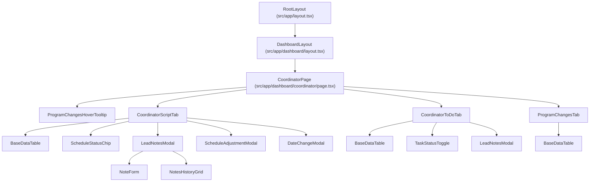
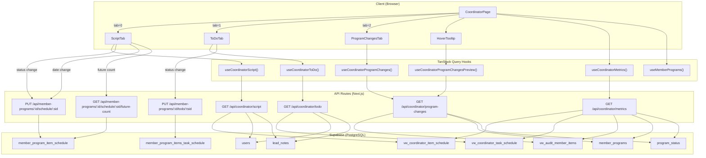

# Coordinator Screen — Comprehensive Documentation

---

## 1. SCREEN OVERVIEW

| Property | Value |
|----------|-------|
| **Screen Name** | Coordinator |
| **Route / URL** | `/dashboard/coordinator` |
| **Purpose** | Central hub for program coordinators to manage therapy script schedules, to-do tasks, and review program change audits across all active member programs. |
| **User Roles** | Any authenticated user (no role-specific gating beyond login). Access controlled by Supabase session + middleware redirect. |
| **Menu Section** | Main Navigation (`section: 'main'`) — second item after Dashboard. |

### Workflow Position

| Before | Current | After |
|--------|---------|-------|
| Dashboard (overview metrics link here) | **Coordinator** — day-to-day operational management | Individual member program pages (via sidebar); Report Card; Order Items |

### Layout Description (top → bottom)

1. **Page Title** — "Coordinator" in bold primary color (h4).
2. **Summary Metric Cards** — A 4-column grid of cards:
   - **Late To Do's** (red top border) — count of overdue tasks.
   - **To Do's Due Today** (primary/blue top border) — tasks due today.
   - **Script Items Due Today** (secondary/purple top border) — script schedule items due today.
   - **Program Changes (This Week)** (info/cyan top border) — audit events this week; hover reveals a tooltip preview of affected programs.
3. **Filters + Tabs Card** — A single card containing:
   - **Filter bar** — Member dropdown, Date Range dropdown (All / Today / This Week / This Month / Custom), optional custom start/end date pickers, "Show Redeemed / Complete" checkbox, "Show Missed" checkbox.
   - **Horizontal tab strip** — Script | To Do | Program Changes.
   - **Tab content area** — renders the selected tab's data grid.

---

## 2. COMPONENT ARCHITECTURE

### Component Tree



### Component Details

#### CoordinatorPage

| Property | Value |
|----------|-------|
| **File** | `src/app/dashboard/coordinator/page.tsx` |
| **Directive** | `'use client'` |

**Props:** None (root page component).

**Local State:**

| Variable | Type | Initial | Controls |
|----------|------|---------|----------|
| `tab` | `number` | `0` | Active tab index (0=Script, 1=To Do, 2=Program Changes) |
| `memberFilter` | `number \| null` | `null` | Selected member/lead ID filter |
| `range` | `'all' \| 'today' \| 'week' \| 'month' \| 'custom'` | `'all'` | Date range preset |
| `start` | `string \| null` | `null` | Custom start date (YYYY-MM-DD) |
| `end` | `string \| null` | `null` | Custom end date (YYYY-MM-DD) |
| `showCompleted` | `boolean` | `false` | Show redeemed/complete items |
| `showMissed` | `boolean` | `false` | Show missed items |

**Hooks Consumed:**
- `useMemberPrograms()` — fetches all member programs (for the member filter dropdown).
- `useCoordinatorMetrics()` — fetches summary card counts.

**Derived State:**
- `memberOptions` — `useMemo` filters programs to Active status, extracts unique `lead_id`/`lead_name` pairs, sorted alphabetically.

**Conditional Rendering:**
- Custom date fields only render when `range === 'custom'`.
- "Show Redeemed / Complete" and "Show Missed" checkboxes are disabled when `tab === 2` (Program Changes).
- Tab content renders conditionally: `tab === 0` → ScriptTab, `tab === 1` → ToDoTab, `tab === 2` → ProgramChangesTab.

---

#### CoordinatorScriptTab

| Property | Value |
|----------|-------|
| **File** | `src/components/coordinator/script-tab.tsx` |

**Props:**

| Name | Type | Required | Default |
|------|------|----------|---------|
| `memberId` | `number \| null` | No | `null` |
| `range` | `'all' \| 'today' \| 'week' \| 'month' \| 'custom'` | No | `'all'` |
| `start` | `string \| undefined` | No | `undefined` |
| `end` | `string \| undefined` | No | `undefined` |
| `showCompleted` | `boolean` | No | `false` |
| `showMissed` | `boolean` | No | `false` |

**Local State:**

| Variable | Type | Initial | Controls |
|----------|------|---------|----------|
| `isNotesModalOpen` | `boolean` | `false` | Notes modal visibility |
| `selectedLead` | `{id: number, name: string} \| null` | `null` | Lead selected for notes |
| `isAdjustmentModalOpen` | `boolean` | `false` | Schedule adjustment modal |
| `adjustmentPromptData` | `object \| null` | `null` | Data for adjustment modal |
| `pendingStatusChange` | `object \| null` | `null` | Pending status change awaiting confirmation |
| `isProcessingAdjustment` | `boolean` | `false` | Adjustment save in progress |
| `isDateChangeModalOpen` | `boolean` | `false` | Date change modal |
| `dateChangeRow` | `Row \| null` | `null` | Row being date-changed |
| `dateChangeFutureCount` | `number` | `0` | Future instances for date change |
| `dateChangeItemDetails` | `object \| undefined` | `undefined` | Item details for date change |
| `isLoadingDateChange` | `boolean` | `false` | Loading future count |
| `isProcessingDateChange` | `boolean` | `false` | Date change save in progress |

**Event Handlers:**
- `handleStatusChange(row, newValue)` — Cycles script item status (Pending → Redeemed → Missed). Performs optimistic update, calls `PUT /api/member-programs/[id]/schedule/[scheduleId]`. On 409, opens adjustment modal.
- `handleAdjustmentConfirm(adjust)` — Confirms or declines schedule cascade adjustment.
- `handleOpenNotesModal(leadId, memberName)` — Opens lead notes modal.
- `handleCloseNotesModal()` — Closes notes modal, invalidates script query.
- `handleOpenDateChangeModal(row)` — Fetches future count, opens date change modal.
- `handleDateChangeConfirm(newDate, adjustFuture)` — Saves new date, optionally cascades.

**Grid Columns:** Note, Member, Scheduled (with calendar icon), Therapy Type, Therapy, Instance, Redeemed (status chip), Responsible (role chip), Updated By, Updated Date.

---

#### CoordinatorToDoTab

| Property | Value |
|----------|-------|
| **File** | `src/components/coordinator/todo-tab.tsx` |

**Props:** Same shape as `CoordinatorScriptTabProps`.

**Local State:** `isNotesModalOpen`, `selectedLead` (same pattern as script tab).

**Event Handlers:**
- `handleStatusChange(row, newValue)` — Toggles task between Pending/Complete. Calls `PUT /api/member-programs/[id]/todo/[taskScheduleId]`.
- `handleOpenNotesModal / handleCloseNotesModal` — Same pattern as script tab.

**Grid Columns:** Note, Member, Due, Therapy Type, Therapy (with script date chip), Task, Description, Instance, Status (toggle switch), Responsible, Updated By, Updated Date.

**Mismatch Indicator:** When a task's parent script item has been redeemed/missed but the task's own status doesn't match, an info icon tooltip warns the user to consider updating.

---

#### ProgramChangesTab

| Property | Value |
|----------|-------|
| **File** | `src/components/coordinator/program-changes-tab.tsx` |

**Props:**

| Name | Type | Required | Default |
|------|------|----------|---------|
| `memberId` | `number \| null` | No | `null` |
| `range` | `'all' \| 'today' \| 'week' \| 'month' \| 'custom'` | No | `'all'` |
| `start` | `string \| undefined` | No | `undefined` |
| `end` | `string \| undefined` | No | `undefined` |
| `showMemberColumn` | `boolean` | No | `true` |

**Grid Columns:** Member (optional), Program, Type, Item, Column, From, To, Changed By, Changed Date.

---

#### ProgramChangesHoverTooltip

| Property | Value |
|----------|-------|
| **File** | `src/components/coordinator/program-changes-hover-tooltip.tsx` |

**Props:**

| Name | Type | Required |
|------|------|----------|
| `children` | `React.ReactElement` | Yes |

Wraps the "Program Changes" summary card. On hover, displays a styled MUI Tooltip listing up to 7 unique member/program pairs that had changes this week. Uses `useCoordinatorProgramChangesPreview()`.

**States:** Loading spinner, error text, empty state ("No changes this week"), or list of changes.

---

#### ScheduleStatusChip

| Property | Value |
|----------|-------|
| **File** | `src/components/ui/schedule-status-chip.tsx` |

Three-state status chip for script items:
- **Pending** (gray, ⭕) → **Redeemed** (green, ✅) → **Missed** (red, ❌) → cycle.
- Click: forward cycle. Shift+Click: backward cycle.
- `readOnly` when program is not Active.

---

#### TaskStatusToggle

| Property | Value |
|----------|-------|
| **File** | `src/components/ui/task-status-toggle.tsx` |

Simple on/off MUI Switch for to-do tasks:
- OFF = Pending (`null`), ON = Complete (`true`).
- `readOnly` when program is not Active.

---

#### BaseDataTable

| Property | Value |
|----------|-------|
| **File** | `src/components/tables/base-data-table.tsx` |

Shared data grid component wrapping MUI X `DataGridPro`. Key features used by Coordinator:
- `persistStateKey` — saves column widths/order per user to `localStorage`.
- `rowClassName` — applies `row-late` class for overdue pending items (red highlight).
- `enableExport` — CSV export toolbar (Script and To Do tabs).
- `autoHeight`, `pageSize`, `pageSizeOptions`, `sortModel`.

---

#### LeadNotesModal, ScheduleAdjustmentModal, DateChangeModal

| Component | File |
|-----------|------|
| `LeadNotesModal` | `src/components/notes/lead-notes-modal.tsx` |
| `ScheduleAdjustmentModal` | `src/components/modals/schedule-adjustment-modal.tsx` |
| `DateChangeModal` | `src/components/modals/date-change-modal.tsx` |

**LeadNotesModal:** Full-height dialog (`80vh`) with NoteForm (add note) + NotesHistoryGrid (view notes). Invalidates parent query on close to refresh note counts.

**ScheduleAdjustmentModal:** Shown on 409 Conflict when redeeming a script item on a different date than scheduled. Displays date difference, affected future instances, and offers "Yes, Adjust" or "No, Keep Original".

**DateChangeModal:** Opened via calendar icon on pending script items. Date picker with option to cascade changes to future instances.

---

## 3. DATA FLOW

### Data Lifecycle

1. **Entry:** Page loads → `useCoordinatorMetrics()` and `useMemberPrograms()` fire TanStack Query requests. Tab content fires `useCoordinatorScript()` / `useCoordinatorToDo()` / `useCoordinatorProgramChanges()` based on active tab.
2. **Transformations:**
   - Script tab: flattens row data, maps `therapy_name`, `therapy_type`, `created_by` from nested/enriched fields.
   - To Do tab: extracts nested `member_program_item_tasks.therapy_tasks.therapies` into flat columns.
   - Program Changes tab: maps audit fields into display columns.
3. **User Input:**
   - Status changes: optimistic update via `queryClient.setQueryData()`, then API call, then `invalidateQueries()`.
   - Date changes: modal collects new date + cascade preference, calls API.
   - Notes: modal form submits via NoteForm, triggers history refresh.
4. **Optimistic Updates:** Script and To Do tabs perform optimistic cache manipulation (add/remove/update rows) before the API round-trip completes. On error, queries are invalidated to revert.
5. **Loading States:** `isLoading` from hooks → `BaseDataTable` shows loading overlay with CircularProgress.
6. **Error States:** `error` from hooks → `BaseDataTable` shows Alert banner.

### Data Flow Diagram



---

## 4. API / SERVER LAYER

### GET /api/coordinator/metrics

| Property | Value |
|----------|-------|
| **File** | `src/app/api/coordinator/metrics/route.ts` |
| **Method** | GET |
| **Auth** | Supabase session required (401 if missing) |
| **Cache** | Default (no explicit cache headers) |

**Parameters:** None.

**Response Shape:**
```typescript
{
  data: {
    lateTasks: number;         // Pending tasks with due_date < today
    tasksDueToday: number;     // Pending tasks due today
    apptsDueToday: number;     // Pending script items due today
    programChangesThisWeek: number; // Audit events this week
  }
}
```

**Error Responses:** `401` Unauthorized, `500` Internal server error.

---

### GET /api/coordinator/script

| Property | Value |
|----------|-------|
| **File** | `src/app/api/coordinator/script/route.ts` |
| **Method** | GET |
| **Auth** | Supabase session required |
| **Cache** | `Cache-Control: no-store, no-cache, must-revalidate` |

**Query Parameters:**

| Name | Type | Required | Description |
|------|------|----------|-------------|
| `memberId` | `number` | No | Filter by lead/member ID |
| `range` | `'all' \| 'today' \| 'week' \| 'month'` | No | Date range preset (default: `'all'`) |
| `start` | `string` (YYYY-MM-DD) | No | Custom start date |
| `end` | `string` (YYYY-MM-DD) | No | Custom end date |
| `showCompleted` | `'true'` | No | Include redeemed items |
| `showMissed` | `'true'` | No | Include missed items |

**Response:** `{ data: Row[] }` — Array of enriched schedule rows with therapy info, role info, member name, user emails, note counts.

**Logic:**
1. Fetches Active program IDs via `ProgramStatusService`.
2. Queries `vw_coordinator_item_schedule` filtered by program IDs, completed_flag, and date range.
3. Enriches with user emails from `users` table and note counts from `lead_notes` table.

---

### GET /api/coordinator/todo

| Property | Value |
|----------|-------|
| **File** | `src/app/api/coordinator/todo/route.ts` |
| **Method** | GET |
| **Auth** | Supabase session required |

**Query Parameters:** Same as `/api/coordinator/script`.

**Response:** `{ data: Row[] }` — Array of task schedule rows with nested therapy info, role info, script status, and enrichment fields.

**Logic:** Same pattern as script route but queries `vw_coordinator_task_schedule`. Transforms flat view columns into nested structure expected by frontend.

---

### GET /api/coordinator/program-changes

| Property | Value |
|----------|-------|
| **File** | `src/app/api/coordinator/program-changes/route.ts` |
| **Method** | GET |
| **Auth** | Supabase session required |

**Query Parameters:**

| Name | Type | Required | Description |
|------|------|----------|-------------|
| `memberId` | `number` | No | Filter by member |
| `range` | `string` | No | Date range preset |
| `start` / `end` | `string` | No | Custom date range |
| `unique_only` | `'true'` | No | Group by member+program, return most recent per group |
| `limit` | `number` | No | Limit result count |

**Response:** `{ data: Row[] }` — Audit event rows from `vw_audit_member_items`. When `unique_only=true`, returns simplified `{ member_name, program_name, changed_at }[]`.

---

### PUT /api/member-programs/[id]/schedule/[scheduleId]

| Property | Value |
|----------|-------|
| **File** | `src/app/api/member-programs/[id]/schedule/[scheduleId]/route.ts` |
| **Method** | PUT |
| **Auth** | Supabase session required |

**Request Body:**

| Field | Type | Description |
|-------|------|-------------|
| `completed_flag` | `boolean \| null` | New status value |
| `confirm_cascade` | `boolean` | Confirm adjustment after 409 |
| `adjust_schedule` | `boolean` | Whether to cascade to future instances |
| `redemption_date` | `string` | Date of redemption (YYYY-MM-DD) |
| `scheduled_date` | `string` | New scheduled date (for calendar feature) |
| `adjust_future` | `boolean` | Cascade date change to future instances |

**Response:** `{ data, cascade?, message? }`

**Status Codes:** `200` Success, `401` Unauthorized, `404` Not found, `409` Conflict (prompt required), `500` Error.

**Key Behavior:** Two distinct flows:
1. **Date Change Flow** (`scheduled_date` without `completed_flag`): Updates date, cascades via `adjust_future_schedule_instances` RPC.
2. **Redemption Flow** (`completed_flag`): Checks if adjustment needed (`checkScheduleAdjustmentNeeded`), returns 409 if prompt required, otherwise updates status and optionally cascades.

---

### PUT /api/member-programs/[id]/todo/[taskScheduleId]

| Property | Value |
|----------|-------|
| **File** | `src/app/api/member-programs/[id]/todo/[taskScheduleId]/route.ts` |
| **Method** | PUT |
| **Auth** | Supabase session required |

**Request Body:** `{ completed_flag: boolean | null }`

**Response:** `{ data }` — Updated task schedule row.

---

### GET /api/member-programs/[id]/schedule/[scheduleId]/future-count

| Property | Value |
|----------|-------|
| **File** | `src/app/api/member-programs/[id]/schedule/[scheduleId]/future-count/route.ts` |
| **Method** | GET |
| **Auth** | Supabase session required |

**Response:**
```typescript
{
  futureInstanceCount: number;
  itemDetails: {
    therapyName: string;
    instanceNumber: number;
    daysBetween: number;
  }
}
```

---

## 5. DATABASE LAYER

### Tables / Views Accessed

#### vw_coordinator_task_schedule (View)

| Column | Source | Type | Description |
|--------|--------|------|-------------|
| `member_program_item_task_schedule_id` | `member_program_items_task_schedule` | integer (PK) | Task schedule ID |
| `member_program_item_schedule_id` | `member_program_item_schedule` | integer | Parent script schedule |
| `member_program_item_task_id` | `member_program_items_task_schedule` | integer | Task ID |
| `member_program_item_id` | `member_program_item_schedule` | integer | Item ID |
| `instance_number` | `member_program_item_schedule` | integer | Schedule instance |
| `member_program_id` | `member_program_items` | integer | Program ID |
| `lead_id` | `member_programs` | integer | Lead/member ID |
| `due_date` | `member_program_items_task_schedule` | date | Task due date |
| `completed_flag` | `member_program_items_task_schedule` | boolean (nullable) | null=pending, true=complete, false=missed |
| `task_name` | `member_program_item_tasks` | text | Task name |
| `task_description` | `member_program_item_tasks` | text | Task description |
| `task_delay` | `member_program_item_tasks` | integer | Days delay from script date |
| `therapy_name` | `therapies` | text | Therapy name |
| `therapy_type_name` | `therapytype` | text | Therapy type |
| `role_name` | `program_roles` | text | Responsible role |
| `role_display_color` | `program_roles` | text | Role color hex |
| `program_status_name` | `program_status` | text | Program status |
| `member_name` | `leads` | text | Computed first + last name |
| `script_scheduled_date` | `member_program_item_schedule` | date | Parent script date |
| `script_completed_flag` | `member_program_item_schedule` | boolean (nullable) | Parent script status |

**Definition file:** `supabase/migrations/20260319000000_add_script_completed_flag_to_task_schedule_view.sql`

**JOIN chain:** `member_program_items_task_schedule` → `member_program_item_schedule` → `member_program_items` → `member_programs` → `leads`, with LEFT JOINs to `member_program_item_tasks` → `therapy_tasks` → `therapies` → `therapytype`, `program_roles`, `program_status`.

---

#### vw_coordinator_item_schedule (View)

Database-defined view (no migration in repo). Pre-joins schedule items with therapy, member, role, and status information. Columns include `member_program_item_schedule_id`, `member_program_id`, `lead_id`, `scheduled_date`, `completed_flag`, `therapy_name`, `therapy_type_name`, `program_status_name`, `member_name`, `role_name`, `role_display_color`, `instance_number`, `created_by`, `updated_by`, etc.

---

#### vw_audit_member_items (View)

Database-defined audit view. Columns include `id`, `member_id`, `program_id`, `member_name`, `program_name`, `operation`, `item_name`, `changed_column`, `from_value`, `to_value`, `changed_by_user`, `event_at`.

---

#### Core Tables (Write Targets)

| Table | Operations | File |
|-------|-----------|------|
| `member_program_item_schedule` | READ (future-count), UPDATE (completed_flag, scheduled_date) | `schedule/[scheduleId]/route.ts` |
| `member_program_items_task_schedule` | UPDATE (completed_flag), READ (task schedules for cascade) | `todo/[taskScheduleId]/route.ts`, `schedule/[scheduleId]/route.ts` |
| `lead_notes` | READ (note counts per lead) | `coordinator/script/route.ts`, `coordinator/todo/route.ts` |
| `users` | READ (email, full_name for enrichment) | `coordinator/script/route.ts`, `coordinator/todo/route.ts` |
| `member_programs` | READ (program IDs by status) | `program-status-service.ts` |
| `program_status` | READ (status name → ID mapping) | `program-status-service.ts` |

### Key Queries

**Metrics — Late Tasks Count:**
```sql
-- via Supabase client
SELECT count(*) FROM vw_coordinator_task_schedule
WHERE member_program_id IN (:activeIds)
  AND due_date < :today
  AND completed_flag IS NULL;
```
File: `src/app/api/coordinator/metrics/route.ts`, function: `GET`.

**Script Schedule — Main Query:**
```sql
SELECT * FROM vw_coordinator_item_schedule
WHERE member_program_id IN (:activeIds)
  AND completed_flag IS NULL  -- default; varies with showCompleted/showMissed
  AND scheduled_date >= :start AND scheduled_date <= :end
ORDER BY scheduled_date ASC;
```
File: `src/app/api/coordinator/script/route.ts`, function: `GET`.

**Note Counts (N+1 concern):**
```sql
SELECT lead_id FROM lead_notes WHERE lead_id IN (:leadIds);
-- Counted in application code
```
File: `src/app/api/coordinator/script/route.ts` and `todo/route.ts`.

**Performance Notes:**
- Views pre-join multiple tables — single query instead of N+1.
- `ProgramStatusService` makes 2 queries (status lookup + program filter) per API call — could be cached.
- Note counts fetch all `lead_notes` rows for matching leads and count in JS — a `COUNT ... GROUP BY` would be more efficient.
- User enrichment queries `users` table with `IN` clause — efficient for the typical data set size.

---

## 6. BUSINESS RULES & LOGIC

| Rule | Where Enforced | Violation Behavior |
|------|---------------|-------------------|
| Only Active programs appear in Coordinator data | API (ProgramStatusService) | Programs with other statuses are silently excluded |
| Status changes only allowed on Active programs | Frontend (readOnly prop on chip/toggle) | Chip/toggle is non-interactive; no API call made |
| Script status is three-state: Pending (null) → Redeemed (true) → Missed (false) | Frontend (ScheduleStatusChip cycle) + API (accepts boolean/null) | Invalid values not possible via UI |
| Task status is two-state: Pending (null) ↔ Complete (true) | Frontend (TaskStatusToggle) + API | Switch toggle only produces null or true |
| Redemption on different date triggers adjustment prompt | API returns 409 + `checkScheduleAdjustmentNeeded` | Modal asks user to confirm cascade |
| Date changes can only be made on pending items of active programs | Frontend validation in `handleOpenDateChangeModal` | Toast error: "Cannot change date for completed or missed items" / "Cannot change date for items on inactive programs" |
| Overdue pending items are highlighted red | Frontend (`rowClassName` comparing `scheduled_date` to today) | Visual-only; red background row |
| To-Do tab shows mismatch indicator when task and parent script status diverge | Frontend (info icon in Status column) | Tooltip: "Associated script item was marked [Redeemed/Missed]. Consider updating this task to match." |
| Program Changes count excludes routine Script/Todo completion changes | API metrics route (uses `vw_audit_member_items` which filters by design) | Clean count of structural changes only |
| Custom date range clears when switching to preset | Frontend (`setStart(null); setEnd(null)` on non-custom selection) | Clean state transition |

### Derived Values / Calculations

| Value | Formula | Location |
|-------|---------|----------|
| Late Tasks | `COUNT WHERE due_date < today AND completed_flag IS NULL` | `metrics/route.ts` |
| Tasks Due Today | `COUNT WHERE due_date = today AND completed_flag IS NULL` | `metrics/route.ts` |
| Script Items Due Today | `COUNT WHERE scheduled_date = today AND completed_flag IS NULL` | `metrics/route.ts` |
| Program Changes This Week | `COUNT WHERE event_at >= weekStart AND event_at < weekEnd+1` | `metrics/route.ts` |
| Week boundaries | Sunday-to-Saturday (`getDay()` based) | `metrics/route.ts` |

---

## 7. FORM & VALIDATION DETAILS

### Filter Controls (not a traditional form — no submit)

| Control | Type | Bound State | Validation |
|---------|------|-------------|------------|
| Member | Select dropdown | `memberFilter` | None; optional |
| Date Range | Select dropdown | `range` | Enum constrained |
| Start Date | `<input type="date">` | `start` | Only visible when range='custom' |
| End Date | `<input type="date">` | `end` | Only visible when range='custom' |
| Show Redeemed / Complete | Checkbox | `showCompleted` | Disabled when tab=2 |
| Show Missed | Checkbox | `showMissed` | Disabled when tab=2 |

### DateChangeModal Form

| Field | Type | Validation | Error |
|-------|------|-----------|-------|
| Current Date | Disabled text | N/A | N/A |
| New Date | MUI DatePicker | Must differ from current date | "Change Date" button disabled until different date selected |
| Adjust Future | Checkbox | None | N/A |

### LeadNotesModal (NoteForm)

Delegates to `NoteForm` component with `formId="note-form"`. Submits via the form's own submit handler; footer "Create" button is `type="submit" form="note-form"`.

No dirty-state tracking or unsaved changes warnings on the Coordinator page itself — all interactions are immediate (click-to-save or modal-confirmed).

---

## 8. STATE MANAGEMENT

### State Summary

| Category | Store | Keys |
|----------|-------|------|
| **Server State** | TanStack React Query | `['coordinator', 'metrics']`, `['coordinator', 'script', qs]`, `['coordinator', 'todo', qs]`, `['coordinator', 'program-changes', qs]`, `['coordinator-program-changes-preview', 'preview']`, `['member-programs', 'list']` |
| **Local Component State** | `useState` in CoordinatorPage | `tab`, `memberFilter`, `range`, `start`, `end`, `showCompleted`, `showMissed` |
| **Local Component State** | `useState` in ScriptTab | Modal open/close flags, pending change data, loading flags |
| **Local Component State** | `useState` in ToDoTab | Modal open/close flags |
| **URL State** | None | No query params or route params used |
| **Persisted State** | `localStorage` | Grid column widths/order per user via `persistStateKey` (`coordinatorScriptGrid`, `coordinatorToDoGrid`, `coordinatorProgramChangesGrid`) |

### TanStack Query Configuration

| Query | staleTime | gcTime | refetchOnWindowFocus |
|-------|-----------|--------|---------------------|
| Metrics | 30s | 2min | Yes |
| Script | 30s | 2min | Yes |
| To Do | 30s | 2min | Yes |
| Program Changes | default (0) | default (5min) | default |
| Preview | 30s | 2min | Yes |

### State Transitions

| User Action | State Change |
|------------|-------------|
| Click tab | `tab` → 0/1/2; conditional rendering swaps tab content |
| Select member | `memberFilter` → leadId; hooks re-query with new memberId |
| Change date range | `range` → value; if custom, `start`/`end` auto-set to today; hooks re-query |
| Toggle "Show Redeemed" | `showCompleted` toggles; hooks re-query |
| Click status chip | Optimistic cache update → API call → invalidate metrics |
| Click calendar icon | Fetch future-count → open modal → confirm → API call → invalidate |
| Click note icon | Open LeadNotesModal → on close → invalidate script/todo query |

---

## 9. NAVIGATION & ROUTING

### Inbound Navigation

| Source | Mechanism |
|--------|-----------|
| Sidebar menu | Direct link `/dashboard/coordinator` (section: main) |
| Dashboard page | Uses `useCoordinatorMetrics` + `ProgramChangesHoverTooltip` — user may navigate to Coordinator from there |

### Outbound Navigation

The Coordinator screen does not navigate to other pages. All interactions (status changes, notes, date changes) happen inline via modals. Users navigate away via the sidebar.

### Route Guards

| Layer | Check | Redirect |
|-------|-------|----------|
| `middleware.ts` | `x-user` header check for `/dashboard` prefix | → `/login` if unauthenticated |
| `src/app/dashboard/layout.tsx` | `supabase.auth.getUser()` | → `/login` if no user |

### Dynamic Route Segments

None — `/dashboard/coordinator` is a static route.

### Deep Linking

Not supported — tab selection, filters, and member selection are local state only and are not reflected in the URL. Page reloads reset to defaults (tab=Script, range=All, no member filter).

---

## 10. ERROR HANDLING & EDGE CASES

### Error States

| Error | Trigger | UI Treatment | Recovery |
|-------|---------|-------------|----------|
| API fetch failure (script/todo/changes) | Network error or 500 | Red Alert banner via BaseDataTable `error` prop | Automatic refetch on window focus; manual page refresh |
| Status change failure | API returns non-200 | Toast error "Failed to update status"; optimistic update reverted via `invalidateQueries` | User can retry |
| 409 Conflict on redemption | Redeemed on different date than scheduled | ScheduleAdjustmentModal opens | User chooses to adjust or keep original |
| Date change failure | API error | Toast error with message | User can retry |
| Future-count fetch failure | Network/API error | Toast error; modal does not open | User can retry by clicking calendar again |
| Auth failure | Session expired | 401 → middleware redirects to login | Re-login |

### Empty States

| Scenario | Behavior |
|----------|----------|
| No active programs | All metric cards show 0; grids show empty DataGrid |
| No matching rows for filters | DataGrid shows "No rows" default |
| No changes this week | Tooltip shows "No changes this week" |

### Loading States

| Component | Indicator |
|-----------|-----------|
| Metric cards | Show `0` (no skeleton — `metrics?.value ?? 0`) |
| Data grids | BaseDataTable shows `CircularProgress` overlay with "Loading data..." text |
| Tooltip | CircularProgress inline with "Loading..." |
| Schedule adjustment | "Adjusting..." button text with disabled state |
| Date change | "Saving..." button text with disabled state |

---

## 11. ACCESSIBILITY

### Current Implementation

| Aspect | Status | Notes |
|--------|--------|-------|
| **ARIA Labels** | Partial | MUI components provide built-in ARIA support. Custom `Tooltip` elements have `title` attributes. No explicit `aria-label` on filter controls. |
| **Keyboard Navigation** | Partial | Tab navigation works for MUI controls. DataGridPro has built-in keyboard nav. `ScheduleStatusChip` click handler does not have keyboard equivalent (no `onKeyDown`). |
| **Screen Reader** | Partial | Metric cards use Typography but no `aria-live` regions for dynamic updates. Status changes have no screen reader announcement. |
| **Color Contrast** | Good | MUI theme colors used; role chips use white text on colored backgrounds (may need contrast audit for light role colors). |
| **Focus Management** | Partial | Modal dialogs manage focus automatically (MUI Dialog). No explicit focus management after status changes or toast dismissal. |

### Gaps

- `ScheduleStatusChip` uses only `onClick` — needs `onKeyDown` (Enter/Space) for keyboard accessibility.
- Metric card values should use `aria-live="polite"` for dynamic count updates.
- Tab panel content should have `role="tabpanel"` and `aria-labelledby` linking to tab.

---

## 12. PERFORMANCE CONSIDERATIONS

### Identified Concerns

| Area | Status | Details |
|------|--------|---------|
| **Note count queries** | Medium concern | Fetches all `lead_notes` rows for matching leads, counts in JS. A SQL `COUNT(*) GROUP BY lead_id` would be more efficient. |
| **ProgramStatusService calls** | Medium concern | Makes 2 DB queries (statuses + programs) on every API request. Should be cached per-request or use a materialized view. |
| **Metrics route makes duplicate ProgramStatusService call** | Low concern | Calls `getValidProgramIds` twice (once for tasks/scripts, once for changes). |
| **View performance** | Good | `vw_coordinator_item_schedule` and `vw_coordinator_task_schedule` pre-join all needed tables, avoiding N+1 queries. |
| **DataGridPro** | Good | Uses `autoHeight` and pagination (10/25/50 rows), preventing large DOM. |
| **Grid state persistence** | Good | `localStorage` saves column widths per user, avoiding layout recalculation. |
| **Optimistic updates** | Good | Status changes feel instant — no waiting for server round-trip. |
| **Component memoization** | Gap | `CoordinatorPage` does not memoize tab components; each re-render reconstructs. Filter changes trigger unnecessary re-mounts of all tab content. However, only the active tab is rendered. |
| **Virtualization** | N/A | DataGridPro has built-in row virtualization. |

### Caching Strategy

| Layer | Mechanism | TTL |
|-------|-----------|-----|
| Client | TanStack Query staleTime | 30 seconds (metrics, script, todo, preview); 0 (changes) |
| Client | TanStack Query gcTime | 2 minutes (metrics, script, todo, preview); 5 minutes default (changes) |
| Server | `Cache-Control: no-store` on script route | No caching |
| Browser | `localStorage` grid state | Indefinite (per user) |

---

## 13. THIRD-PARTY INTEGRATIONS

| Service | Purpose | Package | Config |
|---------|---------|---------|--------|
| **Supabase** | Authentication + PostgreSQL database | `@supabase/supabase-js`, `@supabase/ssr` | `NEXT_PUBLIC_SUPABASE_URL`, `NEXT_PUBLIC_SUPABASE_ANON_KEY` (env vars) |
| **TanStack React Query** | Server state management, caching | `@tanstack/react-query` | QueryClient configured in app-level provider |
| **MUI / MUI X** | UI components, DataGridPro | `@mui/material`, `@mui/x-data-grid-pro`, `@mui/x-date-pickers` | MUI license key for Pro features |
| **Sonner** | Toast notifications | `sonner` | Used directly via `toast.error()` / `toast.success()` |
| **date-fns** | Date formatting and comparison | `date-fns` | No config needed |

**Failure Modes:**
- Supabase outage → All API calls fail → Error alerts shown in grids + metric cards show 0.
- No fallback UI for complete service unavailability beyond error alerts.

---

## 14. SECURITY CONSIDERATIONS

| Aspect | Status | Details |
|--------|--------|---------|
| **Authentication** | Enforced server-side | Every API route checks `supabase.auth.getSession()` and returns 401 if absent. Middleware also redirects unauthenticated requests to `/login`. |
| **Authorization** | No role-based access | Any authenticated user can access all Coordinator data. No permission checks beyond authentication. |
| **Input Sanitization** | Adequate | Query parameters are type-coerced (parseInt, string comparison). Body params are used directly in Supabase client calls (parameterized queries). |
| **SQL Injection** | Protected | Supabase JS client uses parameterized queries. No raw SQL concatenation. |
| **XSS Prevention** | Adequate | React's JSX escaping prevents XSS. No `dangerouslySetInnerHTML` usage. |
| **CSRF** | Protected by default | Next.js API routes use same-origin cookies (`credentials: 'include'`). Supabase auth tokens are HTTP-only cookies. |
| **Sensitive Data** | Low risk | Screen displays member names, therapy names, and schedule dates. No SSN, payment info, or highly sensitive PII on this screen. |
| **HIPAA Considerations** | Medium concern | Member names + therapy information constitute PHI. Ensure audit logging covers who viewed this data. Current implementation does not log read access. |

---

## 15. TESTING COVERAGE

### Existing Tests

No tests exist for the Coordinator screen. Searches for `*coordinator*test*`, `*coordinator*spec*`, and `__tests__/**coordinator**` returned zero results.

### Gaps

| Area | Missing |
|------|---------|
| Unit tests | Component rendering, metric card display, filter logic, `memberOptions` derivation |
| Hook tests | `useCoordinatorMetrics`, `useCoordinatorScript`, `useCoordinatorToDo`, `useCoordinatorProgramChanges` |
| API route tests | All 4 coordinator routes + schedule/todo PUT routes |
| Integration tests | Status change flow (optimistic update → API → cache invalidation), adjustment prompt flow (409 → modal → confirm) |
| E2E tests | Full page load, tab switching, filter interaction, status change, date change, notes modal |

### Suggested Test Cases

**Unit Tests:**
1. `CoordinatorPage` renders 4 metric cards with correct values from mock metrics.
2. `memberOptions` correctly filters to Active programs and deduplicates leads.
3. Filter controls update state correctly (member, range, custom dates).
4. `ScheduleStatusChip` cycles through states on click and shift+click.
5. `TaskStatusToggle` toggles between Pending and Complete.
6. `rowClassName` returns `'row-late'` for overdue pending items and `''` for resolved items.

**Integration Tests:**
7. Script tab optimistic update removes row when marking as Redeemed (showCompleted=false).
8. Script tab reverts optimistic update on API failure.
9. 409 response opens ScheduleAdjustmentModal with correct prompt data.
10. Date change modal fetches future count and displays correctly.
11. Notes modal open/close invalidates correct query.

**E2E Tests:**
12. Navigate to `/dashboard/coordinator` → verify metric cards load.
13. Switch between Script / To Do / Program Changes tabs → verify correct grid loads.
14. Select a member filter → verify grid data filters.
15. Mark a script item as Redeemed → verify row updates (or is removed).
16. Open date change modal → select new date → confirm → verify update.

---

## 16. CODE REVIEW FINDINGS

| Severity | File | Issue | Suggested Fix |
|----------|------|-------|---------------|
| **Medium** | `src/app/api/coordinator/script/route.ts` | Note counts fetch all `lead_notes` rows and count in JS. Inefficient for large note volumes. | Use `SELECT lead_id, COUNT(*) FROM lead_notes WHERE lead_id IN (...) GROUP BY lead_id` via Supabase RPC or raw query. |
| **Medium** | `src/app/api/coordinator/todo/route.ts` | Same note count inefficiency as script route. Duplicated logic. | Extract shared `getNoteCountsByLeadIds()` utility. |
| **Medium** | `src/app/api/coordinator/metrics/route.ts` | Calls `ProgramStatusService.getValidProgramIds` twice — once at line 27, once at line 82. Second call is identical. | Store first result and reuse: `const programIds = await ProgramStatusService.getValidProgramIds(supabase);` then reuse for all queries including program changes. |
| **Medium** | `src/components/coordinator/script-tab.tsx` | Query key reconstruction is duplicated across `handleStatusChange`, `handleAdjustmentConfirm`, `handleCloseNotesModal`, `handleDateChangeConfirm`. | Extract a `getQueryKey()` helper function within the component. |
| **Low** | `src/app/dashboard/coordinator/page.tsx` | `useMemberPrograms()` cast: `as { data: MemberPrograms[] | undefined } as any` — double assertion is a code smell. | Fix the hook's return type or use a single proper type assertion. |
| **Low** | `src/components/coordinator/script-tab.tsx` | Multiple `as any` casts on rows and column types throughout the file. | Define proper TypeScript types matching the API response shape. |
| **Low** | `src/components/coordinator/todo-tab.tsx` | `handleStatusChange` duplicates the same optimistic update logic as script-tab (80+ lines). | Extract shared `useOptimisticStatusChange` hook. |
| **Low** | `src/app/api/coordinator/todo/route.ts` | Indentation error at line 200: `return NextResponse.json(...)` is over-indented. | Fix indentation. |
| **Low** | `src/components/coordinator/script-tab.tsx` | `handleStatusChange` catches errors with bare `catch {}` — swallows error details. | Log error: `catch (err) { console.error(err); ... }`. |
| **Low** | `src/app/dashboard/coordinator/page.tsx` | No URL state persistence for filters/tabs. Users lose context on refresh. | Consider syncing `tab`, `memberFilter`, and `range` to URL search params. |
| **Low** | `src/components/coordinator/program-changes-hover-tooltip.tsx` | Uses deprecated `componentsProps` API. | Migrate to `slotProps` (MUI v6+ pattern). |

---

## 17. TECH DEBT & IMPROVEMENT OPPORTUNITIES

### Refactoring Opportunities

1. **Extract shared query key builder** — Both script-tab and todo-tab reconstruct the same `URLSearchParams → coordinatorKeys.xxx(qs)` pattern in 3-4 places each. Create a shared `buildCoordinatorQueryKey(type, filters)` utility.

2. **Extract shared optimistic update hook** — `useOptimisticStatusChange({ queryKeyFn, apiUrl, invalidateKeys })` would eliminate ~80 lines of duplication between script and todo tabs.

3. **Extract note count enrichment** — Both `script/route.ts` and `todo/route.ts` have identical note-counting logic. Move to a shared `enrichWithNoteCounts(supabase, rows)` utility.

4. **Extract user enrichment** — Both routes have identical user email enrichment. Move to `enrichWithUserInfo(supabase, rows)`.

5. **Cache ProgramStatusService results** — The service makes 2 DB queries per call. For a single request serving multiple coordinator endpoints, cache the result in request scope or use a time-based cache.

### Missing Abstractions

- No shared `CoordinatorFilters` type exported for reuse across tab components.
- No shared `CoordinatorRow` base type that script/todo rows extend.
- Program Changes tab is also imported by `src/app/dashboard/page.tsx` — consider making it fully self-contained with its own filter UI option.

### Deprecated Patterns

- `componentsProps` in `ProgramChangesHoverTooltip` → should be `slotProps`.
- Bare `catch {}` without error logging in some handlers.

### Scalability Concerns

- All coordinator queries fetch **all** matching rows (no server-side pagination). As program count grows, this will become a performance issue. Consider adding `limit`/`offset` or cursor-based pagination to the script and todo endpoints.
- `ProgramStatusService` fetches all program statuses and all matching program IDs on every request. For high-traffic scenarios, this should be cached.

---

## 18. END-USER DOCUMENTATION DRAFT

### Coordinator

**Your command center for managing daily therapy schedules and tasks.**

---

#### What This Page Is For

The Coordinator page gives you a real-time view of all therapy schedules (Script), tasks (To Do), and program modifications (Program Changes) across active member programs. Use it to:

- See what's overdue and what's due today at a glance.
- Mark therapy appointments as Redeemed (completed) or Missed.
- Mark tasks as Complete.
- Reschedule therapy dates when needed.
- Add notes to members directly from the schedule view.
- Track what changes have been made to member programs.

---

#### Step-by-Step Instructions

##### Viewing Your Daily Workload

1. Open the **Coordinator** page from the sidebar menu.
2. Review the four **summary cards** at the top:
   - **Late To Do's** — tasks past their due date that need attention (red).
   - **To Do's Due Today** — tasks scheduled for today (blue).
   - **Script Items Due Today** — therapy appointments scheduled for today (purple).
   - **Program Changes** — hover over this card to see which programs had changes this week.

##### Filtering Data

1. Use the **Member** dropdown to focus on a specific member.
2. Use the **Date Range** dropdown to narrow the time window (Today, This Week, This Month, or Custom).
3. For a custom range, select "Custom" and enter Start and End dates.
4. Check **"Show Redeemed / Complete"** to include already-completed items.
5. Check **"Show Missed"** to include missed items.

##### Managing Script Items (Script Tab)

1. Click the **Script** tab.
2. Rows highlighted in **red** are overdue pending items.
3. To mark an item as Redeemed, click the status chip (gray "Pending" → green "Redeemed").
   - If the item is redeemed on a different date than scheduled, you'll be asked whether to adjust future dates.
4. To mark as Missed, click again (green "Redeemed" → red "Missed"), or **Shift+Click** to go directly from Pending to Missed.
5. To change a scheduled date, click the **calendar icon** next to the date. Choose a new date and decide whether to shift future instances.

##### Managing Tasks (To Do Tab)

1. Click the **To Do** tab.
2. Use the toggle switch in the **Status** column to mark tasks as Complete or Pending.
3. If a task's parent script item has been resolved but the task hasn't, you'll see an info icon suggesting you update it.

##### Adding Notes

1. Click the **note icon** (pencil) in any row to open the notes modal for that member.
2. Type your note and click **Create**.
3. View the note history below the form.
4. Click **Close** when done — note counts will refresh automatically.

##### Viewing Program Changes

1. Click the **Program Changes** tab.
2. Review the audit log showing what was changed, by whom, and when.
3. Columns include: From value → To value, making it easy to see exactly what changed.

---

#### Field Descriptions

| Field | Description |
|-------|-------------|
| **Member** | The member (patient/client) associated with the program. |
| **Scheduled / Due** | The date the therapy or task is scheduled for. |
| **Therapy Type** | The category of therapy (e.g., Chiropractic, Massage). |
| **Therapy** | The specific therapy name. |
| **Instance** | Which occurrence of the therapy this is (e.g., 3 of 12). |
| **Redeemed / Status** | Current completion status — Pending, Redeemed/Complete, or Missed. |
| **Responsible** | The role assigned to manage this item (shown as a colored badge). |
| **Updated By** | The last person to modify this record. |
| **Note** | Click to view or add notes for the member. The badge number shows existing note count. |

---

#### Tips and Notes

- **Shift+Click** on a Script status chip to cycle backwards (Pending → Missed directly, skipping Redeemed).
- The **"Show Redeemed / Complete"** and **"Show Missed"** checkboxes are disabled on the Program Changes tab because they don't apply.
- Overdue items are highlighted in **red** — focus on these first.
- Column widths and order are saved per user — rearrange and resize columns to suit your workflow.
- You can **export** Script and To Do data to CSV using the toolbar.
- The Program Changes tooltip on the summary card shows a **quick preview** — hover to see affected programs without switching tabs.

---

#### FAQ

**Q: Why can't I change the status of an item?**
A: Status changes are only allowed for Active programs. If the program is Paused, Cancelled, or Completed, the status controls will be grayed out.

**Q: What happens when I adjust future dates?**
A: When you confirm a schedule adjustment, all future pending instances of that therapy are shifted by the same number of days, and their associated tasks are also updated. The system tells you exactly how many instances and tasks were affected.

**Q: Why do I see a warning icon next to a task's status?**
A: This means the parent script item (the therapy appointment) has been marked as Redeemed or Missed, but this task still shows a different status. Consider updating the task to match.

**Q: Why are some rows highlighted in red?**
A: Red highlighting indicates overdue pending items — the scheduled/due date has passed and no action (Redeemed/Missed/Complete) has been recorded yet.

**Q: Can I see data for non-active programs?**
A: No. The Coordinator screen only shows data for programs with an "Active" status. To view historical data for paused or completed programs, use the Program Audit page or individual program views.

---

#### Troubleshooting

| Issue | Solution |
|-------|----------|
| **Metric cards all show 0** | Check that there are Active programs in the system. If there are no Active programs, all counts will be zero. |
| **Grid shows "No rows"** | Adjust your filters — you may have a member or date range selected that has no matching data. Try setting Date Range to "All" and Member to "All Members". |
| **Status change didn't save** | If you see a red toast notification, the save failed. Check your internet connection and try again. The row will revert to its previous state. |
| **Column widths reset** | Grid state is saved per user. If you clear your browser's localStorage, column customizations will be lost. |
| **Page is slow to load** | The Coordinator queries multiple database views. If the system has many active programs, initial load may take a few seconds. The loading spinner will display while data is being fetched. |
