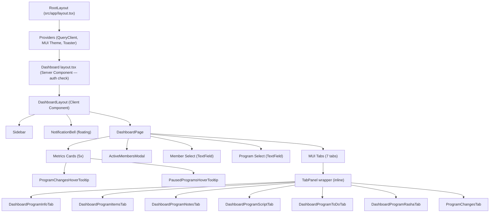
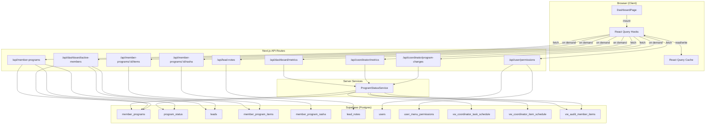

# Dashboard Screen — Comprehensive Documentation

> **Generated:** 2026-03-18  
> **Route:** `/dashboard`  
> **Page file:** `src/app/dashboard/page.tsx`

---

## 1. SCREEN OVERVIEW

### Identity

| Property | Value |
|----------|-------|
| **Screen name** | Dashboard |
| **Route / URL** | `/dashboard` |
| **Purpose** | Primary landing screen after login. Displays high-level program metrics, allows staff to select a member and drill into their program details across seven tabs (Program, Items, Notes, Script, To Do, RASHA, Changes). |
| **Application** | YOY Program Tracker — Next.js 15.5 App Router |

### User Roles & Auth Gating

- **All authenticated users** can access this screen.
- The `/dashboard` route is a **protected route** — unauthenticated users are redirected to `/login` by both middleware (`middleware.ts`) and the server-side layout (`src/app/dashboard/layout.tsx`).
- Sidebar navigation items are **filtered by user permissions** (admin sees all; non-admin users see only their permitted paths via `user_menu_permissions` table).
- The Dashboard page itself has **no role-based gating** beyond authentication — every logged-in user sees the same content.

### Workflow Position

| Direction | Screen | Trigger |
|-----------|--------|---------|
| **Before** | Login (`/login`) | Successful authentication redirects here |
| **After** | Any sidebar destination | User clicks a sidebar nav item |
| **Peer** | Coordinator (`/dashboard/coordinator`) | Shares metrics data (coordinator metrics hook) |

### Layout Description (top to bottom, left to right)

1. **Sidebar (fixed left, 240 px on desktop)** — Logo, collapsible nav sections (Main, Marketing, Operations, Sales, Admin), user avatar + logout at bottom.
2. **Main content area** (right of sidebar, gray background `#f8f9fa`):
   - **Header** — "Dashboard" title (`h4`, bold, primary color).
   - **Metrics Cards Row** — Five equal-width cards in a horizontal grid:
     1. Active Members (green) — with 3-dot menu → "View Active Members" modal
     2. New Programs This Month (purple)
     3. Completed Programs (orange)
     4. Program Changes This Week (blue) — hover tooltip shows preview
     5. Paused Programs (red) — hover tooltip shows paused member names
   - **Member Program Viewer Card** — Below metrics:
     - Member dropdown (`TextField select`) — lists members with active programs, alphabetically.
     - Program dropdown (conditional) — appears only when the selected member has multiple programs.
     - **Seven Tabs**: Program | Items | Notes | Script | To Do | RASHA | Changes
     - Tab content renders beneath the tab bar.
     - If no member is selected, a "Select a member…" placeholder is shown.
3. **Floating Notification Bell** (fixed, top center) — appears only when active notifications exist.

---

## 2. COMPONENT ARCHITECTURE

### Component Tree

### Component Details

#### `DashboardPage` — `src/app/dashboard/page.tsx`

| Aspect | Details |
|--------|---------|
| **Props** | None (page component) |
| **Local state** | `selectedMember` (`any`, `null`) — currently selected member object |
|  | `selectedProgram` (`MemberPrograms \| null`, `null`) — currently selected program |
|  | `tabValue` (`number`, `0`) — active tab index (0–6) |
|  | `activeMembersMenuAnchor` (`HTMLElement \| null`, `null`) — menu anchor for Active Members card |
|  | `activeMembersModalOpen` (`boolean`, `false`) — controls Active Members modal visibility |
| **Context/global** | None consumed directly; all data via React Query hooks |
| **Hooks** | `useDashboardMetrics()` — fetches 5 metric counts |
|  | `useCoordinatorMetrics()` — fetches `programChangesThisWeek` |
|  | `useDashboardMembers()` — fetches members with active programs |
| **Refs** | None |
| **Side effects** | None (no `useEffect`) |
| **Event handlers** | `handleMemberChange` — sets member, auto-selects first program, resets tab to 0 |
|  | `handleProgramChange` — sets program, resets tab to 0 |
|  | `handleTabChange` — updates `tabValue` |
|  | `handleActiveMembersMenuOpen/Close` — controls 3-dot menu |
|  | `handleViewActiveMembers` — closes menu, opens modal |
| **Conditional rendering** | Error state → full-page `Alert`. Members loading → spinner in dropdown. Selected member with >1 program → program dropdown visible. `selectedProgram` truthy → tabs visible. No member selected → "Select a member…" message. |

#### `DashboardLayout` — `src/components/layout/DashboardLayout.tsx`

| Aspect | Details |
|--------|---------|
| **Props** | `children: React.ReactNode` (required), `user: User` (required, Supabase User) |
| **Renders** | `Sidebar`, main content `Box`, floating `NotificationBell` |

#### `Sidebar` — `src/components/layout/Sidebar.tsx`

| Aspect | Details |
|--------|---------|
| **Props** | `user: User` (required) |
| **Local state** | `anchorEl` — user menu anchor; `openSection` — which collapsible section is open; `openSubmenu` — which admin submenu is open |
| **Hooks** | `useRouter()`, `usePathname()`, `useUserPermissions()` |
| **Conditional rendering** | Permissions loading → "Loading permissions…". Nav items filtered by `userPermissions.isAdmin` or `permissions.includes(path)`. Collapsible sections show/hide on click. |

#### `ActiveMembersModal` — `src/components/dashboard/active-members-modal.tsx`

| Aspect | Details |
|--------|---------|
| **Props** | `open: boolean` (required), `onClose: () => void` (required) |
| **Hooks** | `useActiveMembers()` — fetches from `/api/dashboard/active-members` |
| **Key logic** | Transforms member data to compute `end_date` (start + duration), `days_since_start`, `is_new` (≤7 days). Renders a `BaseDataTable` with columns: Name, Email, Start Date, End Date, Coach. Star icon for new members, autorenew icon for memberships. Past-due end dates in red. |

#### `ProgramChangesHoverTooltip` — `src/components/coordinator/program-changes-hover-tooltip.tsx`

| Aspect | Details |
|--------|---------|
| **Props** | `children: React.ReactElement` (required) |
| **Hooks** | `useCoordinatorProgramChangesPreview()` — fetches week's changes (unique, limit 7) |
| **Renders** | MUI `Tooltip` wrapping children. Content: loading spinner, error text, "No changes this week", or list of "Member | Program" names. |

#### `PausedProgramsHoverTooltip` — `src/components/dashboard/paused-programs-hover-tooltip.tsx`

| Aspect | Details |
|--------|---------|
| **Props** | `children: React.ReactElement` (required) |
| **Hooks** | `usePausedProgramsPreview()` — fetches paused programs from `/api/member-programs` |
| **Renders** | MUI `Tooltip`. Content: loading, error, "No paused programs", or unique member names with paused programs. |

#### `DashboardProgramInfoTab` — `src/components/dashboard/dashboard-program-info-tab.tsx`

| Aspect | Details |
|--------|---------|
| **Props** | `program: MemberPrograms` (required) |
| **Local state** | `isGeneratingPlanSummary` (`boolean`, `false`) |
| **Hooks** | `useActiveLeads()`, `useActiveProgramStatus()`, `useMemberProgramItems(program.member_program_id)` |
| **Renders** | Two-column layout: Program Name, Member info, Start Date (left); Status chip, Member Goals (right). "Plan Summary" button at bottom right — triggers `generatePlanSummary()` utility. |

#### `DashboardProgramItemsTab` — `src/components/dashboard/dashboard-program-items-tab.tsx`

| Aspect | Details |
|--------|---------|
| **Props** | `program: MemberPrograms` (required) |
| **Hooks** | `useMemberProgramItems(program.member_program_id)` |
| **Renders** | `BaseDataTable` with columns: Therapy Type, Therapy Name, Quantity (with usage color chip), Instructions. Read-only, export enabled. |

#### `DashboardProgramNotesTab` — `src/components/dashboard/dashboard-program-notes-tab.tsx`

| Aspect | Details |
|--------|---------|
| **Props** | `program: MemberPrograms \| null` (required), `memberId?: number \| null` (optional) |
| **Local state** | `open` (`boolean`, `false`) — controls Add Note modal |
| **Hooks** | `useLeadNotes(leadId)` |
| **Renders** | "Add Note" button, `BaseDataTable` with Date/Time, Type (chip), Content, Created By. Opens `LeadNotesModal` on add. Alert/response indicators on date column. |

#### `DashboardProgramScriptTab` — `src/components/dashboard/dashboard-program-script-tab.tsx`

| Aspect | Details |
|--------|---------|
| **Props** | `program: MemberPrograms` (required) |
| **Renders** | Thin wrapper that delegates to `ProgramScriptTab` (read-only). |

#### `DashboardProgramToDoTab` — `src/components/dashboard/dashboard-program-todo-tab.tsx`

| Aspect | Details |
|--------|---------|
| **Props** | `program: MemberPrograms` (required) |
| **Renders** | Thin wrapper that delegates to `ProgramToDoTab` (read-only). |

#### `DashboardProgramRashaTab` — `src/components/dashboard/dashboard-program-rasha-tab.tsx`

| Aspect | Details |
|--------|---------|
| **Props** | `program: MemberPrograms` (required) |
| **Hooks** | `useMemberProgramRashaItems(program.member_program_id)` |
| **Key logic** | Computes group summaries from active RASHA items (total seconds per group), detects type mismatches within groups. |
| **Renders** | Summary cards per group (colored borders), `BaseDataTable` with RASHA Name, Length, Group Name, Type (with mismatch warning), Order, Active flag. |

#### `ProgramChangesTab` — `src/components/coordinator/program-changes-tab.tsx`

| Aspect | Details |
|--------|---------|
| **Props** | `memberId?: number \| null`, `range?: string` (default `'all'`), `start?`, `end?`, `showMemberColumn?: boolean` (default `true`) |
| **Hooks** | `useCoordinatorProgramChanges({ memberId, range, start, end })` |
| **Renders** | `BaseDataTable` with Member, Program, Type, Item, Column, From, To, Changed By, Changed Date. On Dashboard, called with `range="all"`, `showMemberColumn=false`. |

#### `NotificationBell` — `src/components/notifications/notification-bell.tsx`

| Aspect | Details |
|--------|---------|
| **Props** | `floating?: boolean` (default `true`) |
| **Hooks** | `useActiveNotifications()` |
| **Key logic** | Sorts by priority (urgent > high > normal), then by date. Renders as floating FAB with pulse animation. Hidden when no active notifications. Opens popover with notification list. Click → detail modal. |

---

## 3. DATA FLOW

### Data Lifecycle

1. **Page Load** — `DashboardPage` mounts. Three hooks fire in parallel:
   - `useDashboardMetrics()` → `GET /api/dashboard/metrics` → returns 5 aggregate counts.
   - `useCoordinatorMetrics()` → `GET /api/coordinator/metrics` → returns `programChangesThisWeek`.
   - `useDashboardMembers()` → `GET /api/member-programs` → client-side filters for Active status, groups by `lead_id`, sorts alphabetically.

2. **Tooltip Hover** — Two additional queries on tooltip render:
   - `usePausedProgramsPreview()` → `GET /api/member-programs` → client-side filters for Paused status.
   - `useCoordinatorProgramChangesPreview()` → `GET /api/coordinator/program-changes?range=week&unique_only=true&limit=7`.

3. **Member Selection** — User picks a member from dropdown:
   - `selectedMember` state set, first program auto-selected.
   - Tab-specific hooks fire based on `selectedProgram.member_program_id`:
     - Items tab: `useMemberProgramItems(id)` → `GET /api/member-programs/{id}/items`
     - RASHA tab: `useMemberProgramRashaItems(id)` → `GET /api/member-programs/{id}/rasha`
     - Notes tab: `useLeadNotes(leadId)` → `GET /api/lead-notes?lead_id={id}`
     - Info tab: `useActiveLeads()`, `useActiveProgramStatus()`, `useMemberProgramItems(id)`
     - Script/ToDo: delegated components fetch their own data
     - Changes tab: `useCoordinatorProgramChanges({ memberId, range: 'all' })`

4. **Active Members Modal** — Opened via 3-dot menu on Active Members card:
   - `useActiveMembers()` → `GET /api/dashboard/active-members` → computes end dates and "new" flag client-side.

5. **Note Creation** (Notes tab) — "Add Note" button opens `LeadNotesModal` → `POST /api/lead-notes` → invalidates query cache.

6. **Plan Summary** (Program tab) — Button triggers `generatePlanSummary()` which generates a DOCX document client-side.

### Transformations

| Data | Transformation | Location |
|------|---------------|----------|
| Member programs | Filtered to Active status, grouped by `lead_id`, sorted by `lead_name` | `useDashboardMembers()` client-side |
| Paused programs | Filtered to Paused status, mapped to `{ member_name, program_name }` | `usePausedProgramsPreview()` client-side |
| Active members | `end_date = start_date + duration`, `is_new = days_since_start ≤ 7` | `ActiveMembersModal` `useMemo` |
| RASHA items | Grouped by `group_name`, totaled seconds, type mismatch detection | `DashboardProgramRashaTab` `useMemo` |
| Program changes | Mapped to flat row format (`member_name`, `type: operation`, etc.) | `ProgramChangesTab` |
| Program items | Mapped with joined therapy info, computed `total_cost`, `total_charge` | `DashboardProgramItemsTab` |

### Loading, Error, and Empty States

| State | UI Treatment |
|-------|-------------|
| Metrics loading | `CircularProgress` inside each card number |
| Metrics error | Full-page `Alert severity="error"` with error message |
| Members loading | Dropdown disabled, `CircularProgress` as end adornment |
| Members error | Inline `Alert severity="error"` |
| Tab data loading | `BaseDataTable` built-in loading state |
| No member selected | "Select a member above to view their program details" centered text |
| Tooltip loading | Spinner inside tooltip content |
| Tooltip error | "Failed to load…" error text in tooltip |
| Tooltip empty | "No changes this week" / "No paused programs" |

### Data Flow Diagram

---

## 4. API / SERVER LAYER

### `GET /api/dashboard/metrics`

| Property | Value |
|----------|-------|
| **File** | `src/app/api/dashboard/metrics/route.ts` |
| **Auth** | Session required (`supabase.auth.getSession()`) — 401 if missing |
| **Parameters** | None |
| **Response** | `{ data: { activeMembers: number, newProgramsThisMonth: number, completedPrograms: number, pausedPrograms: number, membersOnMemberships: number } }` |
| **Errors** | `401 Unauthorized`, `500 { error: string }` |
| **Logic** | Uses `ProgramStatusService.getValidProgramIds()` for Active programs. Counts unique `lead_id`s for active members. Filters by current month `start_date` range for new programs. Queries Completed and Paused statuses directly from `program_status` lookup. |
| **Caching** | Client: staleTime 5 min, gcTime 10 min, refetchOnWindowFocus |

### `GET /api/coordinator/metrics`

| Property | Value |
|----------|-------|
| **File** | `src/app/api/coordinator/metrics/route.ts` |
| **Auth** | Session required — 401 if missing |
| **Parameters** | None |
| **Response** | `{ data: { lateTasks: number, tasksDueToday: number, apptsDueToday: number, programChangesThisWeek: number } }` |
| **Logic** | Uses `ProgramStatusService` for Active programs. Queries views `vw_coordinator_task_schedule`, `vw_coordinator_item_schedule`, `vw_audit_member_items`. Week range = Sunday to Saturday of current week. Excludes completed/missed tasks (checks `completed_flag IS NULL`). |
| **Caching** | Client: staleTime 30s, gcTime 2 min |

### `GET /api/member-programs`

| Property | Value |
|----------|-------|
| **File** | `src/app/api/member-programs/route.ts` |
| **Auth** | Session required — 401 if missing |
| **Parameters** | `?active=true` (optional, filters by `active_flag`) |
| **Response** | `{ data: MemberPrograms[] }` — flat-mapped with joined `lead_name`, `status_name`, `template_name`, `margin`, etc. |
| **Joins** | `users` (created/updated), `leads`, `program_status`, `program_template`, `member_program_finances` |
| **Caching** | Default React Query (1 min staleTime) |

### `GET /api/dashboard/active-members`

| Property | Value |
|----------|-------|
| **File** | `src/app/api/dashboard/active-members/route.ts` |
| **Auth** | Session required — 401 if missing |
| **Parameters** | None |
| **Response** | `{ data: ActiveMember[] }` where `ActiveMember = { lead_id, first_name, last_name, email, phone, start_date, duration, has_coach, is_membership }` |
| **Logic** | Queries `member_programs` with `program_status_id = 1` (Active). Joins `leads` for names. Checks `member_program_items` → `therapies` for coach items (`therapy_name ILIKE '%coach%'`). Deduplicates by `lead_id`, sorts by last name. |
| **Errors** | `401`, `500 { error, details }` |

### `GET /api/coordinator/program-changes`

| Property | Value |
|----------|-------|
| **File** | `src/app/api/coordinator/program-changes/route.ts` |
| **Auth** | Session required — 401 if missing |
| **Parameters** | `range` (today/week/month/all/custom), `memberId`, `start`, `end`, `unique_only` (true/false), `limit` |
| **Response** | `{ data: ProgramChangesPreviewItem[] }` (simplified if `unique_only`) or full audit rows |
| **Logic** | Uses `ProgramStatusService` for Active programs. Queries `vw_audit_member_items`. Supports date range filtering, unique grouping by member+program, and result limiting. |

### `GET /api/user/permissions`

| Property | Value |
|----------|-------|
| **File** | `src/app/api/user/permissions/route.ts` |
| **Auth** | Session required — 401 if missing |
| **Response** | `{ isAdmin: boolean, permissions: string[], isActive: boolean }` |
| **Logic** | Checks `users.is_admin`. Admins get `permissions: ['*']`. Non-admins get paths from `user_menu_permissions`. |

### Additional API Endpoints (Tab-Specific)

| Endpoint | File | Used By |
|----------|------|---------|
| `GET /api/member-programs/:id/items` | `src/app/api/member-programs/[id]/items/route.ts` | Items tab, Info tab |
| `GET /api/member-programs/:id/rasha` | `src/app/api/member-programs/[id]/rasha/route.ts` | RASHA tab |
| `GET /api/lead-notes?lead_id=:id` | `src/app/api/lead-notes/route.ts` | Notes tab |
| `POST /api/lead-notes` | `src/app/api/lead-notes/route.ts` | Notes tab (Add Note) |
| `GET /api/coordinator/script` | `src/app/api/coordinator/script/route.ts` | Script tab (via delegated component) |
| `GET /api/coordinator/todo` | `src/app/api/coordinator/todo/route.ts` | To Do tab (via delegated component) |

---

## 5. DATABASE LAYER

### Tables Touched

#### `member_programs`

| Column | Type | Nullable | Notes |
|--------|------|----------|-------|
| `member_program_id` | `integer` (PK) | No | Auto-increment |
| `program_template_name` | `text` | Yes | Display name |
| `description` | `text` | Yes | Member goals |
| `total_cost` | `numeric` | Yes | |
| `total_charge` | `numeric` | Yes | |
| `lead_id` | `integer` (FK → `leads`) | Yes | |
| `start_date` | `date` | Yes | |
| `duration` | `integer` | No | Days |
| `active_flag` | `boolean` | No | |
| `program_status_id` | `integer` (FK → `program_status`) | Yes | |
| `source_template_id` | `integer` (FK → `program_template`) | Yes | |
| `program_type` | `text` | Yes | `'one-time'` or `'membership'` |
| `created_at`, `updated_at` | `timestamptz` | Yes | |
| `created_by`, `updated_by` | `uuid` (FK → `users`) | Yes | |

#### `leads`

| Column | Type | Nullable | Notes |
|--------|------|----------|-------|
| `lead_id` | `integer` (PK) | No | |
| `first_name` | `text` | No | |
| `last_name` | `text` | No | |
| `email` | `text` | Yes | |
| `phone` | `text` | Yes | |
| `status_id` | `integer` (FK → `status`) | Yes | |
| `campaign_id` | `integer` (FK → `campaigns`) | Yes | |
| `active_flag` | `boolean` | No | |

#### `program_status`

| Column | Type | Nullable | Notes |
|--------|------|----------|-------|
| `program_status_id` | `integer` (PK) | No | |
| `status_name` | `text` | No | e.g., Active, Paused, Completed, Quote |
| `active_flag` | `boolean` | No | |

#### `member_program_items`

| Column | Type | Nullable | Notes |
|--------|------|----------|-------|
| `member_program_item_id` | `integer` (PK) | No | |
| `member_program_id` | `integer` (FK) | No | |
| `therapy_id` | `integer` (FK → `therapies`) | Yes | |
| `quantity` | `integer` | Yes | |
| `used_count` | `integer` | Yes | |
| `item_cost` | `numeric` | Yes | |
| `item_charge` | `numeric` | Yes | |
| `instructions` | `text` | Yes | |

#### `member_program_rasha`

| Column | Type | Nullable | Notes |
|--------|------|----------|-------|
| `member_program_rasha_id` | `integer` (PK) | No | |
| `member_program_id` | `integer` (FK) | No | |
| `rasha_name` | `text` | Yes | |
| `rasha_length` | `integer` | Yes | Seconds |
| `group_name` | `text` | Yes | |
| `type` | `text` | Yes | `'group'` or `'individual'` |
| `order_number` | `integer` | Yes | |
| `active_flag` | `boolean` | Yes | |

#### `users`

| Column | Type | Nullable | Notes |
|--------|------|----------|-------|
| `id` | `uuid` (PK) | No | Supabase auth user ID |
| `email` | `text` | Yes | |
| `full_name` | `text` | Yes | |
| `is_admin` | `boolean` | No | |
| `is_active` | `boolean` | No | |

#### `user_menu_permissions`

| Column | Type | Nullable | Notes |
|--------|------|----------|-------|
| `user_id` | `uuid` (FK → `users`) | No | |
| `menu_path` | `text` | No | e.g., `/dashboard`, `/dashboard/leads` |

#### Database Views

| View | Purpose | Used By |
|------|---------|---------|
| `vw_coordinator_task_schedule` | Flattened task schedule with program reference | Coordinator metrics |
| `vw_coordinator_item_schedule` | Flattened item schedule with program reference | Coordinator metrics |
| `vw_audit_member_items` | Audit log of program item changes | Program Changes card + tab |

### Key Queries

| Query | Type | File | Function | Notes |
|-------|------|------|----------|-------|
| Active member count via `ProgramStatusService` | Read | `src/app/api/dashboard/metrics/route.ts` | `GET` | Two-step: gets valid program IDs, then counts unique `lead_id`s |
| New programs this month | Read | same | `GET` | Filters active program IDs by `start_date` in current month |
| Completed/Paused program counts | Read | same | `GET` | Direct status lookup + count queries |
| Active members with coach detection | Read | `src/app/api/dashboard/active-members/route.ts` | `GET` | Joins `member_program_items` → `therapies`, ILIKE `%coach%` |
| All member programs with joins | Read | `src/app/api/member-programs/route.ts` | `GET` | Complex join: users, leads, program_status, program_template, finances |
| Program changes audit | Read | `src/app/api/coordinator/program-changes/route.ts` | `GET` | Queries `vw_audit_member_items` with date range filters |
| User permissions | Read | `src/app/api/user/permissions/route.ts` | `GET` | Checks `users.is_admin`, then `user_menu_permissions` |

#### Performance Notes

- **`ProgramStatusService.getValidProgramIds()`** performs 2 queries on every metrics call (program_status lookup + member_programs filter). Could be cached server-side.
- **Dashboard metrics API** makes 5+ sequential Supabase queries. Could be parallelized with `Promise.all`.
- **`/api/member-programs` (GET)** fetches ALL programs with joins — no pagination. Used by both `useDashboardMembers()` and `usePausedProgramsPreview()` independently (duplicate network requests to the same endpoint).
- **Active members API** hardcodes `program_status_id = 1` instead of using `ProgramStatusService` — inconsistency.

---

## 6. BUSINESS RULES & LOGIC

### Metric Definitions

| Metric | Rule | Enforcement |
|--------|------|-------------|
| **Active Members** | Count of unique `lead_id`s with at least one program in Active status (via `ProgramStatusService`). | Server (API) |
| **New Programs This Month** | Active programs with `start_date` within the current calendar month (1st through last day). | Server (API) |
| **Completed Programs** | Total programs with `program_status.status_name = 'Completed'` (all time, not filtered by Active service). | Server (API) |
| **Program Changes This Week** | Count of rows in `vw_audit_member_items` for Active programs, within the current week (Sunday–Saturday). Excludes Script and Todo completion changes. | Server (API) |
| **Paused Programs** | Total programs with `program_status.status_name = 'Paused'`. | Server (API) |

### Member Dropdown Filtering

- Only members with **Active-status programs** appear in the member dropdown.
- Programs are grouped by `lead_id`; members sorted alphabetically by `lead_name`.
- Members with null `lead_id` or null `lead_name` are excluded.

### Active Members Modal Rules

- A member is marked **"new"** if their `start_date` is within the last 7 days.
- A member **"has coach"** if any of their active program items have a therapy with `therapy_name ILIKE '%coach%'`.
- A member is a **"membership"** member if `program_type = 'membership'` on any of their active programs.
- **End date** = `start_date + duration` (in days).
- Past-due end dates (before today) are rendered in red.

### RASHA Type Mismatch Detection

Within each group, if items have both `type = 'group'` and `type = 'individual'`, a warning icon is displayed. The outlier type (minority within the group) gets the mismatch indicator.

### Feature Flags / Environment Behavior

- `membersOnMemberships` metric is hardcoded to `0` — placeholder for future implementation.

---

## 7. FORM & VALIDATION DETAILS

### Member Selection

| Field | Type | Bound State | Validation |
|-------|------|-------------|------------|
| Select Member | `TextField select` | `selectedMember` | None — dropdown populated from API |
| Select Program | `TextField select` | `selectedProgram` | Only shown when member has >1 program |

### Notes Tab — Add Note

The "Add Note" button opens `LeadNotesModal` (external component). Form validation is handled within that modal using `react-hook-form` + `zod` (via `LeadNoteFormData` schema). The Dashboard's Notes tab only controls the open/close state.

### Plan Summary Generation

Not a traditional form. The "Plan Summary" button triggers a DOCX generation utility. No user input — it uses the selected program and its items as data sources.

---

## 8. STATE MANAGEMENT

### Local Component State

| Variable | Component | Type | Initial | Purpose |
|----------|-----------|------|---------|---------|
| `selectedMember` | DashboardPage | `any` | `null` | Currently selected member |
| `selectedProgram` | DashboardPage | `MemberPrograms \| null` | `null` | Currently selected program |
| `tabValue` | DashboardPage | `number` | `0` | Active tab index |
| `activeMembersMenuAnchor` | DashboardPage | `HTMLElement \| null` | `null` | Menu positioning |
| `activeMembersModalOpen` | DashboardPage | `boolean` | `false` | Modal visibility |
| `anchorEl` | Sidebar | `HTMLElement \| null` | `null` | User menu positioning |
| `openSection` | Sidebar | `string \| undefined` | `undefined` | Active collapsible section |
| `openSubmenu` | Sidebar | `string \| undefined` | `undefined` | Active admin submenu |
| `open` (notes) | DashboardProgramNotesTab | `boolean` | `false` | Add Note modal |
| `isGeneratingPlanSummary` | DashboardProgramInfoTab | `boolean` | `false` | Generation in progress |

### React Query Cache

| Query Key | staleTime | gcTime | refetchOnWindowFocus |
|-----------|-----------|--------|---------------------|
| `['dashboard', 'metrics']` | 5 min | 10 min | Yes |
| `['coordinator', 'metrics']` | 30s | 2 min | Yes |
| `['dashboard-member-programs', 'members']` | default (1 min) | default | No |
| `['paused-programs-preview', 'preview']` | 30s | 2 min | Yes |
| `['coordinator-program-changes-preview', 'preview']` | 30s | 2 min | Yes |
| `['active-members']` | default | default | No |
| `['member-program-items', 'by-program', id]` | default | default | No |
| `['member-program-rasha', 'by-program', id]` | default | default | No |
| `['lead-notes', 'list', leadId]` | 2 min | 10 min | No |
| `['user-permissions', userId]` | 0 (always refetch) | default | No |

### URL State

None. The Dashboard does not use URL query parameters or route params. Selected member/program state is entirely local — not deep-linkable.

### Cookies / Persistent State

- Supabase auth session is stored in HTTP-only cookies managed by `@supabase/ssr`.
- `BaseDataTable` components use `persistStateKey` for grid column state (e.g., `"dashboardProgramItemsGrid"`, `"dashboardProgramRashaGrid"`) — persisted via MUI DataGrid's built-in state persistence (localStorage).

---

## 9. NAVIGATION & ROUTING

### Inbound Routes

| From | Trigger |
|------|---------|
| `/login` | Successful authentication (server action redirect) |
| Any authenticated route | Direct URL navigation to `/dashboard` |
| Sidebar "Dashboard" link | Click from any `/dashboard/*` page |
| Middleware redirect | Authenticated user accessing `/login`, `/register`, `/forgot-password` |

### Outbound Routes

| To | Trigger |
|----|---------|
| `/login` | Logout (Sidebar user menu) |
| Any sidebar nav item | Click (e.g., `/dashboard/coordinator`, `/dashboard/leads`, etc.) |

### Route Guards

1. **Middleware** (`middleware.ts`): Checks `x-user` header. Redirects unauthenticated users to `/login`.
2. **Server layout** (`src/app/dashboard/layout.tsx`): Calls `supabase.auth.getUser()`. Redirects to `/login` if no user.
3. **Sidebar permissions**: Navigation items filtered by `useUserPermissions()` — items without permission are hidden (not redirected).

### Deep Linking

Not supported. Member/program selection is local state only. Sharing the `/dashboard` URL shows the default empty state for every user.

---

## 10. ERROR HANDLING & EDGE CASES

### Error States

| Trigger | UI Treatment | Recovery |
|---------|-------------|----------|
| Dashboard metrics API failure | Full-page `Alert severity="error"` replaces all content | Refresh page |
| Members API failure | Inline `Alert severity="error"` below member dropdown | Refresh page |
| Tab data fetch failure | `BaseDataTable` built-in error display | Auto-retry (React Query default) |
| Tooltip data failure | "Failed to load…" text within tooltip | Hover again (triggers refetch) |
| Auth session expired | API returns 401 → hook throws → error boundary or stale UI | Refresh redirects to login |
| Active Members modal API failure | Error message passed to `BaseDataTable` | Close and reopen modal |

### Empty States

| Scenario | UI |
|----------|-----|
| No active members | Active Members card shows `0`; modal shows empty table |
| No programs for selected member | Should not occur (only members with programs appear in dropdown) |
| No member selected | "Select a member above to view their program details" |
| No paused programs | Tooltip: "No paused programs" |
| No program changes this week | Tooltip: "No changes this week"; card shows `0` |
| No items/notes/RASHA for a program | Empty `BaseDataTable` |

### Loading States

| Component | Treatment |
|-----------|-----------|
| Metric card values | `CircularProgress size={32}` inline replacing the number |
| Member dropdown | Disabled, `CircularProgress size={20}` as end adornment |
| Tooltip content | `CircularProgress size={16}` with "Loading…" text |
| Tab data grids | `BaseDataTable` loading state (built-in) |
| Sidebar permissions | "Loading permissions…" text replaces nav content |

### Timeout / Offline

No explicit timeout or offline handling implemented. React Query will retry failed requests (default: 3 retries with exponential backoff). No offline-first capability.

---

## 11. ACCESSIBILITY

### ARIA Attributes

| Element | Attribute | Value |
|---------|-----------|-------|
| Tab panels | `role="tabpanel"` | Set on `TabPanel` wrapper divs |
| Tab panels | `id` | `dashboard-tabpanel-{index}` |
| Tab panels | `aria-labelledby` | `dashboard-tab-{index}` |
| Tabs container | `aria-label` | `"program details tabs"` |
| Active Members modal close button | `aria-label` | `"close"` |

### Keyboard Navigation

- MUI `Tabs` component provides standard arrow-key navigation between tabs.
- MUI `TextField select` supports keyboard selection (arrow keys, Enter).
- `BaseDataTable` (MUI DataGrid) provides built-in keyboard navigation for rows and cells.
- Sidebar `ListItemButton` components are focusable and keyboard-activatable.

### Screen Reader Considerations

- Metric card values use semantic `Typography` components with descriptive labels above each number.
- The `hidden` attribute on inactive `TabPanel` divs correctly hides content from screen readers.
- Tooltip content provides text alternatives for hover-only information.

### Gaps

- `selectedMember` type is `any` — no aria-label or descriptive text for the member dropdown beyond the label.
- Metric cards lack `role="status"` or `aria-live` for dynamic value updates.
- No skip-to-content link for bypassing the sidebar.
- Color-coded metric cards rely on color alone for status differentiation (no text/icon alternatives for color meaning).

### Focus Management

- No explicit focus management after modal open/close, member selection, or tab changes. Relies on MUI defaults.

---

## 12. PERFORMANCE CONSIDERATIONS

### Identified Concerns

| Concern | Severity | Details |
|---------|----------|---------|
| **Duplicate API calls** | Medium | `useDashboardMembers()` and `usePausedProgramsPreview()` both call `GET /api/member-programs` independently. Two full-table fetches of all programs. |
| **No server-side pagination** | Medium | `GET /api/member-programs` returns ALL programs. As programs grow, response size and parse time will increase linearly. |
| **Sequential dashboard metrics queries** | Medium | The metrics API makes 5+ sequential Supabase queries. `Promise.all` could parallelize them. |
| **ProgramStatusService double-call** | Low | Coordinator metrics API calls `getValidProgramIds()` twice (once for tasks, once for program changes). Result could be reused. |
| **Tab panels not lazy-loaded** | Low | All 7 tab content components mount when `selectedProgram` exists (but use `hidden` attribute — MUI pattern). Each fires its own API call. |
| **No list virtualization** | Low | Member dropdown and Active Members modal table use standard lists. Could be an issue with hundreds of members. |
| **No memoization on DashboardPage** | Low | `handleMemberChange`, `handleProgramChange`, etc. are recreated on every render. Not wrapped in `useCallback`. |

### Caching Strategy

- **Client**: React Query with per-hook staleTime/gcTime settings (see Section 8).
- **Server**: No explicit caching headers set on API responses. Supabase queries hit the database every time.
- **CDN**: Not applicable for API routes.
- **Static assets**: Handled by Next.js default caching (`.next/static`).

---

## 13. THIRD-PARTY INTEGRATIONS

| Service | Purpose | Package | Config |
|---------|---------|---------|--------|
| **Supabase** | Authentication, database, RLS | `@supabase/supabase-js`, `@supabase/ssr` | `NEXT_PUBLIC_SUPABASE_URL`, `NEXT_PUBLIC_SUPABASE_ANON_KEY` |
| **MUI (Material UI) 7** | UI component library | `@mui/material`, `@mui/icons-material`, `@mui/x-data-grid-pro` | MUI X License key (via `MuiXLicense` component) |
| **TanStack React Query** | Server state management & caching | `@tanstack/react-query` | Default `QueryClient` in `Providers` (1 min staleTime) |
| **Sonner** | Toast notifications | `sonner` | `Toaster` in `Providers` (top-right, 4s duration, dark theme) |
| **date-fns** | Date formatting | `date-fns` | Used in `NotificationBell` for relative time |
| **docx-templates** | Plan Summary document generation | `docx-templates` | Used by `generatePlanSummary()` utility |

### Failure Modes

- **Supabase unavailable**: All API calls fail → metrics error state, empty dropdowns, modal errors.
- **MUI X License expired**: DataGrid features degraded (watermark), but functional.
- **React Query DevTools**: Dev-only, no production impact.

---

## 14. SECURITY CONSIDERATIONS

### Authentication & Authorization

| Check | Location | Type |
|-------|----------|------|
| Middleware session check | `middleware.ts` | Route-level redirect |
| Server layout auth | `src/app/dashboard/layout.tsx` | Server-side redirect |
| API session validation | Every API route handler | Session check → 401 |
| Sidebar permission filtering | `Sidebar.tsx` (client) | UI-only — server enforces via RLS |

### Input Sanitization

- Member and program selection use numeric IDs from pre-populated dropdowns — no free-text input on the main Dashboard.
- Notes tab's "Add Note" form uses `zod` validation via `react-hook-form`.
- API routes use parameterized Supabase queries (no raw SQL injection risk).

### CSRF Protection

- Supabase uses cookie-based sessions with `SameSite` attributes.
- No explicit CSRF tokens. API routes rely on cookie-based session validation.

### Sensitive Data

- User emails displayed in Sidebar and Active Members modal.
- Member names, emails, and phone numbers displayed in Active Members modal and program info tab.
- No PHI/HIPAA-specific controls observed (no encryption at rest beyond Supabase defaults, no audit logging for data access).

### Concerns

- **`program_status_id = 1` hardcoded** in Active Members API instead of using the `ProgramStatusService`. If status IDs change, this will silently break.
- **No rate limiting** on any Dashboard API endpoints.
- **Console.log statements** in Active Members API (lines 10, 12, 16, 42–46, 63, 80) could leak information in production logs.

---

## 15. TESTING COVERAGE

### Existing Tests

No test files (`.test.ts`, `.test.tsx`, `.spec.ts`) exist for Dashboard-specific code. The project has only `.test.md` documentation files for other modules:

- `src/lib/services/__tests__/program-status-service.test.md` (documentation, not runnable)
- Other test docs for PROMIS assessment components

### Gaps

| Area | Gap |
|------|-----|
| `DashboardPage` component | No unit or integration tests |
| Dashboard metrics API | No API route tests |
| Active Members API | No API route tests |
| `useDashboardMetrics` hook | No hook tests |
| `useDashboardMembers` hook | No hook tests |
| `ProgramStatusService` | Has test documentation but no runnable tests |
| Tab components | No rendering tests |
| Business rule validation | No tests for metric calculations |

### Suggested Test Cases

#### Unit Tests

- `DashboardPage`: Renders metrics cards, member dropdown, tabs when data is available.
- `DashboardPage`: Shows error alert when metrics fetch fails.
- `DashboardPage`: Shows "Select a member…" when no member selected.
- `DashboardPage`: Auto-selects first program on member change.
- `ActiveMembersModal`: Computes `end_date`, `is_new`, `days_since_start` correctly.
- `DashboardProgramRashaTab`: Type mismatch detection logic.
- `ProgramStatusService.getValidProgramIds()`: Returns Active-only IDs by default.

#### Integration Tests

- Dashboard metrics API: Returns correct counts for known test data.
- Active Members API: Correctly identifies coach items and membership programs.
- Member programs API: Returns proper joined/mapped data structure.
- Permissions API: Admin vs non-admin response shapes.

#### E2E Tests

- Login → Dashboard → Verify 5 metric cards render with numbers.
- Select member from dropdown → Verify tabs appear with data.
- Click Active Members card menu → Open modal → Verify table.
- Switch tabs → Verify each tab loads content.
- Hover Program Changes card → Verify tooltip renders.

---

## 16. CODE REVIEW FINDINGS

| Severity | File | Location | Issue | Suggested Fix |
|----------|------|----------|-------|---------------|
| **High** | `src/app/api/dashboard/active-members/route.ts` | Line 40 | Hardcoded `program_status_id = 1` instead of using `ProgramStatusService`. If Active status ID changes, this silently breaks. | Use `ProgramStatusService.getValidProgramIds()` for consistency. |
| **High** | `src/app/api/dashboard/active-members/route.ts` | Lines 10–80 | Excessive `console.log` statements in production API route. Leaks internal state information. | Remove or gate behind `NODE_ENV === 'development'`. |
| **Medium** | `src/app/dashboard/page.tsx` | Line 76 | `selectedMember` typed as `any`. Loses type safety for property access throughout the component. | Type as `DashboardMember \| null` (import from hook file). |
| **Medium** | `src/app/dashboard/page.tsx` | Lines 86, 97 | `handleMemberChange` and `handleProgramChange` accept unused `event` parameter typed as `any`. | Remove unused parameter or type correctly. |
| **Medium** | `src/lib/hooks/use-dashboard-member-programs.ts` & `src/lib/hooks/use-paused-programs-preview.ts` | Both files | Both hooks independently call `GET /api/member-programs`, fetching the full dataset twice. Wastes bandwidth and server resources. | Extract a shared query hook or use the same query key so React Query deduplicates. |
| **Medium** | `src/app/api/dashboard/metrics/route.ts` | Lines 21–100 | Five sequential database queries. No parallelization. | Use `Promise.all()` for independent queries (e.g., completed and paused counts can run in parallel). |
| **Medium** | `src/app/api/dashboard/metrics/route.ts` | Line 103 | `membersOnMemberships` always returns `0`. Dead/placeholder code shipped to production. | Implement or remove the field from the response. |
| **Low** | `src/app/dashboard/page.tsx` | Lines 86–104 | Event handlers not wrapped in `useCallback`. Recreated on every render, causing unnecessary child re-renders. | Wrap in `useCallback` with appropriate dependencies. |
| **Low** | `src/components/dashboard/dashboard-program-notes-tab.tsx` | Line 41 | `useLeadNotes` return cast as `any`, bypassing type safety. | Remove the `as any` cast; align types. |
| **Low** | `src/components/dashboard/dashboard-program-items-tab.tsx` | Lines 20–31 | Row mapping accesses nested properties with `as any` casts. | Define proper types for the joined API response. |
| **Low** | `src/components/notifications/notification-bell.tsx` | Lines 79–87 | Debug `console.log` left in production code. | Remove or gate behind environment check. |
| **Low** | `src/app/dashboard/page.tsx` | Line 547–549 | `InputProps` deprecated in MUI 7; should use `slotProps.input`. | Update to `slotProps={{ input: { endAdornment: ... } }}`. |

---

## 17. TECH DEBT & IMPROVEMENT OPPORTUNITIES

### Refactoring

1. **Extract metric card component** — The five metric cards in `DashboardPage` share identical structure (colored border, icon, value, label). Extract a reusable `MetricCard` component to reduce ~400 lines of duplicated JSX.

2. **Unify member-programs data fetching** — `useDashboardMembers()`, `usePausedProgramsPreview()`, and the members dropdown all need subsets of the same data from `/api/member-programs`. Create a single shared hook with client-side filtering to avoid duplicate network requests.

3. **Type the `selectedMember` state** — Replace `any` with `DashboardMember` from the hook file. Eliminates cascading type safety losses.

4. **Parallelize dashboard metrics API** — Convert sequential queries to `Promise.all` for ~3-5x faster response.

5. **Use `ProgramStatusService` consistently** — The Active Members API hardcodes status ID `1`. Should use the service for consistency and resilience.

6. **Add URL-based state for member/program selection** — Use query parameters (`?member=123&program=456`) to enable deep linking and browser back/forward support.

7. **Server-side pagination for member-programs** — Currently fetches all programs. Add `limit`/`offset` or cursor-based pagination at the API level.

### Missing Abstractions

- **`MetricCard` component** — Shared across Dashboard, Report Card, and Executive Dashboard screens.
- **`useFilteredMemberPrograms(statusFilter)` hook** — Single hook parameterized by status, replacing 3 independent hooks that fetch the same endpoint.
- **API response type definitions** — API routes return loosely typed objects. Define shared TypeScript interfaces for API responses.

### Deprecated Patterns

- `InputProps` on MUI `TextField` (deprecated in MUI 7, replaced by `slotProps`).
- `componentsProps` on MUI `Tooltip` (deprecated in MUI 7, replaced by `slotProps`).

### Scalability

- The member dropdown loads all active members at once. With 500+ members, this will become slow. Consider a searchable autocomplete with server-side search.
- `BaseDataTable` export functionality works client-side. Large datasets may cause browser memory issues.

---

## 18. END-USER DOCUMENTATION DRAFT

### Dashboard

**Your central hub for monitoring program activity and member details.**

---

### What This Page Is For

The Dashboard gives you a quick snapshot of your organization's program health — how many members are active, how many programs started this month, and which programs need attention. You can also drill into any specific member to see their program details, therapy items, notes, and more.

---

### Step-by-Step Instructions

#### Viewing Program Metrics

1. Log in to the application. You will land on the Dashboard automatically.
2. At the top, five colored cards show key metrics:
   - **Active Members** (green) — Total members currently enrolled in active programs.
   - **New Programs This Month** (purple) — Programs that started during the current calendar month.
   - **Completed Programs** (orange) — Total programs that have been completed (all time).
   - **Program Changes This Week** (blue) — Number of program modifications recorded this week.
   - **Paused Programs** (red) — Programs currently in a paused state.

#### Viewing Active Members List

1. On the **Active Members** card, click the three-dot menu icon (⋮) in the top-right corner.
2. Click **View Active Members**.
3. A modal opens with a searchable table of all active members showing their name, email, start date, projected end date, and whether they have a coach.
4. Members who started within the last 7 days are marked with a star icon.
5. Members on membership programs show a refresh icon.
6. End dates that have passed are shown in red.
7. Use the **Export** button to download the list as a CSV file.

#### Viewing a Member's Program Details

1. In the **Select Member** dropdown, choose a member from the alphabetical list.
2. If the member has multiple active programs, a second dropdown appears — select the program you want to view.
3. Seven tabs appear below:
   - **Program** — Overview: program name, member info, status, goals, and a Plan Summary export button.
   - **Items** — Therapy items assigned to this program with quantities and usage tracking.
   - **Notes** — All notes for this member with the ability to add new notes.
   - **Script** — The program's script schedule (read-only).
   - **To Do** — Task schedule for the program (read-only).
   - **RASHA** — RASHA therapy items with group summaries and type-mismatch warnings.
   - **Changes** — Audit log of all modifications made to this member's program.

#### Adding a Note

1. Select a member and go to the **Notes** tab.
2. Click the **Add Note** button in the top-right corner.
3. Fill in the note type and content in the dialog that appears.
4. Click **Save** — the note will appear in the table immediately.

#### Generating a Plan Summary

1. Select a member and go to the **Program** tab.
2. Click the **Plan Summary** button in the bottom-right corner.
3. A Word document (.docx) will be generated and downloaded automatically.

---

### Field Descriptions

| Field | Description |
|-------|-------------|
| **Active Members** | Count of unique people (leads) who have at least one program in "Active" status right now. |
| **New Programs This Month** | Active programs whose start date falls within the current calendar month. |
| **Completed Programs** | Total number of programs that have reached "Completed" status (cumulative, all time). |
| **Program Changes (This Week)** | Number of recorded modifications (item additions, updates, deletions) to active programs since the start of the current week (Sunday). |
| **Paused Programs** | Number of programs currently in "Paused" status. Hover to see which members are affected. |
| **Select Member** | Dropdown listing all members with active programs, sorted alphabetically. |
| **Select Program** | Appears when the chosen member has multiple active programs. Shows program name and status. |

---

### Tips and Notes

- **Hover over the Program Changes and Paused Programs cards** to see a quick preview of which members are affected without opening any modals.
- **The member dropdown only shows members with Active programs.** If you're looking for a member who was recently paused or completed, check the Programs page instead.
- **Metric cards refresh automatically** when you return to the Dashboard tab after being on another page.
- **Grid columns are resizable and sortable.** Your column preferences are saved between sessions.
- **The Plan Summary button** generates a document using the current program data — make sure information is up-to-date before generating.

---

### FAQ

**Q: Why don't I see all the sidebar menu items that my colleague sees?**  
A: Menu visibility is based on your user permissions. An administrator controls which sections each user can access. Contact your admin if you need access to additional areas.

**Q: Why does the Active Members count differ from what I see in the Programs page?**  
A: Active Members counts unique *people* (leads), while the Programs page shows individual *programs*. One member can have multiple active programs, so the program count will be higher.

**Q: Can I export the metrics cards data?**  
A: The metrics cards themselves are not directly exportable, but you can export the Active Members list from the modal (click the three-dot menu on the Active Members card → View Active Members → Export). The data grids in each tab also have export buttons.

**Q: Why is the "Program Changes" number so high?**  
A: This count includes all recorded modifications to program items (additions, edits, and deletions) across all active programs for the week. Routine operations like scheduling changes are included.

**Q: I selected a member but the tabs show "no data" — what's wrong?**  
A: This can happen if the member's program was recently created and items haven't been assigned yet. Check the Items tab to confirm whether therapies have been added to the program.

---

### Troubleshooting

| Issue | Solution |
|-------|----------|
| Dashboard shows "Failed to load dashboard metrics" | Check your internet connection and refresh the page. If the error persists, the server may be temporarily unavailable — try again in a few minutes. |
| Member dropdown is empty | This means there are no members with Active-status programs in the system. Check the Programs page to see if programs need their status updated. |
| "Select a member above to view their program details" won't go away | Make sure you selected a member from the dropdown (not just clicked on it). The member must have at least one active program. |
| Tabs are loading forever | This usually indicates a network issue. Refresh the page. If one specific tab consistently fails, the underlying data for that tab may have an issue — contact your administrator. |
| Active Members modal shows no data | If the API is responding correctly but the table is empty, there are genuinely no members with active programs (status ID = 1). Verify program statuses in the admin area. |
| Plan Summary download fails | Ensure pop-ups are not blocked by your browser. The document generation requires program items to be present — check the Items tab first. |
