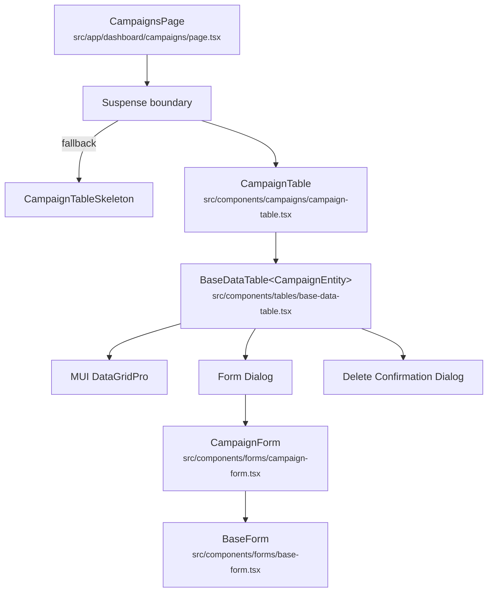
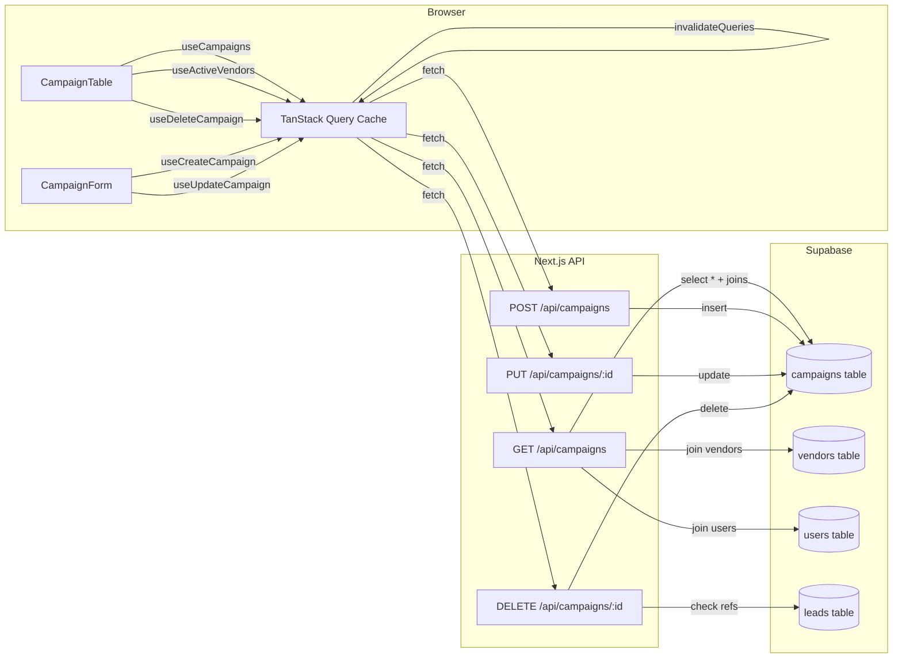

# Marketing / Campaigns — Screen Documentation

> **Last updated:** 2026-03-23  
> **Application:** YOY Program Tracker  
> **Route:** `/dashboard/campaigns`

---

## 1. Screen Overview

| Attribute | Value |
|-----------|-------|
| **Screen name** | Campaigns |
| **Route / URL** | `/dashboard/campaigns` |
| **Purpose** | CRUD management of marketing campaigns (seminars, webinars, events) used for lead generation. Each campaign tracks event details, expected attendance, vendor partnership, and associated costs (ad spend, food). Campaigns are the upstream entity that feeds the Leads pipeline. |
| **Sidebar section** | Marketing |
| **Icon** | Event |

### User Roles & Access

Access is controlled by the **permission-based sidebar filtering** system:

1. **Admin users** (`isAdmin === true`) — full access to all screens including Campaigns.
2. **Users with wildcard permission** (`permissions.includes('*')`) — full access.
3. **Users with explicit path permission** — must have `/dashboard/campaigns` in their `user_menu_permissions` records.
4. Users **without** the above see no "Campaigns" link in the sidebar. The API routes separately enforce Supabase auth (logged-in user required) but do **not** perform role-based checks beyond authentication.

### Workflow Position

```
Vendors (Admin)          Campaigns (this screen)          Leads
────────────────── ──►  ──────────────────────── ──►  ────────────────
Vendors are assigned     Campaigns represent events;     Leads reference a
to campaigns as the      each tracks date, expected      campaign_id as their
marketing partner.       attendees, and costs.           originating source.
```

- **Before:** Vendors must exist to be assignable to campaigns.
- **After:** Leads reference `campaign_id`; campaign performance reports aggregate leads per campaign.

### Layout Description (top → bottom)

1. **Page title** — "Campaigns" (h5, bold).
2. **"Add Campaign" button** — top-right, contained primary button with `+` icon.
3. **Data grid** — full-width MUI X DataGridPro with columns: ID, Campaign Name, Date, Description, Confirmed, Vendor, Ad Spend, Food Cost, Status (active/inactive chip), Created, Created By, Updated, Updated By, Actions (edit/delete icons).
4. **Pagination footer** — page size selector (10 / 25 / 50 / 100), page navigation.
5. **Modals (on demand):**
   - Create/Edit dialog — colored header (blue for create, purple for edit), scrollable form body, sticky Cancel/Submit footer.
   - Delete confirmation dialog — title, message, Cancel + Delete buttons.

---

## 2. Component Architecture

### Component Tree



### CampaignsPage

| Attribute | Detail |
|-----------|--------|
| **File** | `src/app/dashboard/campaigns/page.tsx` |
| **Type** | Server Component (default export, no `'use client'`) |
| **Props** | None |
| **State** | None |
| **Behavior** | Wraps `CampaignTable` in a `Suspense` boundary with `CampaignTableSkeleton` fallback. Adds `p: 3` padding. |

### CampaignTableSkeleton

| Attribute | Detail |
|-----------|--------|
| **File** | `src/app/dashboard/campaigns/page.tsx` (lines 6-38) |
| **Type** | Function component |
| **Behavior** | Renders MUI `Skeleton` elements: text skeleton (200 × 40) for title area, rectangular skeleton (150 × 40) for button, full-width rectangular skeleton (600px tall) for table. |

### CampaignTable

| Attribute | Detail |
|-----------|--------|
| **File** | `src/components/campaigns/campaign-table.tsx` |
| **Type** | Client Component (`'use client'`) |
| **Props** | None |
| **Hooks consumed** | `useCampaigns()`, `useActiveVendors()`, `useDeleteCampaign()` |

**Local state:** None (all state managed by `BaseDataTable` and TanStack Query).

**Key logic:**
- Fetches all campaigns via `useCampaigns()` and all active vendors via `useActiveVendors()`.
- Builds a `vendorMap` (Map of `vendor_id → vendor_name`) to enrich campaign rows.
- Transforms `Campaigns[]` → `CampaignEntity[]` by adding `id`, resolving `vendor_name`, and mapping audit email fields.
- Passes `renderCampaignForm` render-prop to `BaseDataTable` for modal form rendering.

**Column definitions** (lines 25-77):

| Field | Header | Width | Type/Renderer |
|-------|--------|-------|---------------|
| `campaign_id` | ID | 80 | number |
| `campaign_name` | Campaign Name | 200 (flex:1) | string |
| `campaign_date` | Date | 120 | `renderDate` |
| `description` | Description | 250 | string |
| `confirmed_count` | Confirmed | 100 | number |
| `vendor_name` | Vendor | 150 | string |
| `ad_spend` | Ad Spend | 120 | `renderCurrency` |
| `food_cost` | Food Cost | 120 | `renderCurrency` |
| `active_flag` | Status | 120 | `renderActiveFlag` (chip) |
| `created_at` | Created | 120 | `renderDate` |
| `created_by` | Created By | 150 | `renderCreatedBy` |
| `updated_at` | Updated | 120 | `renderDate` |
| `updated_by` | Updated By | 150 | `renderUpdatedBy` |

### BaseDataTable&lt;T&gt;

| Attribute | Detail |
|-----------|--------|
| **File** | `src/components/tables/base-data-table.tsx` |
| **Type** | Generic client component |
| **Props received from CampaignTable** | See table below |

| Prop | Value |
|------|-------|
| `title` | `"Campaigns"` |
| `data` | `campaignsWithId` (CampaignEntity[]) |
| `columns` | `campaignColumns` |
| `loading` | `isLoading` from useCampaigns |
| `error` | `error?.message \|\| null` |
| `getRowId` | `row => row.campaign_id` |
| `onEdit` | `handleEdit` (no-op; form opened by BaseDataTable) |
| `onDelete` | `handleDelete` → `deleteCampaign.mutate(String(id))` |
| `renderForm` | `renderCampaignForm` |
| `persistStateKey` | `"campaignsGrid"` |
| `createButtonText` | `"Add Campaign"` |
| `editButtonText` | `"Edit Campaign"` |
| `deleteButtonText` | `"Delete Campaign"` |
| `deleteConfirmMessage` | `"Are you sure you want to delete this campaign? This action cannot be undone."` |
| `pageSize` | `25` |
| `pageSizeOptions` | `[10, 25, 50, 100]` |

**BaseDataTable local state:**

| Variable | Type | Initial | Purpose |
|----------|------|---------|---------|
| `formOpen` | `boolean` | `false` | Controls create/edit dialog visibility |
| `editingRow` | `T \| undefined` | `undefined` | Row being edited |
| `formMode` | `'create' \| 'edit'` | `'create'` | Dialog mode |
| `expandedRow` | `GridRowId \| null` | `null` | Detail panel row (unused for campaigns) |
| `deleteModalOpen` | `boolean` | `false` | Delete confirmation dialog visibility |
| `deletingId` | `GridRowId \| null` | `null` | Row targeted for deletion |

**Key refs:** `apiRef` (useGridApiRef) — used for state persistence export/restore.

**Side effects:**
- `useMemo` for `initialGridState` — loads persisted grid state from `localStorage` keyed as `campaignsGrid_{userId}`.
- `useLayoutEffect` (unmount) — saves grid state to localStorage on SPA navigation.
- `useLayoutEffect` (beforeunload) — saves grid state on browser close/refresh.

### CampaignForm

| Attribute | Detail |
|-----------|--------|
| **File** | `src/components/forms/campaign-form.tsx` |
| **Type** | Client Component (`'use client'`) |

**Props:**

| Name | Type | Required | Default |
|------|------|----------|---------|
| `initialValues` | `Partial<CampaignFormData> & { campaign_id?: number }` | No | `undefined` |
| `onSuccess` | `() => void` | No | `undefined` |
| `mode` | `'create' \| 'edit'` | No | `'create'` |

**Hooks consumed:** `useForm` (react-hook-form), `useCreateCampaign()`, `useUpdateCampaign()`, `useActiveVendors()`.

**Form state (via react-hook-form):**

| Field | Default Value |
|-------|---------------|
| `campaign_name` | `''` |
| `campaign_date` | Today's date (ISO `YYYY-MM-DD`) |
| `description` | `''` |
| `confirmed_count` | `0` |
| `vendor_id` | `0` |
| `ad_spend` | `null` |
| `food_cost` | `null` |
| `active_flag` | `true` |

**Event handlers:**
- `onSubmit(values)` — calls `updateCampaign.mutateAsync` (edit) or `createCampaign.mutateAsync` (create), then `onSuccess()`.
- `handleDateChange(date)` — converts `Date` to `YYYY-MM-DD` string, sets `campaign_date` via `setValue`.

### BaseForm&lt;T&gt;

| Attribute | Detail |
|-----------|--------|
| **File** | `src/components/forms/base-form.tsx` |
| **Type** | Client Component |
| **Behavior** | Renders `<form>` with scrollable content area, sticky bottom bar with Cancel + Submit buttons. Submit button shows `CircularProgress` when `isSubmitting`. |

---

## 3. Data Flow

### Data Lifecycle

1. **Load:** `CampaignTable` mounts → `useCampaigns()` fires `GET /api/campaigns` → Supabase query with vendor/user joins → returns flat mapped array → stored in TanStack Query cache under `['campaigns', 'list']`.
2. **Transform:** Component maps `Campaigns[]` → `CampaignEntity[]` adding `id` property, resolving `vendor_name` from parallel `useActiveVendors()` query, and mapping `created_by_email`/`updated_by_email`.
3. **Display:** `BaseDataTable` renders `DataGridPro` with transformed data. Grid state (column order, widths, sort, pagination) is restored from `localStorage`.
4. **Create:** User clicks "Add Campaign" → dialog opens → fills form → react-hook-form validates via Zod → `POST /api/campaigns` → server validates again with Zod → Supabase insert → returns new row → `onSuccess` invalidates `['campaigns']` query key → table refetches.
5. **Edit:** User clicks edit icon → dialog opens pre-filled → form submission → `PUT /api/campaigns/:id` → Supabase update → cache invalidation → refetch.
6. **Delete:** User clicks delete icon → confirmation modal → `DELETE /api/campaigns/:id` → server checks for lead references → if none, deletes → optimistic UI removal from cache (rollback on error) → cache invalidation on success.

### Data Flow Diagram



### Loading, Error, and Optimistic States

| State | Implementation |
|-------|---------------|
| **Loading (initial)** | `Suspense` fallback shows `CampaignTableSkeleton`; `BaseDataTable` shows `CircularProgress` overlay when `loading=true` |
| **Loading (grid not ready)** | If `persistStateKey` is set but user hasn't loaded yet, grid area shows centered `CircularProgress` |
| **Error** | `BaseDataTable` renders MUI `Alert severity="error"` above the grid |
| **Optimistic delete** | `useDeleteCampaign.onMutate` removes the row from cache immediately; `onError` rolls back using saved `prev` snapshot |
| **Submitting form** | Submit button shows `CircularProgress`; button disabled during `isSubmitting \|\| mutation.isPending` |

---

## 4. API / Server Layer

### GET /api/campaigns

| Attribute | Detail |
|-----------|--------|
| **File** | `src/app/api/campaigns/route.ts` |
| **Method** | `GET` |
| **Auth** | `supabase.auth.getUser()` — returns 401 if not authenticated |
| **Parameters** | None |
| **Query** | `select(*, vendor:vendors!campaigns_vendor_id_fkey(vendor_id,vendor_name), created_user:users!campaigns_created_by_fkey(id,email,full_name), updated_user:users!campaigns_updated_by_fkey(id,email,full_name))` |
| **Response (200)** | `{ data: CampaignWithJoins[] }` |
| **Response (401)** | `{ error: "Unauthorized" }` |
| **Response (500)** | `{ error: "<supabase error message>" }` |
| **Caching** | None (no Cache-Control headers) |
| **Rate limiting** | None |

**Response shape (per item):**
```typescript
{
  campaign_id: number;
  campaign_name: string;
  campaign_date: string;
  description: string;
  confirmed_count: number;
  vendor_id: number;
  ad_spend: number | null;
  food_cost: number | null;
  active_flag: boolean;
  created_at: string | null;
  created_by: string | null;
  updated_at: string | null;
  updated_by: string | null;
  vendor_name: string | null;
  created_by_email: string | null;
  created_by_full_name: string | null;
  updated_by_email: string | null;
  updated_by_full_name: string | null;
}
```

### POST /api/campaigns

| Attribute | Detail |
|-----------|--------|
| **File** | `src/app/api/campaigns/route.ts` |
| **Method** | `POST` |
| **Auth** | `supabase.auth.getUser()` — returns 401 |
| **Request body** | `CampaignFormData` (Zod validated) |
| **Validation** | `campaignSchema.safeParse(body)` |
| **Query** | `insert([parse.data]).select().single()` |
| **Response (201)** | `{ data: Campaign }` |
| **Response (400)** | `{ error: "Invalid JSON" }` or `{ error: ZodFlattenedError }` |
| **Response (401)** | `{ error: "Unauthorized" }` |
| **Response (500)** | `{ error: "<supabase error>" }` |

### GET /api/campaigns/:id

| Attribute | Detail |
|-----------|--------|
| **File** | `src/app/api/campaigns/[id]/route.ts` |
| **Method** | `GET` |
| **Auth** | Supabase auth required |
| **Params** | `id` (route segment — campaign_id) |
| **Query** | `select(*, vendor join).eq('campaign_id', id).single()` |
| **Response (200)** | `{ data: CampaignWithVendor }` |

### PUT /api/campaigns/:id

| Attribute | Detail |
|-----------|--------|
| **File** | `src/app/api/campaigns/[id]/route.ts` |
| **Method** | `PUT` |
| **Auth** | Supabase auth required |
| **Params** | `id` (route segment) |
| **Request body** | `CampaignUpdateData` (partial, Zod validated via `campaignUpdateSchema`) |
| **Query** | `update(parse.data).eq('campaign_id', id).select().single()` |
| **Response (200)** | `{ data: Campaign }` |
| **Response (400)** | `{ error: "Invalid JSON" }` or `{ error: ZodFlattenedError }` |

### DELETE /api/campaigns/:id

| Attribute | Detail |
|-----------|--------|
| **File** | `src/app/api/campaigns/[id]/route.ts` |
| **Method** | `DELETE` |
| **Auth** | Supabase auth required |
| **Params** | `id` (route segment) |
| **Referential check** | Queries `leads` table for any row with `campaign_id = id`; if found, returns 409 |
| **Query** | `delete().eq('campaign_id', id)` |
| **Response (200)** | `{ data: true }` |
| **Response (409)** | `{ error: "Cannot delete campaign: referenced by leads." }` |
| **Response (500)** | `{ error: "<supabase error>" }` |

### POST /api/campaigns/bulk

| Attribute | Detail |
|-----------|--------|
| **File** | `src/app/api/campaigns/bulk/route.ts` |
| **Method** | `POST` |
| **Auth** | Supabase auth required |
| **Request body** | `{ campaigns: CampaignFormData[] }` |
| **Validation** | Array check, empty check, max 1000 limit, per-row `campaignSchema.safeParse` |
| **Query** | `insert(validatedCampaigns).select(* + vendor/user joins)` |
| **Response (201)** | `{ data: MappedCampaigns[], message: "N campaigns created successfully", count: N }` |
| **Response (400)** | Validation errors with row-level detail |

---

## 5. Database Layer

### Tables

#### `campaigns` (primary)

| Column | Type | Nullable | Default | Constraints |
|--------|------|----------|---------|-------------|
| `campaign_id` | `integer` | NO | auto-increment (PK) | Primary key |
| `campaign_name` | `text` | NO | — | — |
| `campaign_date` | `text` (ISO date) | NO | — | — |
| `description` | `text` | NO | — | — |
| `confirmed_count` | `integer` | NO | — | — |
| `vendor_id` | `integer` | NO | — | FK → `vendors.vendor_id` |
| `ad_spend` | `numeric` | YES | `null` | — |
| `food_cost` | `numeric` | YES | `null` | — |
| `active_flag` | `boolean` | NO | — | — |
| `created_at` | `timestamptz` | YES | `now()` | Auto-set |
| `created_by` | `text` (uuid) | YES | — | FK → `users.id` |
| `updated_at` | `timestamptz` | YES | `now()` | Updated by trigger |
| `updated_by` | `text` (uuid) | YES | — | FK → `users.id` |

**Foreign keys:**
- `campaigns_vendor_id_fkey` → `vendors(vendor_id)`
- `campaigns_created_by_fkey` → `users(id)`
- `campaigns_updated_by_fkey` → `users(id)`

**Triggers:**
- `update_campaigns_timestamp` — auto-updates `updated_at` on row modification.

**RLS:** Enabled. Authenticated users get full access; `service_role` bypasses.

**Audit:** No audit trigger on `campaigns` (noted as a gap in `database/SCHEMA.md`).

#### `vendors` (joined)

| Column | Type | Notes |
|--------|------|-------|
| `vendor_id` | `integer` | PK |
| `vendor_name` | `text` | Displayed in Vendor column |
| `active_flag` | `boolean` | Only active vendors shown in form dropdown |

#### `users` (joined)

| Column | Type | Notes |
|--------|------|-------|
| `id` | `uuid` | PK (Supabase auth UID) |
| `email` | `text` | Displayed in Created By / Updated By columns |
| `full_name` | `text` | Available but not currently displayed |

#### `leads` (referential integrity check)

| Column | Type | Notes |
|--------|------|-------|
| `lead_id` | `integer` | PK |
| `campaign_id` | `integer` | FK → `campaigns.campaign_id`; checked before campaign delete |

### Queries

#### List all campaigns

```sql
-- File: src/app/api/campaigns/route.ts → GET
-- Type: READ
SELECT *,
  vendor:vendors!campaigns_vendor_id_fkey(vendor_id, vendor_name),
  created_user:users!campaigns_created_by_fkey(id, email, full_name),
  updated_user:users!campaigns_updated_by_fkey(id, email, full_name)
FROM campaigns;
```

**Performance:** No WHERE clause — returns all campaigns (active and inactive). No ordering specified (client-side sort via DataGrid). Joins use foreign key indexes. Could benefit from an index on `active_flag` if filtering is added server-side.

#### Get single campaign

```sql
-- File: src/app/api/campaigns/[id]/route.ts → GET
-- Type: READ
SELECT *,
  vendor:vendors!campaigns_vendor_id_fkey(vendor_id, vendor_name)
FROM campaigns
WHERE campaign_id = $1
LIMIT 1;
```

**Performance:** Primary key lookup — efficient.

#### Create campaign

```sql
-- File: src/app/api/campaigns/route.ts → POST
-- Type: WRITE
INSERT INTO campaigns (campaign_name, campaign_date, description, confirmed_count, vendor_id, ad_spend, food_cost, active_flag)
VALUES ($1, $2, $3, $4, $5, $6, $7, $8)
RETURNING *;
```

#### Update campaign

```sql
-- File: src/app/api/campaigns/[id]/route.ts → PUT
-- Type: WRITE
UPDATE campaigns
SET <partial fields>
WHERE campaign_id = $1
RETURNING *;
```

#### Check lead references (before delete)

```sql
-- File: src/app/api/campaigns/[id]/route.ts → DELETE
-- Type: READ
SELECT lead_id FROM leads WHERE campaign_id = $1 LIMIT 1;
```

**Performance:** Should have an index on `leads.campaign_id` for fast lookup. If the index doesn't exist, this could be slow with many leads.

#### Delete campaign

```sql
-- File: src/app/api/campaigns/[id]/route.ts → DELETE
-- Type: WRITE
DELETE FROM campaigns WHERE campaign_id = $1;
```

#### Bulk insert

```sql
-- File: src/app/api/campaigns/bulk/route.ts → POST
-- Type: WRITE
INSERT INTO campaigns (campaign_name, ..., created_by, updated_by)
VALUES <up to 1000 rows>
RETURNING *, vendor join, user joins;
```

---

## 6. Business Rules & Logic

| # | Rule | Enforced At | Violation Behavior |
|---|------|-------------|--------------------|
| 1 | Campaign name is required and non-empty | Client (Zod + react-hook-form), Server (Zod) | Inline field error: "Campaign name is required" |
| 2 | Campaign date is required | Client + Server (Zod) | Inline field error: "Campaign date is required" |
| 3 | Description is required | Client + Server (Zod) | Inline field error: "Description is required" |
| 4 | Confirmed count must be a number | Client + Server (Zod) | Inline field error: "Confirmed count is required" |
| 5 | Vendor is required (must be > 0) | Client + Server (Zod `z.number()`) | Inline field error: "Vendor is required" |
| 6 | Cannot delete a campaign that has leads referencing it | Server (API DELETE handler) | Toast error: "Cannot delete campaign: referenced by leads." (HTTP 409) |
| 7 | Bulk import limited to 1000 campaigns per request | Server (API bulk handler) | JSON error: "Maximum 1000 campaigns per bulk import" (HTTP 400) |
| 8 | Bulk import array must not be empty | Server (API bulk handler) | JSON error: "Campaigns array cannot be empty" (HTTP 400) |
| 9 | Ad spend and food cost are optional (nullable) | Client + Server (Zod `.nullable().optional()`) | No error; stored as null |
| 10 | Active flag defaults to true for new campaigns | Client (react-hook-form default) | N/A |

### Derived/Calculated Values

- **Vendor name** — resolved client-side by mapping `vendor_id` → `vendor_name` using a parallel `useActiveVendors()` query and a `Map` lookup.
- **Created By / Updated By** — resolved server-side by joining to `users` table on `created_by`/`updated_by` UUIDs, returning email addresses.

### Feature Flags / Environment Behavior

None. The campaigns screen has no feature flag gating or environment-specific behavior.

---

## 7. Form & Validation Details

### Form Fields

| Label | Field Name | Input Type | Bound State | Required | Validation | Error Message |
|-------|-----------|------------|-------------|----------|------------|---------------|
| Campaign Name | `campaign_name` | `TextField` | react-hook-form | Yes | `z.string().min(1)` | "Campaign name is required" |
| Campaign Date | `campaign_date` | `DatePicker` | react-hook-form (via `setValue`) | Yes | `z.string().min(1)` | "Campaign date is required" |
| Description | `description` | `TextField` (multiline, 3 rows) | react-hook-form | Yes | `z.string().min(1)` | "Description is required" |
| Confirmed Count | `confirmed_count` | `TextField` (type=number) | react-hook-form (`valueAsNumber`) | Yes | `z.number()` | "Confirmed count is required" |
| Vendor | `vendor_id` | `TextField` (select) | react-hook-form (`valueAsNumber`) | Yes | `z.number()` | "Vendor is required" |
| Ad Spend | `ad_spend` | `TextField` (type=number, $ prefix) | react-hook-form (`valueAsNumber`) | No | `z.number().nullable().optional()` | — |
| Food Cost | `food_cost` | `TextField` (type=number, $ prefix) | react-hook-form (`valueAsNumber`) | No | `z.number().nullable().optional()` | — |
| Active | `active_flag` | `Switch` | react-hook-form (via `setValue`) | Yes | `z.boolean()` | — |

### Validation Strategy

- **Client-side:** Zod schema via `zodResolver` in react-hook-form. Validation runs on submit (default mode).
- **Server-side:** Same Zod schema (`campaignSchema` for create, `campaignUpdateSchema` for update) validated in API route. Errors returned as flattened Zod errors.

### Form Submission Flow

1. User fills form → clicks "Create" / "Update"
2. `handleSubmit` (react-hook-form) runs Zod validation
3. If invalid → inline errors rendered via `helperText` on each field
4. If valid → `onSubmit` called
5. `onSubmit` constructs `CampaignFormData` object
6. If edit: calls `updateCampaign.mutateAsync({ ...data, id: campaign_id })`
7. If create: calls `createCampaign.mutateAsync(data)`
8. On success: `onSuccess()` called → dialog closes; toast "Campaign created/updated"
9. On error: toast error message shown

### Dirty State / Unsaved Changes

No dirty-state tracking or unsaved-changes warning is implemented. Closing the dialog discards changes silently.

---

## 8. State Management

### Local Component State

| Component | Variable | Type | Purpose |
|-----------|----------|------|---------|
| BaseDataTable | `formOpen` | `boolean` | Dialog visibility |
| BaseDataTable | `editingRow` | `CampaignEntity \| undefined` | Row being edited |
| BaseDataTable | `formMode` | `'create' \| 'edit'` | Dialog mode |
| BaseDataTable | `deleteModalOpen` | `boolean` | Delete dialog visibility |
| BaseDataTable | `deletingId` | `GridRowId \| null` | Row targeted for deletion |

### Server/Cache State (TanStack Query)

| Query Key | Hook | Stale Time | Data |
|-----------|------|------------|------|
| `['campaigns', 'list']` | `useCampaigns()` | Default (0) | All campaigns |
| `['campaigns', 'active']` | `useActiveCampaigns()` | Default (0) | Active campaigns only |
| `['vendors', 'active']` | `useActiveVendors()` | Default (0) | Active vendors |

**Mutation invalidation:** All campaign mutations invalidate `['campaigns']` (the `all` key), causing both `list` and `active` queries to refetch.

### Persisted State (localStorage)

| Key Pattern | Purpose |
|-------------|---------|
| `campaignsGrid_{userId}` | DataGrid column widths, order, sort model, pagination model, filter state |

### URL State

None. No query parameters or hash fragments are used.

---

## 9. Navigation & Routing

### Inbound Routes

| Source | Link/Trigger |
|--------|-------------|
| Sidebar | "Campaigns" under Marketing section → `/dashboard/campaigns` |
| Direct URL | Browser navigation to `/dashboard/campaigns` |

### Outbound Navigation

None. The Campaigns screen does not navigate to other screens. There are no row-click handlers that route elsewhere.

### Route Guards

1. **Middleware** (`middleware.ts`): `/dashboard` is a protected route. Unauthenticated users are redirected to `/login`.
2. **Sidebar permission filter**: Users without `/dashboard/campaigns` in their permissions do not see the link (but can still access via direct URL if authenticated).
3. **API-level auth**: Each API route checks `supabase.auth.getUser()` and returns 401 if not authenticated.

### Deep Linking

The URL `/dashboard/campaigns` is shareable. However, grid state (sort, filters, page) is persisted in localStorage per user, not in the URL — so deep links always show the default/saved grid state of the visiting user.

---

## 10. Error Handling & Edge Cases

### Error States

| Trigger | UI Treatment | Recovery |
|---------|-------------|----------|
| `useCampaigns()` fetch fails | `Alert severity="error"` above grid with error message | User can refresh the page |
| Create/Update mutation fails | `toast.error()` via Sonner with error message | User can retry submission |
| Delete mutation fails | `toast.error()` + optimistic removal rolled back (row reappears) | User can retry |
| Delete blocked by lead reference | `toast.error("Cannot delete campaign: referenced by leads.")` | User must remove lead associations first |
| Invalid JSON in API request | HTTP 400 `{ error: "Invalid JSON" }` | N/A (programmatic error) |
| Zod validation fails (server) | HTTP 400 with flattened error details | N/A (should be caught client-side first) |
| Supabase auth expired | HTTP 401; middleware redirects to `/login` | User re-authenticates |

### Empty States

When no campaigns exist, the DataGrid shows its built-in "No rows" empty state.

### Loading States

1. **Suspense fallback:** Skeleton UI (title placeholder + button placeholder + 600px table area) shown on initial render.
2. **Grid loading overlay:** Semi-transparent white overlay with `CircularProgress` and "Loading data..." text while `isLoading` is true.
3. **Grid not ready (auth loading):** Centered `CircularProgress` while waiting for user ID to be available for state persistence.
4. **Form submission:** Submit button shows `CircularProgress` spinner; Cancel and Submit buttons disabled.

### Timeout / Offline Handling

No explicit timeout handling. No offline/service-worker support. TanStack Query will retry failed requests per its default retry policy (3 retries with exponential backoff).

---

## 11. Accessibility

### ARIA & Semantics

- MUI DataGridPro provides built-in ARIA roles (`role="grid"`, `role="row"`, `role="gridcell"`) and keyboard navigation.
- Dialog components use `role="dialog"` with `aria-labelledby` (via `DialogTitle`).
- Form fields have associated labels via MUI `TextField` `label` prop (rendered as `<label>`).
- Active/Inactive status uses `Chip` component with color differentiation (green/default) — consider adding `aria-label` for screen readers.

### Keyboard Navigation

- **Tab order:** Title → Add Campaign button → Grid cells → Pagination controls.
- **Grid navigation:** Arrow keys to move between cells (DataGridPro built-in).
- **Dialog:** Focus trapped within dialog when open. Tab cycles through form fields.
- **Delete dialog:** `autoFocus` set on Delete button for keyboard confirmation.
- No custom keyboard shortcuts defined.

### Screen Reader Considerations

- Grid column headers are announced via built-in DataGridPro support.
- Currency values rendered as `$X,XXX.XX` text — readable.
- Date values rendered as locale-formatted strings — readable.
- Active/Inactive chip text is readable, but the color distinction is visual only.

### Color Contrast

- Active chip: green outlined on white — meets WCAG AA for the text label.
- Currency and date values use `Typography variant="body2"` — inherits theme contrast.
- Dialog headers use white text on primary/secondary background — should be verified against theme colors.

### Focus Management

- **Dialog open:** Focus moves into dialog content (MUI default behavior).
- **Dialog close:** Focus returns to triggering element (MUI default behavior).
- **After form submit:** Dialog closes; no explicit focus management back to grid.

---

## 12. Performance Considerations

### Identified Concerns

| Area | Status | Notes |
|------|--------|-------|
| **List virtualization** | Handled | DataGridPro virtualizes rows by default |
| **Full table fetch** | Potential concern | `GET /api/campaigns` returns ALL campaigns with no server-side pagination or filtering. Acceptable for small-to-medium datasets (< 10,000 rows). May need server-side pagination if campaigns grow large. |
| **Vendor lookup** | Minor | Builds a `Map` on every render from vendor array. Memoized within render scope but recreated each time `campaigns` or `vendors` data changes. |
| **Column definitions** | Good | Defined as module-level constants outside the component (no re-creation) |
| **Grid state persistence** | Good | Uses `localStorage` — synchronous but fast for small payloads |
| **DataGrid key prop** | Good | Key includes `persistStateKey` + `user.id` to force remount on user change |
| **Delete optimistic update** | Good | Immediate UI feedback with rollback on failure |

### Caching Strategy

| Layer | Strategy |
|-------|----------|
| **Client (TanStack Query)** | Default staleTime (0) — refetches on window focus and mount. Cache persists in memory during session. |
| **Server** | No caching headers set on API responses. |
| **CDN** | N/A — API routes are dynamic. |
| **Grid state** | `localStorage` per user, saved on unmount and beforeunload. |

---

## 13. Third-Party Integrations

### GoHighLevel (GHL) — Indirect

| Attribute | Detail |
|-----------|--------|
| **Service** | GoHighLevel CRM |
| **Purpose** | GHL webhook imports create leads that reference campaigns. `GHLService.ensureDefaultCampaign()` auto-creates a default campaign if one doesn't exist. |
| **File** | `src/lib/services/ghl-service.ts` |
| **Env vars** | GHL config in `src/lib/config/ghl.ts` (not directly used by Campaigns screen) |
| **Failure mode** | If default campaign creation fails, falls back to `campaign_id = 1` |

The Campaigns screen itself does not directly call any external APIs. GHL integration affects the campaigns table indirectly via webhook-driven lead imports.

---

## 14. Security Considerations

| Area | Status | Notes |
|------|--------|-------|
| **Authentication** | Enforced | Every API route calls `supabase.auth.getUser()` and returns 401 if unauthenticated |
| **Authorization (role-based)** | Partial | Sidebar hides the link for unauthorized users, but API routes only check authentication, not role/permission. A user with valid auth but without campaigns permission can still call `/api/campaigns` directly. |
| **Input validation** | Enforced | Zod schemas on both client and server. String fields validated for non-empty. Numeric fields validated for type. |
| **XSS prevention** | Handled | React auto-escapes rendered values. No `dangerouslySetInnerHTML` usage. |
| **CSRF** | Mitigated | Same-origin cookies with `credentials: 'include'`. Supabase auth tokens are HttpOnly cookies managed by `@supabase/ssr`. |
| **SQL injection** | Prevented | Supabase client uses parameterized queries internally. No raw SQL. |
| **PII/PHI** | Low risk | Campaigns do not contain PII. Vendor names and campaign descriptions are business data. |
| **HIPAA** | N/A | No protected health information on this screen. |
| **File uploads** | N/A | No file upload functionality. |
| **Sensitive data in responses** | Clean | `created_by`/`updated_by` expose user emails (not passwords or tokens). |

---

## 15. Testing Coverage

### Existing Tests

No test files matching `*campaign*` were found in the codebase. **There are zero tests for the Campaigns screen.**

### Gaps

| Area | Impact |
|------|--------|
| Component rendering | Not tested |
| Form validation | Not tested |
| API route handlers | Not tested |
| Delete referential integrity check | Not tested |
| Bulk import validation | Not tested |
| Optimistic delete rollback | Not tested |

### Suggested Test Cases

#### Unit Tests

| Test | File to Create |
|------|---------------|
| CampaignForm renders all fields | `src/components/forms/__tests__/campaign-form.test.tsx` |
| CampaignForm validates required fields | Same file |
| CampaignForm submits create payload correctly | Same file |
| CampaignForm submits update payload with campaign_id | Same file |
| CampaignTable transforms data correctly (vendor_name mapping) | `src/components/campaigns/__tests__/campaign-table.test.tsx` |
| campaignSchema validates correct input | `src/lib/validations/__tests__/campaign.test.ts` |
| campaignSchema rejects missing required fields | Same file |
| campaignUpdateSchema allows partial updates | Same file |

#### Integration Tests

| Test | Description |
|------|-------------|
| GET /api/campaigns returns joined data | Verify vendor_name and email mapping |
| POST /api/campaigns validates and inserts | Verify Zod validation + DB insert |
| PUT /api/campaigns/:id partial update | Verify partial schema works |
| DELETE /api/campaigns/:id with no leads | Verify successful deletion |
| DELETE /api/campaigns/:id with leads | Verify 409 response |
| POST /api/campaigns/bulk max limit | Verify 1000 limit enforcement |
| POST /api/campaigns/bulk validation errors | Verify per-row error reporting |

#### E2E Tests

| Test | Description |
|------|-------------|
| Create campaign happy path | Navigate → click Add → fill form → submit → verify row appears |
| Edit campaign | Click edit → modify fields → submit → verify updated values |
| Delete campaign (no leads) | Click delete → confirm → verify row removed |
| Delete campaign (has leads) | Click delete → confirm → verify error toast |
| Grid state persistence | Sort/resize columns → navigate away → return → verify state preserved |

---

## 16. Code Review Findings

| Severity | File | Location | Issue | Suggested Fix |
|----------|------|----------|-------|---------------|
| **High** | `src/app/api/campaigns/[id]/route.ts` | `GET` handler, line 36-37 | `created_by_email` and `updated_by_email` are set to `data.created_by` (UUID), not the user's email. The list endpoint joins `users` and returns the email, but the single-get endpoint does not. Inconsistent response shape. | Join `users` table like the list endpoint does, or remove these fields from the single-get response. |
| **High** | `src/app/api/campaigns/[id]/route.ts` | Lines 11, 54, 89 | `params` usage is inconsistent: `GET` uses `const { id } = params` (sync), `PUT` and `DELETE` use `const { id } = await context.params` (async). In Next.js 15, `params` is a Promise. The `GET` handler may fail at runtime. | Use `await` consistently: `const { id } = await params` in all handlers. |
| **Medium** | `src/app/api/campaigns/route.ts` | `POST` handler | `created_by` and `updated_by` are not set on insert. The bulk endpoint sets them (`user.id`), but the single-create endpoint does not. If the DB doesn't have a default trigger, these fields will be null. | Add `created_by: user.id, updated_by: user.id` to the insert data. |
| **Medium** | `src/components/campaigns/campaign-table.tsx` | Lines 136-137 | `created_at` and `updated_at` fallback to `new Date().toISOString()` when null. This shows the current timestamp as a misleading "created at" date for records with null timestamps. | Use a dash or "N/A" instead of fabricating a timestamp. |
| **Medium** | `src/components/forms/campaign-form.tsx` | Line 62 | `onSubmit` parameter typed as `any` instead of `CampaignFormData`. Bypasses type safety. | Type as `CampaignFormData`: `const onSubmit = async (values: CampaignFormData) => {` |
| **Medium** | `src/components/forms/campaign-form.tsx` | Lines 113-117 | Edit mode: `confirmed_count` defaults to `0` via `\|\| 0` and `active_flag` via `\|\| true`. If `confirmed_count` is legitimately `0`, it works correctly. But `active_flag: false` would be overridden to `true` due to `\|\| true` falsy check. | Use nullish coalescing: `active_flag: initialValues.active_flag ?? true` |
| **Medium** | `src/lib/hooks/use-campaigns.ts` | `useActiveCampaigns`, line 34-39 | Fetches ALL campaigns from `GET /api/campaigns` then filters client-side for `active_flag`. Wasteful if there are many inactive campaigns. | Add a query parameter `?active=true` and filter server-side, or use a separate endpoint. |
| **Low** | `src/components/campaigns/campaign-table.tsx` | Line 88-91 | `handleEdit` is a no-op function. The comment says BaseDataTable handles it, which is true, but passing a no-op `onEdit` prop causes the edit action column to appear. This is intentional but the no-op function is confusing. | Remove the function body comment or replace with a more explicit comment. |
| **Low** | `src/app/api/campaigns/[id]/route.ts` | DELETE handler | `await context.params` is used but `req` (first parameter) is unused. No `_req` prefix. | Rename to `_req` for consistency. |
| **Low** | `src/lib/validations/campaign.ts` | `vendor_id` | Zod schema accepts any number including `0` and negatives for `vendor_id`. The form uses `0` as the "Select a vendor" placeholder value, which would pass validation. | Add `.min(1, 'Vendor is required')` to `vendor_id`. |
| **Low** | `src/app/api/campaigns/route.ts` | GET handler | No ordering specified on the query. Results depend on database default order (typically insertion order). | Add `.order('campaign_date', { ascending: false })` or similar for predictable ordering. |

---

## 17. Tech Debt & Improvement Opportunities

| Category | Description | Priority |
|----------|-------------|----------|
| **Missing audit trigger** | `campaigns` table lacks an audit trigger (documented in `database/SCHEMA.md`). Changes are not tracked in `audit_events`. | High |
| **No server-side authorization** | API routes only check authentication, not whether the user has permission to access campaigns. A user could call the API directly without sidebar permission. | High |
| **No server-side pagination** | `GET /api/campaigns` returns all rows. Should add pagination parameters for scalability. | Medium |
| **Inconsistent params handling** | Mix of sync and async `params` access across GET/PUT/DELETE handlers in `[id]/route.ts`. | Medium |
| **Missing created_by on single POST** | Unlike the bulk endpoint, the single-create POST doesn't set `created_by`/`updated_by`. | Medium |
| **No unsaved changes warning** | Form dialog can be closed without warning, losing user input. | Low |
| **No bulk UI** | The bulk import endpoint exists but has no corresponding frontend UI. Only usable programmatically. | Low |
| **Vendor dropdown shows only active** | If a campaign references an inactive vendor, editing it may not show the vendor in the dropdown. | Low |
| **Client-side vendor resolution** | Vendor names are resolved by a separate query + Map lookup. Could be resolved server-side (which it already is in the API response via `vendor_name` field, making the client-side resolution redundant). | Low |
| **Grid column defs not memoized** | `campaignColumns` is a module-level constant (good), but `campaignsWithId` is recreated every render. Consider `useMemo`. | Low |

---

## 18. End-User Documentation Draft

### Campaigns

Manage your marketing campaigns — track events, vendors, costs, and attendance.

---

### What This Page Is For

The **Campaigns** page is where you create and manage records for your marketing events — seminars, webinars, dinner events, and other lead-generation activities. Each campaign tracks:

- When and where the event happens
- Which vendor/partner is involved
- How much you spent on advertising and food
- How many people confirmed attendance

Campaigns are the starting point of your sales pipeline. When leads come in from events, they are linked to the campaign they originated from, letting you analyze which campaigns generate the best results.

---

### Step-by-Step Instructions

#### Creating a New Campaign

1. Click the **"Add Campaign"** button in the top-right corner.
2. Fill in the required fields:
   - **Campaign Name** — a descriptive name for the event (e.g., "March 2026 Dinner Seminar").
   - **Campaign Date** — click the date field and select the event date from the calendar.
   - **Description** — briefly describe the event type, location, or purpose.
   - **Confirmed Count** — the number of confirmed attendees.
   - **Vendor** — select the marketing partner/vendor from the dropdown.
3. Optionally fill in:
   - **Ad Spend** — the total advertising cost for this campaign.
   - **Food Cost** — the food/catering cost for this campaign.
   - **Active** — toggle on (default) to make this campaign available for lead assignment.
4. Click **"Create"** to save.

#### Editing a Campaign

1. Find the campaign in the table.
2. Click the **pencil icon** in the Actions column.
3. Modify any fields.
4. Click **"Update"** to save changes.

#### Deleting a Campaign

1. Click the **trash icon** in the Actions column.
2. A confirmation dialog will appear.
3. Click **"Delete"** to confirm.

> **Note:** You cannot delete a campaign that has leads assigned to it. You must first reassign or remove the associated leads.

#### Sorting and Filtering

- Click any **column header** to sort by that column.
- Drag column edges to **resize** columns.
- Drag column headers to **reorder** columns.
- Your column layout, sort preferences, and page size are **automatically saved** and will be restored next time you visit.

---

### Field Descriptions

| Field | Description |
|-------|-------------|
| **Campaign Name** | The name or title of your marketing event. This is how the campaign will appear in lead forms and reports. |
| **Campaign Date** | The date the event takes place. Used for chronological sorting and reporting. |
| **Description** | A short description of the event — type, location, or special notes. |
| **Confirmed Count** | The number of people who confirmed they would attend. Used for show-rate calculations in reports. |
| **Vendor** | The marketing partner or vendor managing or co-hosting the event. Must be set up in Admin > Vendors first. |
| **Ad Spend** | The total advertising cost for this campaign (in dollars). Used for ROI calculations. |
| **Food Cost** | The food or catering cost for this campaign (in dollars). Used for ROI calculations. |
| **Active** | Whether this campaign is active. Only active campaigns appear as options when creating new leads. |

---

### Tips and Notes

- **Plan your vendors first.** Before creating campaigns, make sure your vendors are set up in Admin > Vendors. You won't be able to create a campaign without selecting a vendor.
- **Keep campaign names consistent.** Use a naming convention like "Month Year — Event Type" (e.g., "March 2026 — Dinner Seminar") so they sort and display clearly in reports.
- **Deactivate instead of deleting.** If a campaign is no longer in use but has leads tied to it, toggle it to Inactive rather than trying to delete it.
- **Ad Spend and Food Cost** are optional but valuable — they power the cost-per-lead and ROI metrics in the Marketing Reports page.

---

### FAQ

**Q: Why can't I delete a campaign?**  
A: The campaign has one or more leads associated with it. You must reassign those leads to a different campaign or remove them before the campaign can be deleted.

**Q: Why don't I see the Campaigns link in the sidebar?**  
A: Your user account may not have permission to access Marketing screens. Contact your administrator to request access.

**Q: Can I import campaigns in bulk?**  
A: The system supports bulk import via API, but there is no bulk-import button on this screen. Contact your administrator if you need to import campaigns from a spreadsheet.

**Q: Will my table settings (sort, column sizes) be saved?**  
A: Yes. Your grid layout, column widths, sort order, and page size are automatically saved to your browser and restored each time you visit the page.

**Q: What does "Confirmed Count" mean?**  
A: This is the number of people who confirmed attendance for the event. It's used in marketing reports to calculate show rates (actual attendees vs. confirmed).

---

### Troubleshooting

| Problem | Solution |
|---------|----------|
| **Table is blank / stuck loading** | Check your internet connection and refresh the page. If the problem persists, the server may be temporarily unavailable. |
| **"Unauthorized" error** | Your session may have expired. Log out and log back in. |
| **Vendor dropdown is empty** | No active vendors exist. Ask an admin to create vendors in Admin > Vendors. |
| **"Cannot delete campaign: referenced by leads"** | Open the Leads page, filter by this campaign, and reassign or delete the associated leads first. |
| **Column layout reset unexpectedly** | This can happen if you clear your browser's local storage or use a different browser. Your settings are stored locally per browser. |
| **Form won't submit** | Check for red error messages on required fields. All required fields must be filled before submission. |
