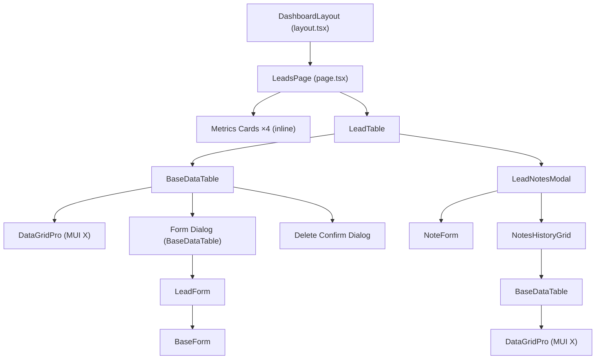
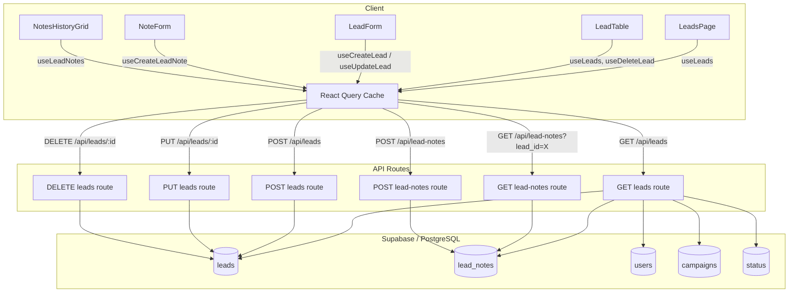

# Marketing / Leads Screen — Technical & User Documentation

---

## 1. SCREEN OVERVIEW

| Attribute | Value |
|-----------|-------|
| **Screen name** | Leads |
| **Sidebar section** | Marketing |
| **Route / URL** | `/dashboard/leads` |
| **Page file** | `src/app/dashboard/leads/page.tsx` |
| **Purpose** | CRUD management of sales leads (prospects). View, create, edit, delete leads; attach notes; track status through the sales pipeline; surface action-needed metrics. |

### User Roles & Auth Gating

- **Authentication:** Supabase session required. The dashboard layout (`src/app/dashboard/layout.tsx`) server-checks `supabase.auth.getUser()` and redirects unauthenticated users to `/login`.
- **Authorization:** The sidebar filters the "Leads" link via `useUserPermissions()` → `hasPermission('/dashboard/leads')`. Users without the `/dashboard/leads` entry in `user_menu_permissions` will not see the link. However, the API routes themselves only enforce authentication (not per-path permission), so a user who navigates directly to the URL can still access data if authenticated.
- **Roles:** Any authenticated user with the `/dashboard/leads` permission — typically Sales, Marketing, Coordinators, and Admins.

### Workflow Position

```
Marketing Campaigns → **Leads** → Member Programs (won leads) → Coordinator Script/To-Do
```

- **Before:** Campaigns are created in Marketing > Campaigns; confirmed attendees become leads.
- **After:** When a lead's status reaches "Won", a member program is created via the Program Wizard on the Sales/Programs screen.

### Layout Description (top → bottom)

1. **Page header** — "Leads" title (h4, primary color).
2. **Metrics cards row** — Four equal-width cards in a 4-column grid:
   - Card 1 (warning/amber): "No PME Date" — count of leads with status "PME Scheduled" but no `pmedate`.
   - Card 2 (error/red): "No Follow-Up Note" — count of leads with status "Follow Up" but no recent Follow-Up note.
   - Card 3 (info/blue): "PMEs Scheduled" — count of leads with a `pmedate` in the current calendar month.
   - Card 4 (success/green): Placeholder — hardcoded to 0, titled "Card 4 Title".
3. **Data grid card** — Full-width MUI Card containing:
   - Header area with "Add Lead" button (right-aligned).
   - MUI X DataGridPro showing all leads with columns: Note icon, First Name, Last Name, PME Date, Email, Phone, Status, Campaign, Active/Inactive, Updated By, Updated date, and Actions (Edit/Delete).
4. **Modals** (rendered on demand):
   - Lead Create/Edit form dialog (via `BaseDataTable` form modal).
   - Lead Notes modal (via `LeadNotesModal`).
   - Delete confirmation dialog.

---

## 2. COMPONENT ARCHITECTURE

### Component Tree



### LeadsPage (`src/app/dashboard/leads/page.tsx`)

| Aspect | Details |
|--------|---------|
| **Props** | None (Next.js page component) |
| **Local state** | None (derived via `useMemo`) |
| **Hooks** | `useLeads()` → `{ data: leads, isLoading: leadsLoading }` |
| **Memoized values** | `noPmeDateCount` — leads with `status_id === 2 && !pmedate`; `noFollowUpNoteCount` — leads with `status_id === 11 && !last_followup_note`; `pmesScheduledThisMonth` — leads with `pmedate` in current month |
| **Conditional rendering** | Each card shows `<CircularProgress>` while `leadsLoading`, else the computed count |

### LeadTable (`src/components/leads/lead-table.tsx`)

| Aspect | Details |
|--------|---------|
| **Props** | `title?: string` (default `'Leads'`) |
| **Local state** | `isNotesModalOpen: boolean` (false); `selectedLead: { id: number; name: string } | null` (null) |
| **Hooks** | `useLeads()`, `useDeleteLead()` |
| **Side effects** | `useEffect` — registers `window.openLeadNotesModal` function; cleans up on unmount |
| **Event handlers** | `handleDelete(id)` → `deleteLead.mutate(String(id))`; `handleEdit(_row)` → noop (BaseDataTable handles); `handleOpenNotesModal(leadId, leadName)` → sets modal state; `handleCloseNotesModal()` → clears modal state |
| **Conditional rendering** | Notes modal rendered only when `selectedLead` is truthy |

### LeadForm (`src/components/forms/lead-form.tsx`)

| Aspect | Details |
|--------|---------|
| **Props** | `initialValues?: Partial<LeadFormData> & { lead_id?: number }`, `onSuccess?: () => void`, `mode?: 'create' \| 'edit'` |
| **Local state** | react-hook-form state (`register`, `handleSubmit`, `errors`, `isSubmitting`, `setValue`, `watch`, `control`) |
| **Hooks** | `useCreateLead()`, `useUpdateLead()`, `useActiveStatus()`, `useActiveCampaigns()` |
| **Side effects** | `useEffect` — In create mode, auto-selects "Confirmed" status when statuses load |
| **Memoized values** | `sortedStatuses` — alphabetically sorted status list; `enabledStatusNames` — Set of status names allowed for selection based on transition rules |
| **Key logic** | `formatPhoneNumber()` — formats input as (XXX) XXX-XXXX; `onSubmit()` — calls create or update mutation depending on mode |

### LeadNotesModal (`src/components/notes/lead-notes-modal.tsx`)

| Aspect | Details |
|--------|---------|
| **Props** | `open: boolean`, `onClose: () => void`, `leadId: number`, `leadName: string` |
| **Local state** | `refreshTrigger: number` (0) — incremented to force child grid refetch |
| **Children** | `NoteForm` (with `hideButtons`, linked via `formId`), `NotesHistoryGrid` |

### NoteForm (`src/components/notes/note-form.tsx`)

| Aspect | Details |
|--------|---------|
| **Props** | `leadId: number`, `onSuccess: () => void`, `hideButtons?: boolean`, `formId?: string` |
| **Local state** | `createAlert: boolean` (false), `alertTitle: string` (''), `alertPriority: 'normal' \| 'high' \| 'urgent'` ('normal'), `alertTargetRoles: number[]` ([]) |
| **Hooks** | `useCreateLeadNote()`, `useCreateNotification()`, `useActiveProgramRoles()` |
| **Form** | react-hook-form with Zod resolver (`leadNoteSchema`); fields: `note_type`, `note` |

### NotesHistoryGrid (`src/components/notes/notes-history-grid.tsx`)

| Aspect | Details |
|--------|---------|
| **Props** | `leadId: number`, `onRefresh: number` |
| **Hooks** | `useLeadNotes(leadId)` |
| **Side effects** | `useEffect` — refetches notes when `onRefresh` changes |
| **Columns** | Date/Time (with alert icon indicators), Type (color-coded Chip), Content (2-line clamp), Created By |

### BaseDataTable (`src/components/tables/base-data-table.tsx`)

Generic reusable data grid wrapper. Used by both `LeadTable` and `NotesHistoryGrid`. See file for full prop interface. Key features used here: form modal, delete confirmation modal, DataGridPro, state persistence via `persistStateKey`, export support.

### BaseForm (`src/components/forms/base-form.tsx`)

Generic form wrapper providing layout (scrollable content, sticky footer with Cancel/Submit buttons) and submission handling.

---

## 3. DATA FLOW

### Data Lifecycle

1. **Entry:** `useLeads()` hook calls `GET /api/leads` via `fetch()`. The API queries Supabase `leads` table with joins to `users`, `campaigns`, `status`, and `lead_notes`.
2. **Transformation (server):** API maps joined data to flat fields: `status_name`, `campaign_name`, `created_by_email`, `updated_by_name`, `note_count`, `last_followup_note`.
3. **Transformation (client):** `LeadTable` maps leads to `LeadEntity[]`, adding `id: lead.lead_id` for DataGridPro compatibility.
4. **Display:** DataGridPro renders rows. Phone numbers are formatted in the column `renderCell`. Status column shows tooltip for "Follow Up" with recent note text.
5. **Metrics cards:** `LeadsPage` derives three counts from the same `leads` data via `useMemo`.
6. **Create/Edit:** User clicks "Add Lead" or Edit icon → form dialog opens → user fills form → `onSubmit` calls `POST /api/leads` or `PUT /api/leads/{id}` → on success, React Query invalidates `['leads', 'list']` and `['leads', 'active']` → grid refetches.
7. **Delete:** User clicks Delete icon → confirmation dialog → `DELETE /api/leads/{id}` → optimistic removal from cache → on error, cache is rolled back.
8. **Notes:** User clicks note icon → `LeadNotesModal` opens → `NoteForm` creates via `POST /api/lead-notes` → `NotesHistoryGrid` refetches via `GET /api/lead-notes?lead_id={id}`.

### Data Flow Diagram



---

## 4. API / SERVER LAYER

### 4.1 `GET /api/leads`

| Attribute | Value |
|-----------|-------|
| **File** | `src/app/api/leads/route.ts` → `GET` |
| **Auth** | `supabase.auth.getUser()` — 401 if no user |
| **Parameters** | None |
| **Response (200)** | `{ data: Lead[] }` where each Lead includes `status_name`, `campaign_name`, `created_by_email`, `updated_by_name`, `note_count`, `last_followup_note` |
| **Errors** | 401 Unauthorized, 500 Server Error |
| **Queries** | 3 Supabase queries: (1) leads with joins, (2) lead_notes for counts, (3) lead_notes for last Follow-Up |

### 4.2 `POST /api/leads`

| Attribute | Value |
|-----------|-------|
| **File** | `src/app/api/leads/route.ts` → `POST` |
| **Auth** | `supabase.auth.getUser()` — 401 if no user |
| **Request body** | `LeadFormData` — `{ first_name, last_name, email, phone, status_id, campaign_id, pmedate, active_flag }` |
| **Validation** | Zod `leadSchema.safeParse()` — 400 on failure |
| **Duplicate check** | Case-insensitive match on `first_name + last_name + email` — 409 Conflict |
| **Response** | 201 `{ data: Lead }`, 400 validation error, 409 duplicate, 500 DB error |
| **Side effects** | Sets `created_by` and `updated_by` to current user ID. Converts empty `pmedate` to null. |
| **DB constraint fallback** | Catches unique index `idx_leads_unique_name_email` violation (code `23505`) → 409 |

### 4.3 `GET /api/leads/{id}`

| Attribute | Value |
|-----------|-------|
| **File** | `src/app/api/leads/[id]/route.ts` → `GET` |
| **Auth** | 401 if no user |
| **Path param** | `id` — lead_id |
| **Response** | 200 `{ data: Lead }` with joined status/campaign/user names |

### 4.4 `PUT /api/leads/{id}`

| Attribute | Value |
|-----------|-------|
| **File** | `src/app/api/leads/[id]/route.ts` → `PUT` |
| **Auth** | 401 if no user |
| **Validation** | `leadUpdateSchema.safeParse()` (partial schema) — 400 on failure |
| **Duplicate check** | Same as POST but excludes current record (`neq('lead_id', id)`) — 409 Conflict |
| **Response** | 200 `{ data: Lead }`, 400 / 409 / 500 |
| **Side effects** | Sets `updated_by` to current user. Converts empty `pmedate` to null. |

### 4.5 `DELETE /api/leads/{id}`

| Attribute | Value |
|-----------|-------|
| **File** | `src/app/api/leads/[id]/route.ts` → `DELETE` |
| **Auth** | 401 if no user |
| **Response** | 200 `{ data: true }` or 500 |
| **Note** | No referential integrity check before delete. If the lead has dependent records (member_programs, lead_notes), the DB FK constraints determine behavior. |

### 4.6 `GET /api/lead-notes?lead_id={id}`

| Attribute | Value |
|-----------|-------|
| **File** | `src/app/api/lead-notes/route.ts` → `GET` |
| **Auth** | `supabase.auth.getSession()` — 401 if no session |
| **Query param** | `lead_id` (required) — 400 if missing |
| **Response** | 200 `{ data: LeadNote[] }` enriched with `created_by_email`, `created_by_name`, `is_alert_source`, `is_alert_response`, `alert_id`, `alert_roles` |
| **Queries** | 4 Supabase queries: (1) lead_notes, (2) users for names, (3) program_roles for role names, (4) notifications for alert associations |

### 4.7 `POST /api/lead-notes`

| Attribute | Value |
|-----------|-------|
| **File** | `src/app/api/lead-notes/route.ts` → `POST` |
| **Auth** | 401 if no session |
| **Request body** | `{ lead_id: number, note_type: string, note: string }` |
| **Validation** | `leadNoteSchema.safeParse()` — 400 with details |
| **Response** | 201 `{ data: LeadNote }` or 400 / 500 |

---

## 5. DATABASE LAYER

### 5.1 Tables

#### `leads`

| Column | Type | Nullable | Default | Constraints |
|--------|------|----------|---------|-------------|
| `lead_id` | integer | NO | serial PK | Primary key, auto-increment |
| `first_name` | text | NO | — | |
| `last_name` | text | NO | — | |
| `email` | text | YES | — | Part of unique index |
| `phone` | text | YES | — | |
| `status_id` | integer | YES | — | FK → `status.status_id` (`leads_status_id_fkey`) |
| `campaign_id` | integer | YES | — | FK → `campaigns.campaign_id` (`leads_campaign_id_fkey`) |
| `active_flag` | boolean | NO | true | |
| `pmedate` | text (date) | YES | — | Stored as ISO date string |
| `created_at` | timestamptz | YES | now() | |
| `created_by` | uuid | YES | — | FK → `users.id` (`leads_created_by_fkey`) |
| `updated_at` | timestamptz | YES | now() | |
| `updated_by` | uuid | YES | — | FK → `users.id` (`leads_updated_by_fkey`) |

**Indexes:** `idx_leads_unique_name_email` — unique on (lower(first_name), lower(last_name), lower(email)).

**Trigger:** `tr_audit_lead_status_transition` — fires on UPDATE of `status_id`, inserting a row into `lead_status_transitions`.

#### `lead_notes`

| Column | Type | Nullable | Default | Constraints |
|--------|------|----------|---------|-------------|
| `note_id` | integer | NO | serial PK | Primary key |
| `lead_id` | integer | NO | — | FK → `leads.lead_id` |
| `note_type` | text | NO | — | One of: Challenge, Follow-Up, Other, PME, Win |
| `note` | text | NO | — | Max 2000 chars (app-level) |
| `created_by` | uuid | YES | — | FK → `users.id` |
| `created_at` | timestamptz | YES | now() | |

#### `lead_status_transitions`

| Column | Type | Nullable | Default | Constraints |
|--------|------|----------|---------|-------------|
| `transition_id` | integer | NO | serial PK | |
| `lead_id` | integer | NO | — | FK → `leads.lead_id` |
| `old_status_id` | integer | YES | — | |
| `new_status_id` | integer | NO | — | |
| `old_pmedate` | text | YES | — | |
| `new_pmedate` | text | YES | — | |
| `transitioned_at` | timestamptz | NO | — | |
| `transitioned_by` | uuid | YES | — | |
| `source` | text | NO | — | 'manual' / 'import' / 'webhook' / 'system' / 'migration' |

#### `status` (reference table)

| Column | Type | Nullable |
|--------|------|----------|
| `status_id` | integer | NO (PK) |
| `status_name` | text | NO |
| `description` | text | YES |
| `active_flag` | boolean | NO |

#### `campaigns` (reference table, joined for display)

| Column | Type | Nullable |
|--------|------|----------|
| `campaign_id` | integer | NO (PK) |
| `campaign_name` | text | NO |
| `active_flag` | boolean | NO |

#### `notifications` (related via lead notes)

Used by the Notes modal to show alert indicators. FK relationships: `notifications.source_note_id` → `lead_notes.note_id`, `notifications.response_note_id` → `lead_notes.note_id`.

### 5.2 Queries

| # | Query | Type | File | Function | Performance Notes |
|---|-------|------|------|----------|-------------------|
| 1 | `SELECT *, joined users/campaigns/status FROM leads` | Read | `src/app/api/leads/route.ts` | `GET` | Full table scan on `leads`; joins via FK. No WHERE filter — fetches all leads regardless of active_flag. |
| 2 | `SELECT lead_id FROM lead_notes WHERE lead_id IN (...)` | Read | `src/app/api/leads/route.ts` | `GET` | Fetches all note rows to count client-side. Could use `GROUP BY` + `COUNT` instead. |
| 3 | `SELECT lead_id, note, created_at FROM lead_notes WHERE lead_id IN (...) AND note_type='Follow-Up' ORDER BY created_at DESC` | Read | `src/app/api/leads/route.ts` | `GET` | Fetches all Follow-Up notes, but only uses first per lead. Could use `DISTINCT ON`. |
| 4 | `INSERT INTO leads (...)` | Write | `src/app/api/leads/route.ts` | `POST` | Single insert with `.select().single()` |
| 5 | `SELECT ... FROM leads WHERE ilike(first_name, ...) AND ilike(last_name, ...) AND ilike(email, ...)` | Read | `src/app/api/leads/route.ts` | `POST` | Duplicate check; uses `ilike` which prevents index usage |
| 6 | `UPDATE leads SET ... WHERE lead_id = ?` | Write | `src/app/api/leads/[id]/route.ts` | `PUT` | Single record update |
| 7 | `DELETE FROM leads WHERE lead_id = ?` | Write | `src/app/api/leads/[id]/route.ts` | `DELETE` | Single record delete |
| 8 | `SELECT * FROM lead_notes WHERE lead_id = ? ORDER BY created_at DESC` | Read | `src/app/api/lead-notes/route.ts` | `GET` | All notes for one lead |
| 9 | `SELECT id, email, full_name FROM users WHERE id IN (...)` | Read | `src/app/api/lead-notes/route.ts` | `GET` | User lookup for note authors |
| 10 | `SELECT * FROM notifications WHERE source_note_id IN (...)` / `response_note_id IN (...)` | Read | `src/app/api/lead-notes/route.ts` | `GET` | Alert association lookup |
| 11 | `INSERT INTO lead_notes (...)` | Write | `src/app/api/lead-notes/route.ts` | `POST` | Single insert |

---

## 6. BUSINESS RULES & LOGIC

### Lead Status Transitions

Defined in `src/lib/lead-status-transitions.ts`:

| Current Status | Allowed Next Statuses |
|---|---|
| Confirmed | No Show, No PME, PME Scheduled |
| Discovery Scheduled | No Show, Lost, PME Scheduled |
| No Show | Confirmed |
| No PME | PME Scheduled |
| PME Scheduled | Lost, Won, Follow Up, No Program, On Hold |
| On Hold | Lost, PME Scheduled |
| Lost | PME Scheduled |
| Follow Up | Won, No Program, Lost |
| No Program | PME Scheduled |
| Won | *(terminal — no transitions)* |

**Create mode:** Only "Confirmed" and "Discovery Scheduled" are selectable. Default is "Confirmed".

**Enforcement:** Frontend only (form disables non-allowed status options). The API does not validate status transitions — it accepts any valid `status_id`.

### Duplicate Lead Detection

- **Rule:** No two leads may share the same first name + last name + email (case-insensitive).
- **Enforced at:**
  - API layer: `ilike` query before insert/update → 409 Conflict response.
  - Database: Unique index `idx_leads_unique_name_email` → constraint violation caught as fallback.
- **User message:** "A lead with this name and email already exists: {name} ({email}) - Lead ID #{id}"

### PME Date Handling

- Empty string PME dates are converted to `null` before database insert/update.
- The "No PME Date" metric card counts leads with `status_id === 2` (PME Scheduled) and `pmedate` is falsy.

### Note Count & Follow-Up Tracking

- The GET /api/leads response enriches each lead with `note_count` and `last_followup_note`.
- The Status column in the grid shows a tooltip with the last Follow-Up note text when the lead status is "Follow Up" and a note exists.
- The "No Follow-Up Note" metric card counts leads with `status_id === 11` (Follow Up) and no `last_followup_note`.

### Auto-Audit of Status Changes

- A database trigger `tr_audit_lead_status_transition` automatically records every `status_id` change to the `lead_status_transitions` table, including old/new status, PME dates, timestamp, and user.

---

## 7. FORM & VALIDATION DETAILS

### Lead Form Fields

| Field | Label | Type | Bound To | Required | Validation | Error Message |
|-------|-------|------|----------|----------|------------|---------------|
| `first_name` | First Name | text | `register('first_name')` | Yes | `z.string().min(1)` | "First name is required" |
| `last_name` | Last Name | text | `register('last_name')` | Yes | `z.string().min(1)` | "Last name is required" |
| `email` | Email | email | `register('email')` | No | `z.string().email().optional().or(z.literal(''))` | "Invalid email format" |
| `phone` | Phone | text | `register('phone')` | Yes | `z.string().min(1)` | "Phone is required" |
| `status_id` | Status | select | `Controller` | Yes | `z.number().min(1)` | "Status is required" |
| `campaign_id` | Campaign | select | `Controller` | Yes | `z.number().min(1)` | "Campaign is required" |
| `pmedate` | PME Date | date | `register('pmedate')` | No | `z.string().optional().or(z.literal(''))` | — |
| `active_flag` | Active | switch | `watch/setValue` | Yes | `z.boolean()` | — |

**Client-side validation:** Zod schema via `zodResolver` in react-hook-form.  
**Server-side validation:** Same Zod schema (`leadSchema` / `leadUpdateSchema`) applied in API routes.

### Phone Formatting

Input is auto-formatted as `(XXX) XXX-XXXX` on change via `formatPhoneNumber()`. The raw value (with formatting characters) is stored.

### Form Submission Flow

1. User fills fields → react-hook-form tracks dirty state.
2. Submit button triggers `handleSubmit(onSubmit)`.
3. Zod validation runs. On failure, field-level errors display.
4. On success, `onSubmit` constructs `LeadFormData` and calls:
   - **Create:** `createLead.mutateAsync(leadData)` → `POST /api/leads`
   - **Edit:** `updateLead.mutateAsync({ ...leadData, id: String(lead_id) })` → `PUT /api/leads/{id}`
5. On mutation success, toast notification shown, queries invalidated, form dialog closes.

### Note Form Fields

| Field | Label | Type | Required | Validation | Error Message |
|-------|-------|------|----------|------------|---------------|
| `note_type` | Note Type | select | Yes | `z.enum(['Challenge', 'Follow-Up', 'Other', 'PME', 'Win'])` | "Note type is required" |
| `note` | Note Content | multiline text | Yes | `z.string().min(1).max(2000)` | "Note content is required" / "cannot exceed 2000 characters" |

Optional alert fields (shown when "Create Alert" toggle is on): Alert Title, Priority (normal/high/urgent), Target Roles (multi-select).

### Dirty State Tracking

- react-hook-form's `isDirty` is used in NoteForm to disable the Save button until the form has changes.
- No unsaved-changes warning is implemented — closing the dialog discards changes silently.

---

## 8. STATE MANAGEMENT

### Local Component State

| Component | Variable | Type | Initial | Purpose |
|-----------|----------|------|---------|---------|
| LeadTable | `isNotesModalOpen` | boolean | false | Controls Notes modal visibility |
| LeadTable | `selectedLead` | `{ id, name } \| null` | null | Lead for Notes modal context |
| BaseDataTable | `formOpen` | boolean | false | Controls form dialog visibility |
| BaseDataTable | `editingRow` | `T \| undefined` | undefined | Row being edited |
| BaseDataTable | `formMode` | `'create' \| 'edit'` | 'create' | Current form mode |
| BaseDataTable | `deleteModalOpen` | boolean | false | Delete confirmation visibility |
| BaseDataTable | `deletingId` | `GridRowId \| null` | null | ID being deleted |
| NoteForm | `createAlert` | boolean | false | Alert creation toggle |
| NoteForm | `alertTitle` | string | '' | Alert title input |
| NoteForm | `alertPriority` | string | 'normal' | Alert priority selector |
| NoteForm | `alertTargetRoles` | number[] | [] | Selected role IDs for alert |
| LeadNotesModal | `refreshTrigger` | number | 0 | Incremented to trigger grid refetch |

### React Query Cache (TanStack Query)

| Query Key | Hook | Stale Time | GC Time | Refetch on Focus |
|-----------|------|------------|---------|-------------------|
| `['leads', 'list']` | `useLeads()` | 30s | 2min | Yes |
| `['leads', 'active']` | `useActiveLeads()` | default | default | default |
| `['lead-notes', 'list', leadId]` | `useLeadNotes(leadId)` | 2min | 10min | default |
| `['status', 'active']` | `useActiveStatus()` | default | default | default |
| `['campaigns', 'active']` | `useActiveCampaigns()` | default | default | default |
| `['program-roles', 'active']` | `useActiveProgramRoles()` | default | default | default |

### Persisted State

- **localStorage:** DataGridPro state (column widths, order, sort, pagination) persisted under key `leadsGrid_{userId}` via `BaseDataTable`'s `persistStateKey` prop.
- **URL state:** None — no query params or route params.

---

## 9. NAVIGATION & ROUTING

### Inbound Routes

| Source | Trigger |
|--------|---------|
| Sidebar → Marketing → Leads | Click nav item |
| Direct URL: `/dashboard/leads` | Browser navigation / bookmark |

### Outbound Navigation

This screen does not navigate to other pages. All actions (create, edit, delete, notes) are performed in modals. The user leaves via sidebar navigation.

### Route Guards

1. **Server-side (layout):** `src/app/dashboard/layout.tsx` checks `supabase.auth.getUser()`. If no user, redirects to `/login`.
2. **Client-side (sidebar):** `useUserPermissions()` → `hasPermission('/dashboard/leads')` controls sidebar link visibility.
3. **No client-side route guard on the page itself** — if a user navigates directly to `/dashboard/leads` without the menu permission, the page renders but API calls succeed if authenticated.

### Deep Linking

The URL `/dashboard/leads` is shareable. No record-level deep linking (e.g., `/dashboard/leads/123`) is supported — individual lead detail is not a separate route.

---

## 10. ERROR HANDLING & EDGE CASES

### Error States

| Error | Trigger | UI Treatment | Recovery |
|-------|---------|-------------|----------|
| API fetch failure (leads) | Network error or 500 from `/api/leads` | `BaseDataTable` shows `<Alert severity="error">` with error message | Retry on window refocus (React Query) |
| API fetch failure (notes) | Network error or 500 from `/api/lead-notes` | `NotesHistoryGrid` shows `<Alert>` + "Failed to load notes history" | Close and reopen modal |
| Create/Update validation error | Zod validation failure | Inline field-level `helperText` errors | User corrects fields |
| Duplicate lead (409) | Name+email match on create/update | Toast error with duplicate details | User changes name/email |
| Delete failure | FK constraint or DB error | Toast error, optimistic removal rolled back | Row reappears in grid |
| Unauthorized (401) | Session expired | API returns 401; no specific UI handling | User must re-login |

### Empty States

- **No leads:** DataGridPro shows default "No rows" message.
- **No notes:** NotesHistoryGrid shows empty DataGridPro.
- **Metric cards:** Show `0` when no leads match criteria.

### Loading States

- **Page load:** Metric cards show `<CircularProgress size={28}>` per card; `BaseDataTable` shows loading overlay with spinner and "Loading data..." text.
- **Form submission:** Submit button shows `<CircularProgress>` spinner.
- **Grid state loading:** When `persistStateKey` is set and user hasn't loaded yet, shows centered `<CircularProgress size={40}>`.

### Timeout / Offline

- No explicit timeout handling. React Query default retry behavior applies.
- No offline support.

---

## 11. ACCESSIBILITY

### ARIA & Semantic HTML

- MUI components provide built-in ARIA roles (`role="grid"`, `role="dialog"`, etc.).
- Form fields use `label` prop which generates `<label>` elements with `for` association.
- Tooltips use `title` attributes and MUI `Tooltip` component (announced by screen readers on focus).
- Page header uses `<Typography component="h1">` for correct heading hierarchy.

### Keyboard Navigation

- DataGridPro supports full keyboard navigation (arrow keys, Enter to edit, Tab through cells).
- Dialogs trap focus when open (MUI Dialog default behavior).
- Form fields are tabbable in DOM order.
- No custom keyboard shortcuts defined.

### Color Contrast

- Metric cards use MUI theme colors (`warning.main`, `error.main`, `info.main`, `success.main`) which should meet WCAG AA.
- Active/Inactive chips use `success`/`default` color variants.
- Note type chips use color-coded variants.

### Focus Management

- When form dialog opens, focus moves into the dialog (MUI Dialog default).
- After form submit success, dialog closes — focus returns to trigger element (MUI default).
- No explicit `autoFocus` on first form field.

---

## 12. PERFORMANCE CONSIDERATIONS

### Identified Concerns

| Concern | Details | Severity |
|---------|---------|----------|
| **Full table load** | `GET /api/leads` fetches ALL leads with no pagination, filtering, or limit. For large datasets, this becomes slow. | Medium |
| **N+2 queries on GET /api/leads** | The API makes 3 separate queries (leads, note counts, follow-up notes) instead of a single query with JOINs or subqueries. | Medium |
| **Note count via client-side counting** | All `lead_notes` rows are fetched just to count them, instead of using SQL `COUNT` + `GROUP BY`. | Medium |
| **Follow-up note fetch over-reads** | All Follow-Up notes are fetched, but only the latest per lead is used. `DISTINCT ON` or `ROW_NUMBER()` would be more efficient. | Low |
| **`ilike` for duplicate check** | The `ilike` function prevents use of the `idx_leads_unique_name_email` index for the pre-insert/update check. | Low |
| **No virtualization concern** | DataGridPro uses internal row virtualization by default — mitigates large list rendering. | N/A |
| **`window.openLeadNotesModal` global** | Attaching function to `window` is a workaround but lightweight; no perf issue. | N/A |

### Caching Strategy

- **Client:** React Query with 30s stale time for leads, 2min for notes. `refetchOnWindowFocus` enabled for leads.
- **Server:** No server-side caching or CDN caching on API routes.
- **Grid state:** Column layout/sort persisted per-user in localStorage.

---

## 13. THIRD-PARTY INTEGRATIONS

| Service | Purpose | Package | Config |
|---------|---------|---------|--------|
| **Supabase** | Auth + PostgreSQL database | `@supabase/supabase-js`, `@supabase/ssr` | `NEXT_PUBLIC_SUPABASE_URL`, `NEXT_PUBLIC_SUPABASE_ANON_KEY` (env vars) |
| **MUI / MUI X** | UI component library + DataGridPro | `@mui/material`, `@mui/x-data-grid-pro` | MUI X license key (env var or config) |
| **TanStack React Query** | Server state management | `@tanstack/react-query` | QueryClientProvider in app root |
| **Sonner** | Toast notifications | `sonner` | `<Toaster>` in layout |
| **Zod** | Schema validation | `zod` | — |
| **react-hook-form** | Form state management | `react-hook-form`, `@hookform/resolvers` | — |

**Failure modes:** If Supabase is unreachable, all API calls fail → error alerts shown. Other packages are client-side only.

---

## 14. SECURITY CONSIDERATIONS

### Authentication

- All API routes verify the Supabase session/user before processing.
- Leads routes use `supabase.auth.getUser()` (secure, validates JWT server-side).
- Lead-notes routes use `supabase.auth.getSession()` (slightly less secure — see code review).

### Authorization

- **Gap:** API routes only check authentication, not per-user permission (e.g., no check that the user has `/dashboard/leads` menu permission). Any authenticated user can call `/api/leads`.
- **Gap:** No row-level security (RLS) enforcement evident in the application layer for leads. Supabase RLS policies may exist at the database level.

### Input Sanitization

- Zod schema validates input types and formats.
- Supabase client uses parameterized queries, preventing SQL injection.
- No explicit XSS sanitization — React's JSX escaping provides baseline protection.

### Sensitive Data

- Lead records contain PII (name, email, phone).
- Data transmitted over HTTPS (Supabase and Next.js default).
- `console.log('Inserting lead data:', leadData)` in POST route logs PII to server console.

### CSRF

- Next.js API routes use `credentials: 'include'` for cookie-based auth. No explicit CSRF token. Supabase's auth cookies use `SameSite` attribute as default protection.

---

## 15. TESTING COVERAGE

### Existing Tests

**None found.** No test files (`*.test.*`, `*.spec.*`) exist for leads-related components, hooks, API routes, or utilities.

### Gaps — Everything

All aspects of the Leads screen are untested.

### Suggested Test Cases

#### Unit Tests

| Target | Test Case |
|--------|-----------|
| `leadSchema` | Validates required fields, rejects invalid email, allows empty email |
| `leadNoteSchema` | Validates note_type enum, note min/max length |
| `lead-status-transitions.ts` | `getAllowedStatusNames` returns correct transitions for each status |
| `CREATE_MODE_STATUS_NAMES` | Only contains "Confirmed" and "Discovery Scheduled" |
| `formatPhoneNumber` (in LeadForm) | Formats various phone inputs correctly |
| `noPmeDateCount` memo | Correctly counts leads with status_id=2 and no pmedate |
| `LeadTable` columns | Renders phone formatting, status tooltip, note count badge |

#### Integration Tests

| Target | Test Case |
|--------|-----------|
| `GET /api/leads` | Returns enriched leads with note counts, handles auth, handles empty DB |
| `POST /api/leads` | Creates lead, rejects duplicates (409), validates schema (400) |
| `PUT /api/leads/:id` | Updates lead, rejects cross-record duplicates, handles not found |
| `DELETE /api/leads/:id` | Deletes lead, handles FK constraint errors |
| `GET /api/lead-notes` | Returns notes with alert info, requires lead_id param |
| `POST /api/lead-notes` | Creates note, validates schema |

#### E2E Tests

| Scenario | Steps |
|----------|-------|
| Create a lead | Click "Add Lead" → fill form → submit → verify row appears in grid |
| Edit a lead | Click Edit → change status → submit → verify updated in grid |
| Delete a lead | Click Delete → confirm → verify row removed |
| Add a note | Click Note icon → fill note → submit → verify in history grid |
| Duplicate prevention | Create lead → try creating duplicate → verify error toast |
| Status transitions | Edit lead → verify only allowed statuses are enabled |
| Metrics cards | Verify card counts match expected based on test data |

---

## 16. CODE REVIEW FINDINGS

| Severity | File | Location | Issue | Suggested Fix |
|----------|------|----------|-------|---------------|
| **Critical** | `src/components/leads/lead-table.tsx` | Line 52 (`window.openLeadNotesModal`) | Global `window` function for cross-component communication is fragile, not type-safe, and breaks if multiple LeadTable instances exist. | Use React context, callback props, or a Zustand store instead. |
| **High** | `src/app/api/lead-notes/route.ts` | Line 14 (`getSession`) | Uses `supabase.auth.getSession()` instead of `getUser()`. Supabase docs warn that `getSession` reads from local storage and doesn't validate the JWT server-side, making it unsuitable for server-side auth checks. | Change to `supabase.auth.getUser()` for secure server-side validation. |
| **High** | `src/app/api/leads/route.ts` | Lines 25-62 | Three separate queries (leads, note counts, follow-up notes) create an N+2 query pattern. For 500 leads, this fetches potentially thousands of note rows just to count them. | Use `supabase.rpc()` or raw SQL with `COUNT`, `GROUP BY`, and window functions in a single query. |
| **High** | `src/app/api/leads/[id]/route.ts` | Line 137 (`DELETE`) | No referential integrity check before deletion. If a lead has `member_programs`, `lead_notes`, or `lead_status_transitions`, the delete may fail with an unclear DB error, or cascade-delete important data. | Add a pre-delete check or return a user-friendly error explaining why deletion is blocked. |
| **High** | `src/app/api/leads/route.ts` | All routes | No authorization check beyond authentication. Any logged-in user can CRUD all leads regardless of their role or menu permissions. | Add role/permission check using the same `user_menu_permissions` table the sidebar uses. |
| **Medium** | `src/app/api/leads/route.ts` | Line 128 | `console.log('Inserting lead data:', leadData)` logs PII (name, email, phone) to server logs. | Remove or redact sensitive fields in log output. |
| **Medium** | `src/app/dashboard/leads/page.tsx` | Lines 57-68 | Metric card logic uses hardcoded `status_id` values (2, 11) instead of looking up by name. If status IDs change, metrics will silently break. | Look up status IDs by name from the status data, or define constants with comments. |
| **Medium** | `src/app/dashboard/leads/page.tsx` | Lines 309-372 | Card 4 is a hardcoded placeholder (`title: "Card 4 Title"`, `value: 0`, `helper: "Card 4 helper text"`). | Implement a real metric or remove the placeholder card. |
| **Medium** | `src/components/leads/lead-table.tsx` | Line 37 (`params.row as any`) | Multiple `as any` casts bypass TypeScript safety. | Use the proper `LeadEntity` type throughout column renderers. |
| **Medium** | `src/components/forms/lead-form.tsx` | Phone field | Phone is stored with formatting characters `(`, `)`, `-`, spaces. This makes phone comparisons and searches unreliable. | Store digits only; format on display. |
| **Medium** | `src/lib/lead-status-transitions.ts` | Entire file | Status transition rules are frontend-only. The API accepts any status_id, allowing users to bypass transitions via direct API calls or browser dev tools. | Enforce transitions server-side in the PUT route. |
| **Low** | `src/components/leads/lead-table.tsx` | Line 236 | `useEffect` for `window.openLeadNotesModal` has empty dependency array `[]` but references `handleOpenNotesModal` which is recreated each render. The stale closure works here because state setters are stable, but it's fragile. | Add `handleOpenNotesModal` to deps or wrap it in `useCallback`. |
| **Low** | `src/app/api/leads/route.ts` | Line 15 | `GET /api/leads` fetches ALL leads with no pagination or `active_flag` filter. As the leads table grows, response size and latency increase. | Add server-side pagination, or at minimum filter to `active_flag = true` by default with an opt-in param for all. |
| **Low** | `src/components/notes/notes-history-grid.tsx` | Line 134 | `useEffect` triggers `refetch()` even on initial mount (when `onRefresh` is 0), causing a redundant fetch since `useLeadNotes` already fetches on mount. | Skip the initial trigger with a ref guard. |
| **Low** | `src/components/leads/lead-table.tsx` | Lines 269-276 | `leadsWithId` mapping creates fallback dates with `new Date().toISOString()` for null `created_at`/`updated_at`. This is misleading — it shows "just now" for records that may have been created long ago. | Show '-' or 'Unknown' instead of a fake date. |

---

## 17. TECH DEBT & IMPROVEMENT OPPORTUNITIES

### Refactoring Opportunities

1. **Extract metric card component:** The four metric cards in `LeadsPage` share identical structure. Extract a reusable `MetricCard` component with props for title, value, color, icon, and helper text.
2. **Replace `window.openLeadNotesModal` pattern:** The global function on `window` is a code smell. Replace with React context, a Zustand store, or by lifting the Notes modal state up to `LeadTable` and passing an `onNotesClick` callback through column `renderCell` via a closure or `GridColDef` with `params.api`.
3. **Consolidate auth checking pattern:** Leads routes use `getUser()` while lead-notes routes use `getSession()`. Standardize on `getUser()` and extract a shared `requireAuth()` utility.
4. **Server-side note aggregation:** Replace the 3-query pattern in `GET /api/leads` with a single query using SQL aggregation (e.g., Supabase RPC or raw SQL with `LEFT JOIN` + `COUNT` + window functions).
5. **Phone number storage:** Store phone numbers as digits only (`5555555555`) and format on display. This prevents issues with searching, deduplication, and data consistency.

### Missing Abstractions

- **`requireAuth()` middleware helper** — shared function returning user or 401 response, used across all API routes.
- **`MetricCard` component** — reusable card for KPI display.
- **Status ID constants** — named constants or a lookup utility instead of magic numbers (2, 4, 5, 11).
- **Pagination utility** — server-side pagination helpers for Supabase queries.

### Deprecated Patterns

- `componentsProps` in MUI Tooltip (line 143 of lead-table.tsx) is deprecated in favor of `slotProps` in newer MUI versions.

---

## 18. END-USER DOCUMENTATION DRAFT

### Leads

*Manage your sales leads from first contact to program enrollment.*

---

### What This Page Is For

The Leads page is your central hub for managing prospective members (leads). Here you can add new leads, track their status through the sales pipeline, record notes about interactions, and monitor key metrics that need attention.

---

### Step-by-Step Instructions

#### Adding a New Lead

1. Click the **Add Lead** button in the upper-right area of the grid.
2. Fill in the required fields:
   - **First Name** and **Last Name** — the lead's full name.
   - **Phone** — enters automatically in (XXX) XXX-XXXX format as you type.
   - **Status** — defaults to "Confirmed" for new leads. "Discovery Scheduled" is also available.
   - **Campaign** — select which marketing campaign this lead came from.
3. Optionally fill in **Email**, **PME Date**, and toggle the **Active** switch.
4. Click **Create** to save.

#### Editing a Lead

1. Find the lead in the grid.
2. Click the **pencil icon** (Edit) in the Actions column on the right.
3. Update the desired fields. Note that the Status dropdown only shows statuses that are valid transitions from the current status.
4. Click **Update** to save.

#### Deleting a Lead

1. Click the **trash icon** (Delete) in the Actions column.
2. Confirm the deletion in the popup dialog.
3. **Warning:** This action cannot be undone.

#### Adding a Note to a Lead

1. Click the **note icon** in the first column of the lead's row.
2. In the Notes modal:
   - Select a **Note Type**: Challenge, Follow-Up, Other, PME, or Win.
   - Enter your **Note Content** (up to 2,000 characters).
   - Optionally toggle **Create Alert** to notify specific roles about this note.
3. Click **Create** to save the note.
4. Previous notes appear in the history grid below the form.

---

### Field Descriptions

| Field | Description |
|-------|-------------|
| **First Name / Last Name** | Lead's full name. Used for identification and duplicate detection. |
| **Email** | Contact email. Used along with name for duplicate detection. |
| **Phone** | Contact phone number. Auto-formats as you type. |
| **Status** | Where this lead is in the sales pipeline (e.g., Confirmed, PME Scheduled, Won). |
| **Campaign** | The marketing campaign that generated this lead. |
| **PME Date** | The date of the lead's Phone Medical Evaluation. |
| **Active** | Whether this lead is currently active. Inactive leads remain in the system but may be filtered out of other views. |

---

### Understanding the Metric Cards

| Card | What It Means |
|------|---------------|
| **No PME Date** (amber) | Leads marked as "PME Scheduled" but missing a PME date. These need a date assigned. |
| **No Follow-Up Note** (red) | Leads in "Follow Up" status with no Follow-Up note recorded. These need follow-up instructions. |
| **PMEs Scheduled** (blue) | Number of leads with a PME date in the current month. Shows your current month's pipeline volume. |

---

### Tips and Notes

- **Hover over "Follow Up" status** in the grid to see the most recent Follow-Up note as a tooltip.
- **Note count badges** appear on the note icon when a lead has existing notes.
- **Column customization:** You can resize, reorder, and sort columns. Your layout is saved automatically and persists between sessions.
- **Export:** Use the toolbar to export the grid data.
- **Status rules:** You can only change a lead's status to certain valid next steps. For example, a "Confirmed" lead can move to "No Show", "No PME", or "PME Scheduled" — but not directly to "Won".

---

### FAQ

**Q: Why can't I select certain statuses when editing a lead?**  
A: The system enforces a status workflow. Each status has specific allowed transitions. For example, to mark a lead as "Won", they must first be in "PME Scheduled" or "Follow Up" status.

**Q: What happens when I delete a lead?**  
A: The lead record is permanently removed. Any associated notes are also affected. If the lead has a member program, the delete may be blocked. Contact an administrator if you encounter issues.

**Q: Why does the "No Follow-Up Note" card count seem wrong?**  
A: The card counts leads with "Follow Up" status that have no Follow-Up type note recorded. If you added a note of a different type (e.g., "Other"), it won't count as a follow-up note.

**Q: Can I filter or search within the grid?**  
A: Yes. Click on column headers to sort. Use the toolbar (if visible) for filtering and searching. You can also type in the quick filter if available.

**Q: How do I create an alert when adding a note?**  
A: Toggle the "Create Alert from this note" switch in the note form. Select the priority level and which roles should be notified. The alert will appear in their notification bell.

---

### Troubleshooting

| Issue | Solution |
|-------|----------|
| "A lead with this name and email already exists" | A duplicate was detected. Check the existing lead ID shown in the error message. Edit the existing record instead. |
| Grid shows "Loading data..." indefinitely | Check your internet connection. Try refreshing the page. If the issue persists, the server may be experiencing problems. |
| Cannot delete a lead | The lead may have associated programs or other dependent records. Contact an administrator. |
| Status dropdown shows all statuses as disabled | This occurs for leads with the "Won" status (terminal). Won leads cannot have their status changed. |
| Changes to column layout are lost | Layout is saved per user. Ensure you're logged in with the same account. Try clearing browser localStorage if the layout is corrupted. |
