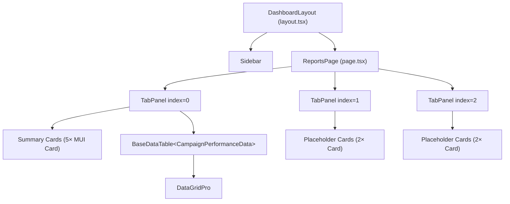
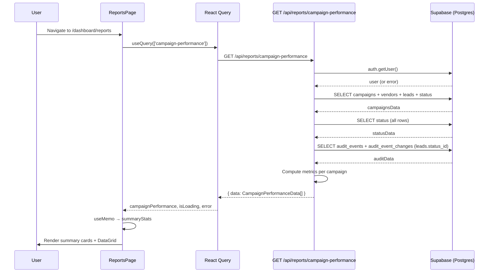
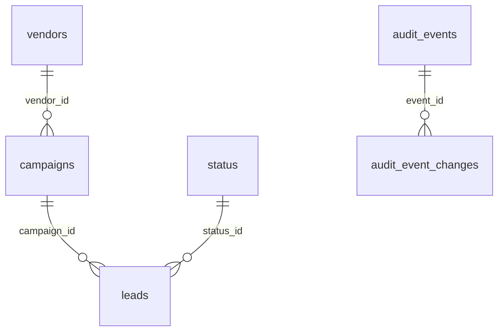

# Marketing / Reports Screen — Comprehensive Documentation

> **Generated:** 2026-03-23  
> **Route:** `/dashboard/reports`  
> **Page file:** `src/app/dashboard/reports/page.tsx`

---

## 1. SCREEN OVERVIEW

### Identity

| Property | Value |
|----------|-------|
| **Screen name** | Reports Dashboard |
| **Route / URL** | `/dashboard/reports` |
| **Purpose** | Read-only analytics screen that aggregates campaign performance metrics — lead counts, show rates, conversion rates, costs — across all marketing campaigns. Provides summary KPI cards and a sortable/filterable data grid. |
| **Application** | YOY Program Tracker — Next.js 15 App Router |

### User Roles & Auth Gating

- **All authenticated users** with the `/dashboard/reports` path in their permissions can access this screen.
- The `/dashboard` route prefix is **protected** — unauthenticated users are redirected to `/login` by both middleware (`middleware.ts`) and the server-side dashboard layout (`src/app/dashboard/layout.tsx`).
- Sidebar navigation items are **filtered by user permissions** via `useUserPermissions()`. The "Reports" link under Marketing only appears if `isAdmin` is true, the user has a wildcard `*` permission, or `/dashboard/reports` is explicitly in their permissions array.
- The API endpoint (`/api/reports/campaign-performance`) performs its own `auth.getUser()` check and returns `401 Unauthorized` if the session is invalid.

### Workflow Position

| Direction | Screen | Trigger |
|-----------|--------|---------|
| **Before** | Any authenticated screen | User clicks "Reports" in sidebar Marketing section |
| **Peer** | Campaigns (`/dashboard/campaigns`) | Same data source; campaigns CRUD |
| **Peer** | Leads (`/dashboard/leads`) | Lead data feeds campaign performance metrics |
| **After** | Any sidebar destination | User clicks another nav item |

### Layout Description (top to bottom, left to right)

1. **Sidebar (fixed left, 240 px on desktop)** — Logo, collapsible nav sections (Main, Marketing, Operations, Sales, Admin), user avatar + logout at bottom.
2. **Main content area** (right of sidebar, `p: 3` padding):
   - **Header row** — "Reports Dashboard" title (`h4`, bold, primary color) on the left; Refresh and Download icon buttons on the right.
   - **Subtitle** — Descriptive text: "Generate and view comprehensive reports for your marketing campaigns, leads, and sales data."
   - **Tab bar** — Three scrollable tabs with icons: **Campaign Performance** (bar chart icon), **Lead Analytics** (pie chart icon), **Sales Metrics** (timeline icon).
   - **Tab 0 — Campaign Performance** (active/data-driven):
     - **Summary cards row** — Five equal-width metric cards in a responsive grid (`md: 2.4` each), each with a colored top border, icon, headline number, and description label:
       1. Total Campaigns (primary/blue)
       2. Active Campaigns (success/green)
       3. Overall Conversion (info/light blue)
       4. Referrals Conversion (warning/orange)
       5. Total Campaign Spend (error/red)
     - **Data grid** — `BaseDataTable` (MUI X DataGridPro) with 11 columns: Campaign, Date, Vendor, Status, Total Leads, No Shows, No PMEs, Show Rate, PME Scheduled, Conversion %, Cost, Cost/Lead.
   - **Tab 1 — Lead Analytics** (placeholder): Two half-width cards — "Lead Conversion Funnel" and "Lead Source Analysis" with descriptive text only.
   - **Tab 2 — Sales Metrics** (placeholder): Two half-width cards — "Revenue Trends" and "Customer Lifetime Value" with descriptive text only.

---

## 2. COMPONENT ARCHITECTURE

### Component Tree



### ReportsPage

| Attribute | Detail |
|-----------|--------|
| **File** | `src/app/dashboard/reports/page.tsx` |
| **Export** | `default` — `ReportsPage()` |
| **Props** | None (Next.js page component) |

#### Local State

| Variable | Type | Initial | Controls |
|----------|------|---------|----------|
| `tabValue` | `number` | `0` | Which tab panel is visible |

#### React Query State

| Query Key | Hook | Returns |
|-----------|------|---------|
| `['campaign-performance']` | `useQuery` | `{ data: campaignPerformance, isLoading, error }` |

#### Memoized Values

| Variable | Dependencies | Description |
|----------|-------------|-------------|
| `summaryStats` | `[campaignPerformance]` | Derived KPIs: `totalCampaigns`, `activeCampaigns`, `overallConversionRate`, `totalCampaignSpend`, `referralsConversionRate` |

#### Event Handlers

| Handler | Trigger | Action |
|---------|---------|--------|
| `handleTabChange` | `<Tabs onChange>` | Sets `tabValue` |
| `handleRefresh` | Refresh `<IconButton>` | `console.log` only (TODO) |
| `handleDownload` | Download `<IconButton>` | `console.log` only (TODO) |

#### Conditional Rendering

| Condition | Rendered |
|-----------|----------|
| `error` truthy | Error message `<Typography color="error">` |
| `isLoading` truthy | `<CircularProgress>` centered spinner |
| `campaignPerformance.length === 0` | "No campaign data available" empty state |
| Otherwise | Summary cards + `BaseDataTable` |
| `tabValue === 1` | Lead Analytics placeholder cards |
| `tabValue === 2` | Sales Metrics placeholder cards |

### TabPanel (inline component)

| Attribute | Detail |
|-----------|--------|
| **File** | `src/app/dashboard/reports/page.tsx` (lines 42–56) |
| **Props** | `children: React.ReactNode`, `index: number`, `value: number` |
| **Behavior** | Renders children only when `value === index`; sets ARIA `role="tabpanel"` |

### BaseDataTable

| Attribute | Detail |
|-----------|--------|
| **File** | `src/components/tables/base-data-table.tsx` |
| **Generic** | `BaseDataTable<T extends BaseEntity>` |

#### Props Passed by ReportsPage

| Prop | Value | Purpose |
|------|-------|---------|
| `title` | `""` | Empty — no title above grid |
| `data` | `campaignPerformance` | Array of `CampaignPerformanceData` |
| `columns` | `campaignColumns` | 11-column `GridColDef[]` |
| `loading` | `isLoading` | Shows loading overlay |
| `onEdit` | `() => {}` | No-op (required prop) |
| `showCreateButton` | `false` | Hides "Create" button |
| `showActionsColumn` | `false` | Hides Edit/Delete actions column |
| `persistStateKey` | `"campaignPerformanceGrid"` | Persists grid column widths/order to `localStorage` per user |

#### Key Internal State (BaseDataTable)

| Variable | Type | Purpose |
|----------|------|---------|
| `formOpen` | `boolean` | Form dialog visibility (unused on this screen) |
| `editingRow` | `T \| undefined` | Row being edited (unused) |
| `formMode` | `'create' \| 'edit'` | Form mode (unused) |
| `expandedRow` | `GridRowId \| null` | Detail panel expansion (unused) |
| `deleteModalOpen` | `boolean` | Delete confirmation (unused) |

#### Key Refs

| Ref | Purpose |
|-----|---------|
| `apiRef` (`useGridApiRef`) | DataGridPro API reference for state persistence (export/restore) |

#### Side Effects

| Effect | Dependencies | Action |
|--------|-------------|--------|
| `useLayoutEffect` (unmount save) | `[persistStateKey, user?.id, apiRef]` | Saves grid state to `localStorage` on SPA navigation (unmount) |
| `useLayoutEffect` (beforeunload) | `[persistStateKey, user?.id, apiRef]` | Saves grid state to `localStorage` on browser close/refresh |

---

## 3. DATA FLOW

### Data Lifecycle

1. **Entry:** `ReportsPage` mounts → React Query fires `GET /api/reports/campaign-performance` with `credentials: 'include'`.
2. **Server:** API route authenticates via Supabase `auth.getUser()`, then executes 3 Supabase queries (campaigns+joins, status lookup, audit events).
3. **Transform (server):** API route iterates campaigns, counts No Shows / No PMEs / PME Scheduled using audit trail history, computes show rate / conversion rate / cost metrics, determines campaign status.
4. **Response:** Returns `{ data: CampaignPerformanceData[] }` as JSON.
5. **Transform (client):** `result.data || []` — no additional transformation.
6. **Derived state:** `useMemo` computes `summaryStats` (totals, averages, referrals-specific conversion).
7. **Display:** Summary cards render KPIs; `BaseDataTable` renders the data grid.

### Data Flow Diagram



---

## 4. API / SERVER LAYER

### GET /api/reports/campaign-performance

| Property | Value |
|----------|-------|
| **Method** | `GET` |
| **Route** | `/api/reports/campaign-performance` |
| **File** | `src/app/api/reports/campaign-performance/route.ts` |
| **Authentication** | Supabase `auth.getUser()` — returns `401` if no valid session |
| **Authorization** | Any authenticated user (no role check beyond auth) |
| **Rate limiting** | None |
| **Caching** | None (no `Cache-Control` headers set) |

#### Request

No query parameters or request body — fetches all campaigns unconditionally.

#### Response (200)

```typescript
{
  data: Array<{
    id: string;                // "campaign-{campaign_id}"
    campaign_id: number;
    campaign_name: string;
    campaign_date: string;     // ISO date
    vendor_name: string;
    campaign_status: 'Active' | 'Closed' | 'Mixed';
    total_leads: number;
    no_shows: number;
    no_pmes: number;
    show_rate: number;         // 0–100 percentage
    pme_scheduled: number;
    conversion_rate: number;   // 0–100 percentage
    total_cost: number;        // ad_spend + food_cost
    cost_per_lead: number;     // total_cost / total_leads
  }>
}
```

#### Error Responses

| Status | Condition | Body |
|--------|-----------|------|
| `401` | No authenticated user | `{ error: 'Unauthorized' }` |
| `500` | Campaigns query error | `{ error: '<Supabase error message>' }` |
| `500` | Status query error | `{ error: '<Supabase error message>' }` |
| `500` | Unhandled exception in calculation | `{ error: 'Failed to calculate campaign performance' }` |

> **Note:** Audit query errors are logged but treated as non-fatal — the response proceeds with available data.

---

## 5. DATABASE LAYER

### Tables Involved

#### `campaigns`

| Column | Type | Nullable | Default | Constraints |
|--------|------|----------|---------|-------------|
| `campaign_id` | `integer` | NO | `nextval(seq)` | PK |
| `campaign_name` | `text` | NO | — | — |
| `campaign_date` | `date` | NO | — | — |
| `description` | `text` | NO | — | — |
| `confirmed_count` | `integer` | NO | — | — |
| `vendor_id` | `integer` | NO | — | FK → `vendors.vendor_id` |
| `ad_spend` | `numeric` | YES | — | — |
| `food_cost` | `numeric` | YES | — | — |
| `active_flag` | `boolean` | NO | `true` | — |
| `created_at` | `timestamptz` | YES | `now()` | — |
| `created_by` | `uuid` | YES | `auth.uid()` | — |
| `updated_at` | `timestamptz` | YES | `now()` | — |
| `updated_by` | `uuid` | YES | `auth.uid()` | — |

**Indexes:** `campaigns_pkey (campaign_id)`

#### `leads`

| Column | Type | Nullable | Default | Constraints |
|--------|------|----------|---------|-------------|
| `lead_id` | `integer` | NO | `nextval(seq)` | PK |
| `first_name` | `text` | NO | — | — |
| `last_name` | `text` | NO | — | — |
| `email` | `text` | YES | — | Unique composite with name (partial) |
| `phone` | `text` | NO | — | — |
| `status_id` | `integer` | NO | — | FK → `status.status_id` |
| `campaign_id` | `integer` | NO | — | FK → `campaigns.campaign_id` |
| `pmedate` | `date` | YES | — | — |
| `active_flag` | `boolean` | NO | `true` | — |
| `created_at` | `timestamptz` | YES | `now()` | — |
| `created_by` | `uuid` | YES | `auth.uid()` | — |
| `updated_at` | `timestamptz` | YES | `now()` | — |
| `updated_by` | `uuid` | YES | `auth.uid()` | — |

**Indexes:** `leads_pkey (lead_id)`, `idx_leads_unique_name_email` (unique partial on name+email)

#### `status` (Lead Status)

| Column | Type | Nullable | Default |
|--------|------|----------|---------|
| `status_id` | `integer` | NO | `nextval(seq)` — PK |
| `status_name` | `text` | NO | — |
| `description` | `text` | YES | — |
| `active_flag` | `boolean` | NO | `true` |

**Indexes:** `status_pkey (status_id)`

#### `vendors`

| Column | Type | Nullable | Default |
|--------|------|----------|---------|
| `vendor_id` | `integer` | NO | `nextval(seq)` — PK |
| `vendor_name` | `text` | NO | — |
| `contact_person` | `text` | NO | — |
| `email` | `text` | YES | — |
| `phone` | `text` | NO | — |
| `active_flag` | `boolean` | NO | `true` |

**Indexes:** `vendors_pkey (vendor_id)`

#### `audit_events`

| Column | Type | Nullable | Default |
|--------|------|----------|---------|
| `event_id` | `bigint` | NO | PK |
| `table_name` | `text` | NO | — |
| `record_id` | `bigint` | YES | — |
| `operation` | `text` | NO | — |
| `actor_user_id` | `uuid` | YES | — |
| `event_at` | `timestamptz` | NO | `now()` |
| `scope` | `text` | NO | `'support'` |

**Indexes:** `audit_events_pkey`, `idx_aevt_tbl_rec (table_name, record_id)`, `idx_aevt_when (event_at)`, `idx_aevt_scope (scope)`, `idx_aevt_member`

#### `audit_event_changes`

| Column | Type | Nullable |
|--------|------|----------|
| `event_id` | `bigint` | NO — PK (composite) |
| `column_name` | `text` | NO — PK (composite) |
| `old_value` | `jsonb` | YES |
| `new_value` | `jsonb` | YES |

**Indexes:** `audit_event_changes_pkey (event_id, column_name)`, `idx_aevtchg_col (column_name)`

### Foreign Key Relationships



### Queries Executed

#### Query 1 — Campaigns with Vendors and Leads (READ)

**File:** `src/app/api/reports/campaign-performance/route.ts`, `GET` function  
**Type:** Read

```sql
-- Supabase client call (lines 17–33):
supabase
  .from('campaigns')
  .select(`
    campaign_id, campaign_name, campaign_date, confirmed_count,
    ad_spend, food_cost,
    vendor:vendors!campaigns_vendor_id_fkey(vendor_name),
    leads:leads!leads_campaign_id_fkey(
      lead_id, status_id, pmedate,
      status:status!leads_status_id_fkey(status_id, status_name)
    )
  `)
```

**Performance notes:**
- Fetches ALL campaigns (no filter on `active_flag` or date range) — grows linearly with campaign count.
- Nested join loads ALL leads per campaign with their status — could be large for high-volume campaigns.
- Uses Supabase PostgREST embedded resources which translate to LEFT JOINs.
- No `campaign_id` filter means this is a full table scan on `campaigns`.

#### Query 2 — Status Lookup (READ)

**File:** `src/app/api/reports/campaign-performance/route.ts`, lines 41–43

```sql
supabase.from('status').select('status_id, status_name')
```

**Performance notes:** Small table, full scan is acceptable.

#### Query 3 — Audit Events for Lead Status Changes (READ)

**File:** `src/app/api/reports/campaign-performance/route.ts`, lines 56–69

```sql
supabase
  .from('audit_events')
  .select(`
    event_id, record_id, event_at,
    audit_event_changes!inner(column_name, old_value, new_value)
  `)
  .eq('table_name', 'leads')
  .eq('audit_event_changes.column_name', 'status_id')
```

**Performance notes:**
- Uses `!inner` join (INNER JOIN) which filters to only events that have `status_id` changes.
- Filtered by `table_name = 'leads'` — leverages `idx_aevt_tbl_rec` index.
- **No date/scope filter** — fetches ALL historical status changes for ALL leads, which can be very large.
- The `idx_aevtchg_col` index on `column_name` helps filter `audit_event_changes`.

---

## 6. BUSINESS RULES & LOGIC

### Metric Calculations

| Metric | Formula | Code Location |
|--------|---------|---------------|
| **Total Leads** | `MAX(campaign.confirmed_count, actual lead count)` | `route.ts` line 106 |
| **No Shows** | Count of leads with Confirmed → No Show transition in audit history; fallback to current "No Show" status if no audit data | `route.ts` lines 109–126 |
| **No PMEs** | Leads who never had PME Scheduled in audit history AND are in terminal status (No PME / Lost / No Program) AND have no `pmedate` | `route.ts` lines 129–145 |
| **PME Scheduled** | Leads who ever had PME Scheduled status in audit history OR currently in PME Scheduled / Won / Lost / No Program status OR have a `pmedate` | `route.ts` lines 148–167 |
| **Show Rate** | `((Total Leads - No Shows) / Total Leads) × 100` | `route.ts` line 172 |
| **Conversion Rate** | `(PME Scheduled / (Total Leads - No Shows)) × 100` | `route.ts` line 176 |
| **Total Cost** | `ad_spend + food_cost` (nulls treated as 0) | `route.ts` line 179 |
| **Cost per Lead** | `total_cost / total_leads` (0 if no leads) | `route.ts` line 182 |

### Campaign Status Determination

| Status | Condition |
|--------|-----------|
| **Active** | `activeLeads > 0` (leads not in terminal states) |
| **Closed** | All leads are in terminal states (Won + Lost + No Program + No PME + No Show = actual lead count) |
| **Mixed** | Neither Active nor Closed |

### Summary Statistics (Client-Side)

| Stat | Formula |
|------|---------|
| `totalCampaigns` | `campaignPerformance.length` |
| `activeCampaigns` | Count where `campaign_status === 'Active'` |
| `overallConversionRate` | Average of all campaign `conversion_rate` values |
| `totalCampaignSpend` | Sum of all campaign `total_cost` values |
| `referralsConversionRate` | `conversion_rate` of the campaign named "Referrals" (0 if not found) |

### Feature Flags / Environment Behavior

N/A — No feature flags or environment-specific behavior affects this screen.

---

## 7. FORM & VALIDATION DETAILS

N/A — This is a read-only analytics screen with no user input forms.

---

## 8. STATE MANAGEMENT

### State Summary

| Category | Key | Location | Description |
|----------|-----|----------|-------------|
| **Local** | `tabValue` | `ReportsPage` | Active tab index (0, 1, 2) |
| **React Query** | `['campaign-performance']` | TanStack Query cache | Fetched campaign data; managed by React Query (stale/refetch policy is default) |
| **Derived** | `summaryStats` | `useMemo` in `ReportsPage` | Computed KPI values |
| **localStorage** | `campaignPerformanceGrid_{userId}` | `BaseDataTable` | Persisted DataGrid column widths, ordering, pagination, sort state |

### State Transitions

| User Action | State Change |
|-------------|--------------|
| Click tab | `tabValue` updates → correct `TabPanel` renders |
| Page mount | React Query fetches data → `isLoading` → data or error |
| Resize grid column | Grid state saved to `localStorage` on unmount/beforeunload |
| Navigate away | Grid state persisted via `useLayoutEffect` cleanup |

---

## 9. NAVIGATION & ROUTING

### Inbound

| Source | Trigger |
|--------|---------|
| Sidebar → Marketing → Reports | Click "Reports" nav item |
| Direct URL | Navigate to `/dashboard/reports` |

### Outbound

| Destination | Trigger |
|-------------|---------|
| Any sidebar item | Click sidebar nav link |
| Login (`/login`) | Session expires / logout |

### Route Guards

1. **Middleware** (`middleware.ts`): Checks if `/dashboard` prefix → redirects unauthenticated users to `/login`.
2. **Dashboard layout** (`src/app/dashboard/layout.tsx`): Server component calls `supabase.auth.getUser()` → redirects to `/login` if no user.
3. **Sidebar permissions** (`Sidebar.tsx`): Filters `marketingNav` items by `hasPermission(item.path)` — hides "Reports" link if user lacks permission.

### Dynamic Route Segments

None — `/dashboard/reports` is a static route.

### Deep Linking

The URL is shareable. No query parameters or hash state. Tab selection is not reflected in the URL — deep-linking always opens on the Campaign Performance tab.

---

## 10. ERROR HANDLING & EDGE CASES

### Error States

| Error | Trigger | UI Treatment | Recovery |
|-------|---------|--------------|----------|
| API fetch failure | Network error or non-200 response | Red text: "Error: {message}" centered in Tab 0 | React Query auto-retries (default 3 retries) |
| Unauthorized (401) | Expired session | Error thrown in `queryFn` → displayed in error state | User must re-login |
| Server error (500) | Database query failure | Error thrown in `queryFn` → displayed in error state | Retry via React Query or manual page refresh |

### Empty States

| Scenario | UI |
|----------|-----|
| No campaigns exist | "No campaign data available" centered text in Tab 0 |
| Lead Analytics tab | Always shows placeholder cards (no data dependency) |
| Sales Metrics tab | Always shows placeholder cards (no data dependency) |

### Loading States

| Scenario | UI |
|----------|-----|
| Initial data fetch | `CircularProgress` spinner (48px), centered with `py: 8` |
| Grid loading | `BaseDataTable` receives `loading` prop → semi-transparent overlay with spinner |

### Timeout / Offline

- No explicit timeout handling — relies on browser/fetch defaults.
- No offline behavior or service worker integration.

---

## 11. ACCESSIBILITY

### ARIA Attributes

| Element | ARIA Attribute | Value |
|---------|---------------|-------|
| `<Tabs>` | `aria-label` | `"reports tabs"` |
| Each `<Tab>` | `id` | `reports-tab-{index}` |
| Each `<Tab>` | `aria-controls` | `reports-tabpanel-{index}` |
| Each `<TabPanel>` | `role` | `"tabpanel"` |
| Each `<TabPanel>` | `id` | `reports-tabpanel-{index}` |
| Each `<TabPanel>` | `aria-labelledby` | `reports-tab-{index}` |
| Refresh button | `<Tooltip>` | `"Refresh Reports"` |
| Download button | `<Tooltip>` | `"Download Report"` |

### Keyboard Navigation

- **Tabs**: MUI Tabs component supports arrow key navigation between tabs, Enter/Space to select.
- **Data Grid**: MUI X DataGridPro supports full keyboard navigation (arrow keys, Page Up/Down, Home/End, Enter to edit).
- **Icon buttons**: Focusable via Tab key; activatable via Enter/Space.

### Screen Reader

- Tab panel content is hidden via `hidden` attribute when inactive.
- Summary card values use semantic `Typography` with `component="div"` — screen readers can read the hierarchy.
- `IconButton` components have `Tooltip` labels for context.

### Gaps

- Summary card values lack explicit `aria-label` to associate the number with its label.
- Data grid percentage columns render plain text — no `aria-label` indicating "percent".
- Color-coded border tops on cards convey meaning only visually.

---

## 12. PERFORMANCE CONSIDERATIONS

### Identified Concerns

| Concern | Severity | Detail |
|---------|----------|--------|
| **Unbounded data fetch** | High | API fetches ALL campaigns, ALL leads, and ALL audit events with no pagination, date filter, or active_flag filter. As data grows, response time and payload size will increase significantly. |
| **Full audit log scan** | High | Query 3 fetches every historical `status_id` change for every lead across all time — this table grows with every status update. |
| **Client-side iteration** | Medium | The API iterates all campaigns × all leads × audit history in nested loops. For 100 campaigns × 50 leads each × 10 status changes = 50,000 iterations. |
| **No server-side caching** | Medium | No `Cache-Control` headers; every page visit triggers a full recalculation. |
| **DataGridPro** | Low | MUI X DataGridPro includes virtualization by default, so rendering large result sets in the grid is efficient. |
| **No memoization of columns** | Low | `campaignColumns` array is recreated on every render (not wrapped in `useMemo`). Impact is minimal since React Query prevents frequent re-renders. |

### Caching Strategy

| Layer | Strategy |
|-------|----------|
| **Client** | React Query default caching (stale time = 0 by default; data is refetched on window focus and mount) |
| **Server** | None |
| **Grid state** | `localStorage` persistence per user via `persistStateKey` |

---

## 13. THIRD-PARTY INTEGRATIONS

| Service | Purpose | Package | Configuration |
|---------|---------|---------|---------------|
| **Supabase** | Authentication + PostgreSQL database | `@supabase/ssr`, `@supabase/supabase-js` | `NEXT_PUBLIC_SUPABASE_URL`, `NEXT_PUBLIC_SUPABASE_ANON_KEY` |
| **TanStack Query** | Client-side data fetching + caching | `@tanstack/react-query` | Default `QueryClient` (configured in app providers) |
| **MUI X DataGridPro** | Data grid with sorting, filtering, pagination, virtualization | `@mui/x-data-grid-pro` | License key (MUI X Pro) |

### Failure Modes

| Service | Failure | Fallback |
|---------|---------|----------|
| Supabase auth | Token expired | 401 → error state displayed |
| Supabase DB | Query timeout/error | 500 → error state displayed |
| TanStack Query | Network failure | Auto-retry (3×) → error state |

---

## 14. SECURITY CONSIDERATIONS

### Authentication

- **Server-side:** API route calls `supabase.auth.getUser()` which validates the session JWT with Supabase. Returns 401 if invalid.
- **Middleware:** `middleware.ts` redirects unauthenticated users to `/login` for all `/dashboard` routes.
- **Layout:** `layout.tsx` performs a redundant server-side auth check and redirects.

### Authorization

- **API route:** Only checks if the user is authenticated — does **not** verify if the user has permission to view reports. Any authenticated user can call this endpoint directly.
- **UI-only gating:** Sidebar hides the "Reports" link based on permissions, but the API itself has no permission check.

### Input Sanitization

- No user input is accepted — this is a GET-only, read-only endpoint with no query parameters.
- Supabase client library uses parameterized queries, preventing SQL injection.

### Data Sensitivity

- The endpoint returns aggregate campaign metrics — no PII (names, emails, phones) is exposed.
- Lead IDs are not returned in the client-facing response (used only server-side).

### CSRF

- Next.js API routes with `credentials: 'include'` rely on Supabase session cookies. No explicit CSRF token is used; however, the Supabase auth cookie is `SameSite` configured.

---

## 15. TESTING COVERAGE

### Existing Tests

No test files were found for this screen:
- No `*.test.*` or `*.spec.*` files matching `reports` exist in the project.
- No E2E test files reference `/dashboard/reports`.

### Gaps

| Area | Missing Coverage |
|------|-----------------|
| Component rendering | No unit tests for `ReportsPage` render states (loading, error, empty, data) |
| API route | No integration tests for `/api/reports/campaign-performance` |
| Business logic | No unit tests for metric calculations (show rate, conversion rate, status determination) |
| Grid persistence | No tests for localStorage save/restore behavior |

### Suggested Test Cases

#### Unit Tests

- `ReportsPage` renders loading spinner when `isLoading` is true
- `ReportsPage` renders error message when query fails
- `ReportsPage` renders empty state when no campaigns returned
- `ReportsPage` renders 5 summary cards with correct values
- `ReportsPage` tab switching renders correct tab panels
- `summaryStats` memo correctly calculates `overallConversionRate` as average
- `summaryStats` memo finds Referrals campaign by exact name match
- `summaryStats` returns `null` when `campaignPerformance` is empty

#### Integration Tests

- `GET /api/reports/campaign-performance` returns 401 when unauthenticated
- `GET /api/reports/campaign-performance` returns correct data shape
- Show rate calculation: campaign with 10 leads and 2 no-shows → 80%
- Conversion rate: 5 PME scheduled out of 8 showed up → 62.5%
- Campaign status: all terminal → "Closed"
- Audit history fallback: no audit data → uses current status for no-show count

#### E2E Tests

- Navigate to Marketing → Reports from sidebar
- Verify summary cards display
- Verify data grid loads with at least one row
- Sort grid by "Total Leads" column
- Switch between all three tabs

---

## 16. CODE REVIEW FINDINGS

| Severity | File | Location | Issue | Suggested Fix |
|----------|------|----------|-------|---------------|
| **Critical** | `route.ts` | Line 91 | `parseInt(change.old_value as any)` — `old_value` is `jsonb`, which could be a stringified number, null, or an object. `parseInt` on a non-string can return `NaN` silently, corrupting the audit map. | Safely coerce: `Number(change.old_value) \|\| null` with explicit NaN check. |
| **High** | `route.ts` | Lines 17–33 | No filter on `active_flag` or date range — fetches ALL campaigns including inactive/test campaigns. Response size grows unbounded. | Add `.eq('active_flag', true)` filter; consider date range parameter. |
| **High** | `route.ts` | Lines 56–69 | Audit events query fetches ALL historical status changes for ALL leads with no date or campaign scope filter. This is an unbounded query that grows with every status change in the system. | Add date range filter or scope by campaign's leads only. |
| **High** | `route.ts` | Full function | No authorization check beyond auth — any logged-in user can access campaign cost data via API. UI hides the link but doesn't enforce. | Add permission check in the API route (e.g., verify user has `/dashboard/reports` permission). |
| **Medium** | `page.tsx` | Lines 108, 132, 151 | Extensive use of `(lead.status as any)` — breaks type safety and makes refactoring fragile. | Define proper types for the nested Supabase response shape. |
| **Medium** | `page.tsx` | Lines 233–241 | `handleRefresh` and `handleDownload` are TODO stubs that only `console.log`. The UI shows functional-looking buttons that do nothing. | Implement refresh via `queryClient.invalidateQueries(['campaign-performance'])` and CSV/PDF export. |
| **Medium** | `page.tsx` | Line 505 | `summaryStats?.overallConversionRate.toFixed(1)` — if `summaryStats` is null, this safely returns `0` via `|| 0`. But if `overallConversionRate` is `NaN` (possible with empty data), `.toFixed(1)` returns `"NaN"`. | Guard against NaN: `(summaryStats?.overallConversionRate ?? 0).toFixed(1)` |
| **Medium** | `page.tsx` | Line 567 | Same NaN risk for `referralsConversionRate.toFixed(1)`. | Same fix. |
| **Medium** | `page.tsx` | Line 659 | `onEdit={() => {}}` passed as a no-op. `BaseDataTable` uses `onEdit` to determine if edit actions are available, but `showActionsColumn={false}` already hides them. The no-op is unnecessary. | Remove `onEdit` prop or pass `undefined`. |
| **Medium** | `route.ts` | Line 188 | `activeLeads` calculation can go negative if categories overlap (a lead could be counted in both `noShows` and another terminal state). | Verify categories are mutually exclusive or clamp to `Math.max(0, activeLeads)`. |
| **Low** | `page.tsx` | Lines 136–227 | `campaignColumns` array is defined inside the component body without `useMemo`, causing a new array reference on every render. | Wrap in `useMemo` with empty dependency array (static column definitions). |
| **Low** | `page.tsx` | Lines 668–794 | Tab 1 and Tab 2 are fully hardcoded placeholder content with no data or interactivity. | Document as planned features; consider showing "Coming Soon" explicitly rather than static mockup cards. |
| **Low** | `route.ts` | Line 71–73 | Audit query error is logged but silently swallowed — metrics will silently show inaccurate numbers (No Shows / No PMEs / PME Scheduled default to zero or current-status fallback). | Consider returning a warning flag in the response so the UI can indicate data may be incomplete. |

---

## 17. TECH DEBT & IMPROVEMENT OPPORTUNITIES

### Refactoring

| Opportunity | Benefit |
|-------------|---------|
| **Extract metric calculation into a shared utility** | The show rate / conversion rate / cost-per-lead formulas are business logic buried in the API route. Extracting to `src/lib/utils/campaign-metrics.ts` would make them testable, reusable, and documented. |
| **Create a custom hook** `useCampaignPerformance()` | Encapsulate the React Query call and `summaryStats` derivation into a reusable hook at `src/lib/hooks/use-campaign-performance.ts`, following the pattern of other hooks in the project (e.g., `use-metric-definitions.ts`). |
| **Type the Supabase response** | Replace `(campaign.vendor as any)` and `(lead.status as any)` with properly typed Supabase select generics to restore type safety. |
| **Parameterize the API** | Add optional query params for date range and `active_flag` filter to limit data volume as the system scales. |
| **Implement pending features** | Tab 1 (Lead Analytics) and Tab 2 (Sales Metrics) are empty placeholders. Either implement or remove them from the tab bar. |
| **Implement Refresh and Download** | The toolbar buttons are visible but non-functional — confusing for users. |

### Deprecated Patterns

| Pattern | Recommendation |
|---------|---------------|
| Inline `TabPanel` component in page file | Extract to a shared component (or use MUI Lab `TabPanel`) |
| `console.log` in event handlers | Remove or replace with proper implementation |

### Scalability

| Issue | Recommendation |
|-------|---------------|
| Full table scan of campaigns + leads + audit events | Add server-side pagination and/or date range filtering |
| All computation on API side per request | Consider a materialized view or cache layer for campaign metrics |
| `localStorage` grid state could grow large with many users on shared machines | Add TTL or size limit to persisted state |

---

## 18. END-USER DOCUMENTATION DRAFT

### Reports Dashboard

View performance metrics for all your marketing campaigns in one place.

---

#### What This Page Is For

The Reports Dashboard gives you a bird's-eye view of how your marketing campaigns are performing. You can see how many leads attended events, how many scheduled PMEs (Private Medical Exams), what each campaign cost, and how campaigns compare to each other. This helps you understand which campaigns are generating the best results for your investment.

---

#### How to View Campaign Performance

1. Click **Marketing** in the left sidebar to expand the section.
2. Click **Reports**.
3. The **Campaign Performance** tab loads automatically with your data.
4. Review the **summary cards** at the top for overall metrics.
5. Scroll down to the **data table** to see per-campaign breakdowns.
6. Click any column header to sort. Use the column menu (three dots) to filter.

---

#### Summary Cards

| Card | What It Shows |
|------|--------------|
| **Total Campaigns** | The total number of campaigns in the system. |
| **Active Campaigns** | Campaigns that still have leads in non-terminal statuses (still in progress). |
| **Overall Conversion** | The average conversion rate across all campaigns — what percentage of leads who showed up went on to schedule a PME. |
| **Referrals Conversion** | The conversion rate specifically for your "Referrals" campaign, so you can compare referral quality against paid campaigns. |
| **Total Campaign Spend** | The combined advertising spend and food costs across all campaigns. |

---

#### Data Table Columns

| Column | Description |
|--------|------------|
| **Campaign** | The campaign name. |
| **Date** | The date the campaign event took place. |
| **Vendor** | The marketing vendor who ran the campaign. |
| **Status** | Whether the campaign is Active (leads still being processed), Closed (all leads resolved), or Mixed. |
| **Total Leads** | The higher of confirmed attendees vs actual leads in the system. |
| **No Shows** | Leads who were confirmed but did not attend. |
| **No PMEs** | Leads who attended but never scheduled a PME. |
| **Show Rate** | Percentage of leads who actually showed up: (Total Leads − No Shows) ÷ Total Leads. |
| **PME Scheduled** | Number of leads who progressed to a scheduled PME. |
| **Conversion %** | Percentage of attendees (those who showed up) who scheduled a PME. |
| **Cost** | Total campaign cost (advertising + food). |
| **Cost/Lead** | Average cost per lead: Total Cost ÷ Total Leads. |

---

#### Tips & Notes

- **Column customization persists.** If you resize or reorder columns, your layout is saved and will be restored next time you visit.
- **Sorting works on any column.** Click a column header once for ascending, again for descending.
- **Lead Analytics and Sales Metrics tabs** are planned features and will display charts in a future update.
- The "Referrals" campaign is called out specifically because referral leads typically have higher conversion rates — this lets you benchmark easily.

---

#### FAQ

**Q: Why does my Total Leads number not match what I see on the Leads page?**  
A: Total Leads on the Reports page uses the higher of the confirmed count (from the campaign setup) and the actual number of lead records. If the confirmed count was set higher than the actual imports, the confirmed count is used.

**Q: What does "Mixed" campaign status mean?**  
A: Mixed means some leads are still active (being processed) while others have reached terminal statuses, but the campaign doesn't cleanly fit "Active" or "Closed."

**Q: Why is my Show Rate higher than 100%?**  
A: This shouldn't normally happen. If it does, it may indicate that the confirmed count was set lower than the actual attendance. Contact your administrator.

**Q: Can I export this data?**  
A: The Download button is planned for a future release. In the meantime, you can use your browser's print function or copy data from the grid.

**Q: Why don't I see the Reports link in my sidebar?**  
A: Your user account may not have permission to access Reports. Contact your administrator to request access.

---

#### Troubleshooting

| Issue | Solution |
|-------|----------|
| **Spinner never stops / page stays loading** | Check your internet connection. Try refreshing the page. If the problem persists, the database may be temporarily unavailable — try again in a few minutes. |
| **"Error: Failed to fetch campaign performance: 401"** | Your session has expired. Log out and log back in. |
| **"Error: Failed to fetch campaign performance: 500"** | A server error occurred. Try refreshing. If it persists, contact your administrator. |
| **Data looks outdated** | The page loads fresh data each time you visit. Navigate away and back, or refresh the browser. |
| **Columns are in a weird order** | Your grid layout is saved in your browser. To reset, clear your browser's local storage for this site, or use a private/incognito window. |
