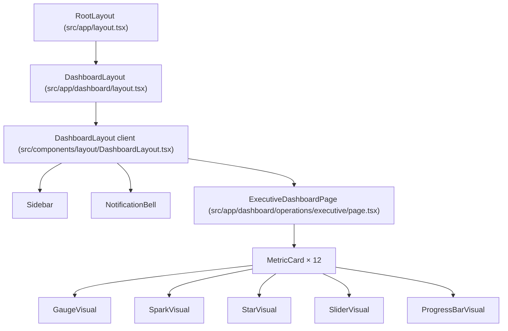
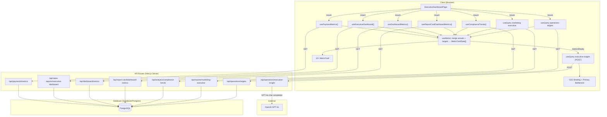

# Operations / Executive Dashboard

---

## 1. Screen Overview

| Attribute | Detail |
|-----------|--------|
| **Screen name** | Executive Dashboard |
| **Route / URL** | `/dashboard/operations/executive` |
| **Purpose** | Provide the CEO / executive team with a single-page, real-time view of the company's operational health across three business domains: Financial Health, Marketing / Sales Engine, and Delivery Model Strength. Each KPI is compared against a monthly target, paced to the current day of the month, and colour-coded as On Track / Watch / Behind. An AI-generated "CEO Briefing" (Theory of Constraints analysis via GPT-4o) highlights the single biggest bottleneck in the business. |
| **User role(s)** | Any authenticated user. No role-based gating is enforced beyond Supabase auth. |
| **Workflow position** | Accessed from the sidebar under **Operations → Executive Dashboard**. Typically the first screen an executive opens. From here, users may navigate to **Performance Targets** (`/dashboard/operations/targets`) to adjust KPI targets, or drill into individual functional dashboards (Payments, Reports, Coordinator, etc.). |

### Layout Description (top → bottom)

1. **Page header** — "Executive Dashboard" title (`h4`, bold, primary colour).
2. **Summary card** — Full-width `Card` containing:
   - **Left column**: "CEO Briefing" — AI-generated insight paragraph (or loading spinner).
   - **Right column**: "Primary Bottleneck" label + metric name, plus two `Chip` badges showing **Strength** count and **Watch** count.
3. **Section: Financial Health** — Section heading + tagline ("Top outcomes"), then a responsive grid of 4 `MetricCard` components: Collections, Booked Sales, Membership Revenue %, Program Margin.
4. **Section: Marketing / Sales Engine** — Heading + tagline ("Critical funnel and conversion pressure"), grid of 4 `MetricCard` components: Leads, Show Rate, PMEs Scheduled, Close Rate.
5. **Section: Delivery Model Strength** — Heading + tagline ("Long-term durability"), grid of 4 `MetricCard` components: Active Clients, Avg Satisfaction Score, Overall Compliance %, Dropouts.

Each `MetricCard` shows: label, status badge (Behind / Watch / On Track), current value, target value, a visual (Gauge, Sparkline, Star Rating, Slider, or Progress Bar), and "Expected by Today" paced value.

---

## 2. Component Architecture

### Component Tree

### ExecutiveDashboardPage

| Attribute | Detail |
|-----------|--------|
| **File** | `src/app/dashboard/operations/executive/page.tsx` |
| **Type** | Client component (`'use client'`) |
| **Props** | None (page component) |

#### Local State

| Variable | Type | Initial | Purpose |
|----------|------|---------|---------|
| `period` | `PeriodFilter` (`'month' \| 'week' \| 'quarter' \| 'custom'`) | `'month'` | Period filter selection (UI present but currently hidden / not wired to cards) |

#### Hooks / Data Consumed

| Hook / Query | Source | Cache Key | What it provides |
|---|---|---|---|
| `usePaymentMetrics()` | `use-payments.ts` | `['payments','metrics']` | `totalAmountDue` (collections), `membershipRevenuePct` |
| `useExecutiveDashboard({ range: 'this_month' })` | `use-sales-reports.ts` | `['sales-reports','executive-dashboard',{range:'this_month'}]` | `totalRevenue` (booked sales), `avgMargin`, `conversionRate`, `revenueTrend` |
| `useDashboardMetrics()` | `use-dashboard-metrics.ts` | `['dashboard','metrics']` | `activeMembers`, `cancelledThisMonth` |
| `useReportCardDashboardMetrics()` | `use-dashboard-metrics-report-card.ts` | `['report-card-dashboard-metrics','metrics']` | `avgSupportRating` |
| `useComplianceTrends()` | `use-compliance-trends.ts` | `['compliance-trends']` | Array of `ComplianceTrendData` (latest month averaged for overall compliance) |
| Inline `useQuery` — marketing | page file | `['marketing-executive']` | `leadsCount`, `pmesScheduled`, `showRate` from `/api/reports/marketing-executive` |
| Inline `useQuery` — targets | page file | `['operations-targets']` | Array of `TargetRecord` from `/api/operations/targets` |
| Inline `useQuery` — insight | page file | `['executive-insight', insightHash]` | `{ insight, constraint, cached, generatedAt }` from POST `/api/operations/executive-insight` |

#### Key Memoised Values

Each of the 12 metrics is computed in a `useMemo` block that:
1. Finds the matching `TargetRecord` for the current month.
2. Reads the actual value from the appropriate hook.
3. Calculates `expected` = `target × getMonthPaceRatio()` for pace-able metrics.
4. Derives status via `deriveStatus(actual, expected, direction)`.

Memoised section arrays: `financialHealthEntries`, `marketingSalesEntries`, `deliveryModelEntries`.

#### Event Handlers

| Handler | Trigger | Action |
|---------|---------|--------|
| `setPeriod` | `ButtonGroup` (currently hidden) | Updates `period` state |

#### Conditional Rendering

| Condition | Renders |
|-----------|---------|
| `insightLoading === true` | `CircularProgress` + "Analyzing metrics…" |
| `insightLoading === false` | AI insight text or "Loading…" fallback |
| `metricsReady === false` | Insight query is disabled (`enabled: false`) |

### MetricCard

| Attribute | Detail |
|-----------|--------|
| **File** | `src/components/executive-dashboard/MetricCard.tsx` |
| **Props** | See table below |

| Prop | Type | Required | Default |
|------|------|----------|---------|
| `metric` | `MetricDefinition` | Yes | — |
| `data` | `MetricCardData` | No | `undefined` |

`MetricCardData`:

| Field | Type |
|-------|------|
| `actual` | `number \| null` |
| `target` | `number \| null` |
| `expected` | `number \| null` |
| `expectedLabel` | `string` (optional override for the expected display) |
| `status` | `MetricStatus` (`'behind' \| 'watch' \| 'on_track'`) |
| `trend` | `number[]` (for SparkVisual) |

Rendering logic selects the visual component based on `metric.visual_type`:

| `visual_type` | Component |
|---------------|-----------|
| `GAUGE` | `GaugeVisual` |
| `SPARK` | `SparkVisual` |
| `STAR` | `StarVisual` |
| `SLIDER` | `SliderVisual` |
| `PROGRESS_BAR` | `ProgressBarVisual` |

### GaugeVisual

| Attribute | Detail |
|-----------|--------|
| **File** | `src/components/executive-dashboard/GaugeVisual.tsx` |
| **Props** | `progress: number` (0–1), `color: string` |
| **Renders** | MUI X `<Gauge>` component (arc from -110° to 110°) |

### SparkVisual

| Attribute | Detail |
|-----------|--------|
| **File** | `src/components/executive-dashboard/SparkVisual.tsx` |
| **Props** | `trend: number[]`, `color: string` |
| **Renders** | Custom SVG sparkline (160×40px). Returns `null` if `trend.length < 2`. |

### StarVisual

| Attribute | Detail |
|-----------|--------|
| **File** | `src/components/executive-dashboard/StarVisual.tsx` |
| **Props** | `value: number \| null \| undefined`, `color: string` |
| **Renders** | MUI `<Rating>` component, read-only, max 5, precision 0.1 |

### SliderVisual

| Attribute | Detail |
|-----------|--------|
| **File** | `src/components/executive-dashboard/SliderVisual.tsx` |
| **Props** | `progress: number` (0–1), `color: string` |
| **Renders** | MUI `<Slider>` component, disabled, 0–100 range |

### ProgressBarVisual

| Attribute | Detail |
|-----------|--------|
| **File** | `src/components/executive-dashboard/ProgressBarVisual.tsx` |
| **Props** | `progress: number` (0–1), `color: string` |
| **Renders** | MUI `<LinearProgress>` component, determinate, shows "X% of limit" |

---

## 3. Data Flow

### Data Lifecycle

1. **Entry**: Six independent React Query hooks fire on mount. Each fetches from a different API route. An additional inline query fetches targets from `/api/operations/targets`.
2. **Transformation**: Each metric's `useMemo` block:
   - Looks up the monthly target from `allTargets` by `metric_key` + current month prefix.
   - Reads the actual value from the relevant hook's data.
   - Computes `expected = target × (currentDayOfMonth / daysInMonth)` for pace-able metrics.
   - Derives `status` via ratio thresholds (≥1.0 = on_track, ≥0.9 = watch, <0.9 = behind; inverted for `lower_is_better`).
3. **AI Insight**: Once any metric has a non-null actual value (`metricsReady`), a POST to `/api/operations/executive-insight` sends all metric snapshots. The API calls GPT-4o with a Theory of Constraints prompt and returns a briefing + primary constraint. Results are cached for 60 minutes (both client-side via `staleTime` and server-side via in-memory cache).
4. **Display**: Section arrays are mapped to `MetricCard` components, which render the chosen visual type.

### Data Flow Diagram

---

## 4. API / Server Layer

### 4.1 GET `/api/payments/metrics`

| Attribute | Detail |
|-----------|--------|
| **File** | `src/app/api/payments/metrics/route.ts` |
| **Auth** | `supabase.auth.getSession()` — 401 if no session |
| **Request** | No parameters |
| **Response** | `{ data: PaymentMetrics }` |

Response shape (`PaymentMetrics`):

| Field | Type |
|-------|------|
| `totalAmountOwed` | `number` |
| `totalAmountDue` | `number` (paid this month — used as "Collections") |
| `totalAmountLate` | `number` |
| `totalAmountCancelled` | `number` |
| `cancelledDateRangeStart` | `string \| null` |
| `cancelledDateRangeEnd` | `string \| null` |
| `membersWithPaymentsDue` | `number` |
| `latePaymentsBreakdown` | `Array<{ memberId, memberName, amount }>` |
| `cancelledPaymentsBreakdown` | `Array<{ memberId, memberName, amount }>` |
| `membershipRevenuePct` | `number` |

Error responses: `401 Unauthorized`, `500 Failed to fetch payment metrics`.

### 4.2 GET `/api/sales-reports/executive-dashboard`

| Attribute | Detail |
|-----------|--------|
| **File** | `src/app/api/sales-reports/executive-dashboard/route.ts` |
| **Auth** | `supabase.auth.getUser()` — 401 if no user |
| **Query params** | `range` (string, default `'all'`), `startDate?`, `endDate?` |
| **Response** | `{ data: ExecutiveDashboardData }` |

`ExecutiveDashboardData.summary`:

| Field | Type | Used on this screen |
|-------|------|---------------------|
| `totalRevenue` | `number` | Booked Sales actual |
| `pipelineValue` | `number` | Not used |
| `avgProgramValue` | `number` | Not used |
| `avgMargin` | `number` | Program Margin actual |
| `conversionRate` | `number` | Close Rate actual |
| `revenueTrend` | `number[]` | Booked Sales sparkline |

Error responses: `401 Unauthorized`, `500 Failed to calculate executive dashboard`.

### 4.3 GET `/api/dashboard/metrics`

| Attribute | Detail |
|-----------|--------|
| **File** | `src/app/api/dashboard/metrics/route.ts` |
| **Auth** | `supabase.auth.getSession()` — 401 if no session |
| **Response** | `{ data: DashboardMetrics }` |

Relevant fields used:

| Field | Type | Used for |
|-------|------|----------|
| `activeMembers` | `number` | Active Clients actual |
| `cancelledThisMonth` | `number` | Dropouts actual |

### 4.4 GET `/api/report-card/dashboard-metrics`

| Attribute | Detail |
|-----------|--------|
| **File** | `src/app/api/report-card/dashboard-metrics/route.ts` |
| **Auth** | `supabase.auth.getUser()` — 401 if no user |
| **Response** | `{ data: DashboardMetrics }` (report-card variant) |

Relevant field used: `avgSupportRating: number | null` → Avg Satisfaction Score actual.

### 4.5 GET `/api/analytics/compliance-trends`

| Attribute | Detail |
|-----------|--------|
| **File** | `src/app/api/analytics/compliance-trends/route.ts` |
| **Auth** | `supabase.auth.getSession()` — 401 if no session |
| **Response** | `ComplianceTrendData[]` (last 12 months) |
| **DB call** | `supabase.rpc('get_monthly_compliance_trends')` |

The executive page takes the **last element** of the array, averages `nutrition`, `supplements`, `exercise`, `meditation` to produce Overall Compliance %.

### 4.6 GET `/api/reports/marketing-executive`

| Attribute | Detail |
|-----------|--------|
| **File** | `src/app/api/reports/marketing-executive/route.ts` |
| **Auth** | `supabase.auth.getUser()` — 401 if no user |
| **Response** | `{ leadsCount: number, pmesScheduled: number, showRate: number }` |

These map to Leads, PMEs Scheduled, and Show Rate metrics.

### 4.7 GET `/api/operations/targets`

| Attribute | Detail |
|-----------|--------|
| **File** | `src/app/api/operations/targets/route.ts` |
| **Auth** | `supabase.auth.getUser()` — 401 if no user |
| **Query params** | Optional `periodType` (`WEEK \| MONTH`), `periodStart` (`YYYY-MM-DD`) |
| **Response** | `{ data: TargetRecord[] }` |
| **Validation** | Zod schemas for `periodType` and `periodStart` |

The executive page fetches **all** targets (no filter params) and finds the current month's MONTH target for each `metric_key` client-side.

### 4.8 POST `/api/operations/executive-insight`

| Attribute | Detail |
|-----------|--------|
| **File** | `src/app/api/operations/executive-insight/route.ts` |
| **Auth** | **None** — no auth check (see Security section) |
| **Request body** | `{ metrics: MetricSnapshot[] }` |
| **Response** | `{ insight: string, constraint: string, cached: boolean, generatedAt: string }` |
| **Caching** | Server-side in-memory cache, 60-minute TTL, keyed by metrics hash |
| **External call** | OpenAI `gpt-4o`, `temperature: 0.5`, `max_tokens: 200` |

Error responses: `400 metrics array is required`, `502 AI service error` (OpenAI API errors), `500 Internal server error`.

---

## 5. Database Layer

### 5.1 Tables Touched

#### `metric_definitions`

| Column | Type | Nullable | Default | Constraints |
|--------|------|----------|---------|-------------|
| `id` | `bigserial` | No | auto | PK |
| `metric_key` | `text` | No | — | UNIQUE |
| `label` | `text` | No | — | — |
| `value_type` | `text` | No | — | CHECK: `currency`, `count`, `percent`, `ratio` |
| `period_types` | `text[]` | No | `'{}'` | — |
| `display_order` | `int` | No | `0` | — |
| `active_flag` | `boolean` | No | `true` | — |
| `dashboard_section` | `text` | Yes | `NULL` | CHECK: `FINANCIAL_HEALTH`, `MARKETING_ENGINE`, `SALES_PERFORMANCE`, `DELIVERY_MODEL_STRENGTH` |
| `visual_type` | `text` | Yes | `NULL` | CHECK: `GAUGE`, `SPARK`, `STAR` |
| `show_on_executive_dashboard` | `boolean` | No | `false` | — |
| `target_direction` | `text` | No | `'higher_is_better'` | CHECK: `higher_is_better`, `lower_is_better` |
| `created_at` | `timestamptz` | Yes | `now()` | — |
| `updated_at` | `timestamptz` | Yes | `now()` | — |

**Indexes**: `idx_metric_definitions_active` (partial, `active_flag = true`), `idx_metric_definitions_dashboard` (partial, `show_on_executive_dashboard = true AND active_flag = true`, on `dashboard_section, display_order`).

**RLS**: Enabled. `authenticated` role has full access. `service_role` bypasses.

**Migration files**: `20260317000000_create_metric_definitions_table.sql`, `20260320000000_add_executive_dashboard_columns_to_metric_definitions.sql`, `20260323000000_rename_section_and_add_delivery_metrics.sql`, `20260324000000_add_target_direction_to_metric_definitions.sql`.

#### `metric_targets`

| Column | Type | Nullable | Default | Constraints |
|--------|------|----------|---------|-------------|
| `id` | `bigint` | No | identity | PK |
| `metric_key` | `text` | No | — | FK → `metric_definitions.metric_key` |
| `period_type` | `text` | No | — | CHECK: `WEEK`, `MONTH` |
| `period_start` | `date` | No | — | — |
| `target_value` | `numeric` | No | — | — |
| `notes` | `text` | Yes | — | — |
| `created_at` | `timestamptz` | Yes | `now()` | — |
| `updated_at` | `timestamptz` | Yes | `now()` | — |

**Unique constraint**: `(metric_key, period_type, period_start)`.

**Indexes**: `idx_metric_targets_period` on `(period_type, period_start)`, `idx_metric_targets_metric_key` on `(metric_key)`.

**RLS**: Enabled. Same policy as `metric_definitions`.

**Migration file**: `20260316000000_create_metric_targets_table.sql`.

#### Other Tables Queried (indirectly via API routes)

| Table | Used by API | Purpose |
|-------|------------|---------|
| `member_programs` | payments/metrics, dashboard/metrics, report-card, sales-reports | Program records |
| `member_program_payments` | payments/metrics | Payment line items |
| `member_program_finances` | sales-reports/executive-dashboard | Revenue, margin |
| `program_status` | dashboard/metrics, payments/metrics, sales-reports | Status lookup |
| `program_status_transitions` | dashboard/metrics | Cancelled-this-month count |
| `leads` | marketing-executive, sales-reports | Lead records |
| `status` | sales-reports, marketing-executive | Lead status lookup |
| `campaigns` | sales-reports, marketing-executive | Campaign data |
| `audit_events` / `audit_event_changes` | sales-reports, marketing-executive | PME/status audit trail |
| `member_progress_summary` | report-card | Compliance/progress scores |
| `survey_response_sessions` / `survey_responses` | report-card | Satisfaction ratings |
| `survey_domain_scores` | report-card | MSQ scores |

### 5.2 Key Queries

| Query | Type | File | Function | Notes |
|-------|------|------|----------|-------|
| `metric_definitions` select (active, ordered) | READ | `api/operations/metrics/route.ts` | `GET` | Uses partial index |
| `metric_targets` select (all or filtered) | READ | `api/operations/targets/route.ts` | `GET` | Unfiltered from executive page |
| `member_program_payments` + `member_programs` join | READ | `api/payments/metrics/route.ts` | `GET` | Multiple queries; `ProgramStatusService` fetches IDs first |
| `campaigns` with nested `leads` + `status` | READ | `api/sales-reports/executive-dashboard/route.ts` | `GET` | Complex join, full table scan on campaigns |
| `member_programs` with `member_program_finances` | READ | `api/sales-reports/executive-dashboard/route.ts` | `GET` | Filtered by status IDs |
| `program_status` lookup | READ | Multiple routes | — | Fetched repeatedly across routes (no shared cache) |
| `supabase.rpc('get_monthly_compliance_trends')` | READ | `api/analytics/compliance-trends/route.ts` | `GET` | Server-side stored function |
| `leads` count this month | READ | `api/reports/marketing-executive/route.ts` | `GET` | Uses `created_at` range |
| `campaigns` with leads this month | READ | `api/reports/marketing-executive/route.ts` | `GET` | For show-rate calculation |

**Performance notes**:
- The `sales-reports/executive-dashboard` route does a full scan of `campaigns` and `audit_events` tables with in-memory date filtering — could be slow as data grows.
- `payments/metrics` calls `ProgramStatusService.getValidProgramIds` twice (once for active+paused, once for all), each involving a `program_status` lookup + `member_programs` query.
- `program_status` table is queried separately in multiple API routes without caching.
- The compliance trends endpoint uses an RPC stored function, which is efficient.

---

## 6. Business Rules & Logic

### Status Derivation

| Rule | Enforcement | Violation Behaviour |
|------|-------------|---------------------|
| Status is `on_track` if `actual / expected ≥ 1.0` (or `≤ 1.0` for `lower_is_better`) | Client-side (`deriveStatus` function in page.tsx) | Falls to `watch` or `behind` |
| Status is `watch` if ratio ≥ 0.9 (or ≤ 1.1 for lower_is_better) | Client-side | Falls to `behind` |
| Status is `behind` if ratio < 0.9 (or > 1.1 for lower_is_better) | Client-side | Red badge shown |
| If `expected ≤ 0`, status defaults to `on_track` | Client-side | Prevents division errors |
| If actual or target is null, status defaults to `watch` | Client-side | Amber badge shown |

### Pace Calculation

`expected = target × (currentDayOfMonth / totalDaysInMonth)`

Applied to: Collections, Booked Sales, Leads, PMEs Scheduled, Active Clients. **Not applied** to rate-based metrics (Show Rate, Close Rate, Program Margin, Membership Revenue %, Satisfaction, Compliance) — these use the full-month target directly (expected = null, `expectedLabel` = "Not Applicable").

### Compliance Calculation

Overall Compliance % = average of the latest month's `nutrition`, `supplements`, `exercise`, `meditation` values from compliance trends, excluding null values.

### Collections (Amount Paid This Month)

Despite being labelled "Collections", this metric represents **payments received this calendar month across all programs** (not just active ones). Includes membership and non-membership payments.

### AI Insight

The executive-insight route applies a Theory of Constraints prompt:
- Identifies ONE primary constraint across all three business domains.
- The constraint metric name appears on line 1 of the response (parsed as `constraint`).
- The remaining text is the `insight` paragraph.
- Cached server-side for 60 minutes (hash-based), client-side staleTime also 60 minutes.

### Feature Flags / Environment Behaviour

| Flag | Effect |
|------|--------|
| `OPENAI_API_KEY` env var | Required for executive insight. If missing, insight API returns 500. |
| Period filter buttons | Present in code but commented out / hidden (`{/* Period filter buttons — hidden until filters are wired to cards */}`). |

---

## 7. Form & Validation Details

N/A — This screen is read-only. There are no forms or user input fields. The period filter `ButtonGroup` exists in state but is not rendered.

---

## 8. State Management

### Local Component State

| Variable | Type | Scope |
|----------|------|-------|
| `period` | `PeriodFilter` | `ExecutiveDashboardPage` — currently unused in rendering |

### React Query Cache (TanStack Query)

| Cache Key | Stale Time | GC Time | Refetch on Focus |
|-----------|------------|---------|-------------------|
| `['payments','metrics']` | 30s | 2min | Yes |
| `['sales-reports','executive-dashboard',…]` | default (0) | default (5min) | Yes |
| `['dashboard','metrics']` | 5min | 10min | Yes |
| `['report-card-dashboard-metrics','metrics']` | 2min | default | Yes |
| `['compliance-trends']` | 5min | 10min | No |
| `['marketing-executive']` | default (0) | default (5min) | Yes |
| `['operations-targets']` | default (0) | default (5min) | Yes |
| `['executive-insight', hash]` | 60min | 60min | No |

### URL State

No query parameters or route params used. The URL is static: `/dashboard/operations/executive`.

### Persisted State

None. No localStorage, sessionStorage, or cookies are used by this screen.

---

## 9. Navigation & Routing

### Inbound

| Source | Link target |
|--------|-------------|
| Sidebar → Operations → "Executive Dashboard" | `/dashboard/operations/executive` |
| Direct URL / bookmark | `/dashboard/operations/executive` |

### Outbound

No explicit outbound navigation from this screen. Users navigate via the sidebar.

### Route Guards

The parent `dashboard/layout.tsx` is a **server component** that calls `supabase.auth.getUser()`. If no user is found, it redirects to `/login`. There is no role-based guard.

### Deep Linking

Fully supported — the URL is static with no dynamic segments. Any authenticated user can bookmark and share the URL.

---

## 10. Error Handling & Edge Cases

### Error States

| Scenario | UI Treatment | Recovery |
|----------|-------------|----------|
| Any data hook fails silently | Metric cards show "—" for values, status defaults to "watch" | Automatic refetch on window focus |
| Executive insight API returns error | Insight text shows "Loading…" indefinitely | `retry: 1` in useQuery config |
| OpenAI API error | Insight API returns 502 with error details | Cached result served if available; otherwise shows "Loading…" |
| User not authenticated | Redirect to `/login` (layout-level) | User logs in |

### Empty States

| Scenario | Display |
|----------|---------|
| No targets configured | All cards show "Target —"; status defaults to "watch" for all metrics |
| No payment data | Collections and Membership Revenue show "—" |
| No campaigns/sales data | Booked Sales, Program Margin, Close Rate show "—" |
| Compliance trends empty | Overall Compliance shows "—" |
| No active members | Active Clients shows "—" or 0 |

### Loading States

- Each hook starts in `isLoading` state (React Query default).
- Individual metric cards render with "—" values until data arrives.
- The AI insight section shows a `CircularProgress` spinner + "Analyzing metrics…" text.
- No skeleton screens are used.

### Timeout Handling

No explicit timeout handling. React Query's default behaviour applies. The executive insight query has `retry: 1`.

### Offline Behaviour

Not explicitly handled. Cached React Query data would be shown if available; otherwise, metrics show "—".

---

## 11. Accessibility

### ARIA & Semantics

- Page title uses `<Typography variant="h4" component="h1">` — correct heading hierarchy.
- Section headings use `<Typography variant="h6">` — should be `h2` for proper hierarchy.
- `MetricCard` uses MUI `<Card>` — no explicit ARIA role needed (generic container).
- Status `<Chip>` components have text labels ("Behind", "Watch", "On Track") — accessible.
- `GaugeVisual` uses MUI X `<Gauge>` with text label — accessible.
- `StarVisual` uses MUI `<Rating readOnly>` — has built-in ARIA support.
- `SliderVisual` uses `<Slider disabled>` — has ARIA but is disabled.

### Keyboard Navigation

- Tab order follows DOM order (header → summary card → metric cards L→R, T→B).
- No interactive elements on metric cards (read-only).
- No keyboard shortcuts defined.

### Colour Contrast

- Status colours use high-contrast pairings: red `#d32f2f` on `#ffebee`, orange `#e65100` on `#fff3e0`, green `#2e7d32` on `#e8f5e9`.
- Primary bottleneck text is `#d32f2f` on white — passes WCAG AA.
- Gauge/spark/progress colours inherit from status — same high-contrast palette.

### Focus Management

No modals, dialogs, or form submissions — no special focus management needed.

---

## 12. Performance Considerations

### Re-render Analysis

- **12 `useMemo` blocks** for metric entries ensure cards don't recompute unless their specific data dependencies change.
- **Section arrays** are memoised (`financialHealthEntries`, etc.).
- `MetricCard` is **not** wrapped in `React.memo` — every parent re-render re-renders all 12 cards. This is a potential optimization.
- Visual sub-components (`GaugeVisual`, `SparkVisual`, etc.) are also not memoised.

### Large Lists

Not applicable — fixed set of 12 metric cards.

### Bundle Size

- MUI X Charts (`@mui/x-charts/Gauge`) is imported only for `GaugeVisual` — this is a large package. Consider dynamic import.
- `SparkVisual` is custom SVG — minimal bundle impact.
- OpenAI SDK is server-only (not bundled to client).

### Caching Strategy

| Layer | Cache | TTL |
|-------|-------|-----|
| React Query (client) | In-memory | 30s–60min depending on hook |
| Executive insight (server) | In-memory variable | 60 minutes |
| API routes | No HTTP caching headers set | — |
| Supabase | Connection pooling via project config | — |

### Database Performance

- The `sales-reports/executive-dashboard` route performs 4+ sequential database queries with in-memory joins and filtering — could be refactored into fewer queries or a database function.
- `payments/metrics` also performs multiple sequential queries.
- `program_status` table is queried independently in multiple API routes per page load (no shared cache).
- No N+1 queries detected, but the pattern of fetching all IDs then querying by ID list could hit Postgres `IN` clause limits with very large datasets.

---

## 13. Third-Party Integrations

### OpenAI

| Attribute | Detail |
|-----------|--------|
| **Service** | OpenAI ChatCompletion API |
| **Purpose** | Generate CEO Briefing (Theory of Constraints analysis) |
| **SDK** | `openai` npm package |
| **Model** | `gpt-4o` |
| **Config** | `OPENAI_API_KEY` env var |
| **Failure mode** | 502 response from insight API; UI shows "Loading…" indefinitely |
| **Fallback** | Cached response served if metrics hash matches; otherwise no insight shown |

### Supabase

| Attribute | Detail |
|-----------|--------|
| **Service** | Supabase (Postgres + Auth) |
| **Purpose** | All data storage and authentication |
| **SDK** | `@supabase/ssr`, `@supabase/supabase-js` |
| **Config** | `NEXT_PUBLIC_SUPABASE_URL`, `NEXT_PUBLIC_SUPABASE_ANON_KEY` env vars |
| **Failure mode** | API routes return 500; metric cards show "—" |

---

## 14. Security Considerations

### Authentication

- **Dashboard layout** (server component): Calls `supabase.auth.getUser()` and redirects to `/login` if unauthenticated. This protects the page itself.
- **Most API routes**: Each route independently checks `supabase.auth.getUser()` or `supabase.auth.getSession()` and returns 401 if unauthenticated.
- **CRITICAL: `/api/operations/executive-insight` has NO authentication check.** Any unauthenticated request with a valid JSON body can trigger an OpenAI API call, potentially incurring costs.

### Authorization

- No role-based access control. Any authenticated user can view the executive dashboard.
- RLS on `metric_targets` and `metric_definitions` allows all authenticated users full CRUD access — no row-level restrictions.

### Input Sanitisation

- The executive-insight route accepts arbitrary JSON and passes metric labels/values to the OpenAI prompt. Label strings are not sanitised — potential prompt injection vector (low risk since labels come from the client's own data, not user-freeform input).
- All database queries use the Supabase JS client (parameterised queries) — no SQL injection risk.

### CSRF Protection

- Next.js API routes are protected by same-origin policy for cookie-based auth.
- The executive-insight POST endpoint lacks auth entirely, making CSRF moot (it's unprotected).

### Sensitive Data

- No PII is displayed on this screen (only aggregate metrics).
- OpenAI receives aggregate metric values (no member names or personal data).
- `OPENAI_API_KEY` is server-side only.

---

## 15. Testing Coverage

### Existing Tests

No tests exist for the Executive Dashboard screen. Searched for `*test*executive*`, `*spec*executive*`, and `__tests__/` — found only unrelated test files for PROMIS assessment and report card components.

### Gaps

| Area | Gap |
|------|-----|
| Component rendering | No unit tests for `MetricCard`, `GaugeVisual`, `SparkVisual`, `StarVisual`, `SliderVisual`, `ProgressBarVisual` |
| Page rendering | No test for `ExecutiveDashboardPage` |
| Business logic | No test for `deriveStatus`, `getMonthPaceRatio`, `formatValue` |
| API routes | No tests for any of the 8 API routes used by this screen |
| Integration | No test verifying data flow from API to rendered cards |

### Suggested Test Cases

**Unit Tests**:
- `deriveStatus()`: Test all threshold boundaries for both `higher_is_better` and `lower_is_better` directions, including edge cases (expected ≤ 0, equal values).
- `getMonthPaceRatio()`: Test first day, last day, mid-month.
- `formatValue()`: Test currency formatting (under/over $1000), percent, count, ratio, null.
- `MetricCard`: Render with various statuses, null values, each visual type.
- Each visual component: Render with boundary values (0, 1, negative, null).

**Integration Tests**:
- Mock API responses and verify that `ExecutiveDashboardPage` renders correct values in correct cards.
- Verify loading state shows spinner for AI insight.
- Verify empty state (all null data) shows "—" values.

**E2E Tests**:
- Authenticated user loads `/dashboard/operations/executive` — all 12 cards render.
- AI insight section loads after metrics are ready.
- Verify correct section grouping (4 cards per section).

---

## 16. Code Review Findings

| Severity | File | Issue | Suggested Fix |
|----------|------|-------|---------------|
| **Critical** | `src/app/api/operations/executive-insight/route.ts` | No authentication check. Any unauthenticated request can trigger OpenAI API calls, incurring costs and potentially leaking business metric context. | Add `supabase.auth.getUser()` check at the top of the POST handler, matching the pattern in other routes. |
| **High** | `src/app/dashboard/operations/executive/page.tsx` (lines 71–76, 85–97) | Metric definitions (COLLECTIONS_METRIC, BOOKED_SALES_METRIC, etc.) are hardcoded as constants in the page file rather than fetched from the `metric_definitions` database table. Changes in the DB (label, visual_type, section) won't reflect on the dashboard. | Fetch definitions from `/api/operations/metrics` and filter by `show_on_executive_dashboard = true`. |
| **High** | `src/app/api/sales-reports/executive-dashboard/route.ts` | Full table scan on `campaigns` with no date filter at the DB level — all campaigns and all audit events are fetched, then filtered in memory. As data grows this will degrade. | Add `.gte('campaign_date', ...)` filter to the campaigns query and scope the audit_events query to relevant lead IDs. |
| **Medium** | `src/app/dashboard/operations/executive/page.tsx` (line 195) | `findTarget` is defined as a regular function inside the component body (not memoised), but called inside `useMemo` blocks that depend on `allTargets`. The function itself closes over `allTargets` and `currentMonthPrefix` but is recreated every render. | Move `findTarget` into each `useMemo` block, or wrap it in `useCallback`. |
| **Medium** | `src/app/dashboard/operations/executive/page.tsx` (line 164) | `period` state is declared but never used in rendering (period filter UI is hidden). Dead state. | Remove `period` and `setPeriod` until the feature is wired up, or add a TODO comment. |
| **Medium** | `src/app/api/payments/metrics/route.ts` (line 13) | Uses `supabase.auth.getSession()` instead of `supabase.auth.getUser()`. Supabase recommends `getUser()` for server-side auth checks as `getSession()` reads from the JWT without server validation. | Change to `supabase.auth.getUser()`. |
| **Medium** | `src/app/api/dashboard/metrics/route.ts` (line 8–10) | Same issue — uses `getSession()` instead of `getUser()` for auth. | Change to `getUser()`. |
| **Medium** | `src/app/api/analytics/compliance-trends/route.ts` (line 21) | Same issue — uses `getSession()` instead of `getUser()`. | Change to `getUser()`. |
| **Medium** | `src/components/executive-dashboard/MetricCard.tsx` | Component is not wrapped in `React.memo`. Since it receives object props that are recreated via `useMemo`, it will re-render on every parent render even if its inputs haven't changed. | Wrap in `React.memo` or ensure parent props are referentially stable. |
| **Low** | `src/app/dashboard/operations/executive/page.tsx` (line 69) | `MockEntry` type name is misleading — these are real entries, not mocks. The comment says "Mock metric definitions & data — will be replaced with real API data later" but the data IS real (from hooks). | Rename to `MetricEntry` and remove the misleading comment. |
| **Low** | `src/app/api/operations/executive-insight/route.ts` (line 26) | In-memory cache (`let cache: CacheEntry | null`) is lost on every serverless function cold start. In a serverless environment, this provides inconsistent caching. | Consider using a shared cache (Redis, Supabase table, or Vercel KV) for consistent caching. |
| **Low** | `src/app/dashboard/operations/executive/page.tsx` | `PERIOD_OPTIONS` constant is defined but never referenced in the JSX. | Remove until the period filter feature is implemented. |
| **Low** | `src/components/executive-dashboard/SparkVisual.tsx` | Custom SVG sparkline implementation exists when MUI X Charts has `<SparkLineChart>` component. | Consider replacing with MUI X `SparkLineChart` for consistency and maintained accessibility. |

---

## 17. Tech Debt & Improvement Opportunities

| Area | Opportunity |
|------|-------------|
| **Hardcoded metric definitions** | The 12 metric definition constants in the page file duplicate database data. Migrate to fetching from `/api/operations/metrics` and building the card array dynamically. This would also make adding/removing metrics a database-only change. |
| **Shared auth helper** | The `requireAuth` function is duplicated across `operations/targets`, `operations/metrics`, and inline in other routes. Extract a shared `requireAuth` utility in `src/lib/utils/` or `src/lib/middleware/`. |
| **Program status lookups** | `program_status` table is queried independently in 4+ API routes per page load. Cache the status mapping in `ProgramStatusService` or share it via a request-scoped cache. |
| **Period filter** | The period filter UI (week/month/quarter/custom) is partially implemented (state exists, options defined, ButtonGroup present but hidden). Complete the feature or remove the dead code. |
| **SparkVisual → MUI X** | Replace custom SVG sparkline with MUI X `SparkLineChart` for consistency with the project's "prefer existing MUI components" rule. |
| **ProgressBar visual_type** | The `PROGRESS_BAR` and `SLIDER` visual types are used in the page but not included in the `chk_visual_type` database constraint (which only allows `GAUGE`, `SPARK`, `STAR`). Add them to the constraint or remove them from the code. |
| **Insight caching** | Move from in-memory to a persistent cache (Supabase table or Redis) for consistent behaviour across serverless cold starts. |
| **Error boundaries** | No React error boundary wraps this page. A failed render (e.g., unexpected null in a `useMemo`) would crash the entire page. Add an error boundary at the section level. |
| **API response normalisation** | Some routes return `{ data: ... }`, others return bare arrays (compliance-trends). Standardise on a consistent envelope. |

---

## 18. End-User Documentation Draft

### Executive Dashboard

**One-line description**: A real-time scorecard showing your business's most critical performance metrics with AI-powered analysis.

---

### What This Page Is For

The Executive Dashboard gives you a bird's-eye view of your business health. It pulls together data from payments, sales, marketing, client programs, and compliance systems into a single page with 12 key metrics. Each metric is compared against the target you've set for the current month, and an AI assistant identifies the single biggest bottleneck in your business right now.

---

### Understanding the Dashboard

#### CEO Briefing (Top Section)

The top card contains two key elements:

- **CEO Briefing** (left side): An AI-generated paragraph that analyses all 12 metrics using Theory of Constraints thinking. It identifies the ONE metric that, if improved, would have the largest impact on your business. This updates automatically when your data changes (recalculated at most once per hour).
- **Primary Bottleneck** (right side): The specific metric the AI identifies as your biggest constraint right now.
- **Strength / Watch badges**: Quick count of how many metrics are on track vs. needing attention.

#### Metric Cards

Each card shows:

| Element | Meaning |
|---------|---------|
| **Title** | The metric name (e.g., "Collections", "Leads") |
| **Status badge** | 🟢 **On Track** — meeting or exceeding pace. 🟡 **Watch** — slightly below pace (within 10%). 🔴 **Behind** — more than 10% below pace. |
| **Large number** | Current actual value for this month |
| **Target** | The monthly target you've set on the Performance Targets page |
| **Visual** | A gauge, sparkline, star rating, or progress bar showing progress toward the target |
| **Expected by Today** | Where you should be at this point in the month to hit your target (pro-rated by day) |

#### Three Sections

1. **Financial Health** — Revenue and cash flow: Collections, Booked Sales, Membership Revenue %, Program Margin.
2. **Marketing / Sales Engine** — Your sales funnel: Leads generated, Show Rate, PMEs Scheduled, Close Rate.
3. **Delivery Model Strength** — Client outcomes: Active Clients, Satisfaction Score, Overall Compliance, Dropouts.

---

### Tips and Notes

- **Targets must be set first.** If you haven't configured targets on the Performance Targets page, all metrics will show "Watch" status and no target value. Navigate to **Operations → Performance Targets** to set monthly goals.
- **"Expected by Today" is pace-adjusted.** If your monthly target is $100k and you're halfway through the month, the expected value is $50k. Rate-based metrics (like Show Rate or Close Rate) show "Not Applicable" since they don't pace linearly.
- **The AI briefing refreshes hourly.** It won't change more than once per hour unless the underlying metric values change.
- **Dropouts is a "lower is better" metric.** For this card, being under target is green (good) and over target is red (bad).

---

### FAQ

**Q: Why do some metrics show "—" instead of a number?**
A: The data source for that metric hasn't loaded yet or has no data for the current month. This can happen if no payments have been recorded, no campaigns have run, or no compliance surveys have been completed this month.

**Q: How do I change the monthly targets?**
A: Go to **Operations → Performance Targets** in the sidebar. There you can set targets for each metric by month.

**Q: Who can see this dashboard?**
A: Any user with a login to the system can access the Executive Dashboard. There are no role restrictions.

**Q: How is "Overall Compliance %" calculated?**
A: It's the average of the four compliance dimensions (nutrition, supplements, exercise, meditation) from the most recent month's survey data across all active members.

**Q: What does the AI briefing actually do?**
A: It analyses all 12 metrics through a "Theory of Constraints" lens — a business framework that says every system has one primary bottleneck at any given time. The AI identifies that bottleneck and explains what happens to your business if it isn't addressed in the next 30–60 days.

---

### Troubleshooting

| Issue | Cause | Resolution |
|-------|-------|------------|
| CEO Briefing shows "Loading…" and never updates | OpenAI API may be unavailable or the API key may be misconfigured | Contact your system administrator to verify the `OPENAI_API_KEY` is set correctly |
| All metrics show "—" | You may have lost your session | Refresh the page. If the issue persists, log out and log back in. |
| All status badges show "Watch" | No targets have been set for the current month | Go to Performance Targets and configure monthly targets |
| A specific metric seems wrong | The data source for that metric may have stale data | Check the underlying data on the relevant functional page (e.g., Payments Tracking for Collections) |
