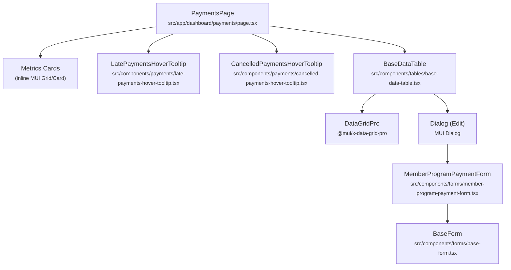
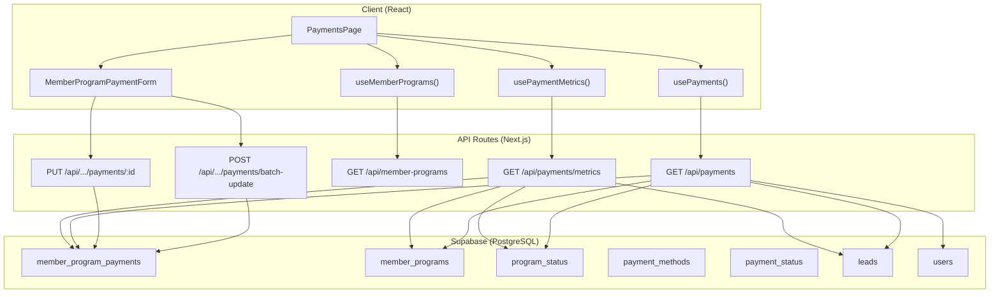

# Operations — Payments Tracking

---

## 1. Screen Overview

| Property | Value |
|----------|-------|
| **Screen Name** | Payments Tracking |
| **Route / URL** | `/dashboard/payments` |
| **Menu Section** | Operations |
| **Purpose** | Centralized view of all member payment installments. Displays key financial metrics (accounts receivable, monthly collections, late balances, cancelled totals) and a filterable data grid of individual payments. Allows inline editing of payment records. |

### User Roles & Access

- **Authentication:** Supabase session required. The `dashboard/layout.tsx` server component calls `getUser()` and redirects to `/login` if unauthenticated.
- **Middleware:** Edge middleware (`middleware.ts`) checks for `x-user` header on all `/dashboard/*` routes and redirects unauthenticated users to `/login`.
- **Permission Gating:** The sidebar filters this link via `hasPermission('/dashboard/payments')`. Admin users (`is_admin = true`) see all menu items. Non-admin users must have a `user_menu_permissions` row with `menu_path = '/dashboard/payments'`.
- **API-Level Auth:** Every API route this screen calls verifies `supabase.auth.getSession()` and returns `401 Unauthorized` if missing.
- **Note:** No role-based restriction exists *beyond* the menu permission. Any authenticated user whose sidebar includes this link can access all payment data. There is no per-member or per-program ownership filtering at the API level.

### Workflow Position

| Before | This Screen | After |
|--------|-------------|-------|
| Programs page (Sales > Programs) where payments are generated via the Financials tab → Regenerate Payments | **Payments Tracking** — monitor, filter, and update payment statuses | Individual payment edits feed back into program financials; late/cancelled metrics surface on Executive Dashboard |

### Layout Description (Top to Bottom)

1. **Page Title** — "Payments" in bold primary color
2. **Metrics Cards Row** — Four equal-width cards in a horizontal `Grid`:
   - **Accounts Receivable** (blue top border) — total unpaid balance for Active/Paused programs
   - **Amount Paid This Month** (primary top border) — sum of payments with `payment_date` in current calendar month, all program statuses
   - **Total Amount Late** (red top border, hover tooltip) — overdue Pending payments for Active/Paused programs
   - **Total Amount Cancelled** (grey top border, hover tooltip) — sum of Cancelled-status payments across all programs
3. **Filters Bar** — Member dropdown (populated from Active/Paused programs' leads) + "Show All Payments" checkbox
4. **Data Grid** — `BaseDataTable` (MUI X DataGridPro) with columns: Member Name, Program Name, Due Date, Amount, Status, Notes, Updated, Updated By. Rows are clickable to open the edit dialog. Late Pending rows are highlighted red.
5. **Edit Dialog** — `MemberProgramPaymentForm` inside a `BaseDataTable`-managed MUI Dialog. Allows editing payment status, date, amount (conditionally), method, reference, and notes.

---

## 2. Component Architecture

### Component Tree



### PaymentsPage

| Property | Details |
|----------|---------|
| **File** | `src/app/dashboard/payments/page.tsx` |
| **Directive** | `'use client'` |
| **Props** | None (Next.js page component) |

**Local State:**

| Variable | Type | Initial | Purpose |
|----------|------|---------|---------|
| `memberFilter` | `number \| null` | `null` | Selected member ID for filtering payments |
| `showAllPayments` | `boolean` | `false` | When false, only Pending payments shown; when true, all statuses |
| `editingPayment` | `PaymentRow \| null` | `null` | The payment row being edited |
| `editDialogOpen` | `boolean` | `false` | Controls edit dialog visibility |

**Hooks Consumed:**

| Hook | Source | Purpose |
|------|--------|---------|
| `usePaymentMetrics()` | `use-payments.ts` | Fetches aggregated metric card data |
| `usePayments({ memberId, showAllPayments })` | `use-payments.ts` | Fetches filtered payment list |
| `useProgramStatus()` | `use-program-status.ts` | Fetches program statuses (used indirectly) |
| `useMemberPrograms()` | `use-member-programs.ts` | Fetches all programs to derive member filter options and look up program status for edit dialog |

**Memoized Values:**

| Variable | Dependencies | Purpose |
|----------|-------------|---------|
| `memberOptions` | `allPrograms` | Deduped, alphabetically sorted list of members from Active/Paused programs |

**Event Handlers:**

| Handler | Trigger | Action |
|---------|---------|--------|
| `handleRowClick` | DataGrid row click | Sets `editingPayment` and opens dialog |
| `handleEditSuccess` | Form submission success | Closes dialog, clears editing state, calls `refetch()` |
| `setMemberFilter` | Member dropdown change | Updates member filter state, triggers re-query |
| `setShowAllPayments` | Checkbox toggle | Toggles all/pending filter, triggers re-query |

**Conditional Rendering:**

| Condition | Effect |
|-----------|--------|
| `metricsLoading` | Shows `CircularProgress` spinner inside each metric card |
| `paymentsLoading` | Shows loading overlay on DataGrid |
| Row `payment_status_name !== 'Pending'` | Row does not get late highlighting |
| Row is Pending with `payment_due_date < today` | Row gets `row-late` CSS class (red background) |

---

### LatePaymentsHoverTooltip

| Property | Details |
|----------|---------|
| **File** | `src/components/payments/late-payments-hover-tooltip.tsx` |
| **Props** | `children: React.ReactElement` (required) |

Wraps its child in a MUI `Tooltip`. Internally calls `usePaymentMetrics()` (shared cache with page) and displays a per-member breakdown of late payment amounts. Shows loading spinner while fetching, error text on failure, or "No late payments" when empty.

---

### CancelledPaymentsHoverTooltip

| Property | Details |
|----------|---------|
| **File** | `src/components/payments/cancelled-payments-hover-tooltip.tsx` |
| **Props** | `children: React.ReactElement` (required) |

Identical pattern to `LatePaymentsHoverTooltip` but renders the cancelled payments breakdown from `usePaymentMetrics()`.

---

### BaseDataTable

| Property | Details |
|----------|---------|
| **File** | `src/components/tables/base-data-table.tsx` |
| **Key Props Used by This Screen** | `title`, `data`, `columns`, `loading`, `onRowClick`, `onEdit`, `renderForm`, `showCreateButton=false`, `getRowId`, `rowClassName`, `sortModel` |

Generic reusable table component wrapping MUI X `DataGridPro`. Manages its own dialog state for create/edit forms. Supports row selection highlighting, custom row class names, column state persistence via localStorage, and optional aggregation footers.

---

### MemberProgramPaymentForm

| Property | Details |
|----------|---------|
| **File** | `src/components/forms/member-program-payment-form.tsx` |

**Props:**

| Prop | Type | Required | Default | Description |
|------|------|----------|---------|-------------|
| `programId` | `number` | Yes | — | The member program this payment belongs to |
| `initialValues` | `Partial<MemberProgramPaymentsFormData> & { member_program_payment_id?: number }` | No | — | Pre-populated form values for edit mode |
| `onSuccess` | `() => void` | No | — | Callback on successful create/update |
| `mode` | `'create' \| 'edit'` | No | `'create'` | Form mode |
| `programStatus` | `string` | No | — | Lowercase program status name (controls field editability) |
| `programType` | `string \| undefined` | No | — | `'one-time'` or `'membership'` (controls whether amount/due date are editable) |

**Hooks Consumed:**

| Hook | Purpose |
|------|---------|
| `useMemberProgramPayments(programId)` | Fetches all payments for auto-adjustment calculation |
| `useMemberProgramFinances(programId)` | Fetches `final_total_price` for auto-adjustment validation |
| `useMemberProgramItems(programId)` | Fetches items for taxable charge calculation |
| `useProgramStatus()` | Program status list |
| `useActivePaymentStatus()` | Active payment status options for dropdown |
| `useActivePaymentMethods()` | Active payment method options for dropdown |
| `useCreateMemberProgramPayment(programId)` | Create mutation |
| `useUpdateMemberProgramPayment(programId)` | Single update mutation |
| `useBatchUpdateMemberProgramPayments()` | Batch update mutation (for auto-adjustments) |

**Key Derived State:**

| Variable | Logic |
|----------|-------|
| `canEditAmount` | `!isMembership && (status === 'quote' \|\| status === 'active') && !isPaymentPaid` |
| `canEditDueDate` | `!isMembership && !isPaymentPaid` |
| `isPaidSelected` | Watches `payment_status_id` and resolves to `true` when "Paid" status selected |
| `autoAdjustmentPreview` | Computes real-time preview of how changing one payment amount redistributes across remaining unpaid payments |

---

### BaseForm

| Property | Details |
|----------|---------|
| **File** | `src/components/forms/base-form.tsx` |
| **Props** | `onSubmit`, `onCancel`, `isSubmitting`, `submitText`, `children`, `submitHandler` |

Generic form wrapper providing scrollable content area and sticky bottom action bar with Cancel/Submit buttons.

---

## 3. Data Flow

### Data Lifecycle

1. **Page Mount:** Three parallel React Query fetches fire:
   - `GET /api/payments/metrics` → metric card data
   - `GET /api/payments?pendingOnly=true` → payment rows (default: pending only)
   - `GET /api/member-programs` → all programs (for member filter dropdown)
   - `GET /api/program-status` → program status list

2. **Filter Change:** When `memberFilter` or `showAllPayments` changes, `usePayments` query key changes, triggering a refetch of `GET /api/payments` with updated query params.

3. **Row Click → Edit:** Clicking a row opens the edit dialog, which triggers additional fetches for the selected payment's program:
   - `GET /api/member-programs/:id/payments` (all payments for auto-adjustment)
   - `GET /api/member-programs/:id/finances` (program price)
   - `GET /api/member-programs/:id/items` (items for tax calculation)
   - `GET /api/payment-status` (active statuses for dropdown)
   - `GET /api/payment-methods` (active methods for dropdown)

4. **Form Submit:**
   - Single update: `PUT /api/member-programs/:id/payments/:paymentId`
   - Batch update (when amount changed): `POST /api/member-programs/:id/payments/batch-update`
   - On success: toast notification, dialog closes, payment list refetches

### Data Flow Diagram



---

## 4. API / Server Layer

### GET /api/payments

| Property | Value |
|----------|-------|
| **File** | `src/app/api/payments/route.ts` |
| **Method** | GET |
| **Auth** | Session required (401 if missing) |

**Query Parameters:**

| Param | Type | Required | Default | Description |
|-------|------|----------|---------|-------------|
| `memberId` | `string` (numeric) | No | — | Filter to payments for a specific lead |
| `pendingOnly` | `'true'` | No | — | When `'true'`, only return payments with Pending status |

**Response:** `{ data: PaymentRow[] }` — array of payment objects with flattened `member_name`, `program_name`, `payment_status_name`, `payment_method_name`, and `*_by_email`/`*_by_full_name` fields.

**Query Flow:**
1. Fetch all `program_status` rows, identify excluded statuses (Cancelled, Completed, Quote)
2. Fetch `member_programs` with lead join, filter by member if specified, exclude programs with excluded statuses
3. Fetch `member_program_payments` for valid program IDs, `active_flag = true`, ordered by `payment_due_date` ascending
4. Post-query filter: if `pendingOnly`, keep only Pending-status payments
5. Enrich with program details (member name, program name) and user details (created_by/updated_by names)

**Error Responses:** `401` (unauthorized), `500` (server error with `{ error: string }`)

---

### GET /api/payments/metrics

| Property | Value |
|----------|-------|
| **File** | `src/app/api/payments/metrics/route.ts` |
| **Method** | GET |
| **Auth** | Session required (401 if missing) |

**Parameters:** None

**Response Shape:**

```typescript
{
  data: {
    totalAmountOwed: number;        // Unpaid balance (Active/Paused programs)
    totalAmountDue: number;          // Amount paid this month (all programs)
    totalAmountLate: number;         // Overdue Pending payments (Active/Paused)
    totalAmountCancelled: number;    // Cancelled payment total (all programs)
    cancelledDateRangeStart: string | null;
    cancelledDateRangeEnd: string | null;
    membersWithPaymentsDue: number;
    latePaymentsBreakdown: Array<{ memberId: number; memberName: string; amount: number }>;
    cancelledPaymentsBreakdown: Array<{ memberId: number; memberName: string; amount: number }>;
    membershipRevenuePct: number;    // % of month's revenue from membership programs
  }
}
```

**Query Flow:**
1. Uses `ProgramStatusService.getValidProgramIds()` with `['paused']` for operational metrics and `['all']` for paid/cancelled metrics
2. Fetches payments with `active_flag = true` for both program sets
3. Computes metrics with date comparisons (today for late, month range for paid this month)

---

### GET /api/member-programs/:id/payments

| Property | Value |
|----------|-------|
| **File** | `src/app/api/member-programs/[id]/payments/route.ts` |
| **Method** | GET |
| **Auth** | Session required |

Returns all payments for a specific program with joined status/method names. Used by the edit form for auto-adjustment calculations.

---

### POST /api/member-programs/:id/payments

| Property | Value |
|----------|-------|
| **File** | `src/app/api/member-programs/[id]/payments/route.ts` |
| **Method** | POST |
| **Auth** | Session required |

Creates a new payment record. Sets `created_by` and `updated_by` to current session user.

**Request Body:** `MemberProgramPaymentsFormData` fields (payment_amount, payment_due_date, payment_date, payment_status_id, payment_method_id, payment_reference, notes)

**Validation:** Checks `member_program_id` matches route param. Minimal server-side; relies on client-side Zod validation.

---

### PUT /api/member-programs/:id/payments/:paymentId

| Property | Value |
|----------|-------|
| **File** | `src/app/api/member-programs/[id]/payments/[paymentId]/route.ts` |
| **Method** | PUT |
| **Auth** | Session required |

Updates a single payment. Sanitizes `payment_method_id` (converts `0` to `null` to avoid FK violation).

---

### DELETE /api/member-programs/:id/payments/:paymentId

| Property | Value |
|----------|-------|
| **File** | `src/app/api/member-programs/[id]/payments/[paymentId]/route.ts` |
| **Method** | DELETE |
| **Auth** | Session required |

Deletes a single payment (subject to RLS policy: only unpaid rows can be deleted).

---

### POST /api/member-programs/:id/payments/batch-update

| Property | Value |
|----------|-------|
| **File** | `src/app/api/member-programs/[id]/payments/batch-update/route.ts` |
| **Method** | POST |
| **Auth** | Session required |

**Request Body:**

```typescript
{
  paymentUpdates: Array<{
    member_program_payment_id: number;
    member_program_id: number;
    payment_amount?: number;
    payment_status_id?: number;
    // ... other payment fields
  }>
}
```

**Validation:** Checks that `paymentUpdates` is an array and all entries have matching `member_program_id`.

**Error Response:** If any individual update fails, returns 500 with specific payment ID in error message. **Note:** This is not wrapped in a database transaction — partial updates are possible on failure.

---

## 5. Database Layer

### Tables Touched

#### member_program_payments

| Column | Type | Nullable | Default | Constraints |
|--------|------|----------|---------|-------------|
| `member_program_payment_id` | `integer` | No | serial PK | Primary key |
| `member_program_id` | `integer` | No | — | FK → `member_programs.member_program_id` |
| `payment_amount` | `numeric` | Yes | — | — |
| `payment_due_date` | `date` | Yes | — | — |
| `payment_date` | `date` | Yes | — | Populated when payment is recorded as paid |
| `payment_status_id` | `integer` | Yes | — | FK → `payment_status.payment_status_id` |
| `payment_method_id` | `integer` | Yes | — | FK → `payment_methods.payment_method_id` |
| `payment_reference` | `text` | Yes | — | Check number, transaction ID, etc. |
| `notes` | `text` | Yes | — | — |
| `active_flag` | `boolean` | No | `true` | Soft delete flag |
| `created_at` | `timestamptz` | Yes | `now()` | — |
| `created_by` | `uuid` | Yes | — | FK → `auth.users.id` |
| `updated_at` | `timestamptz` | Yes | `now()` | Auto-updated by trigger |
| `updated_by` | `uuid` | Yes | — | FK → `auth.users.id` |

**Triggers:** `tr_audit_member_program_payments` (audit trail), `update_member_program_payments_timestamp` (auto `updated_at`)

**RLS Policies (from docs):**
- SELECT/INSERT: Constrained to caller's programs
- DELETE: Only unpaid rows (`payment_date IS NULL`)

#### payment_status

| Column | Type | Nullable | Description |
|--------|------|----------|-------------|
| `payment_status_id` | `integer` | No | PK |
| `payment_status_name` | `text` | No | e.g., Pending, Paid, Late, Cancelled, Refunded |
| `active_flag` | `boolean` | No | — |

#### payment_methods

| Column | Type | Nullable | Description |
|--------|------|----------|-------------|
| `payment_method_id` | `integer` | No | PK |
| `payment_method_name` | `text` | No | e.g., Cash, Check, Credit Card, ACH, Wire |
| `active_flag` | `boolean` | No | — |

#### member_programs

Used for joining member/program names and filtering by status. Key columns: `member_program_id`, `lead_id`, `program_status_id`, `program_template_name`, `program_type`.

#### program_status

Used to determine which programs are "valid" for different metric calculations. Key columns: `program_status_id`, `status_name`.

#### leads

Used for member name resolution. Joined via `member_programs.lead_id` → `leads.lead_id`. Key columns: `lead_id`, `first_name`, `last_name`.

#### users

Used for audit trail display (created_by/updated_by name resolution). Key columns: `id`, `email`, `full_name`.

---

### Key Queries

#### 1. Payments List (GET /api/payments)

```
File: src/app/api/payments/route.ts — GET handler

-- Step 1: Load program statuses
SELECT program_status_id, status_name FROM program_status;

-- Step 2: Load qualified programs
SELECT member_program_id, lead_id, program_status_id, program_template_name,
       lead:leads!fk_member_programs_lead(lead_id, first_name, last_name)
FROM member_programs
WHERE lead_id = :memberId  -- optional filter
-- Then client-side filter to exclude Cancelled/Completed/Quote statuses

-- Step 3: Load payments
SELECT *, payment_status(payment_status_id, payment_status_name),
       payment_methods(payment_method_id, payment_method_name)
FROM member_program_payments
WHERE member_program_id IN (:programIds)
  AND active_flag = true
ORDER BY payment_due_date ASC;

-- Step 4: Load user names for audit fields
SELECT id, email, full_name FROM users WHERE id IN (:userIds);
```

**Type:** Read  
**Performance:** Uses `.in()` filter on `member_program_id` which should hit an index. Post-query filtering for pending status is O(n) on the result set. The user lookup is a second query batched by collected IDs — efficient.

#### 2. Metrics (GET /api/payments/metrics)

```
File: src/app/api/payments/metrics/route.ts — GET handler

-- Uses ProgramStatusService for program ID resolution (2 queries)
-- Then 2 bulk payment fetches:

SELECT *, payment_status(payment_status_id, payment_status_name)
FROM member_program_payments
WHERE member_program_id IN (:activePausedProgramIds) AND active_flag = true;

SELECT *, payment_status(payment_status_id, payment_status_name)
FROM member_program_payments
WHERE member_program_id IN (:allProgramIds) AND active_flag = true;
```

**Type:** Read  
**Performance Note:** Fetches ALL payments for ALL programs twice (once for Active/Paused, once for all). Filtering and aggregation happens in JavaScript. For large payment volumes, this could become slow. No pagination or server-side aggregation.

---

## 6. Business Rules & Logic

### Metric Calculation Rules

| Rule | Description | Enforced At |
|------|-------------|-------------|
| **Accounts Receivable** | Sum of `payment_amount` for unpaid payments (not Paid status) on Active/Paused programs only | API (`payments/metrics/route.ts`) |
| **Amount Paid This Month** | Sum of `payment_amount` where `payment_date` falls in current calendar month, across ALL program statuses | API (`payments/metrics/route.ts`) |
| **Total Amount Late** | Sum of `payment_amount` for Pending payments with `payment_due_date < today`, Active/Paused programs only | API (`payments/metrics/route.ts`) |
| **Total Amount Cancelled** | Sum of `payment_amount` for Cancelled-status payments across ALL programs | API (`payments/metrics/route.ts`) |
| **Membership Revenue %** | `(membershipPaidThisMonth / totalAmountDue) * 100` | API (`payments/metrics/route.ts`) |

### Payment List Filtering Rules

| Rule | Description | Enforced At |
|------|-------------|-------------|
| **Excluded Programs** | Payments from Cancelled, Completed, and Quote programs are excluded from the list | API (`payments/route.ts`) |
| **Default View** | Only Pending payments shown by default | Hook (`use-payments.ts` sends `pendingOnly=true`) |
| **Show All Toggle** | Removes the Pending filter when checked | Hook (omits `pendingOnly` param) |
| **Active Flag** | Only `active_flag = true` payments are returned | API (`payments/route.ts`) |

### Payment Edit Rules

| Rule | Description | Enforced At |
|------|-------------|-------------|
| **Amount editability** | Amount can only be edited for non-membership programs in Quote or Active status where payment is not already paid | Frontend (`member-program-payment-form.tsx`) |
| **Due date editability** | Due date can only be edited for non-membership programs where payment is not paid | Frontend (`member-program-payment-form.tsx`) |
| **Membership lock** | For membership programs, amount and due date are NEVER editable (system-generated) | Frontend (`member-program-payment-form.tsx`) |
| **Status required** | Payment status must be selected (not 0) | Frontend (manual validation in `onSubmit`) |
| **Method required when Paid** | Payment method is required only when status is "Paid" | Frontend (manual validation in `onSubmit`) |
| **Paid Date required when Paid** | Payment date is required when status is "Paid" | Frontend (manual validation in `onSubmit`) |
| **Paid Date cleared when not Paid** | If status is not Paid, payment_date is set to null on submit | Frontend (`onSubmit` logic) |
| **Auto-adjustment** | When a payment amount is changed, the difference is distributed evenly across remaining unpaid payments to maintain total = program price | Frontend (preview) + API (batch update) |
| **No negative payments** | Auto-adjustment is blocked if it would make any payment negative | Frontend (`autoAdjustmentPreview` validation) |
| **Total must equal program price** | After adjustment, sum of all payments must equal `final_total_price` | Frontend (`autoAdjustmentPreview` validation) |

### Late Row Highlighting

| Rule | Description | Enforced At |
|------|-------------|-------------|
| Only Pending payments are candidates for late highlighting | Frontend (`rowClassName` callback) |
| A Pending payment is "late" if `payment_due_date < today` (local time comparison) | Frontend (`rowClassName` callback) |
| Late rows receive `row-late` CSS class → red background via DataGridPro `sx` | Frontend (`base-data-table.tsx`) |

---

## 7. Form & Validation Details

### Zod Schema (`memberProgramPaymentsFormSchema`)

**File:** `src/lib/validations/member-program-payments.ts`

| Field | Type | Validation | Error Message |
|-------|------|-----------|---------------|
| `member_program_id` | `number` | `min(1)` | "Member program ID is required" |
| `payment_amount` | `number` | `min(0)` | "Amount must be non-negative" |
| `payment_due_date` | `string` | `min(1)` | "Due date is required" |
| `payment_date` | `string` | optional, nullable | — |
| `payment_status_id` | `number` | `min(0)`, `refine(> 0)` | "Status is required" |
| `payment_method_id` | `number` | `min(0)` | — (conditionally required in `onSubmit`) |
| `payment_reference` | `string` | optional, nullable | — |
| `notes` | `string` | optional, nullable | — |

### Form Fields

| Field Label | Input Type | Bound Variable | Disabled Condition | Validation |
|-------------|-----------|----------------|-------------------|------------|
| Due Date | `date` | `payment_due_date` | `!canEditDueDate` | Required (Zod) |
| Amount | `number` (step 0.01) | `payment_amount` | `!canEditAmount` | Min 0 (Zod), auto-adjustment preview |
| Status | `select` | `payment_status_id` | Never | Required > 0 (manual) |
| Paid Date | `date` | `payment_date` | `!isPaidSelected` | Required when Paid (manual) |
| Method | `select` | `payment_method_id` | `!isPaidSelected` | Required when Paid (manual) |
| Reference | `text` | `payment_reference` | Never | Optional |
| Notes | `textarea` (4 rows) | `notes` | Never | Optional |

### Form Submission Flow

1. User clicks Submit → `handleSubmit(onSubmit)` fires
2. Zod schema validates all fields → shows inline errors if invalid
3. Manual validation checks: status > 0, method required if Paid, paid date required if Paid
4. If amount was edited and auto-adjustment is active, verify `autoAdjustmentPreview.canSave`
5. Build payload; clear `payment_date` if status is not Paid
6. If edit mode with auto-adjustments: call `batchUpdatePayments.mutateAsync()`
7. If edit mode without adjustments: call `updatePayment.mutateAsync()`
8. If create mode: call `createPayment.mutateAsync()`
9. On success: `onSuccess()` callback → closes dialog, refetches list
10. On error: toast notification via Sonner

### Side Effects

- When `isPaidSelected` changes to `false`, `payment_date` and `payment_method_id` are cleared automatically via `useEffect`
- Form is reset via `useEffect` when `normalizedInitials` or `programId` changes (handles dialog re-open with different row)

---

## 8. State Management

### Local Component State

| Component | Variable | Type | Scope |
|-----------|----------|------|-------|
| PaymentsPage | `memberFilter` | `number \| null` | Page filter |
| PaymentsPage | `showAllPayments` | `boolean` | Page filter |
| PaymentsPage | `editingPayment` | `PaymentRow \| null` | Dialog control |
| PaymentsPage | `editDialogOpen` | `boolean` | Dialog control |
| BaseDataTable | `formOpen` | `boolean` | Dialog visibility |
| BaseDataTable | `editingRow` | `T \| undefined` | Row being edited |
| BaseDataTable | `formMode` | `'create' \| 'edit'` | Dialog mode |
| MemberProgramPaymentForm | react-hook-form state | `MemberProgramPaymentsFormData` | Form values, errors, dirty |

### Server/Cache State (React Query)

| Query Key | Stale Time | GC Time | Refetch On Focus |
|-----------|-----------|---------|------------------|
| `['payments', 'list', qs]` | 30s | 2min | Yes |
| `['payments', 'metrics']` | 30s | 2min | Yes |
| `['member-programs', 'list']` | default | default | default |
| `['program-status', 'list']` | default | default | default |
| `['payment-status', 'active']` | default | default | default |
| `['payment-methods', 'active']` | default | default | default |
| `['member-program-payments', 'by-program', id]` | default | default | default |
| `['member-program-finances', 'program', id]` | default | default | default |

### URL State

No query parameters or route parameters are used. The page is at a static route `/dashboard/payments`. Filter state (member, show all) is local only and not persisted in the URL.

---

## 9. Navigation & Routing

### Inbound Routes

| Source | Mechanism |
|--------|-----------|
| Sidebar → Operations → "Payments Tracking" | `<Link>` to `/dashboard/payments` |
| Direct URL | Typing `/dashboard/payments` in browser |

### Outbound Navigation

| Destination | Trigger |
|-------------|---------|
| None — this is a terminal screen | Users edit payments in-place via the dialog. There are no links to other pages from this screen. |

### Route Guards

1. **Edge Middleware** (`middleware.ts`): Redirects unauthenticated users from `/dashboard/*` to `/login`
2. **Dashboard Layout** (`src/app/dashboard/layout.tsx`): Server-side `getUser()` check, redirects to `/login` if no user
3. **Sidebar Permission Filter**: Hides the link if user lacks `'/dashboard/payments'` in their permissions (but does not block direct URL access)

### Deep Linking

The page is accessible via direct URL `/dashboard/payments`. However, filter state is not reflected in the URL, so sharing a filtered view is not possible.

---

## 10. Error Handling & Edge Cases

### Error States

| Error | Trigger | UI Treatment | Recovery |
|-------|---------|-------------|----------|
| Metrics fetch failure | API returns 500 or network error | `CircularProgress` stays visible (no explicit error state on cards) | React Query auto-retry (3 attempts default) |
| Payments fetch failure | API returns 500 or network error | DataGrid shows empty with loading overlay stuck | React Query auto-retry |
| Form submission failure | API error on create/update | Toast notification via Sonner (`toast.error()`) | User can retry submission |
| Auto-adjustment blocked | Negative payment would result | `Alert severity="error"` inline in form | User must adjust amount |
| Invalid program ID | Row click on orphaned payment | Form loads with missing program data | User can cancel dialog |

### Empty States

| Scenario | Display |
|----------|---------|
| No payments found (filters active) | DataGrid shows "No rows" default MUI empty state |
| No members in filter dropdown | Dropdown shows only "All Members" option |
| No late payments | Tooltip shows "No late payments" text |
| No cancelled payments | Tooltip shows "No cancelled payments" text |
| All metrics zero | Cards display `$0` |

### Loading States

| Element | Loading Indicator |
|---------|-------------------|
| Metric cards | `CircularProgress` spinner (32px) inside each card |
| DataGrid | Semi-transparent white overlay with `CircularProgress` (40px) + "Loading data..." text |
| Form submission | Submit button shows `CircularProgress` (22px), button and Cancel disabled |

### Timeout Handling

No explicit timeout handling. Relies on browser/fetch default timeouts and React Query retry logic.

### Offline Behavior

No offline support. Failed fetches result in React Query retries. No service worker or offline cache.

---

## 11. Accessibility

### Current Implementation

| Feature | Status | Notes |
|---------|--------|-------|
| ARIA labels | Partial | MUI components provide built-in ARIA attributes. No custom `aria-label` additions. |
| Keyboard navigation | Yes | DataGrid supports full keyboard navigation (arrow keys, Enter, Tab). Form fields are standard HTML inputs. |
| Screen reader | Partial | MUI tooltips use `role="tooltip"`. Card metrics lack `aria-live` regions for dynamic updates. |
| Color contrast | Partial | Late row highlighting uses `alpha(error.main, 0.24)` which may have insufficient contrast with text. Metric values use theme semantic colors. |
| Focus management | Default | Dialog traps focus via MUI Dialog. No explicit `autoFocus` on first form field. |

### Gaps

- Metric cards update without `aria-live` announcements
- Late row visual indicator relies solely on color (no icon or text indicator)
- Tooltip hover content is not keyboard-accessible (no focus trigger)
- No skip-to-content links within the page

---

## 12. Performance Considerations

### Identified Concerns

| Concern | Severity | Details |
|---------|----------|---------|
| **Unbounded metrics query** | Medium | `GET /api/payments/metrics` fetches ALL payments for ALL programs (Active/Paused and all statuses) into memory and aggregates in JS. No pagination or database-level aggregation. |
| **Unbounded payments list** | Medium | `GET /api/payments` fetches all matching payments without pagination at the API level. DataGrid provides client-side pagination (25/page default). |
| **Duplicate data fetch in metrics** | Low | Metrics endpoint fetches two overlapping sets of payments (Active/Paused and All), resulting in redundant data transfer for the intersection. |
| **Tooltip hooks duplication** | Low | Both `LatePaymentsHoverTooltip` and `CancelledPaymentsHoverTooltip` each call `usePaymentMetrics()`. React Query deduplicates these (same cache key), but three hook instances (page + 2 tooltips) subscribe to the same query. |
| **Edit dialog fetches** | Low | Opening the edit dialog triggers 5 additional API calls. These are cached by React Query and only re-fetched if stale. |
| **No virtualization concern** | N/A | DataGridPro has built-in row virtualization. |
| **Memoization** | Good | `memberOptions` and `columns` are properly memoized. `autoAdjustmentPreview` is memoized in the form. |

### Caching Strategy

| Layer | Strategy |
|-------|----------|
| Client (React Query) | 30s stale time for payments/metrics, default for lookups. Refetch on window focus. |
| Server | No server-side caching. Each API call hits Supabase directly. |
| CDN | N/A (dynamic data) |
| localStorage | DataGrid column widths and order persisted per user via `persistStateKey` (not currently used by this page — `persistStateKey` prop is not passed). |

---

## 13. Third-Party Integrations

| Service | Purpose | Package | Config |
|---------|---------|---------|--------|
| **Supabase** | Database, auth, RLS | `@supabase/ssr`, `@supabase/supabase-js` | `NEXT_PUBLIC_SUPABASE_URL`, `NEXT_PUBLIC_SUPABASE_ANON_KEY` |
| **MUI / MUI X** | UI components, DataGridPro | `@mui/material`, `@mui/x-data-grid-pro` | MUI X license key (configured in root layout) |
| **TanStack React Query** | Data fetching / caching | `@tanstack/react-query` | Configured in `Providers.tsx` |
| **Sonner** | Toast notifications | `sonner` | Configured in `Providers.tsx` |
| **React Hook Form + Zod** | Form state + validation | `react-hook-form`, `@hookform/resolvers`, `zod` | Per-form configuration |

**Failure Modes:**
- Supabase outage → all API calls fail → loading states persist, retry logic kicks in
- MUI X license expiry → DataGridPro shows watermark but remains functional

---

## 14. Security Considerations

| Area | Status | Details |
|------|--------|---------|
| **Authentication** | Enforced | Session verified on every API route via `supabase.auth.getSession()` |
| **Authorization** | Partial | Sidebar permission filtering hides the link. API routes verify authentication but do NOT verify the user has the `/dashboard/payments` menu permission. Any authenticated user can call the API directly. |
| **Input sanitization** | Partial | Supabase JS client uses parameterized queries (prevents SQL injection). No explicit XSS sanitization on notes/reference fields, but React escapes output by default. |
| **CSRF** | Protected | Supabase auth uses HTTP-only cookies; Next.js API routes are same-origin. |
| **Sensitive data** | Low risk | Payment amounts and member names visible. No SSN, credit card numbers, or PHI beyond names. |
| **FK validation** | Yes | `payment_method_id = 0` is sanitized to `null` to prevent FK constraint violations. |
| **RLS** | Enforced at DB | Supabase RLS policies constrain SELECT/INSERT/DELETE based on `auth.uid()`. DELETE restricted to unpaid rows. |

---

## 15. Testing Coverage

### Existing Tests

No tests exist for the Payments Tracking screen or its supporting files. The project has test documentation files (`.test.md`) for other areas but no executable test suites for payments.

### Gaps

All aspects of this screen are untested:
- Page component rendering
- Metric calculations
- API route handlers
- Form validation logic
- Auto-adjustment algorithm
- Row highlighting logic

### Suggested Test Cases

**Unit Tests:**

| Test | File to Test | What to Assert |
|------|-------------|----------------|
| Metric calculations | `payments/metrics/route.ts` | Correct totals for mixed payment statuses, edge cases (no payments, all paid, all late) |
| Auto-adjustment algorithm | `member-program-payment-form.tsx` | Even distribution, rounding, last-payment remainder, negative prevention |
| Late row detection | `payments/page.tsx` → `rowClassName` | Correct class for past-due Pending, no class for past-due Paid, no class for future Pending |
| Date normalization | `member-program-payment-form.tsx` → `normalizeDateInput` | ISO strings, datetime strings, null, empty |
| Currency formatting | `lib/utils/money.ts` | Various amounts, zero, negative, NaN |
| Zod schema validation | `lib/validations/member-program-payments.ts` | Required fields, min amounts, optional fields |

**Integration Tests:**

| Test | What to Assert |
|------|----------------|
| GET /api/payments with filters | Correct exclusion of Cancelled/Completed/Quote programs, pending filter, member filter |
| GET /api/payments/metrics | Correct metric aggregation against known test data |
| PUT /api/.../payments/:id | Successful update, FK sanitization for method_id=0, unauthorized response |
| POST /api/.../payments/batch-update | All updates applied, program ID mismatch rejected, partial failure handling |

**E2E Tests:**

| Test | Steps |
|------|-------|
| View and filter payments | Navigate to page → verify metric cards → select member filter → verify grid updates → toggle Show All → verify grid shows all statuses |
| Edit a pending payment to Paid | Click row → set status to Paid → verify Paid Date and Method become required → fill fields → submit → verify toast and grid update |
| Auto-adjustment preview | Click row → change amount → verify preview shows adjusted payments → submit → verify all payments updated |

---

## 16. Code Review Findings

| Severity | File | Issue | Suggested Fix |
|----------|------|-------|---------------|
| **High** | `src/app/api/member-programs/[id]/payments/batch-update/route.ts` | Batch update is NOT wrapped in a database transaction. If one update succeeds and the next fails, the data is left in an inconsistent state (partial payment adjustments). | Use Supabase RPC or a PL/pgSQL function to wrap all updates in a single transaction. |
| **High** | `src/app/api/payments/metrics/route.ts` | Fetches ALL payments for ALL programs into memory for JS aggregation. For organizations with thousands of payments, this will degrade in performance and could hit Supabase row limits. | Move aggregation to SQL using `SUM()`, `COUNT()`, and `CASE WHEN` in a single query or database function. |
| **Medium** | `src/app/api/payments/route.ts` | Post-query filtering for Pending status (`pendingOnly`) fetches all payments first, then filters in JS. Wastes bandwidth and memory. | Add a Supabase `.eq('payment_status_id', pendingStatusId)` to the query. Requires an upfront lookup of the Pending status ID. |
| **Medium** | `src/app/dashboard/payments/page.tsx` | Metric card for "Amount Paid This Month" uses variable `totalAmountDue` which is misleading — it represents amount *paid* this month, not amount due. | Rename the variable in the API response to `totalPaidThisMonth` for clarity. |
| **Medium** | `src/components/forms/member-program-payment-form.tsx` | Multiple `(initialValues as any)` and `(normalizedInitials as any)` casts throughout the form. Weakens type safety. | Define a proper `PaymentFormInitialValues` type that extends the form data with `member_program_payment_id`. |
| **Medium** | `src/app/api/payments/route.ts` | The excluded status set is hardcoded as `['cancelled', 'completed', 'quote']` using string comparison. Does not use `ProgramStatusService` like the metrics endpoint does. | Replace with `ProgramStatusService.getValidProgramIds(supabase, { includeStatuses: ['paused'] })` for consistency. |
| **Medium** | `src/components/payments/late-payments-hover-tooltip.tsx` | Both tooltip components call `usePaymentMetrics()` independently. While React Query deduplicates, three subscriptions (page + 2 tooltips) to the same query add minor overhead. | Pass metrics data as props from the parent page instead of each component fetching independently. |
| **Low** | `src/app/dashboard/payments/page.tsx` | `formatDateRange` helper is defined inside the component and recreated on every render. | Move to a utility file or wrap in `useCallback`. |
| **Low** | `src/app/dashboard/payments/page.tsx` | The `columns` array is defined inside the component without `useMemo`, causing a new reference on every render. | Wrap in `useMemo` or define outside the component. |
| **Low** | `src/components/forms/member-program-payment-form.tsx` | The `useEffect` that clears `payment_date` and `payment_method_id` when `isPaidSelected` becomes false runs on every render where `isPaidSelected` is false, not only on transition. | Track previous `isPaidSelected` value to only clear on actual transition. |
| **Low** | `src/app/dashboard/payments/page.tsx` | No `persistStateKey` prop passed to `BaseDataTable`, so column widths/order are not saved between sessions for this screen. | Add `persistStateKey="payments-tracking"` to preserve user grid customizations. |

---

## 17. Tech Debt & Improvement Opportunities

### Refactoring Opportunities

1. **Extract metrics aggregation to SQL** — The `GET /api/payments/metrics` endpoint performs all aggregation in JavaScript after loading all payment records. A SQL function or view would be significantly more efficient and maintainable.

2. **Consistent status filtering** — The payments list API manually builds excluded status sets while the metrics API uses `ProgramStatusService`. Both should use the service for consistency.

3. **Transaction safety for batch updates** — The batch update endpoint should use a database function to ensure atomicity. The current implementation can leave payments in an inconsistent state.

4. **URL-based filter state** — Member filter and show-all toggle should be reflected in URL query parameters for deep linking and browser back/forward support.

5. **Type-safe form initial values** — Replace `as any` casts in the payment form with a properly typed interface.

6. **Paginated payments API** — Add server-side pagination parameters (page, pageSize) to the payments list endpoint rather than fetching all records.

### Missing Abstractions

- A shared `usePaymentMetricsData` prop-passing pattern could eliminate duplicate `usePaymentMetrics()` calls in tooltip components
- A `PaymentStatusName` enum/union type would replace scattered string comparisons (`'Pending'`, `'Paid'`, `'Cancelled'`)
- A `DateUtils` module could centralize date parsing and formatting (currently duplicated across multiple files)

### Deprecated Patterns

- None identified. Dependencies are current (MUI 7, React 19, Next.js 15.5).

---

## 18. End-User Documentation Draft

### Payments Tracking

Monitor and manage all member payment schedules from a single screen.

---

#### What This Page Is For

The Payments Tracking page gives you a real-time view of all payment installments across your active and paused member programs. Use it to see how much money is owed, track what's been collected this month, identify late payments, and update payment records when members pay.

---

#### Understanding the Dashboard Cards

At the top of the page, four summary cards give you an at-a-glance financial picture:

| Card | What It Shows |
|------|---------------|
| **Accounts Receivable** | Total dollar amount of all unpaid payments across active and paused programs |
| **Amount Paid This Month** | Total dollar amount of payments recorded as paid during the current calendar month |
| **Total Amount Late** | Total dollar amount of pending payments that are past their due date. **Hover over this card** to see a breakdown by member. |
| **Total Amount Cancelled** | Total dollar amount of cancelled payments. **Hover over this card** to see a breakdown by member and the date range. |

---

#### Filtering Payments

- **Member dropdown** — Select a specific member to see only their payments. Choose "All Members" to see everyone.
- **Show All Payments checkbox** — By default, only pending (unpaid) payments are shown. Check this box to also see paid, cancelled, and other payment statuses.

---

#### Reading the Payment Table

| Column | Description |
|--------|-------------|
| Member Name | The member this payment belongs to |
| Program Name | The program associated with this payment |
| Due Date | When the payment is due |
| Amount | The payment amount in dollars |
| Status | Current payment status (Pending, Paid, Cancelled, etc.) |
| Notes | Any notes attached to this payment |
| Updated | When the payment record was last modified |
| Updated By | Who last modified the payment record |

**Red-highlighted rows** indicate pending payments that are past their due date.

---

#### Editing a Payment

1. **Click any row** in the table to open the edit dialog.
2. Update the fields as needed:
   - **Status** — Change to "Paid" when the member pays. This will enable the Paid Date and Method fields.
   - **Paid Date** — Enter the date payment was received (required when status is Paid).
   - **Method** — Select how the member paid (required when status is Paid).
   - **Reference** — Enter a check number, transaction ID, or other reference.
   - **Notes** — Add any relevant notes.
3. Click **Update** to save your changes.

> **Note:** For membership programs, the Amount and Due Date fields cannot be edited — they are managed automatically by the billing system.

> **Note:** If you change the Amount on a one-time program payment, the system will automatically adjust the remaining unpaid payments to keep the total equal to the program price. A preview of these adjustments appears before you save.

---

#### Tips and Notes

- The table sorts by due date (earliest first) by default. Click any column header to re-sort.
- Paid payments are hidden by default. Use "Show All Payments" to review payment history.
- Hover over the "Total Amount Late" and "Total Amount Cancelled" cards for a per-member breakdown.
- The metrics cards update automatically when you return to this page or switch browser tabs.

---

#### FAQ

**Q: Why don't I see any payments?**  
A: By default, only Pending payments for Active and Paused programs are shown. If all payments are paid or the programs are in other statuses (Quote, Completed, Cancelled), the table will be empty. Try checking "Show All Payments."

**Q: Why can't I edit the amount or due date?**  
A: Amounts can only be edited for one-time programs in Quote or Active status where the payment hasn't already been recorded as paid. Membership payments are always system-managed.

**Q: What happens to other payments when I change an amount?**  
A: The system automatically redistributes the difference across remaining unpaid payments so the total always equals the program price. You'll see a preview before saving.

**Q: How is a payment marked as "late"?**  
A: A payment is considered late if its status is "Pending" and its due date is before today. Late payments appear highlighted in red.

**Q: Why is "Accounts Receivable" different from the sum in the table?**  
A: Accounts Receivable includes all unpaid payments (not just Pending — also Late, etc.) for Active and Paused programs. The table may be filtered to show only a subset.

---

#### Troubleshooting

| Issue | Solution |
|-------|----------|
| Metric cards show a spinner that won't stop | Check your internet connection. Try refreshing the page. If the issue persists, the database service may be temporarily unavailable. |
| Payment amounts don't add up to the program price | This can happen after manual edits. Open the program in Sales > Programs and use the Financials tab to regenerate the payment schedule. |
| Cannot see the Payments Tracking link in the sidebar | Your user account may not have permission to access this page. Contact an administrator to grant access. |
| Edit dialog shows blank fields | The payment's associated program may have been deleted or moved to an inaccessible status. Try refreshing the page. |
| "Failed to update payment" error on save | This typically means the database rejected the update (e.g., FK constraint violation). Ensure Status and Method are valid selections. If the error persists, contact support. |
