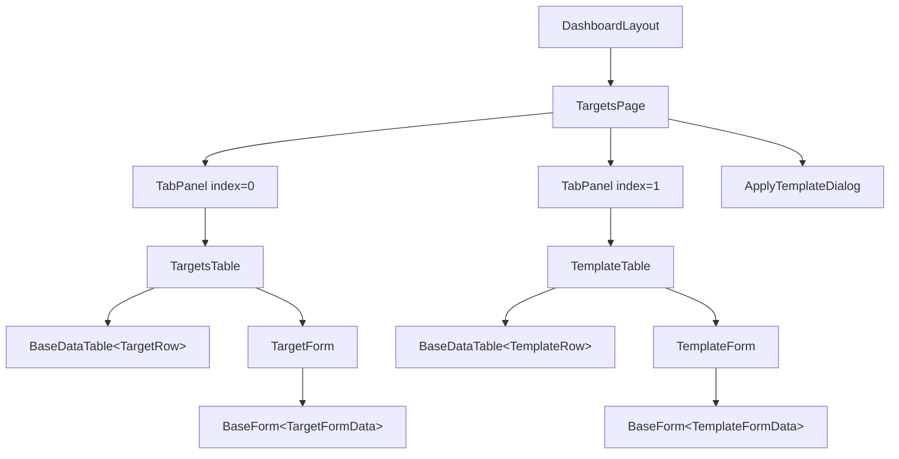
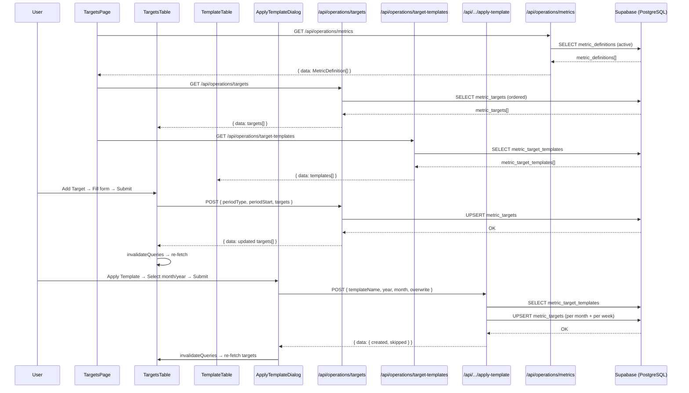

# Operations / Performance Targets

## 1. Screen Overview

| Property | Value |
|----------|-------|
| **Screen name** | Performance Targets |
| **Route / URL** | `/dashboard/operations/targets` |
| **Purpose** | Define, manage, and bulk-apply weekly and monthly business performance targets for executive reporting. Targets set here feed into the Executive Dashboard for actual-vs-target comparison. |
| **User roles** | Any authenticated user. No role-based gating beyond authentication; RLS grants all authenticated users full CRUD access. |
| **Workflow position** | Typically visited *before* the Executive Dashboard: users set up target templates, apply them to upcoming months, then review actual-vs-target on the Executive Dashboard (`/dashboard/operations/executive`). |

### Layout Description (top to bottom)

1. **Page header** — "Performance Targets" title in primary color, bold h4.
2. **Card container** — Full-width MUI Card wrapping all content.
3. **Tab bar** — Two tabs inside the card:
   - **TARGETS** (Flag icon) — Active targets grid with inline CRUD and an "Apply Template" button.
   - **TEMPLATE** (ContentCopy icon) — Template items grid with inline CRUD.
4. **Tab panel: Targets** — MUI X DataGridPro showing all `metric_targets` rows. Columns: Type, Section, Period, Metric, Target Value, Notes, Actions (edit/delete). Header buttons: "Apply Template" and "Add Target".
5. **Tab panel: Template** — MUI X DataGridPro showing all `metric_target_templates` rows. Columns: Type, Section, Metric, Target Value, Notes, Actions. Header button: "Add Template Item".
6. **Apply Template Dialog** — Modal dialog for bulk-creating targets from the template for a chosen month/year.

---

## 2. Component Architecture

### Component Tree



### TargetsPage

| Property | Detail |
|----------|--------|
| **File** | `src/app/dashboard/operations/targets/page.tsx` |
| **Directive** | `'use client'` |

**Props:** None (page component)

**Local state:**

| Variable | Type | Initial | Controls |
|----------|------|---------|----------|
| `tabValue` | `number` | `0` | Active tab index (0 = Targets, 1 = Template) |
| `applyDialogOpen` | `boolean` | `false` | Visibility of the Apply Template dialog |

**Event handlers:**

| Handler | Trigger | Action |
|---------|---------|--------|
| `handleTabChange` | Tab click | Sets `tabValue` to new tab index |
| `() => setApplyDialogOpen(true)` | "Apply Template" button click | Opens apply dialog |
| `() => setApplyDialogOpen(false)` | Dialog close / cancel | Closes apply dialog |

**Conditional rendering:**
- `TabPanel` only renders children when `value === index` (hidden otherwise via `hidden` attribute).
- Each tab panel wraps its table in `<Suspense fallback={<TableSkeleton />}>`.

---

### TargetsTable

| Property | Detail |
|----------|--------|
| **File** | `src/components/targets/targets-table.tsx` |

**Props:**

| Prop | Type | Required | Default | Description |
|------|------|----------|---------|-------------|
| `additionalHeaderButtons` | `React.ReactNode` | No | `undefined` | Extra buttons rendered in table header (used for "Apply Template") |

**Local state / hooks:**

| Variable | Source | Type | Description |
|----------|--------|------|-------------|
| `metrics` | `useMetricDefinitions()` | `MetricDefinition[]` | All active metric definitions |
| `targets` | `useQuery([TARGETS_QUERY_KEY])` | `Array<{id, metric_key, period_type, period_start, target_value, notes}>` | All target rows from API |
| `isLoading` | `useQuery` | `boolean` | Loading state for targets fetch |
| `error` | `useQuery` | `Error \| null` | Error state |
| `deleteMutation` | `useMutation` | mutation | Handles DELETE calls |
| `usedKeysForPeriod` | `useMemo` | `Map<string, Set<string>>` | Maps `"periodType|periodStart"` → set of already-used metric keys; prevents duplicate target creation |

**Derived data:**
- `rows: TargetRow[]` — Maps raw API data to display rows by joining with `metrics` to resolve `metric_label` and `section`.

**Key constants:**
- `TARGETS_QUERY_KEY = 'operations-targets'`
- `SECTION_LABELS` — Maps section enums (`FINANCIAL_HEALTH`, etc.) to human-readable labels.

---

### TemplateTable

| Property | Detail |
|----------|--------|
| **File** | `src/components/targets/template-table.tsx` |

**Props:** None

**Local state / hooks:**

| Variable | Source | Type | Description |
|----------|--------|------|-------------|
| `metrics` | `useMetricDefinitions()` | `MetricDefinition[]` | Active metric definitions |
| `templates` | `useQuery([TEMPLATES_QUERY_KEY])` | `Array<{id, template_name, metric_key, period_type, target_value, notes}>` | Template items |
| `deleteMutation` | `useMutation` | mutation | DELETE for template items |
| `usedKeys` | `useMemo` | `Map<string, Set<string>>` | Maps `periodType` → set of already-used metric keys |

**Key constants:**
- `TEMPLATES_QUERY_KEY = 'operations-target-templates'` (exported)

---

### ApplyTemplateDialog

| Property | Detail |
|----------|--------|
| **File** | `src/components/targets/apply-template-dialog.tsx` |

**Props:**

| Prop | Type | Required | Default |
|------|------|----------|---------|
| `open` | `boolean` | Yes | — |
| `onClose` | `() => void` | Yes | — |

**Local state:**

| Variable | Type | Initial | Controls |
|----------|------|---------|----------|
| `year` | `number` | `currentYear` | Selected year for template application |
| `month` | `number` | `currentMonth` | Selected month (1–12) |
| `overwrite` | `boolean` | `false` | Whether to overwrite existing targets |

**Queries & mutations:**
- `useQuery([TEMPLATES_QUERY_KEY])` — Fetches template items for preview counts.
- `applyMutation` — POSTs to `/api/operations/targets/apply-template` with `{ templateName: 'Default', year, month, overwrite }`.
- On success: invalidates `operations-targets`, shows toast with created/skipped counts, calls `onClose`.
- On error: shows error toast.

**Conditional rendering:**
- If `templateItems.length === 0`: shows warning Alert "No template entries defined."
- Otherwise: shows month/year selectors, preview section, overwrite checkbox.

---

### TargetForm

| Property | Detail |
|----------|--------|
| **File** | `src/components/forms/target-form.tsx` |

**Props:**

| Prop | Type | Required | Default |
|------|------|----------|---------|
| `initialValues` | `Partial<TargetFormData> & { id?: number }` | No | `undefined` |
| `onSuccess` | `() => void` | No | `undefined` |
| `mode` | `'create' \| 'edit'` | No | `'create'` |
| `usedKeysForPeriod` | `Map<string, Set<string>>` | No | `undefined` |

**Form library:** React Hook Form + Zod resolver

**Local state (via useForm):**
- `period_type`, `metric_key`, `period_start`, `target_value`, `notes`

**Key behaviors:**
- Changing `period_type` resets `metric_key` and `period_start`.
- In edit mode, `period_type`, `metric_key`, and `period_start` fields are disabled.
- In create mode, the metric dropdown filters out metrics already used for the same period (via `usedKeysForPeriod`).
- For MONTH: shows month/year dropdown (spanning 2020–2030).
- For WEEK: shows year + ISO week number dropdowns.
- Target value shows `$` prefix for currency metrics, `%` suffix for percent metrics.
- Edit mode with changed period/metric: DELETEs old row, then UPSERTs new one.

---

### TemplateForm

| Property | Detail |
|----------|--------|
| **File** | `src/components/forms/template-form.tsx` |

**Props:**

| Prop | Type | Required | Default |
|------|------|----------|---------|
| `initialValues` | `Partial<TemplateFormData> & { id?: number }` | No | `undefined` |
| `onSuccess` | `() => void` | No | `undefined` |
| `mode` | `'create' \| 'edit'` | No | `'create'` |
| `usedKeys` | `Map<string, Set<string>>` | No | `undefined` |

**Form library:** React Hook Form + Zod resolver

**Key behaviors:**
- Simpler than TargetForm: no period_start field (templates are period-agnostic).
- Hardcoded `template_name: 'Default'`.
- Same delete-then-upsert pattern for edits with changed period/metric.

---

### BaseDataTable

| Property | Detail |
|----------|--------|
| **File** | `src/components/tables/base-data-table.tsx` |

Generic wrapper around MUI X DataGridPro. Provides: action column (edit/delete), create button, form dialog, delete confirmation dialog, loading overlay, error alert, state persistence (localStorage), aggregation footer, and export toolbar.

---

### BaseForm

| Property | Detail |
|----------|--------|
| **File** | `src/components/forms/base-form.tsx` |

Generic form shell with scrollable content area and sticky footer (Cancel + Submit buttons).

---

### useMetricDefinitions

| Property | Detail |
|----------|--------|
| **File** | `src/lib/hooks/use-metric-definitions.ts` |

React Query hook fetching `GET /api/operations/metrics`. Returns all active `MetricDefinition` objects. Also exports:
- `getMetricKeysForPeriod(metrics, periodType)` — filters metrics by supported period type.
- `getMetricDefinition(metrics, key)` — finds a single definition by key.

---

## 3. Data Flow

### Data Lifecycle

1. **Initial load:** Page mounts → `TargetsTable` and `TemplateTable` each fire React Query fetches:
   - `GET /api/operations/metrics` → populates metric definition dropdowns and display labels.
   - `GET /api/operations/targets` → populates Targets grid.
   - `GET /api/operations/target-templates` → populates Template grid.
2. **Display transformation:** Raw API rows are joined with `metrics` to resolve `metric_label` and `section` (human-readable labels). Currency values are formatted with `$` prefix, percents with `%`.
3. **Create/Edit:** User opens form dialog → fills fields → form validated via Zod → `POST /api/operations/targets` (or `target-templates`) → React Query cache invalidated → grid refreshes.
4. **Delete:** User clicks delete icon → confirmation dialog → `DELETE /api/operations/targets` (or `target-templates`) → cache invalidated → grid refreshes.
5. **Apply Template:** User clicks "Apply Template" → selects month/year → `POST /api/operations/targets/apply-template` → bulk-creates `metric_targets` for the month + its weeks → cache invalidated → toast feedback.

### Data Flow Diagram



---

## 4. API / Server Layer

### GET /api/operations/targets

| Property | Detail |
|----------|--------|
| **File** | `src/app/api/operations/targets/route.ts` → `GET` |
| **Auth** | `requireAuth` — checks `supabase.auth.getUser()`; returns 401 if not authenticated |
| **Query params** | `periodType` (optional, `WEEK` or `MONTH`), `periodStart` (optional, `YYYY-MM-DD`) |
| **Response** | `{ data: metric_targets[] }` |
| **Errors** | 400 (invalid params), 401 (unauthorized), 500 (DB error) |

### POST /api/operations/targets

| Property | Detail |
|----------|--------|
| **File** | `src/app/api/operations/targets/route.ts` → `POST` |
| **Auth** | `requireAuth` |
| **Body** | `{ periodType: 'WEEK'\|'MONTH', periodStart: string, targets: [{ metric_key, target_value, notes? }] }` |
| **Validation** | Zod schema; percent values must be 0–100; metric_key must exist in active `metric_definitions`; WEEK periodStart must be a Monday |
| **Operation** | UPSERT on `(metric_key, period_type, period_start)` |
| **Response** | `{ data: metric_targets[] }` (targets for that period) |
| **Errors** | 400 (validation), 401, 500 |

### DELETE /api/operations/targets

| Property | Detail |
|----------|--------|
| **File** | `src/app/api/operations/targets/route.ts` → `DELETE` |
| **Auth** | `requireAuth` |
| **Body** | `{ id: number }` OR `{ metric_key, periodType, periodStart }` |
| **Response** | `{ data: { deleted: true } }` |
| **Errors** | 400, 401, 500 |

### GET /api/operations/target-templates

| Property | Detail |
|----------|--------|
| **File** | `src/app/api/operations/target-templates/route.ts` → `GET` |
| **Auth** | `requireAuth` |
| **Query params** | `templateName` (optional) |
| **Response** | `{ data: metric_target_templates[] }` |
| **Errors** | 401, 500 |

### POST /api/operations/target-templates

| Property | Detail |
|----------|--------|
| **File** | `src/app/api/operations/target-templates/route.ts` → `POST` |
| **Auth** | `requireAuth` |
| **Body** | `{ templateName?: string, metric_key, period_type, target_value, notes? }` |
| **Validation** | Zod; metric must be active; percent 0–100 |
| **Operation** | UPSERT on `(template_name, metric_key, period_type)` |
| **Response** | `{ data: metric_target_templates[] }` |
| **Errors** | 400, 401, 500 |

### DELETE /api/operations/target-templates

| Property | Detail |
|----------|--------|
| **File** | `src/app/api/operations/target-templates/route.ts` → `DELETE` |
| **Auth** | `requireAuth` |
| **Body** | `{ id: number }` |
| **Response** | `{ data: { deleted: true } }` |
| **Errors** | 400, 401, 500 |

### POST /api/operations/targets/apply-template

| Property | Detail |
|----------|--------|
| **File** | `src/app/api/operations/targets/apply-template/route.ts` → `POST` |
| **Auth** | `requireAuth` |
| **Body** | `{ templateName?: string (default 'Default'), year: number (2020–2040), month: number (1–12), overwrite?: boolean (default false) }` |
| **Logic** | Reads template items → for monthly items, creates/upserts targets for `YYYY-MM-01`; for weekly items, creates/upserts targets for each ISO week whose Monday falls in that month |
| **Response** | `{ data: { created, skipped, errors?, monthStart, weekStarts, monthlyCount, weeklyCount } }` |
| **Errors** | 400 (validation), 401, 404 (empty/missing template), 500 |

### GET /api/operations/metrics

| Property | Detail |
|----------|--------|
| **File** | `src/app/api/operations/metrics/route.ts` → `GET` |
| **Auth** | `requireAuth` |
| **Response** | `{ data: MetricDefinition[] }` (active metrics, ordered by `display_order`) |
| **Errors** | 401, 500 |

---

## 5. Database Layer

### Tables

#### metric_targets

| Column | Type | Nullable | Default | Constraints |
|--------|------|----------|---------|-------------|
| `id` | `bigint` | NO | Identity | PK |
| `metric_key` | `text` | NO | — | FK → `metric_definitions(metric_key)` |
| `period_type` | `text` | NO | — | CHECK `IN ('WEEK', 'MONTH')` |
| `period_start` | `date` | NO | — | — |
| `target_value` | `numeric` | NO | — | — |
| `notes` | `text` | YES | — | — |
| `created_at` | `timestamptz` | YES | `now()` | — |
| `updated_at` | `timestamptz` | YES | `now()` | — |

**Constraints:**
- `uq_metric_targets_key_period` — UNIQUE on `(metric_key, period_type, period_start)`

**Indexes:**
- `idx_metric_targets_period` on `(period_type, period_start)`
- `idx_metric_targets_metric_key` on `(metric_key)`

**RLS:** Enabled. Authenticated users have full access; service_role bypasses.

**Migration:** `supabase/migrations/20260316000000_create_metric_targets_table.sql`

---

#### metric_definitions

| Column | Type | Nullable | Default | Constraints |
|--------|------|----------|---------|-------------|
| `id` | `bigserial` | NO | Identity | PK |
| `metric_key` | `text` | NO | — | UNIQUE |
| `label` | `text` | NO | — | — |
| `value_type` | `text` | NO | — | CHECK `IN ('currency', 'count', 'percent', 'ratio')` |
| `period_types` | `text[]` | NO | `'{}'` | — |
| `display_order` | `int` | NO | `0` | — |
| `active_flag` | `boolean` | NO | `true` | — |
| `dashboard_section` | `text` | YES | — | CHECK `IN ('FINANCIAL_HEALTH', 'MARKETING_ENGINE', 'SALES_PERFORMANCE', 'DELIVERY_MODEL_STRENGTH')` |
| `visual_type` | `text` | YES | — | CHECK `IN ('GAUGE', 'SPARK', 'STAR')` |
| `show_on_executive_dashboard` | `boolean` | NO | `false` | — |
| `target_direction` | `text` | NO | `'higher_is_better'` | CHECK `IN ('higher_is_better', 'lower_is_better')` |
| `created_at` | `timestamptz` | YES | `now()` | — |
| `updated_at` | `timestamptz` | YES | `now()` | — |

**Indexes:**
- `idx_metric_definitions_active` on `(active_flag)` WHERE `active_flag = true`
- `idx_metric_definitions_dashboard` on `(dashboard_section, display_order)` WHERE `show_on_executive_dashboard = true AND active_flag = true`

**RLS:** Enabled. Same as `metric_targets`.

**Migrations:**
- `20260317000000_create_metric_definitions_table.sql`
- `20260320000000_add_executive_dashboard_columns_to_metric_definitions.sql`
- `20260321000000_add_program_margin_metric.sql`
- `20260322000000_add_membership_revenue_pct_metric.sql`
- `20260323000000_rename_section_and_add_delivery_metrics.sql`
- `20260324000000_add_target_direction_to_metric_definitions.sql`

---

#### metric_target_templates

| Column | Type | Nullable | Default | Constraints |
|--------|------|----------|---------|-------------|
| `id` | `bigint` | NO | Identity | PK |
| `template_name` | `text` | NO | `'Default'` | — |
| `metric_key` | `text` | NO | — | FK → `metric_definitions(metric_key)` |
| `period_type` | `text` | NO | — | CHECK `IN ('WEEK', 'MONTH')` |
| `target_value` | `numeric` | NO | — | — |
| `notes` | `text` | YES | — | — |
| `created_at` | `timestamptz` | YES | `now()` | — |
| `updated_at` | `timestamptz` | YES | `now()` | — |

**Constraints:**
- `uq_template_metric` — UNIQUE on `(template_name, metric_key, period_type)`

**Indexes:**
- `idx_metric_target_templates_name` on `(template_name)`

**RLS:** Enabled. Same as above.

**Migration:** `supabase/migrations/20260319000000_create_metric_target_templates_table.sql`

---

### Queries

#### Fetch all targets (TargetsTable)

```
supabase.from('metric_targets').select('*')
  .order('period_type').order('period_start', { ascending: false }).order('metric_key')
```
- **Type:** Read
- **File:** `src/app/api/operations/targets/route.ts` → `GET`
- **Index usage:** `idx_metric_targets_period` supports the ordering. Full table scan since no WHERE clause (filtered client-side or optionally by query params).
- **Performance:** Acceptable for low-to-moderate row counts (< 10k). No pagination at the DB level; all rows returned.

#### Fetch targets by period (optional filter)

```
.eq('period_type', periodType).eq('period_start', periodStart)
```
- **Index usage:** `idx_metric_targets_period` directly supports this filter.

#### Upsert target

```
supabase.from('metric_targets').upsert({ ... }, { onConflict: 'metric_key,period_type,period_start' })
```
- **Type:** Write (upsert)
- **File:** `src/app/api/operations/targets/route.ts` → `POST`
- **Performance:** Single-row upsert, efficient. Unique constraint used for conflict resolution.

#### Delete target by ID

```
supabase.from('metric_targets').delete().eq('id', id)
```
- **Type:** Write (delete)
- **File:** `src/app/api/operations/targets/route.ts` → `DELETE`
- **Performance:** PK lookup, O(1).

#### Fetch metric definitions (active)

```
supabase.from('metric_definitions').select('...').eq('active_flag', true)
  .order('display_order').order('metric_key')
```
- **Type:** Read
- **File:** `src/app/api/operations/metrics/route.ts` → `GET`
- **Index usage:** `idx_metric_definitions_active` partial index.

#### Fetch all template items

```
supabase.from('metric_target_templates').select('*').order('period_type').order('metric_key')
```
- **Type:** Read
- **File:** `src/app/api/operations/target-templates/route.ts` → `GET`

#### Apply template — check existing (per metric/period)

```
supabase.from('metric_targets').select('id')
  .eq('metric_key', ...).eq('period_type', ...).eq('period_start', ...).maybeSingle()
```
- **Type:** Read
- **File:** `src/app/api/operations/targets/apply-template/route.ts` → `POST`
- **Performance note:** N+1 pattern — one query per template item per week. For a template with 10 weekly metrics and 5 weeks, this is 50 individual queries. See Section 16 for optimization opportunity.

---

## 6. Business Rules & Logic

### Rules

| Rule | Enforcement | Violation behavior |
|------|-------------|-------------------|
| Target values for `percent` metrics must be 0–100 | API validation (POST targets, POST templates) + DB-level (if added) | 400 error: "Percent must be between 0 and 100" |
| Weekly target `periodStart` must be a Monday | API validation (POST targets) | 400 error: "For weekly targets, periodStart must be the Monday of the week." |
| Monthly target `periodStart` is normalized to `YYYY-MM-01` | API (normalizeMonthStart) | Automatic normalization, not an error |
| One target per `(metric_key, period_type, period_start)` | DB unique constraint + UPSERT | Silently overwrites on conflict |
| One template item per `(template_name, metric_key, period_type)` | DB unique constraint + UPSERT | Silently overwrites on conflict |
| Metric must be active to set a target | API validation (checks `active_flag = true`) | 400 error: "Unknown or inactive metric" (templates) or "Unknown metric" (targets) |
| Apply template without overwrite skips existing targets | API logic (apply-template) | Skipped count returned in response |
| Template name defaults to `'Default'` | API default + UI hardcoded | N/A |

### Calculations & Derived Values

| Display value | Formula / Logic |
|---------------|-----------------|
| Period display (Monthly) | `toLocaleDateString('en-US', { month: 'long', year: 'numeric' })` |
| Period display (Weekly) | `"Week {isoWeekNumber}, {isoWeekYear}"` using `date-fns` |
| Target value formatting | Currency: `Intl.NumberFormat('en-US', { style: 'currency' })`, Percent: `{value}%`, Count/Ratio: raw number |
| Available metrics (create mode) | All active metrics for the selected `period_type`, minus those already assigned for the same period |
| Weeks in month (apply template) | All ISO weeks whose Monday falls within the calendar month |

### Feature Flags

N/A — No feature flags affect this screen.

---

## 7. Form & Validation Details

### Target Form Fields

| Field | Input type | Bound variable | Validation | Client | Server | Error message |
|-------|-----------|----------------|------------|--------|--------|---------------|
| Period type | Select | `period_type` | Required, enum `['WEEK', 'MONTH']` | Zod | Zod | "Required" |
| Metric | Select | `metric_key` | Required, `min(1)` | Zod | Zod + active check | "Select a metric" / "Unknown metric" |
| Period (Month) | Select | `period_start` | Required, `min(1)`, valid date | Zod | Zod + normalize | "Select period" |
| Period (Week) | Year + Week selects | `period_start` | Required, valid date, must be Monday | Zod | Zod + Monday check | "Invalid date" / "must be Monday" |
| Target value | Number input | `target_value` | Required, `min(0)`, percent ≤ 100 | Zod (`min(0)`) + `inputProps.max` | validateTargetValue | Zod message / "Percent must be 0–100" |
| Notes | Multiline text | `notes` | Optional, nullable | Zod | Zod | — |

### Template Form Fields

| Field | Input type | Bound variable | Validation | Client | Server | Error message |
|-------|-----------|----------------|------------|--------|--------|---------------|
| Period type | Select | `period_type` | Required, enum `['WEEK', 'MONTH']` | Zod | Zod | "Required" |
| Metric | Select | `metric_key` | Required, `min(1)` | Zod | Zod + active check | "Select a metric" / "Unknown or inactive metric" |
| Target value | Number input | `target_value` | Required, `min(0)`, percent ≤ 100 | Zod + `inputProps` | Zod + metricDef check | "Percent must be 0–100" |
| Notes | Multiline text | `notes` | Optional, nullable | Zod | Zod | — |

### Form Submission Flow

**Target Form (create):**
1. User fills fields → clicks "Add"
2. `handleSubmit` triggers Zod validation
3. On pass: `POST /api/operations/targets` with `{ periodType, periodStart, targets: [{metric_key, target_value, notes}] }`
4. API validates → upserts → returns updated targets
5. `queryClient.invalidateQueries(['operations-targets'])` → grid refreshes
6. `onSuccess()` → dialog closes

**Target Form (edit):**
1. Same as create, but if `period_type`, `period_start`, or `metric_key` changed from initial values:
   - First `DELETE /api/operations/targets` with `{ id: initialValues.id }`
   - Then `POST` the new values (upsert)
2. This handles the case where the unique key changes.

**Dirty state tracking:** Not explicitly implemented. No unsaved changes warning.

---

## 8. State Management

### Local Component State

| Component | Variable | Type | Description |
|-----------|----------|------|-------------|
| TargetsPage | `tabValue` | `number` | Active tab |
| TargetsPage | `applyDialogOpen` | `boolean` | Apply dialog visibility |
| BaseDataTable | `formOpen` | `boolean` | Form dialog open |
| BaseDataTable | `editingRow` | `T \| undefined` | Row being edited |
| BaseDataTable | `formMode` | `'create' \| 'edit'` | Form mode |
| BaseDataTable | `deleteModalOpen` | `boolean` | Delete confirmation open |
| BaseDataTable | `deletingId` | `GridRowId \| null` | Row pending deletion |
| ApplyTemplateDialog | `year`, `month`, `overwrite` | `number`, `number`, `boolean` | Form state |

### Shared / Cached State (React Query)

| Query key | Data | Stale behavior |
|-----------|------|----------------|
| `['metric-definitions']` | `MetricDefinition[]` | Default stale time; refetched on window focus |
| `['operations-targets']` | Target rows | Invalidated on create/edit/delete/apply |
| `['operations-target-templates']` | Template rows | Invalidated on create/edit/delete |

### URL State

None — no query params or dynamic route segments used on this page.

### Persisted State

- `BaseDataTable` supports grid state persistence via `persistStateKey` prop (localStorage), but neither `TargetsTable` nor `TemplateTable` pass this prop, so **no grid state is persisted** on this screen.

---

## 9. Navigation & Routing

### Inbound Navigation

| From | Trigger |
|------|---------|
| Sidebar → Operations → "Performance Targets" | Menu click |
| Direct URL `/dashboard/operations/targets` | Browser navigation / bookmark |

### Outbound Navigation

This screen does not programmatically navigate elsewhere. Users navigate away via the sidebar.

### Route Guards

1. **Middleware** (`middleware.ts`): Redirects unauthenticated users from `/dashboard/*` to `/login`.
2. **Dashboard layout** (`src/app/dashboard/layout.tsx`): Server component checks `supabase.auth.getUser()` → redirects to `/login` if no user.
3. **API routes**: Each handler calls `requireAuth()` → returns 401 if no authenticated user.
4. **No role-based guard** — any authenticated user can access.

### Deep Linking

The URL `/dashboard/operations/targets` is directly shareable. Tab state is **not** reflected in the URL (always opens on Targets tab).

---

## 10. Error Handling & Edge Cases

### Error States

| Trigger | UI treatment | Recovery |
|---------|-------------|----------|
| API fetch failure (targets/templates/metrics) | `<Alert severity="error">` above grid | Automatic retry on window focus (React Query default) |
| Form submission error | Exception thrown from `onSubmit` → React Hook Form catches → error displayed in console. No user-visible inline error for API failures in forms. | User can retry submission |
| Apply template failure | `toast.error("Failed to apply template: ...")` | Dismiss toast, retry |
| Apply template — empty template | `<Alert severity="warning">` inside dialog: "No template entries defined." | Add entries in Templates tab first |

### Empty States

| Scenario | Display |
|----------|---------|
| No targets | MUI DataGridPro shows "No rows" overlay |
| No template items | MUI DataGridPro "No rows" overlay |
| No metrics loaded yet | Metric dropdown disabled + loading state |

### Loading States

| Scenario | Display |
|----------|---------|
| Initial table load | `<Suspense>` shows `<TableSkeleton>` (header placeholder + large rectangular skeleton) |
| Data fetching | DataGridPro `loading` prop → built-in loading overlay + custom overlay with `<CircularProgress>` and "Loading data..." text |
| Form submitting | Submit button shows `<CircularProgress>` spinner, button disabled |
| Apply template in progress | "Applying..." button text with spinner icon |

### Timeout / Offline

No explicit timeout or offline handling. Browser fetch defaults apply.

---

## 11. Accessibility

### ARIA Roles & Labels

| Element | ARIA attribute | Value |
|---------|---------------|-------|
| Tab bar | `aria-label` | `"performance targets tabs"` |
| Each Tab | `id`, `aria-controls` | `targets-tab-{index}`, `targets-tabpanel-{index}` |
| Tab panels | `role`, `id`, `aria-labelledby` | `"tabpanel"`, matching IDs |
| DataGridPro | Built-in | MUI provides ARIA grid roles |
| Dialog (Apply Template) | Built-in | MUI Dialog provides `role="dialog"` |
| Close button (dialog) | `<IconButton>` | No explicit `aria-label` (relies on icon) |

### Keyboard Navigation

- Tab key moves focus through: tab bar → tab panels → grid → buttons.
- Arrow keys navigate between tabs in the tab bar.
- DataGridPro supports full keyboard navigation (arrow keys, Enter to edit, Escape to cancel).
- Dialog traps focus when open (MUI built-in).

### Gaps

- Close buttons on dialogs lack explicit `aria-label` attributes.
- No skip-to-content link.

---

## 12. Performance Considerations

### Potential Concerns

| Concern | Current status | Recommendation |
|---------|---------------|----------------|
| All targets loaded at once (no server pagination) | Low row count expected (< 500) | Acceptable now; add server pagination if dataset grows |
| N+1 queries in apply-template | Each metric × each week = individual DB query | Batch into bulk upsert (see Section 16) |
| `usedKeysForPeriod` recomputed on every render | Uses `useMemo` with `[targets]` dependency | Correct |
| `formatPeriodDisplay` / `formatTargetValue` in render cells | Creates `Intl.NumberFormat` per cell | Minor; could memoize formatter instances |
| No virtualization | `autoHeight` mode renders all rows in DOM | For > 100 rows, consider fixed height with virtual scrolling |

### Caching

| Layer | Strategy |
|-------|----------|
| Client (React Query) | Default `staleTime` (~0), `gcTime` (~5 min). Data refetched on window focus. |
| Server (API routes) | No caching headers. No CDN caching. |
| Database | PostgreSQL internal caching only. |

### Bundle Impact

Key dependencies: `@mui/x-data-grid-pro`, `@tanstack/react-query`, `date-fns`, `zod`, `react-hook-form`, `sonner`. All are shared across the application.

---

## 13. Third-Party Integrations

| Service | Purpose | Package | Config (env vars) |
|---------|---------|---------|-------------------|
| Supabase | Database (PostgreSQL), Auth, RLS | `@supabase/ssr`, `@supabase/supabase-js` | `NEXT_PUBLIC_SUPABASE_URL`, `NEXT_PUBLIC_SUPABASE_ANON_KEY` |
| Sonner | Toast notifications | `sonner` | None |

**Failure modes:**
- Supabase unreachable → API returns 500 → grid shows error alert.
- Auth token expired → `requireAuth` returns 401 → user sees "Unauthorized" (no automatic redirect from API; React Query will surface the error).

---

## 14. Security Considerations

### Authentication & Authorization

| Check | Where | Notes |
|-------|-------|-------|
| Authenticated user required | Middleware (redirect), Layout (redirect), API routes (`requireAuth`) | Triple-layered |
| Role-based access | **Not implemented** | All authenticated users have full CRUD. Consider restricting write access to admin/operations roles if needed. |
| RLS (Row Level Security) | Database | `USING (true)` for authenticated — full table access. No row-level filtering by user. |

### Input Sanitization

- All API inputs validated via Zod schemas (type-safe parsing).
- No raw SQL — Supabase query builder used exclusively (parameterized queries, immune to SQL injection).
- No user-generated HTML rendered; React escapes by default (XSS safe).

### CSRF Protection

- Next.js API routes are same-origin by default. Supabase auth uses httpOnly cookies managed by `@supabase/ssr`.
- No explicit CSRF tokens, but SameSite cookie policy provides protection.

### Sensitive Data

- No PII, PHI, or HIPAA-relevant data on this screen (business metrics only).
- Supabase credentials are public anon keys (designed to be exposed); actual security is via RLS and auth.

---

## 15. Testing Coverage

### Existing Tests

No test files exist for this screen. Searched for `*.test.*` and `*.spec.*` files referencing targets, templates, metrics, or the page route — **none found**.

### Gaps

- No unit tests for value formatting functions (`formatPeriodDisplay`, `formatTargetValue`).
- No unit tests for date utility functions (`normalizeMonthStart`, `getMonday`, `weekToPeriodStart`, `getWeeksInMonth`).
- No integration tests for API routes.
- No component tests for form validation behavior.
- No E2E tests for the CRUD workflow.

### Suggested Test Cases

**Unit tests:**

| Test | File/Function |
|------|---------------|
| `formatPeriodDisplay` returns "March 2026" for MONTH, `"Week 12, 2026"` for WEEK | `targets-table.tsx` |
| `formatTargetValue` returns `$1,000` for currency, `50%` for percent | `targets-table.tsx` |
| `normalizeMonthStart` normalizes any date to first-of-month | `targets/route.ts` |
| `getWeeksInMonth` returns correct Monday dates for edge months (Jan, Dec, Feb leap year) | `apply-template/route.ts` |
| `weekToPeriodStart` round-trips with `periodStartToWeek` | `target-form.tsx` |
| Zod schema `targetFormSchema` rejects invalid input | `target-form.tsx` |
| Zod schema `templateFormSchema` rejects invalid input | `template-form.tsx` |

**Integration tests:**

| Test | Route |
|------|-------|
| GET returns all targets | `/api/operations/targets` |
| POST creates a new monthly target | `/api/operations/targets` |
| POST rejects weekly target with non-Monday periodStart | `/api/operations/targets` |
| POST rejects percent > 100 | `/api/operations/targets` |
| DELETE by id removes target | `/api/operations/targets` |
| Apply template creates targets for month + weeks | `/api/operations/targets/apply-template` |
| Apply template with `overwrite: false` skips existing | `/api/operations/targets/apply-template` |
| 401 returned for unauthenticated requests | All routes |

**E2E tests:**

| Test |
|------|
| Navigate to Performance Targets → verify grid loads with data |
| Add a monthly target → verify it appears in grid |
| Edit a target → verify value updates |
| Delete a target → verify removal from grid |
| Switch to Template tab → add template item → verify it appears |
| Apply template → verify targets created and toast shown |
| Apply template with overwrite unchecked → verify skip behavior |

---

## 16. Code Review Findings

| Severity | File | Issue | Suggested Fix |
|----------|------|-------|---------------|
| **High** | `src/components/forms/target-form.tsx` (L121–156) | **No user-visible error on form submission failure.** If `POST` returns non-OK, `throw new Error(...)` is called but React Hook Form's `handleSubmit` wraps it — the error is caught internally or logged to console, but no toast or inline error is shown to the user. | Add `try/catch` in `onSubmit` and call `toast.error()` on failure, similar to `ApplyTemplateDialog`. |
| **High** | `src/components/forms/template-form.tsx` (L75–105) | Same issue as above — no user-visible error feedback on submission failure. | Same fix: wrap in try/catch, show toast. |
| **High** | `src/app/api/operations/targets/apply-template/route.ts` (L128–198) | **N+1 query pattern.** When `overwrite: false`, each template item × each period issues a separate `SELECT ... .maybeSingle()` check. For 10 metrics × 5 weeks = 50 DB queries. | Batch the existence check: query all existing targets for the month in one `SELECT`, then filter in code. Batch the upserts into a single call if possible. |
| **Medium** | `src/components/targets/targets-table.tsx` (L255) | `onEdit={() => {}}` passes a no-op. `BaseDataTable` checks `onEdit` truthiness to render the edit action button, so edit icons appear but the `onEdit` callback does nothing — actual edit behavior is driven by `renderForm`. This is confusing but functional. | Consider making `onEdit` optional in `BaseDataTable` and using a `boolean` flag for whether to show the edit action. |
| **Medium** | `src/components/forms/target-form.tsx` (L117) | **Hardcoded year range `[2020...2030]`** will become a UX problem after 2030. | Derive dynamically from `currentYear - 2` to `currentYear + 5`. |
| **Medium** | `src/app/api/operations/targets/route.ts` (L204–223) | **Sequential upserts in a loop.** Each target in the `targets[]` array is upserted one at a time. For bulk operations, this is slow. | Use a single bulk upsert: `supabase.from('metric_targets').upsert(allRows, { onConflict: ... })`. |
| **Medium** | `src/components/targets/targets-table.tsx`, `template-table.tsx` | **Duplicated `SECTION_LABELS` and `formatTargetValue`/`formatTemplateValue`** logic. Identical mapping and formatting repeated in both files. | Extract to a shared utility (e.g., `src/lib/utils/metric-display.ts`). |
| **Low** | `src/app/api/operations/targets/route.ts` (L117) | `getMonday(localD).toISOString().slice(0, 10)` — `toISOString()` converts to UTC which can shift the date across a day boundary depending on timezone. | Use local date formatting: `${d.getFullYear()}-${String(d.getMonth()+1).padStart(2,'0')}-${String(d.getDate()).padStart(2,'0')}` as done elsewhere in the same file. |
| **Low** | `src/components/targets/apply-template-dialog.tsx` (L75) | `templateName` is hardcoded to `'Default'`. The `metric_target_templates` table supports multiple named templates, but the UI only uses `'Default'`. | Future enhancement: add template name selector if multiple templates are needed. |
| **Low** | `src/types/database.types.ts` | **Generated Supabase types not updated** — `metric_targets`, `metric_definitions`, and `metric_target_templates` are missing from the generated types file. | Run `supabase gen types typescript` to regenerate. |
| **Low** | `src/app/api/operations/metrics/route.ts` (L27) | `target_direction` column not included in the `select()` call, but the TypeScript type `MetricDefinition` includes it. The `select('*')` approach in other routes would include it, but this explicit `select()` omits it. | Add `target_direction` to the select list. |

---

## 17. Tech Debt & Improvement Opportunities

### Refactoring Opportunities

1. **Extract shared formatting utilities.** `SECTION_LABELS`, `formatTargetValue`/`formatTemplateValue`, and `PeriodType` display logic are duplicated across `targets-table.tsx` and `template-table.tsx`. Move to `src/lib/utils/metric-display.ts`.

2. **Extract `requireAuth` middleware.** Each API route defines its own `requireAuth` function with identical logic. There is already a TODO comment in the targets route acknowledging this. Extract to `src/lib/api/auth.ts`.

3. **Batch database operations.** The apply-template endpoint performs O(N×W) individual queries. Refactor to batch existence checks and upserts.

4. **Add user-visible error handling to forms.** Both `TargetForm` and `TemplateForm` silently fail on API errors. Add toast notifications.

5. **Regenerate Supabase types.** The `database.types.ts` file doesn't include the target-related tables, losing type safety in API routes.

### Missing Abstractions

- **Target service layer**: Business logic (validation, normalization, template application) lives in API route handlers. Consider extracting to a `src/lib/services/targets.ts` for reuse and testability.
- **Form error feedback pattern**: Other parts of the app use `sonner` toasts for errors, but the target forms don't follow this pattern.

### Deprecated Patterns

None identified. Dependencies are current.

### Scalability

- If the number of metrics or targets grows significantly, add server-side pagination to the GET endpoints and configure DataGridPro server-side mode.
- URL state for active tab (e.g., `?tab=template`) would improve deep linking.

---

## 18. End-User Documentation Draft

### Performance Targets

Set and manage your weekly and monthly business performance targets.

---

### What This Page Is For

The Performance Targets page lets you define numeric goals for key business metrics — like collections, leads, close rate, or cost per lead — broken down by week or month. These targets feed into the Executive Dashboard, where you can compare actual results against your goals.

You can also save a reusable **template** of target values and apply it to any month with one click, so you don't have to re-enter the same numbers each period.

---

### Step-by-Step Instructions

#### Setting Individual Targets

1. On the **TARGETS** tab, click **Add Target**.
2. Select a **Period Type**: Monthly or Weekly.
3. Choose the **Metric** you want to set a target for (e.g., "Collections", "Leads").
4. Select the **Period**: for monthly, choose the month; for weekly, choose the year and week number.
5. Enter your **Target Value**. Currency metrics show a `$` prefix; percentage metrics show a `%` suffix.
6. Optionally add **Notes** (e.g., "Adjusted for holiday week").
7. Click **Add**.

#### Editing a Target

1. Find the target in the grid and click the **pencil icon** in the Actions column.
2. Modify the target value or notes.
3. Click **Update**.

#### Deleting a Target

1. Click the **trash icon** in the Actions column.
2. Confirm deletion in the popup.

#### Creating a Template

1. Switch to the **TEMPLATE** tab.
2. Click **Add Template Item**.
3. Select the **Period Type** and **Metric**.
4. Enter the **Target Value** — this is the baseline value that will be applied each time you use the template.
5. Optionally add **Notes**.
6. Click **Add**.

#### Applying a Template to a Month

1. On the **TARGETS** tab, click **Apply Template**.
2. Choose the **Month** and **Year**.
3. Review the preview showing how many monthly and weekly targets will be created.
4. Optionally check **Overwrite existing targets** if you want to replace targets that already exist for this period.
5. Click **Apply Template**.
6. A confirmation message will show how many targets were created and how many were skipped.

---

### Field Descriptions

| Field | Description |
|-------|-------------|
| **Period Type** | Whether this target covers a full calendar month or a single ISO week (Monday–Sunday). |
| **Metric** | The business metric being targeted (e.g., Collections, Leads, Close Rate). Only metrics configured for the chosen period type appear. |
| **Period** | The specific month or week the target applies to. Monthly targets use the first day of the month; weekly targets use the Monday of that week. |
| **Target Value** | The numeric goal. Format depends on the metric type: dollar amount for revenue metrics, percentage for rate metrics, whole number for counts. |
| **Notes** | Optional free-text notes to provide context for this target (e.g., "Q1 goal", "Reduced for holiday"). |
| **Section** | The dashboard section this metric belongs to (e.g., Financial Health, Marketing Engine). Set automatically based on the metric. |

---

### Tips & Notes

- **Templates save time.** If your targets are similar month to month, set up a template once and apply it each period.
- **Overwrite with care.** The "Overwrite existing targets" option in the Apply Template dialog will replace any targets you've already set for that month. Leave it unchecked to only fill in missing targets.
- **Weekly targets from templates** are created for each ISO week whose Monday falls within the selected month (typically 4–5 weeks).
- You can use the **filter and sort** features in the data grid to find specific targets quickly.
- **Export**: On the Targets tab, use the toolbar to export data to CSV.

---

### FAQ

**Q: Why can't I see a metric in the dropdown?**
A: Metrics are filtered by period type. Some metrics are only available for Monthly targets. Switch the period type to see all available options. Also, in create mode, metrics already assigned for the same period are hidden to prevent duplicates.

**Q: Can I have different targets for the same metric in different weeks?**
A: Yes. Each week is a separate target. You can set different values for Week 12 and Week 13 of the same metric.

**Q: What happens if I apply the template twice for the same month?**
A: If "Overwrite existing targets" is unchecked, existing targets are skipped — nothing is lost. If overwrite is checked, existing values are replaced with the template values.

**Q: Can I create multiple templates?**
A: The database supports multiple named templates, but the current UI only uses a template named "Default". All template items you add go into this single template.

**Q: How do these targets appear on the Executive Dashboard?**
A: The Executive Dashboard reads targets for the current period and compares them against actual values calculated from your program data. Metrics with targets show gauge or trend visuals indicating progress toward the goal.

---

### Troubleshooting

| Problem | Solution |
|---------|----------|
| "Unauthorized" error when loading the page | Your session may have expired. Log out and log back in. |
| Target not appearing after creation | Check that you're looking at the correct tab (Targets, not Template). Try refreshing the page. |
| "Apply Template" button does nothing | Ensure the Template tab has at least one entry. The dialog shows a warning if the template is empty. |
| Grid shows "No rows" | No targets have been created yet. Click "Add Target" or use "Apply Template" to populate. |
| Wrong target value after applying template | Check the template values on the Template tab. If overwrite was checked, the template values replace any manual edits. |
