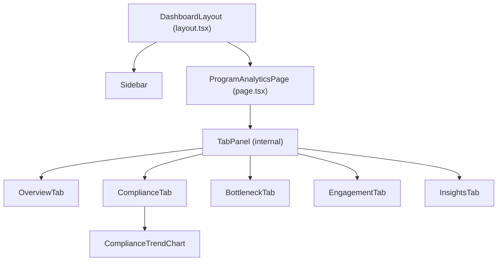
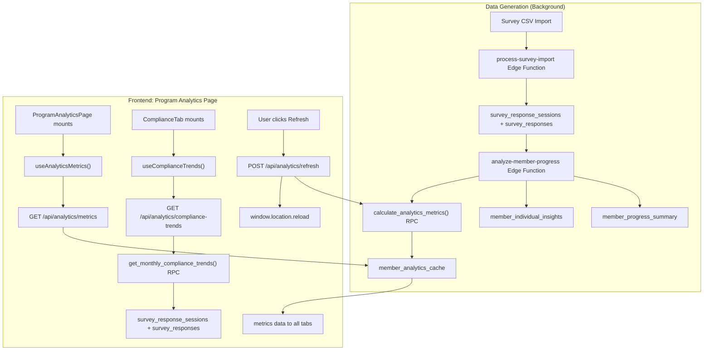

# Operations — Program Analytics

> **Comprehensive technical and end-user documentation for the Program Analytics screen.**

---

## 1. SCREEN OVERVIEW

| Attribute | Value |
|-----------|-------|
| **Screen Name** | Program Analytics |
| **Route / URL** | `/dashboard/program-analytics` |
| **Navigation Section** | Operations (sidebar collapsible group) |
| **Purpose** | Aggregated, program-level analytics dashboard showing compliance patterns, health vitals, bottleneck surveys, engagement trends, and statistical outcome insights across all members |

### User Roles & Access

- **Authentication:** Requires an active Supabase session. Middleware redirects unauthenticated users to `/login`.
- **Permission gating:** The sidebar filters navigation items through `useUserPermissions()`. A non-admin user must have `/dashboard/program-analytics` in their `user_menu_permissions` rows to see and access this screen. Admin users (`is_admin = true`) have wildcard access (`*`).
- **No additional role check** inside the page component or API routes beyond session validation — any authenticated user who can navigate here can view all analytics data.

### Workflow Context

| Direction | Screen | Relationship |
|-----------|--------|-------------|
| **Before** | Coordinator dashboard, Report Card | Coordinators track individual members before reviewing aggregate analytics |
| **Before** | Survey data imports | Analytics are populated after survey responses are imported and the `analyze-member-progress` edge function runs |
| **After** | Executive Dashboard (`/dashboard/operations/executive`) | Executives review high-level KPIs that are informed by the same underlying data |
| **After** | Individual member detail views | Users may drill down to specific members after identifying at-risk patterns here |

### Layout Description (Top to Bottom)

1. **Page header** — "Program Analytics" title (`h4`, bold, primary color)
2. **Tab bar** — Five horizontal tabs with icons:
   - Overview | Compliance | Bottlenecks | Engagement | Insights
3. **Active tab content panel** — Only the selected tab's content renders (lazy via `hidden` + conditional rendering)

Each tab contains a distinct card-based layout described in detail under their respective component sections below.

---

## 2. COMPONENT ARCHITECTURE

### Component Tree



---

### ProgramAnalyticsPage

| Attribute | Detail |
|-----------|--------|
| **File** | `src/app/dashboard/program-analytics/page.tsx` |
| **Type** | Client component (`'use client'`) — default export |

#### Props

None (page component).

#### Local State

| Variable | Type | Initial | Controls |
|----------|------|---------|----------|
| `tabValue` | `number` | `0` | Which tab is active (0–4) |

#### Hooks / Data

| Hook | Return Values Used | Source |
|------|-------------------|--------|
| `useAnalyticsMetrics()` | `data` (aliased `metricsResponse`), `isLoading`, `error` | `@/lib/hooks/use-analytics-metrics` |

#### Event Handlers

| Handler | Trigger | Action |
|---------|---------|--------|
| `handleTabChange` | `<Tabs onChange>` | Sets `tabValue` to the new tab index |

#### Conditional Rendering

| Condition | Renders |
|-----------|---------|
| `isLoading` | Centered `CircularProgress` spinner (full viewport height) |
| `error` | Red `Alert` with error message |
| Default | Header + Tabs + active TabPanel |

---

### TabPanel (Internal Helper)

| Attribute | Detail |
|-----------|--------|
| **File** | `src/app/dashboard/program-analytics/page.tsx` (lines 13–33) |
| **Type** | Internal function component |

#### Props

| Prop | Type | Required | Description |
|------|------|----------|-------------|
| `children` | `React.ReactNode` | Optional | Tab content |
| `index` | `number` | Yes | Tab index this panel corresponds to |
| `value` | `number` | Yes | Currently active tab index |

Renders children only when `value === index`; uses `hidden` attribute and ARIA roles.

---

### OverviewTab

| Attribute | Detail |
|-----------|--------|
| **File** | `src/components/program-analytics/OverviewTab.tsx` |
| **Type** | Client component — default export |

#### Props

| Prop | Type | Required | Default |
|------|------|----------|---------|
| `metrics` | `any` | Yes | — |

#### Local State

None.

#### Key Logic

- Parses JSONB fields: `health_vitals_by_tier`, `avg_compliance_by_category`, `completion_statistics`
- Calculates average health vitals (energy, mood, motivation, wellbeing) across all tiers (low/medium/high) using median values
- Extracts compliance rates by category (nutrition, exercise, supplements, meditation)
- Counts critical compliance areas (< 50%)

#### Conditional Rendering

| Condition | Renders |
|-----------|---------|
| `!metrics` | Info alert "No analytics data available" |
| `criticalAreas > 0` | Red alert banner warning of compliance areas below 50% |
| `criticalAreas === 0` | Green alert banner "Program Health: Strong Performance" |

#### Layout

- **Row 1:** 3 summary cards (Programs Completed, Active Members, Avg Member Health /100)
- **Row 2:** 4 health vitals cards (Energy, Mood, Motivation, Wellbeing) — 1–5 scale, color-coded
- **Row 3:** 4 compliance cards (Nutrition, Exercise, Supplements, Meditation) — percentage, color-coded

#### Color Logic

| Score Range (1–5) | Color | Label |
|--------------------|-------|-------|
| < 3.0 | Red (`error`) | Poor/Fair |
| 3.0–3.9 | Yellow (`warning`) | Average |
| >= 4.0 | Green (`success`) | Good/Excellent |

| Compliance % | Color |
|-------------|-------|
| < 50% | Red |
| 50–74% | Yellow |
| >= 75% | Green |

---

### ComplianceTab

| Attribute | Detail |
|-----------|--------|
| **File** | `src/components/program-analytics/ComplianceTab.tsx` |
| **Type** | Client component — default export |

#### Props

| Prop | Type | Required |
|------|------|----------|
| `metrics` | `any` | Yes |

#### Hooks

| Hook | Purpose |
|------|---------|
| `useComplianceTrends()` | Fetches `/api/analytics/compliance-trends` for trend chart data |

#### Key Logic

- Parses `avg_compliance_by_category` and `compliance_distribution` from metrics
- Maps distribution ranges (0-20%, 20-40%, 40-60%, 60-80%, 80-100%) into four categories: Critical, At Risk, Moderate, High Performers
- Generates dynamic insight message based on compliance levels

#### Layout

- **Insight Alert** — Dynamic severity (error/warning/success)
- **Row 1:** 4 compliance category cards with `LinearProgress` bars
- **Row 2:** `ComplianceTrendChart` (full width) — area chart for last 12 months
- **Row 3:** Compliance Distribution card — 4-column layout (High Performers, Moderate, At Risk, Critical)

---

### ComplianceTrendChart

| Attribute | Detail |
|-----------|--------|
| **File** | `src/components/program-analytics/ComplianceTrendChart.tsx` |
| **Type** | Client component — default export |

#### Props

| Prop | Type | Required |
|------|------|----------|
| `data` | `ComplianceTrendData[] \| undefined` | Yes |
| `isLoading` | `boolean` | Yes |
| `error` | `Error \| null` | Yes |

#### Visualization

- Uses **Recharts** `AreaChart` with gradient fills
- Four series: Nutrition (green), Supplements (blue), Exercise (orange), Meditation (purple)
- Reference lines at 75% and 50% thresholds
- Custom tooltip showing month, percentages, member count, survey count
- Y-axis domain: 0–100%

#### States

| State | Renders |
|-------|---------|
| Loading | Skeleton placeholder |
| Error | Error alert |
| Empty data | Info alert |
| Data present | Area chart |

---

### BottleneckTab

| Attribute | Detail |
|-----------|--------|
| **File** | `src/components/program-analytics/BottleneckTab.tsx` |
| **Type** | Client component — default export |

#### Props

| Prop | Type | Required |
|------|------|----------|
| `metrics` | `any` | Yes |

#### Key Logic

- Parses `bottleneck_modules` JSONB field
- Sorts surveys by completion rate ascending (lowest first)
- Identifies critical bottlenecks (< 70% completion)
- Generates insight for the primary bottleneck (lowest-performing survey)

#### Layout

- **Critical Alert** — Shows if any surveys are below 70%
- **Bottleneck Insight** — Primary bottleneck name, percentage, recommendation
- **Survey Grid** — 6 cards per row, each showing: rank badge, survey name, completion %, progress bar, member count

---

### EngagementTab

| Attribute | Detail |
|-----------|--------|
| **File** | `src/components/program-analytics/EngagementTab.tsx` |
| **Type** | Client component — default export |

#### Props

| Prop | Type | Required |
|------|------|----------|
| `metrics` | `any` | Yes |

#### Key Logic

- Parses `health_vitals_by_tier` and `cohort_analysis` JSONB fields
- Calculates weighted health averages across tiers
- Generates engagement insight based on average health score

#### Layout

- **Engagement Insight Alert** — Dynamic severity based on avg health
- **Section: "Overall Member Health"** — 4 vitals cards (Energy, Mood, Motivation, Wellbeing)
- **Section: "Engagement by Time in Program"** — Cohort cards showing month, compliance progress bar, member count, completed count
- **Info tooltip** — Explains cohort metrics on hover

---

### InsightsTab

| Attribute | Detail |
|-----------|--------|
| **File** | `src/components/program-analytics/InsightsTab.tsx` |
| **Type** | Client component — default export |

#### Props

| Prop | Type | Required |
|------|------|----------|
| `metrics` | `any` | Yes |

#### Local State

| Variable | Type | Initial | Controls |
|----------|------|---------|----------|
| `isRefreshing` | `boolean` | `false` | Refresh button loading state |
| `refreshError` | `string \| null` | `null` | Error message from refresh attempt |
| `showActiveOnly` | `boolean` | `false` | Toggle between all members vs active-only in at-risk segmentation |

#### Key Logic

- Parses MSQ and PROMIS-29 statistical measures: success rates, effect sizes, odds ratios
- Parses `at_risk_members` and filters by `showActiveOnly` toggle
- Segments members into quadrants: Critical, Monitor, Investigate, Success
- Transforms data for Recharts grouped bar chart

#### Layout

- **Header row** — "Last calculated" timestamp + "Refresh Analytics" button
- **Info Alert** — Explanation of MSQ vs PROMIS-29 comparison
- **Grouped Bar Chart** — Success rates by compliance tier (MSQ vs PROMIS-29)
- **Two-column comparison:**
  - Left: MSQ Effect Size + Odds Ratio
  - Right: PROMIS-29 Effect Size + Odds Ratio
- **At-Risk Member Segmentation** — Toggle button (All/Active Only) + 4 quadrant boxes
- **Key Insights** — "What's Working" + "Needs Attention" side-by-side cards

#### Third-Party Library

Uses **Recharts** (`BarChart`, `Bar`, `XAxis`, `YAxis`, `CartesianGrid`, `Tooltip`, `Legend`, `ResponsiveContainer`, `ReferenceLine`, `Cell`).

---

## 3. DATA FLOW

### Data Lifecycle

1. **Survey data is imported** → `survey_response_sessions` + `survey_responses` created
2. **Edge function `analyze-member-progress` runs** → calculates per-member metrics → upserts `member_progress_summary` and `member_individual_insights`
3. **Edge function calls `calculate_analytics_metrics()` RPC** → aggregates all member data → inserts new row into `member_analytics_cache`
4. **User opens Program Analytics page** → `useAnalyticsMetrics()` fires `GET /api/analytics/metrics` → returns latest cache row
5. **ComplianceTab mounts** → `useComplianceTrends()` fires `GET /api/analytics/compliance-trends` → calls `get_monthly_compliance_trends()` RPC
6. **User clicks "Refresh Analytics"** → `POST /api/analytics/refresh` → calls `calculate_analytics_metrics()` RPC → page reloads

### Data Transformations

| Location | Transformation |
|----------|---------------|
| API routes | None — pass-through from DB to client |
| `OverviewTab` | Parse JSONB strings, average health vitals across tiers, extract compliance rates |
| `ComplianceTab` | Parse JSONB, map distribution ranges to 4 categories |
| `BottleneckTab` | Parse JSONB, sort by completion rate |
| `EngagementTab` | Parse JSONB, weighted health averages, format cohort labels |
| `InsightsTab` | Parse JSONB, transform into Recharts data shape, filter at-risk by segment/status |
| `ComplianceTrendChart` | Format month strings ("2025-11" → "Nov '25"), fill missing months with nulls |

### Data Flow Diagram



---

## 4. API / SERVER LAYER

### GET /api/analytics/metrics

| Attribute | Value |
|-----------|-------|
| **File** | `src/app/api/analytics/metrics/route.ts` |
| **Method** | GET |
| **Auth** | Supabase session required (401 if missing) |
| **Caching** | `force-dynamic` (no server-side caching) |

**Request:** No parameters.

**Response (200):**
```typescript
{
  data: AnalyticsMetrics // Full cache row — see interface in use-analytics-metrics.ts
}
```

**Error Responses:**

| Status | Condition |
|--------|-----------|
| 401 | No session / auth error |
| 404 | No cache exists (first-time use) |
| 500 | Database query error |

---

### POST /api/analytics/refresh

| Attribute | Value |
|-----------|-------|
| **File** | `src/app/api/analytics/refresh/route.ts` |
| **Method** | POST |
| **Auth** | Supabase session required |
| **Max Duration** | 60 seconds (`maxDuration = 60`) |
| **Caching** | `force-dynamic` |

**Request:** No body required.

**Response (200):**
```typescript
{
  data: {
    success: boolean;
    message: string;
    calculation_time_ms: number;
    members_analyzed: number;
    total_api_time_ms: number;
  }
}
```

**Error Responses:**

| Status | Condition |
|--------|-----------|
| 401 | No session |
| 500 | `calculate_analytics_metrics()` RPC failure |

---

### GET /api/analytics/refresh (Status Check)

| Attribute | Value |
|-----------|-------|
| **File** | `src/app/api/analytics/refresh/route.ts` (same file, GET handler) |
| **Auth** | Supabase session required |

**Response (200):**
```typescript
{
  data: {
    has_cache: boolean;
    cache_id?: number;
    calculated_at?: string;
    cache_age?: string;        // e.g., "2h 15m"
    calculation_duration_ms?: number;
    member_count?: number;
  }
}
```

---

### GET /api/analytics/compliance-trends

| Attribute | Value |
|-----------|-------|
| **File** | `src/app/api/analytics/compliance-trends/route.ts` |
| **Method** | GET |
| **Auth** | Supabase session required |
| **Caching** | `force-dynamic` |

**Response (200):** Array of `MonthlyComplianceData` (12 items, one per month):
```typescript
{
  month: string;          // "YYYY-MM"
  nutrition: number | null;
  supplements: number | null;
  exercise: number | null;
  meditation: number | null;
  member_count: number;
  survey_count: number;
}[]
```

---

### GET /api/analytics/individual-insights/[leadId]

| Attribute | Value |
|-----------|-------|
| **File** | `src/app/api/analytics/individual-insights/[leadId]/route.ts` |
| **Method** | GET |
| **Auth** | Supabase session required |
| **Note** | Not directly called from Program Analytics page; used by individual member views |

**Parameters:**

| Param | Type | Required | Validation |
|-------|------|----------|------------|
| `leadId` | Route segment (string → parsed to int) | Yes | Must be a valid integer |

**Error Responses:**

| Status | Condition |
|--------|-----------|
| 400 | Invalid lead ID (NaN) |
| 401 | No session |
| 404 | No insights for this lead |
| 500 | Database error |

---

## 5. DATABASE LAYER

### Table: `member_analytics_cache`

Single-row cache of program-level analytics. Refreshed via `calculate_analytics_metrics()` RPC.

| Column | Type | Nullable | Default | Description |
|--------|------|----------|---------|-------------|
| `cache_id` | integer | NO | autoincrement | Primary key |
| `calculated_at` | timestamptz | NO | `now()` | When metrics were last calculated |
| `member_count` | integer | NO | — | Total members with progress summaries |
| `active_member_count` | integer | NO | — | Members with Active programs |
| `completed_member_count` | integer | NO | — | Members with Completed programs |
| `date_range_start` | date | YES | — | Earliest data date |
| `date_range_end` | date | YES | — | Latest data date |
| `calculation_duration_ms` | integer | YES | — | How long calculation took |
| `compliance_distribution` | jsonb | YES | — | Distribution buckets (0-20%, 20-40%, etc.) |
| `avg_compliance_by_category` | jsonb | YES | — | `{nutrition, exercise, supplements, meditation}` |
| `compliance_timeline` | jsonb | YES | — | Historical compliance data |
| `compliance_msq_correlation` | numeric | YES | — | DEPRECATED |
| `compliance_msq_r_squared` | numeric | YES | — | DEPRECATED |
| `compliance_msq_p_value` | numeric | YES | — | DEPRECATED |
| `compliance_msq_scatter` | jsonb | YES | — | Scatter plot data |
| `compliance_promis_correlation` | numeric | YES | — | DEPRECATED |
| `compliance_promis_r_squared` | numeric | YES | — | DEPRECATED |
| `compliance_promis_p_value` | numeric | YES | — | DEPRECATED |
| `compliance_promis_scatter` | jsonb | YES | — | Scatter plot data |
| `health_vitals_by_tier` | jsonb | YES | — | `{low:{energy,mood,...}, medium:{...}, high:{...}}` |
| `msq_domains_by_tier` | jsonb | YES | — | MSQ domain breakdowns |
| `promis_domains_by_tier` | jsonb | YES | — | PROMIS domain breakdowns |
| `at_risk_members` | jsonb | YES | — | Array of at-risk member objects with segments |
| `bottleneck_modules` | jsonb | YES | — | Array of surveys with completion rates |
| `missed_items_patterns` | jsonb | YES | — | Patterns in missed items |
| `survey_engagement_patterns` | jsonb | YES | — | Survey engagement data |
| `promis_domain_distributions` | jsonb | YES | — | PROMIS score distributions |
| `promis_improvement_trajectories` | jsonb | YES | — | PROMIS trajectories |
| `promis_responder_rates` | jsonb | YES | — | Responder rate data |
| `promis_correlation_network` | jsonb | YES | — | Domain correlation network |
| `cohort_analysis` | jsonb | YES | — | Array of cohorts: `{cohort, member_count, avg_compliance, completed_count}` |
| `time_to_first_issue` | jsonb | YES | — | Time-to-issue analysis |
| `completion_statistics` | jsonb | YES | — | `{avg_member_health_score, ...}` |
| `program_trends` | jsonb | YES | — | Temporal program trends |
| `compliance_success_rates` | jsonb | YES | — | MSQ success rates by tier |
| `compliance_effect_size` | jsonb | YES | — | MSQ effect size analysis |
| `compliance_odds_ratio` | jsonb | YES | — | MSQ odds ratio |
| `promis_success_rates` | jsonb | YES | — | PROMIS success rates by tier |
| `promis_effect_size` | jsonb | YES | — | PROMIS effect size analysis |
| `promis_odds_ratio` | jsonb | YES | — | PROMIS odds ratio |
| `early_warning_correlations` | jsonb | YES | — | Early warning indicators |

**Indexes:**

| Index | Definition |
|-------|-----------|
| `member_analytics_cache_pkey` | `UNIQUE btree (cache_id)` |
| `idx_analytics_cache_calculated_at` | `btree (calculated_at DESC)` |

**RLS Policies:** `authenticated_access_member_analytics_cache` — allows ALL operations when `true` (open to all authenticated users).

---

### Table: `member_individual_insights`

Per-member analytics insights. Used by the individual-insights API endpoint (not directly by the Program Analytics page tabs).

| Column | Type | Nullable | Default |
|--------|------|----------|---------|
| `insight_id` | integer | NO | autoincrement |
| `lead_id` | integer | NO | — |
| `calculated_at` | timestamp | NO | `now()` |
| `compliance_percentile` | integer | YES | — |
| `quartile` | integer | YES | — |
| `rank_in_population` | integer | YES | — |
| `total_members_in_population` | integer | YES | — |
| `risk_level` | text | YES | — |
| `risk_score` | integer | YES | — |
| `risk_factors` | jsonb | YES | — |
| `journey_pattern` | text | YES | — |
| `compliance_comparison` | jsonb | YES | — |
| `vitals_comparison` | jsonb | YES | — |
| `outcomes_comparison` | jsonb | YES | — |
| `ai_recommendations` | jsonb | YES | — |

**Indexes:**

| Index | Definition |
|-------|-----------|
| `member_individual_insights_pkey` | `UNIQUE btree (insight_id)` |
| `member_individual_insights_lead_id_key` | `UNIQUE btree (lead_id)` |
| `idx_member_insights_lead` | `btree (lead_id)` |
| `idx_member_insights_quartile` | `btree (quartile)` |
| `idx_member_insights_risk` | `btree (risk_level)` |
| `idx_member_insights_calculated` | `btree (calculated_at DESC)` |

---

### Table: `user_menu_permissions`

| Column | Type | Nullable | Default |
|--------|------|----------|---------|
| `id` | integer | NO | autoincrement |
| `user_id` | uuid | YES | — |
| `menu_path` | varchar | NO | — |
| `granted_at` | timestamp | YES | `now()` |
| `granted_by` | uuid | YES | — |

---

### Queries Executed

#### 1. Fetch latest analytics cache

| Attribute | Value |
|-----------|-------|
| **Type** | READ |
| **File** | `src/app/api/analytics/metrics/route.ts` → `GET` handler |
| **ORM** | Supabase client |

```sql
SELECT *
FROM member_analytics_cache
ORDER BY calculated_at DESC
LIMIT 1;
```

**Performance:** Uses `idx_analytics_cache_calculated_at` (DESC) index. Single-row fetch — very fast.

#### 2. Refresh analytics cache

| Attribute | Value |
|-----------|-------|
| **Type** | WRITE (INSERT into cache) |
| **File** | `src/app/api/analytics/refresh/route.ts` → `POST` handler |
| **ORM** | Supabase RPC |

```sql
SELECT * FROM calculate_analytics_metrics();
```

**Performance:** Long-running function (5–10+ seconds). Aggregates across `member_progress_summary`, `survey_response_sessions`, `survey_responses`, `survey_domain_scores`, `member_programs`, etc. Intended for manual refresh only.

#### 3. Monthly compliance trends

| Attribute | Value |
|-----------|-------|
| **Type** | READ |
| **File** | `src/app/api/analytics/compliance-trends/route.ts` → `GET` handler |
| **ORM** | Supabase RPC |

```sql
SELECT * FROM get_monthly_compliance_trends();
```

**Performance:** Joins `survey_response_sessions` → `member_programs` → `program_status` → `survey_responses` → `survey_questions`. Filters to last 12 months and Active/Completed/Paused programs. Groups by month. Moderate cost — mitigated by 5-minute client-side cache.

#### 4. Fetch refresh status

| Attribute | Value |
|-----------|-------|
| **Type** | READ |
| **File** | `src/app/api/analytics/refresh/route.ts` → `GET` handler |

```sql
SELECT cache_id, calculated_at, calculation_duration_ms, member_count
FROM member_analytics_cache
ORDER BY calculated_at DESC
LIMIT 1;
```

---

## 6. BUSINESS RULES & LOGIC

### Rules

| Rule | Enforcement | Violation Behavior |
|------|------------|-------------------|
| Only authenticated users can access analytics | Middleware (`middleware.ts`) + API route session check | Redirect to `/login` or 401 response |
| Non-admin users need explicit menu permission for `/dashboard/program-analytics` | Sidebar `getFilteredNavigation()` filters visibility | Page not shown in navigation; direct URL access still works (API is not role-gated beyond auth) |
| Analytics data requires prior calculation | API returns 404 if no cache exists | "No analytics data available" message with instruction to refresh |
| Compliance < 50% = Critical (Overview, Compliance tabs) | Frontend only | Red alert banner, red card border/text |
| Compliance 50–74% = Warning | Frontend only | Yellow card border/text |
| Compliance >= 75% = Success | Frontend only | Green card border/text |
| Health vitals < 3.0 = Red, 3.0–3.9 = Yellow, >= 4.0 = Green | Frontend only | Color-coded cards |
| Bottleneck threshold = 70% survey completion | Frontend only | Red card background, warning badge |
| At-risk segmentation uses quadrant model | `calculate_analytics_metrics()` DB function assigns segments; frontend filters/displays | Four quadrant boxes |

### Calculations & Derived Values

| Value | Formula | Location |
|-------|---------|----------|
| **Avg health vital** | `SUM(tier[vital].median) / tierCount` across low/medium/high tiers | `OverviewTab`, `EngagementTab` |
| **Health label** | Score < 2 = Poor, < 3 = Fair, < 4 = Average, < 5 = Good, 5 = Excellent | `OverviewTab`, `EngagementTab` |
| **Compliance distribution** | Map ranges: 0-20% → Critical, 20-40% → At Risk, 40-60% → Moderate, 60-80% + 80-100% → High Performers | `ComplianceTab` |
| **Avg Member Health** | `completion_statistics.avg_member_health_score` (0–100 composite) | `OverviewTab` |
| **Member Health composite** | 35pts compliance + 35pts curriculum progress + 5pts wins + 5pts challenges + 20pts vitals | `analyze-member-progress` edge function |
| **Exercise compliance %** | `(exercise_days / 5.0) * 100` | `get_monthly_compliance_trends()` DB function |
| **Odds ratio interpretation** | OR > 5 = Strong, > 2 = Moderate, > 1 = Weak, ≤ 1 = No advantage | `InsightsTab` |

---

## 7. FORM & VALIDATION DETAILS

N/A — This screen is read-only analytics. The only interactive write action is the "Refresh Analytics" button, which is a simple POST with no form fields.

---

## 8. STATE MANAGEMENT

### Local Component State

| Component | Variable | Type | Purpose |
|-----------|----------|------|---------|
| `ProgramAnalyticsPage` | `tabValue` | `number` | Active tab index |
| `InsightsTab` | `isRefreshing` | `boolean` | Refresh button loading |
| `InsightsTab` | `refreshError` | `string \| null` | Refresh error message |
| `InsightsTab` | `showActiveOnly` | `boolean` | At-risk member filter toggle |

### React Query Cache (TanStack Query)

| Query Key | Hook | Stale Time | GC Time | Refetch on Focus |
|-----------|------|-----------|---------|------------------|
| `['analytics', 'metrics']` | `useAnalyticsMetrics()` | 10 min | 30 min | No |
| `['compliance-trends']` | `useComplianceTrends()` | 5 min | 10 min | No |
| `['user-permissions', userId]` | `useUserPermissions()` | 0 (always stale) | Default | Default |

### URL State

None — no query parameters or dynamic route segments. Tab selection is not reflected in the URL.

### State Transitions

| User Action | State Change |
|-------------|-------------|
| Click tab | `tabValue` updates → new tab content renders |
| Page load | `useAnalyticsMetrics` fires → `isLoading=true` → data arrives → components render |
| Click "Refresh Analytics" | `isRefreshing=true` → POST fires → on success: `window.location.reload()` → full page refresh |
| Toggle "All Members" / "Active Only" | `showActiveOnly` toggles → `useMemo` refilters at-risk array |

---

## 9. NAVIGATION & ROUTING

### Inbound

| From | Mechanism |
|------|-----------|
| Sidebar "Operations > Program Analytics" | `<Link>` in `Sidebar.tsx` |
| Direct URL | `/dashboard/program-analytics` |
| Browser back/forward | Standard history navigation |

### Outbound

No outbound navigation links from this screen. Users navigate away via the sidebar or browser controls.

### Route Guards

1. **Middleware** (`middleware.ts`): Checks `x-user` header set by `updateSession`. Redirects to `/login` if unauthenticated and path starts with `/dashboard`.
2. **Dashboard layout** (`src/app/dashboard/layout.tsx`): Server component calls `supabase.auth.getUser()`. Redirects to `/login` if no user.
3. **Sidebar filtering**: `getFilteredNavigation()` checks `userPermissions`. Non-admin users without `/dashboard/program-analytics` permission won't see the link.

### Deep Linking

The URL `/dashboard/program-analytics` is shareable. Tab selection is **not** in the URL, so deep links always open to the Overview tab.

---

## 10. ERROR HANDLING & EDGE CASES

### Error States

| Error | Trigger | UI Treatment | Recovery |
|-------|---------|-------------|----------|
| Auth failure | No session | Redirect to `/login` | User logs in |
| Metrics fetch failure | API returns error | Red `Alert` with message | User refreshes page |
| No cache exists | First-time use / never refreshed | API 404 → error state | User navigates to Insights tab and clicks "Refresh Analytics" |
| Compliance trends fetch error | API error | Error alert inside `ComplianceTrendChart` | Automatic retry (2 attempts via React Query) |
| Refresh failure | `calculate_analytics_metrics()` RPC fails | Inline error alert in Insights tab | User retries manually |
| Invalid JSONB parse | Corrupted cache data | `JSON.parse` may throw | **Not handled** — would crash tab (see Code Review) |

### Empty States

| Scenario | UI |
|----------|----|
| `metrics` is null/undefined | "No analytics data available" info alert (per tab) |
| No bottleneck modules | "No bottleneck data available" centered alert |
| No cohort data | "No cohort data available" centered alert |
| No compliance trend data | "No compliance data available" alert in chart |

### Loading States

| Scenario | UI |
|----------|----|
| Initial metrics load | Full-page centered `CircularProgress` spinner |
| Compliance trends loading | `Skeleton` placeholder (300px rectangle) |
| Analytics refresh in progress | Button shows `CircularProgress` (16px) + "Recalculating..." text, button disabled |

---

## 11. ACCESSIBILITY

### ARIA Implementation

| Element | ARIA Attributes |
|---------|----------------|
| Tab panels | `role="tabpanel"`, `id="analytics-tabpanel-{n}"`, `aria-labelledby="analytics-tab-{n}"` |
| Tabs | MUI `Tabs` component provides `role="tablist"`, `role="tab"`, `aria-selected` automatically |
| Alerts | MUI `Alert` provides `role="alert"` |

### Keyboard Navigation

- **Tab key**: Navigates between tabs (MUI handles arrow-key navigation within the tab bar)
- **Enter/Space**: Activates focused tab
- Standard keyboard navigation for the Refresh button and toggle buttons

### Areas for Improvement

- Tab icons lack `aria-label` — icon-only tabs rely on the `label` prop text which MUI renders visually
- Color-coded metrics rely on color alone for status; labels (Poor/Fair/Average/Good/Excellent) provide text alternatives
- Compliance percentage cards use color-coding but include the numeric percentage as text
- The info tooltip on "Engagement by Time in Program" is accessible via `IconButton`

---

## 12. PERFORMANCE CONSIDERATIONS

### Identified Concerns

| Area | Concern | Mitigation |
|------|---------|-----------|
| **Analytics cache fetch** | Single row with many JSONB columns (~40 columns) | Acceptable — single row, indexed by `calculated_at DESC` |
| **Compliance trends** | Real-time aggregation across survey sessions | 5-minute client cache; DB function uses joins on indexed columns |
| **Analytics refresh** | 5–10+ second calculation | `maxDuration: 60`, manual trigger only, not on page load |
| **Tab content rendering** | All 5 tab components import but only 1 renders | `TabPanel` uses `hidden` + conditional children — inactive tabs don't render children |
| **JSONB parsing** | Multiple `JSON.parse` calls per tab | Negligible cost; data is small |
| **Recharts bundle** | BarChart + AreaChart imports | Only InsightsTab and ComplianceTrendChart import Recharts; tree-shaking applies |
| **No virtualization** | Bottleneck cards and cohort cards render all items | Acceptable — typical count is < 20 items |
| **`window.location.reload()`** | Full page reload after refresh instead of React Query invalidation | Unnecessary — could use `queryClient.invalidateQueries()` instead (see Tech Debt) |

### Caching Strategy

| Layer | Strategy |
|-------|----------|
| **React Query** | 10-min stale time for metrics, 5-min for trends |
| **API route** | `force-dynamic` — no server cache |
| **Database** | Single-row cache table refreshed on demand |
| **CDN** | No specific CDN caching configured |

---

## 13. THIRD-PARTY INTEGRATIONS

| Service | Purpose | Package | Config |
|---------|---------|---------|--------|
| **Supabase** | Authentication, database, RPC | `@supabase/ssr`, `@supabase/supabase-js` | `NEXT_PUBLIC_SUPABASE_URL`, `NEXT_PUBLIC_SUPABASE_ANON_KEY` |
| **Recharts** | Data visualization (bar charts, area charts) | `recharts` | None |
| **TanStack React Query** | Server state management, caching | `@tanstack/react-query` | QueryClient configured at app level |
| **MUI (Material UI)** | UI component library | `@mui/material`, `@mui/icons-material` | Theme configured at app level |
| **OpenAI** | AI-generated recommendations (in edge function) | `openai` (Deno import) | `OPENAI_API_KEY` env var (edge function only — not used directly by this screen) |

### Failure Modes

| Service | Failure Mode | Fallback |
|---------|-------------|----------|
| Supabase Auth | Session expired | Redirect to login |
| Supabase DB | Query timeout | Error alert shown to user |
| Recharts | Library error | React error boundary would catch (none configured per-component) |

---

## 14. SECURITY CONSIDERATIONS

### Authentication & Authorization

| Check | Location | Enforcement |
|-------|----------|------------|
| Session validation | Middleware + every API route | Server-side (Supabase `getSession()`) |
| Menu permission | Sidebar filtering | **Client-side only** — API routes do not check menu permissions |

**Gap:** A non-admin user without `/dashboard/program-analytics` permission can directly call `/api/analytics/metrics` if they know the URL. The API only checks for a valid session, not specific permissions.

### Input Sanitization

- No user-provided text input on this screen (read-only)
- `leadId` parameter on individual-insights endpoint is parsed to integer (`parseInt`), preventing injection

### SQL Injection Prevention

- All database queries use Supabase client (parameterized) or RPC calls — no raw SQL construction from user input

### Sensitive Data

- Analytics data is aggregated — no PII exposed in cache
- At-risk member list includes `lead_id`, names, and program status — accessible to any authenticated user
- Individual insights endpoint exposes per-member data — gated by auth only

### CSRF Protection

- Next.js API routes use standard cookie-based auth via Supabase SSR; no explicit CSRF token
- `credentials: 'include'` is used on fetch calls

---

## 15. TESTING COVERAGE

### Existing Tests

**None.** There are no `*.test.ts`, `*.test.tsx`, `*.spec.ts`, or `*.spec.tsx` files in the repository. The `__tests__` directories that exist contain only `.test.md` documentation files, not executable tests.

### Gaps

Everything is untested:
- Component rendering (all 6 components + page)
- API routes (all 4 endpoints)
- Data transformation logic
- Error states and edge cases
- Hook behavior

### Suggested Test Cases

#### Unit Tests

| Test | Target |
|------|--------|
| OverviewTab renders 3 summary cards with correct values | `OverviewTab.tsx` |
| OverviewTab shows critical alert when compliance < 50% | `OverviewTab.tsx` |
| ComplianceTab maps distribution ranges correctly | `ComplianceTab.tsx` |
| BottleneckTab sorts by completion rate ascending | `BottleneckTab.tsx` |
| EngagementTab calculates avg health across tiers | `EngagementTab.tsx` |
| InsightsTab `interpretOddsRatio` returns correct severity | `InsightsTab.tsx` |
| InsightsTab filters at-risk members by active status | `InsightsTab.tsx` |
| ComplianceTrendChart shows skeleton when loading | `ComplianceTrendChart.tsx` |
| TabPanel renders children only when active | `page.tsx` |

#### Integration Tests

| Test | Target |
|------|--------|
| GET /api/analytics/metrics returns cache or 404 | API route |
| POST /api/analytics/refresh calls RPC and returns result | API route |
| GET /api/analytics/compliance-trends returns 12 months | API route |
| All API routes return 401 when unauthenticated | All API routes |

#### E2E Tests

| Test | Path |
|------|------|
| Navigate to Program Analytics, verify all 5 tabs render | Happy path |
| Click through each tab and verify content loads | Tab navigation |
| Click "Refresh Analytics" and verify page reloads | Refresh flow |
| Verify non-admin without permission cannot see sidebar link | Permission gating |

---

## 16. CODE REVIEW FINDINGS

| Severity | File | Location | Issue | Suggested Fix |
|----------|------|----------|-------|---------------|
| **High** | `InsightsTab.tsx` | `handleRefresh` (line 46) | `window.location.reload()` after refresh discards React Query cache and causes full page reload. Race condition: reload happens before `calculate_analytics_metrics()` result is fully committed. | Use `queryClient.invalidateQueries({ queryKey: analyticsKeys.metrics() })` from the `useRefreshAnalytics()` mutation hook that already exists but is unused. |
| **High** | `InsightsTab.tsx` | `handleRefresh` (lines 28–51) | Duplicates refresh logic that already exists in `useRefreshAnalytics()` hook. The hook is defined in `use-analytics-metrics.ts` but never imported. | Import and use `useRefreshAnalytics()` mutation hook instead of manual fetch. |
| **Medium** | All tab components | `metrics: any` prop | All tab components type `metrics` as `any`. The `AnalyticsMetrics` interface exists in `use-analytics-metrics.ts` but is not used by the components. | Change prop type to `AnalyticsMetrics` across all tab components. |
| **Medium** | `OverviewTab.tsx`, `ComplianceTab.tsx`, `EngagementTab.tsx` | JSONB parsing | Multiple `typeof x === 'string' ? JSON.parse(x) : x` blocks are duplicated across tabs with no error handling. If JSONB is malformed, `JSON.parse` will throw and crash the tab. | Extract a shared `safeParseJsonb(value, fallback)` utility; wrap in try/catch. |
| **Medium** | `OverviewTab.tsx`, `EngagementTab.tsx` | `calculateOverallHealth()` | Identical function duplicated in both files. | Extract to a shared utility (e.g., `src/lib/utils/analytics-helpers.ts`). |
| **Medium** | `OverviewTab.tsx`, `EngagementTab.tsx` | `getHealthLabel()`, `getHealthColor()` | Identical helper functions duplicated in both files. | Extract to shared utility. |
| **Medium** | API routes | All routes | No permission check beyond session auth. Any authenticated user can access all analytics data including at-risk member details. | Add role/permission check in API routes or middleware for operations section. |
| **Low** | `page.tsx` | `TabPanel` | `TabPanel` uses `hidden` attribute but also conditionally renders children with `value === index`. The `hidden` is redundant since children are already not rendered. | Remove `hidden` attribute or remove conditional children — keep one approach. |
| **Low** | `ComplianceTab.tsx` | Distribution mapping (lines 36–68) | Hard-coded range strings ("0-20%", "20-40%", etc.) are fragile — if the DB function changes range labels, this breaks silently. | Use ordered index-based mapping or document the contract. |
| **Low** | `InsightsTab.tsx` | `barChartData` memo (lines 118–134) | Regex-replaces tier labels to strip threshold text — brittle if label format changes. | Document expected input format or use a lookup map. |
| **Low** | `ComplianceTrendChart.tsx` | Recharts import | Imports individual Recharts components (best practice), but `Cell` and `ReferenceLine` are imported in `InsightsTab.tsx` but `Cell` is never used. | Remove unused `Cell` import from `InsightsTab.tsx`. |

---

## 17. TECH DEBT & IMPROVEMENT OPPORTUNITIES

### Refactoring Opportunities

1. **Extract shared analytics utilities** — `calculateOverallHealth()`, `getHealthLabel()`, `getHealthColor()`, `safeParseJsonb()` are duplicated across multiple tab components. Create `src/lib/utils/analytics-helpers.ts`.

2. **Use `useRefreshAnalytics()` hook** — The mutation hook in `use-analytics-metrics.ts` already exists and properly invalidates React Query cache on success. `InsightsTab` should use it instead of manual `fetch` + `window.location.reload()`.

3. **Type the metrics prop** — Replace `metrics: any` with `AnalyticsMetrics` type in all tab component interfaces.

4. **URL-based tab state** — Tab selection should be reflected in the URL (e.g., `?tab=compliance`) to support deep linking and browser back/forward.

5. **Server-side permission enforcement** — API routes should validate that the user has operations-level access, not just an active session.

6. **Add error boundaries** — No React error boundaries wrap the tab components. A JSONB parse failure crashes the entire page.

7. **Old cache cleanup** — `member_analytics_cache` accumulates rows (INSERT, never DELETE). Add a cleanup job or use UPSERT to maintain a single row.

8. **Remove deprecated columns** — `compliance_msq_correlation`, `compliance_msq_r_squared`, `compliance_msq_p_value`, `compliance_promis_correlation`, `compliance_promis_r_squared`, `compliance_promis_p_value` are marked DEPRECATED in the TypeScript interface but still exist in the database.

### Missing Abstractions

- **Analytics data context** — Instead of prop-drilling `metrics` through each tab, provide an `AnalyticsContext` or pass data via a shared hook.
- **Chart theme constants** — Color values (thresholds, chart colors) are hard-coded in each component. A shared theme config would improve consistency.

### Architecture Notes

- The `individual-insights/[leadId]` route exists under `/api/analytics/` but is not used by the Program Analytics screen — it's consumed by individual member views. Consider whether it belongs in a different API namespace.

---

## 18. END-USER DOCUMENTATION

### Program Analytics

**One-line description:** View aggregated health, compliance, and outcome metrics across all program members.

---

### What This Page Is For

The Program Analytics page gives operations staff and leadership a bird's-eye view of how all program members are performing collectively. Instead of checking each member individually, you can see compliance trends, health outcomes, bottleneck surveys, and at-risk member segments in one place.

---

### Getting to This Page

1. Log in to the application
2. In the left sidebar, expand the **Operations** section
3. Click **Program Analytics**

> If you don't see "Program Analytics" in the sidebar, your account may not have access. Contact an administrator to request permission.

---

### Tab-by-Tab Guide

#### Overview Tab

Shows a quick summary of the entire program:

- **Programs Completed** — How many members have finished the program
- **Active Members** — How many members are currently enrolled
- **Avg Member Health** — A composite score (0–100) combining compliance, progress, vitals, wins, and challenges
- **Health Vitals** — Average energy, mood, motivation, and wellbeing across all members (1–5 scale)
- **Compliance Rates** — Percentage adherence for nutrition, exercise, supplements, and meditation

**Color coding:**
- **Green** = On track (Good/Excellent or ≥ 75%)
- **Yellow** = Needs monitoring (Average or 50–74%)
- **Red** = Needs intervention (Poor/Fair or < 50%)

#### Compliance Tab

Deep dive into protocol adherence:

- **Category cards** — Each compliance area with a progress bar
- **Compliance Trends chart** — 12-month area chart showing how each category's compliance has changed over time
- **Distribution** — How many members fall into High Performers, Moderate, At Risk, and Critical categories

#### Bottlenecks Tab

Identifies which surveys have the lowest completion rates:

- Cards are sorted from lowest to highest completion
- Surveys below **70%** are flagged in red as critical bottlenecks
- The primary bottleneck card includes a recommended action plan

#### Engagement Tab

Tracks member wellbeing and cohort performance:

- **Overall Member Health** — The same 4 vitals from Overview but with larger display
- **Engagement by Cohort** — Groups members by their program start month, showing average compliance and completion for each cohort

#### Insights Tab

Advanced statistical analysis and member segmentation:

- **Refresh Analytics** button — Click to recalculate all metrics with the latest data (takes 5–30 seconds)
- **Success Rates by Compliance Tier** — Bar chart comparing MSQ (symptoms) and PROMIS-29 (quality of life) improvement across low/medium/high compliance groups
- **Effect Size** — How much more improvement high-compliance members show vs. low-compliance
- **Odds Ratio** — How many times more likely a compliant member is to improve
- **At-Risk Segmentation** — Four quadrants:
  - **CRITICAL** — Low compliance + worsening health (urgent)
  - **MONITOR** — Low compliance but still improving
  - **INVESTIGATE** — High compliance but not improving (may need protocol adjustment)
  - **SUCCESS** — High compliance + improving

> Use the **All Members / Active Only** toggle to focus on currently active members.

---

### Tips and Notes

- **Data freshness:** Analytics are calculated periodically and cached. Check the "Last calculated" timestamp on the Insights tab. If data seems stale, click "Refresh Analytics."
- **Compliance thresholds:** The color-coding uses 50% and 75% as key thresholds. Below 50% requires immediate intervention; 50–74% warrants monitoring.
- **Cohort insights:** Comparing cohorts by start month helps identify if newer members onboard better or if program changes improved outcomes.
- **The Avg Member Health score** is a composite: 35% compliance, 35% curriculum progress, 20% health vitals, 5% wins logged, 5% challenges logged.

---

### FAQ

**Q: Why does the page show "No analytics data available"?**
A: Analytics haven't been calculated yet. Go to the Insights tab and click "Refresh Analytics" to generate the initial data.

**Q: How often is the data updated?**
A: Analytics are recalculated automatically when survey data is imported via the analyze-member-progress process. You can also manually refresh at any time from the Insights tab.

**Q: Why do the MSQ and PROMIS-29 results look different?**
A: They measure different things. MSQ tracks physical symptom burden, while PROMIS-29 measures quality of life. It's normal for a member to improve in one area but not the other.

**Q: Can I export this data?**
A: Not currently from this screen. The underlying data is available in the database for custom reporting.

**Q: Who can see this page?**
A: Any user with the Program Analytics permission enabled. Administrators have automatic access. Contact your admin if you need access.

---

### Troubleshooting

| Problem | Cause | Solution |
|---------|-------|----------|
| Page shows a spinner that never loads | API is unreachable or session expired | Refresh the browser; if persists, log out and back in |
| "Error loading analytics" alert | Database query failed | Try again in a few minutes; if persists, contact support |
| "Refresh Analytics" fails | Calculation timed out or database error | Wait a minute and try again; check if survey data was recently imported |
| Compliance Trends chart shows "No data" | No surveys completed in the last 12 months | Ensure survey responses are being imported regularly |
| All metrics show 0 | Cache exists but was calculated before any member data | Click "Refresh Analytics" after members have completed surveys |
