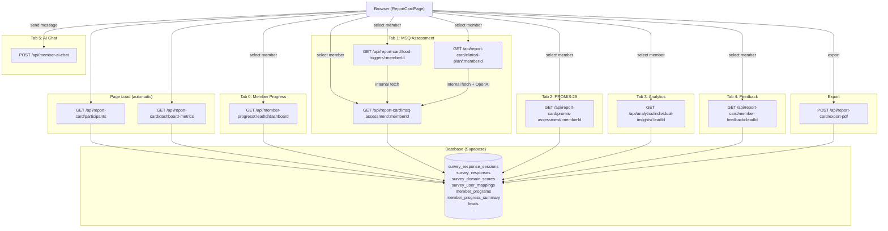

# Report Card Screen — Comprehensive Documentation

> **Generated:** 2026-03-23  
> **Route:** `/dashboard/report-card`  
> **Page file:** `src/app/dashboard/report-card/page.tsx`

---

## 1. SCREEN OVERVIEW

### Identity

| Property | Value |
|----------|-------|
| **Screen name** | Report Card |
| **Route / URL** | `/dashboard/report-card` |
| **Purpose** | Clinical analytics dashboard for reviewing member health outcomes across MSQ-95, PROMIS-29, compliance analytics, AI insights, and member feedback. Supports per-member drill-down with six specialized tabs and PDF export. |
| **Application** | YOY Program Tracker — Next.js 15 App Router |

### User Roles & Auth Gating

- **All authenticated users** can access this screen.
- The `/dashboard` prefix is a **protected route** — unauthenticated users are redirected to `/login` by both middleware (`middleware.ts`) and the server-side layout (`src/app/dashboard/layout.tsx`).
- Sidebar navigation items are filtered by user permissions (admin sees all; non-admin users see only their permitted paths via `user_menu_permissions` table).
- The Report Card page itself has **no role-based gating** beyond authentication — any logged-in user sees the same content.
- API routes enforce authentication via `getSession()` or `getUser()` — no additional role checks.

### Workflow Position

| Direction | Screen | Trigger |
|-----------|--------|---------|
| **Before** | Any sidebar page / Notification link | User clicks "Report Card" in sidebar, or follows a notification deep link with `?leadId=X&tab=Y` |
| **After** | Any sidebar destination / Notes modal / PDF download | User clicks sidebar nav, opens notes, or exports a PDF |
| **Peer** | Dashboard (`/dashboard`), Coordinator (`/dashboard/coordinator`), Operations (`/dashboard/operations/executive`) | Shares `useReportCardDashboardMetrics` with Operations Executive |

### Layout Description (top to bottom, left to right)

1. **Sidebar (fixed left, 240px on desktop)** — Logo, collapsible nav sections, user avatar + logout at bottom.
2. **Main content area** (right of sidebar, gray background):
   - **Header** — "Report Card" title (`h4`, bold, primary color).
   - **Dashboard Metrics Cards Row** — Six equal-width metric cards showing operational health indicators:
     1. Member Progress Coverage (purple)
     2. Avg Member Feedback (color-coded by score)
     3. Programs Ending Soon (orange)
     4. Highest MSQ Scores (red)
     5. Lowest Compliance (orange)
     6. Top Performers (green)
   - **Member Filter Row** — Member dropdown (required), Notes icon button, Export PDF icon button.
   - **Six Tab Bar** — MEMBER PROGRESS | MSQ ASSESSMENT | PROMIS-29 | ANALYTICS & INSIGHTS | MEMBER FEEDBACK | AI INSIGHTS
   - **Tab Content Panel** — Renders the selected tab's content below the tab bar.
3. **Modals (overlay)** — `LeadNotesModal` (view/add notes) and `ExportReportModal` (PDF export configuration).

---

## 2. COMPONENT ARCHITECTURE

### Component Tree

```mermaid
graph TD
    RootLayout["RootLayout (src/app/layout.tsx)"]
    Providers["Providers (QueryClient, MUI Theme, Toaster)"]
    DashLayout["Dashboard layout.tsx (Server — auth)"]
    DashLayoutClient["DashboardLayout (Client)"]
    Sidebar["Sidebar"]
    Page["ReportCardPage"]
    MetricsCards["DashboardMetricsCards"]
    MetricCard["MetricCardWithTooltip (×6)"]
    MemberSelect["Member Select (MUI Select)"]
    NotesBtn["Notes IconButton"]
    ExportBtn["Export IconButton"]
    Tabs["MUI Tabs (6 tabs)"]
    TP0["TabPanel 0 → MemberProgressTab"]
    TP1["TabPanel 1 → MsqAssessmentTab"]
    TP2["TabPanel 2 → PromisAssessmentTab"]
    TP3["TabPanel 3 → AnalyticsInsightsTab"]
    TP4["TabPanel 4 → MemberFeedbackTab"]
    TP5["TabPanel 5 → AIInsightsTab"]
    NotesModal["LeadNotesModal"]
    ExportModal["ExportReportModal"]

    RootLayout --> Providers --> DashLayout --> DashLayoutClient
    DashLayoutClient --> Sidebar
    DashLayoutClient --> Page
    Page --> MetricsCards --> MetricCard
    Page --> MemberSelect
    Page --> NotesBtn
    Page --> ExportBtn
    Page --> Tabs
    Tabs --> TP0
    Tabs --> TP1
    Tabs --> TP2
    Tabs --> TP3
    Tabs --> TP4
    Tabs --> TP5
    Page --> NotesModal
    Page --> ExportModal

    TP0 --> ProfileCard["ProfileCard"]
    TP0 --> TimelineCard["TimelineCard"]
    TP0 --> GoalsCard["GoalsCard"]
    TP0 --> WinsCard["WinsCard"]
    TP0 --> ChallengesCard["ChallengesCard"]
    TP0 --> HealthVitalsCard["HealthVitalsCard"]
    TP0 --> ComplianceCard["ComplianceCard"]

    TP1 --> PatientProfile["PatientSpecificProfile"]
    TP1 --> DomainGrid["DomainCardsGrid"]
    TP1 --> InterpGuide["InterpretationGuide"]

    TP2 --> PromisProfile["PromisProfile"]
    TP2 --> PromisDomainGrid["PromisDomainCardsGrid"]
    TP2 --> PromisGuide["PromisInterpretationGuide"]

    TP3 --> RankingProfile["MemberRankingProfile"]
    TP3 --> CompAnalysis["ComparativeAnalysisGrid"]
    TP3 --> RecsGrid["RecommendationsGrid"]

    TP4 --> SupportRatings["SupportRatingsSummary"]
    TP4 --> RatingsChart["RatingsOverTimeChart"]
    TP4 --> FBTimeline["FeedbackTimeline"]
```



### Component Details

#### `ReportCardPage` (`src/app/dashboard/report-card/page.tsx`)

| Aspect | Detail |
|--------|--------|
| **Props** | None (page component) |
| **Local State** | `tabValue` (number, 0), `selectedMemberId` (number \| null, null), `lastAppliedParams` (string \| null, null), `isNotesModalOpen` (boolean, false), `isExportModalOpen` (boolean, false) |
| **Hooks** | `useSearchParams()`, `useTheme()`, `useReportCardParticipants()` |
| **Effects** | 1 `useEffect` — watches `searchParams`, `membersData`, `membersLoading`, `lastAppliedParams` to apply URL deep-link params (`leadId`, `tab`) |
| **Memos** | `members` — sorted alphabetically; `selectedMember` — resolved from `selectedMemberId` |
| **Event Handlers** | `handleTabChange`, `handleOpenNotesModal`, `handleCloseNotesModal`, inline `onChange` for member select, inline `onClick` for export |
| **Conditional Rendering** | Tabs show/hide via `TabPanel` hidden prop; Notes modal only renders when `selectedMember?.lead_id` exists; Export modal same condition; AI tab shows placeholder if no `lead_id` |

#### `DashboardMetricsCards` (`src/components/report-card/DashboardMetricsCards.tsx`)

| Aspect | Detail |
|--------|--------|
| **Props** | None |
| **Hooks** | `useReportCardDashboardMetrics()` |
| **Conditional Rendering** | Loading → 6 Skeleton rectangles; Error → `null`; No data → `null`; Success → 6 `MetricCardWithTooltip` instances |

#### `MetricCardWithTooltip` (`src/components/report-card/MetricCardWithTooltip.tsx`)

| Prop | Type | Required | Default |
|------|------|----------|---------|
| `title` | `string` | Yes | — |
| `value` | `string \| number` | Yes | — |
| `subtitle` | `string` | Yes | — |
| `icon` | `React.ElementType` | Yes | — |
| `color` | `string` | Yes | — |
| `tooltipData` | `MemberListItem[]` | No | `undefined` |
| `tooltipTitle` | `string` | No | `undefined` |
| `isLoading` | `boolean` | No | `false` |

#### `MsqAssessmentTab` (`src/components/report-card/MsqAssessmentTab.tsx`)

| Prop | Type | Required |
|------|------|----------|
| `selectedMemberId` | `number \| null` | Yes |

Hooks: `useMsqAssessmentData(selectedMemberId, false)` — disables AI features.  
Children: `PatientSpecificProfile`, `DomainCardsGrid`, `InterpretationGuide`.

#### `PromisAssessmentTab` (`src/components/report-card/PromisAssessmentTab.tsx`)

| Prop | Type | Required |
|------|------|----------|
| `selectedMemberId` | `number \| null` | Yes |

Hooks: `usePromisAssessmentData(selectedMemberId)`.  
Children: `PromisProfile`, `PromisDomainCardsGrid`, `PromisInterpretationGuide`.

#### `AnalyticsInsightsTab` (`src/components/report-card/AnalyticsInsightsTab.tsx`)

| Prop | Type | Required |
|------|------|----------|
| `leadId` | `number \| null` | Yes |

Hooks: `useIndividualInsights(leadId)`.  
Children: `MemberRankingProfile`, `ComparativeAnalysisGrid`, `RecommendationsGrid`.

#### `MemberFeedbackTab` (`src/components/report-card/MemberFeedbackTab.tsx`)

| Prop | Type | Required |
|------|------|----------|
| `leadId` | `number \| null` | Yes |

Hooks: `useMemberFeedback(leadId)`.  
Children: `SupportRatingsSummary`, `RatingsOverTimeChart`, `FeedbackTimeline`.

#### `AIInsightsTab` (`src/components/report-card/AIInsightsTab.tsx`)

| Prop | Type | Required |
|------|------|----------|
| `memberId` | `number` | Yes |

| Local State | Type | Initial | Purpose |
|-------------|------|---------|---------|
| `inputMessage` | `string` | `''` | Chat input text |
| `aiProvider` | `AIProvider` | `'anthropic'` | AI provider (hidden toggle, defaults to Anthropic) |
| `showMetrics` | `boolean` | `false` | Collapse state for session metrics panel |
| `uploadedFile` | `UploadedFile \| null` | `null` | Uploaded PDF file with extracted text |
| `isExtractingPdf` | `boolean` | `false` | PDF text extraction in progress |

Refs: `chatContainerRef` (auto-scroll), `fileInputRef` (hidden file input).  
Hooks: `useMemberAIChat({ memberId })`.  
Effects: Auto-scroll on message change; clear conversation on member change.

#### `ExportReportModal` (`src/components/report-card/ExportReportModal.tsx`)

| Prop | Type | Required |
|------|------|----------|
| `open` | `boolean` | Yes |
| `onClose` | `() => void` | Yes |
| `memberId` | `number` | Yes |
| `memberName` | `string` | Yes |

| Local State | Type | Initial | Purpose |
|-------------|------|---------|---------|
| `isExporting` | `boolean` | `false` | Export in progress |
| `exportOptions` | `Partial<ExportOptions>` | `{ memberId, format: 'pdf', sections: {...}, ... }` | Form state for export configuration |

---

## 3. DATA FLOW

### Complete Data Lifecycle

1. **Page Load**: `useReportCardParticipants()` fetches member list; `useReportCardDashboardMetrics()` fetches 6 metric cards. Both are TanStack Query hooks.
2. **URL Deep Linking**: `useEffect` reads `searchParams` (`leadId`, `tab`) and sets `selectedMemberId` and `tabValue` accordingly.
3. **Member Selection**: User selects member from dropdown → sets `selectedMemberId` → triggers data fetch for active tab.
4. **Tab Switch**: User clicks tab → `setTabValue(newValue)` → lazy-loads tab content (each tab fetches its own data via dedicated hooks when rendered).
5. **Tab-Specific Data**:
   - Tab 0 (Member Progress): `useMemberProgressDashboard(leadId)` → `/api/member-progress/.../dashboard`
   - Tab 1 (MSQ): `useMsqAssessmentData(selectedMemberId)` → 3 parallel fetches (assessment, food triggers, clinical plan)
   - Tab 2 (PROMIS): `usePromisAssessmentData(selectedMemberId)` → `/api/report-card/promis-assessment/:memberId`
   - Tab 3 (Analytics): `useIndividualInsights(leadId)` → `/api/analytics/individual-insights/:leadId`
   - Tab 4 (Feedback): `useMemberFeedback(leadId)` → `/api/report-card/member-feedback/:leadId`
   - Tab 5 (AI): `useMemberAIChat({ memberId })` → `POST /api/member-ai-chat` per message
6. **PDF Export**: `ExportReportModal` sends `POST /api/report-card/export-pdf` → receives binary PDF → triggers browser download.
7. **No writes to database** occur from this screen (read-only except AI chat, which is stateless).

### Data Flow Diagram



---

## 4. API / SERVER LAYER

### API Routes Summary

| Method | Route | Auth | File |
|--------|-------|------|------|
| GET | `/api/report-card/participants` | `getUser()` | `src/app/api/report-card/participants/route.ts` |
| GET | `/api/report-card/dashboard-metrics` | `getUser()` | `src/app/api/report-card/dashboard-metrics/route.ts` |
| GET | `/api/report-card/summary` | `getSession()` | `src/app/api/report-card/summary/route.ts` |
| GET | `/api/report-card/programs` | `getSession()` | `src/app/api/report-card/programs/route.ts` |
| GET | `/api/report-card/msq-timeline` | `getSession()` | `src/app/api/report-card/msq-timeline/route.ts` |
| GET | `/api/report-card/insights` | `getSession()` | `src/app/api/report-card/insights/route.ts` |
| GET | `/api/report-card/msq-assessment/:memberId` | `getSession()` | `src/app/api/report-card/msq-assessment/[memberId]/route.ts` |
| GET | `/api/report-card/promis-assessment/:memberId` | `getSession()` | `src/app/api/report-card/promis-assessment/[memberId]/route.ts` |
| GET | `/api/report-card/food-triggers/:memberId` | Cookie forwarding | `src/app/api/report-card/food-triggers/[memberId]/route.ts` |
| GET | `/api/report-card/clinical-plan/:memberId` | Cookie forwarding | `src/app/api/report-card/clinical-plan/[memberId]/route.ts` |
| GET | `/api/report-card/member-feedback/:leadId` | `getSession()` | `src/app/api/report-card/member-feedback/[leadId]/route.ts` |
| GET | `/api/report-card/promis-milestones` | None | `src/app/api/report-card/promis-milestones/route.ts` |
| POST | `/api/report-card/export-pdf` | `getSession()` | `src/app/api/report-card/export-pdf/route.ts` |

### Route Details

#### `GET /api/report-card/participants`

**Parameters:**

| Param | Type | Required | Description |
|-------|------|----------|-------------|
| `program_id` | query string | No | Filter members by program |

**Response:** `{ data: ParticipantOption[] }`

**Supabase tables:** `member_programs`, `program_status`, `member_progress_summary`, `survey_user_mappings`, `survey_response_sessions`, `survey_session_program_context`, `member_individual_insights`.

**Error responses:** 401 (unauthorized), 500 (server error).

#### `GET /api/report-card/dashboard-metrics`

**Parameters:** None.

**Response:** `{ data: DashboardMetrics }` — 7 metric card datasets (6 visible + 1 hidden).

**Supabase tables:** `member_programs`, `leads`, `member_progress_summary`, `survey_response_sessions`, `survey_responses`, `survey_user_mappings`, `survey_domain_scores`, `member_program_items`, `member_program_item_schedule`, `member_program_item_tasks`, `member_program_items_task_schedule`, `program_status` (via `ProgramStatusService`).

**Config:** `export const dynamic = 'force-dynamic'`.

**Error responses:** 401, 500 (with `error` + `message`).

#### `GET /api/report-card/msq-assessment/:memberId`

**Parameters:**

| Param | Type | Required | Description |
|-------|------|----------|-------------|
| `memberId` | path (number) | Yes | `external_user_id` from survey system |

**Response:** `{ data: { summary: MsqAssessmentSummary, domains: MsqDomainCard[] } }`

**Supabase tables:** `survey_user_mappings`, `survey_response_sessions` (form_id=3), `survey_domain_scores`, `survey_domains`, `survey_responses`, `survey_form_question_domain`.

**Error responses:** 400 (invalid ID), 401, 404 (member not found / no MSQ data), 500.

#### `GET /api/report-card/promis-assessment/:memberId`

**Parameters:** Same as MSQ but uses `form_id=6` / `survey_code='PROMIS'`.

**Response:** `{ summary: PromisAssessmentSummary, domains: PromisDomainCard[] }` (note: **not** wrapped in `data`).

**Error responses:** 400, 401, 404, 500.

#### `GET /api/report-card/member-feedback/:leadId`

**Parameters:**

| Param | Type | Required | Description |
|-------|------|----------|-------------|
| `leadId` | path (number) | Yes | Lead ID |

**Response:** `{ data: { ratings: MemberFeedbackRatings, ratingTimeline: RatingTimelineEntry[], feedback: FeedbackEntry[] } }`

**Supabase tables:** `leads`, `survey_response_sessions`, `survey_forms`, `survey_responses`, `survey_questions`.

**Error responses:** 400, 401, 404, 500.

#### `POST /api/report-card/export-pdf`

**Request Body:**

| Field | Type | Required |
|-------|------|----------|
| `memberId` | `number` | Yes |
| `sections.memberProgress` | `boolean` | Yes |
| `sections.msqAssessment` | `boolean` | Yes |
| `sections.promisAssessment` | `boolean` | Yes |

**Response:** Binary PDF (`application/pdf`, `Content-Disposition: attachment`).

**Config:** `runtime = 'nodejs'`, `dynamic = 'force-dynamic'`.

**Error responses:** 400 (missing fields), 401, 500 (PDF generation failure).

#### `GET /api/report-card/clinical-plan/:memberId`

Internally calls `/api/report-card/msq-assessment/:memberId` via server-side fetch (cookie forwarding), then sends domain data to **OpenAI** for AI-generated clinical recommendations.

**Response:** `{ data: ClinicalActionPlan }`.

**Error responses:** 503 (OPENAI_API_KEY missing), 502 (OpenAI failure), 500.

#### `GET /api/report-card/food-triggers/:memberId`

Internally calls MSQ assessment route, processes domain cards through `generateFoodTriggers()`.

**Response:** `{ data: FoodTriggerAnalysis }`.

#### `GET /api/report-card/promis-milestones`

**Deprecated.** Returns 410 Gone with `{ error, message, deprecated_date }`.

---

## 5. DATABASE LAYER

### Tables Touched

| Table | Read/Write | Primary Routes |
|-------|-----------|----------------|
| `survey_response_sessions` | Read | participants, dashboard-metrics, summary, msq-assessment, promis-assessment, msq-timeline, member-feedback |
| `survey_responses` | Read | dashboard-metrics, summary, msq-assessment, promis-assessment, msq-timeline, member-feedback |
| `survey_user_mappings` | Read | participants, msq-assessment, promis-assessment, msq-timeline |
| `survey_domain_scores` | Read | dashboard-metrics, msq-assessment, promis-assessment |
| `survey_domains` | Read | msq-assessment, promis-assessment |
| `survey_form_question_domain` | Read | msq-assessment, promis-assessment |
| `survey_questions` | Read | member-feedback, export-pdf |
| `survey_session_program_context` | Read | participants, programs |
| `survey_forms` | Read | member-feedback |
| `member_programs` | Read | participants, dashboard-metrics |
| `member_progress_summary` | Read | participants, dashboard-metrics, export-pdf |
| `member_individual_insights` | Read | participants |
| `member_program_items` | Read | dashboard-metrics |
| `member_program_item_schedule` | Read | dashboard-metrics |
| `member_program_item_tasks` | Read | dashboard-metrics |
| `member_program_items_task_schedule` | Read | dashboard-metrics |
| `program_status` | Read | participants, dashboard-metrics (via ProgramStatusService) |
| `leads` | Read | dashboard-metrics, member-feedback, export-pdf |

### Key Columns for Report Card

#### `survey_response_sessions`

| Column | Type | Description |
|--------|------|-------------|
| `session_id` | int (PK) | Unique session identifier |
| `lead_id` | int (FK → leads) | CRM lead reference |
| `external_user_id` | int | Survey system user ID |
| `form_id` | int | Survey form type (3=MSQ-95, 6=PROMIS-29) |
| `completed_on` | timestamp | When survey was completed |
| `session_status` | text | Completion status |

#### `survey_user_mappings`

| Column | Type | Description |
|--------|------|-------------|
| `external_user_id` | int (PK) | Survey system user ID |
| `lead_id` | int (FK → leads) | Mapped CRM lead |
| `first_name` | text | Member first name |
| `last_name` | text | Member last name |

#### `survey_domain_scores`

| Column | Type | Description |
|--------|------|-------------|
| `session_id` | int (FK) | Survey session |
| `domain_id` | int (FK → survey_domains) | Domain reference |
| `domain_score` | numeric | Calculated domain score |

### Key Queries

**Participants fetch** (`participants/route.ts`):
```
supabase.from('member_programs')
  .select('lead_id, member_program_id, program_status_id')
  .in('program_status_id', validStatusIds)
```
Joins with `survey_user_mappings`, `survey_response_sessions` (form_id=3), `member_progress_summary`, `member_individual_insights`. All reads.

**MSQ Assessment** (`msq-assessment/[memberId]/route.ts`):
```
supabase.from('survey_response_sessions')
  .select('session_id, completed_on')
  .eq('external_user_id', internalId)
  .eq('form_id', 3)
  .order('completed_on', { ascending: true })
```
Followed by domain scores, individual responses, and question-domain mappings. Performance note: fetches all sessions for a member; no pagination (acceptable for typical member assessment counts ~12).

**Dashboard Metrics** (`dashboard-metrics/route.ts`): The most complex query — 693 lines. Queries across 10+ tables to calculate 7 metric cards. Uses `ProgramStatusService.getValidProgramIds()` as entry point. Performance note: queries schedule and task tables for all active members — could be slow with large datasets.

---

## 6. BUSINESS RULES & LOGIC

### Rules

| Rule | Enforcement | Violation Behavior |
|------|-------------|-------------------|
| Member must be selected before viewing tab content | Frontend (conditional rendering) | "Select a Member" placeholder shown |
| MSQ-95 surveys use `form_id = 3` | API query filters | No data returned if wrong form_id |
| PROMIS-29 surveys use `form_id = 6` and `survey_code = 'PROMIS'` | API query filters | No data returned |
| MSQ score scale: 0 (Never) to 4 (Always) | `getMsqAnswerScore()` in summary route | Unknown answers map to 0 |
| PROMIS T-scores: Mean=50, SD=10 (US population norm) | `convertToTScore()` utility | Null returned for unmappable scores |
| MSQ severity: 0-10 Optimal, 11-30 Mild, 31-60 Moderate, 61-100 Severe, 101+ Very Severe | `PatientSpecificProfile` component | Color-coded display |
| PROMIS severity (symptom): <55 Normal, 55-59 Mild, 60-69 Moderate, 70-79 Severe, 80+ Very Severe | `interpretSymptomSeverity()` | Color-coded display |
| PROMIS severity (function): ≥55 Normal, 45-54 Mild Limitation, etc. (inverted) | `interpretFunctionSeverity()` | Color-coded display |
| Trend calculation requires ≥2 assessments | API + component logic | "Need at least 2 assessments" tooltip |
| Risk score: Compliance 35pts + Progress 35pts + Vitals 20pts + Wins 5pts + Challenges 5pts | `member_individual_insights` (pre-calculated) | Risk level color (green/yellow/red) |
| Paused members shown with 30% opacity in dropdown | Frontend styling | `sx={member.is_paused ? { opacity: 0.3 } : {}}` |
| PDF export requires at least one section selected | Frontend validation | Export button disabled |
| Clinical plan requires `OPENAI_API_KEY` env var | API check | 503 response |
| PDF file uploads limited to 5MB, PDF type only | Frontend validation | Toast error message |
| Feedback ratings: 1-5 scale, color thresholds at 4 (green), 3 (yellow), <3 (red) | `getRatingColor()` | Color-coded display |

### Calculations

| Derived Value | Formula | Location |
|---------------|---------|----------|
| MSQ improvement % | `(first - latest) / first × 100` | `summary/route.ts` |
| Completion rate | `actual MSQ surveys / (members × 12 expected)` | `summary/route.ts` |
| Recent surveys change | `(this week - last week) / last week × 100` | `summary/route.ts` |
| Domain average score | Average of all symptom scores in domain (latest assessment) | `msq-assessment/route.ts` |
| Domain trend | Compare first vs last assessment scores per domain | `msq-assessment/route.ts` |
| PROMIS mean T-score | Average of 7 domain T-scores (excluding pain intensity) | `promis-assessment/route.ts` |
| Risk score | Weighted composite: compliance + progress + vitals + wins + challenges | Pre-calculated in `member_individual_insights` |
| Quartile | Population ranking divided into 4 groups | Pre-calculated |

---

## 7. FORM & VALIDATION DETAILS

### Export Report Modal Form

| Field | Input Type | Bound State | Validation | Error |
|-------|-----------|-------------|------------|-------|
| Member Progress | Checkbox | `exportOptions.sections.memberProgress` | At least one section required | Export button disabled |
| MSQ Assessment | Checkbox | `exportOptions.sections.msqAssessment` | — | — |
| PROMIS-29 Assessment | Checkbox | `exportOptions.sections.promisAssessment` | — | — |
| Include Charts | Checkbox (disabled) | `exportOptions.includeCharts` | Phase 2 feature | — |
| Include Interpretation | Checkbox (disabled) | `exportOptions.includeInterpretation` | Phase 2 feature | — |
| Delivery: Download | Radio | `exportOptions.delivery` | Default 'download' | — |
| Delivery: Email | Radio (disabled) | `exportOptions.delivery` | Phase 3 feature | — |
| Recipient Email | TextField (disabled) | `exportOptions.recipientEmail` | Email format (Zod) | — |

**Server-side validation** (`report-export.ts`): Zod schema validates `memberId` (number, min 1), `format` (enum: pdf/html), `sections` (object with booleans), `delivery` (enum: download/email).

**Submission flow:**
1. User configures sections → clicks "Export PDF"
2. `setIsExporting(true)` → `POST /api/report-card/export-pdf` with JSON body
3. On success: receive blob → create object URL → trigger download → toast success → close modal
4. On error: toast error message → `setIsExporting(false)`

### AI Chat Input

| Field | Input Type | Validation |
|-------|-----------|------------|
| Message | TextField (multiline, maxRows=4) | Non-empty trim required |
| PDF Upload | Hidden file input | PDF type only, max 5MB |

**Submission:** Enter key (without Shift) or click send button → `sendMessage()` → optimistic user message → API call → assistant response appended.

---

## 8. STATE MANAGEMENT

### State Map

| State Type | Variable | Location | Purpose |
|------------|----------|----------|---------|
| Local | `tabValue` | `page.tsx` | Active tab index (0-5) |
| Local | `selectedMemberId` | `page.tsx` | Selected member's `external_user_id` |
| Local | `isNotesModalOpen` | `page.tsx` | Notes modal visibility |
| Local | `isExportModalOpen` | `page.tsx` | Export modal visibility |
| Local | `lastAppliedParams` | `page.tsx` | Prevents re-applying URL params |
| URL | `?leadId=X` | Search params | Deep link to member |
| URL | `?tab=Y` | Search params | Deep link to tab |
| Server (TanStack Query) | `['report-card', 'participants']` | `use-report-card.ts` | Member list cache (staleTime: 0) |
| Server (TanStack Query) | `['report-card-dashboard-metrics', 'metrics']` | `use-dashboard-metrics-report-card.ts` | Metric cards cache (staleTime: 2min) |
| Server (TanStack Query) | `['msq-assessment', 'assessment', memberId]` | `use-msq-assessment.ts` | MSQ data cache (staleTime: 10min) |
| Server (TanStack Query) | `['promis-assessment', 'assessment', memberId]` | `use-promis-assessment.ts` | PROMIS data cache (staleTime: 10min) |
| Server (TanStack Query) | `['individual-insights', leadId]` | `use-individual-insights.ts` | Analytics cache (staleTime: 5min) |
| Server (TanStack Query) | `['member-feedback', leadId]` | `use-member-feedback.ts` | Feedback cache (staleTime: 5min) |
| Local (AI tab) | `messages`, `sessionMetadata` | `use-member-ai-chat.ts` | Chat history (cleared on member change) |

### State Transitions

| Action | State Changes |
|--------|---------------|
| Select member | `selectedMemberId` → new value; active tab hook refetches |
| Switch tab | `tabValue` → new index; new tab's hook fetches if no cache |
| Open notes | `isNotesModalOpen` → true |
| Close notes | `isNotesModalOpen` → false |
| Open export | `isExportModalOpen` → true |
| URL params arrive | `selectedMemberId` and `tabValue` set from URL |
| Send AI message | `messages` appended (optimistic); on response, assistant message appended |
| Clear AI chat | `messages` → `[]`, `sessionMetadata` → `[]` |

---

## 9. NAVIGATION & ROUTING

### Inbound Routes

| Source | Mechanism |
|--------|-----------|
| Sidebar navigation | Direct link to `/dashboard/report-card` |
| Notification deep link | URL with `?leadId=123&tab=2` |
| Direct URL entry | Shareable URL |

### Outbound Navigation

| Destination | Trigger |
|-------------|---------|
| Any sidebar page | Sidebar click |
| PDF download | Export modal → browser download |
| Notes modal (overlay) | Notes button click |

### Route Guards

1. **Middleware** (`middleware.ts`): Redirects unauthenticated users hitting `/dashboard/*` to `/login`.
2. **Server layout** (`src/app/dashboard/layout.tsx`): `supabase.auth.getUser()` → `redirect('/login')` if no user.
3. No feature-flag-based guards.

### Deep Linking

- **URL pattern:** `/dashboard/report-card?leadId=123&tab=2`
- `leadId` matches against `ParticipantOption.lead_id` to find the `external_user_id` for the dropdown.
- `tab` is an integer 0-5 mapping to the six tabs.
- URL is shareable; params are applied after member data loads.

---

## 10. ERROR HANDLING & EDGE CASES

### Error States

| Scenario | UI Treatment | Recovery |
|----------|-------------|----------|
| Dashboard metrics API error | Cards silently hidden (`return null`) | Page refresh |
| Dashboard metrics loading | 6 Skeleton rectangles | Automatic |
| No member selected | Each tab shows centered "Select a Member" placeholder | User selects member |
| MSQ assessment API error | `Alert severity="error"` with message | Fix data / refresh |
| MSQ no data (404) | Error alert with "Error loading assessment data" | Ensure member has MSQ surveys |
| PROMIS assessment error | `Alert severity="error"` | Same as MSQ |
| Analytics not available | `Alert severity="warning"` with "Analytics Not Available" | Wait for next survey import |
| Analytics not yet generated | `Alert severity="info"` with "Analytics Not Yet Generated" | Automatic after survey import |
| Feedback not available | `Alert severity="warning"` | Wait for member to complete feedback surveys |
| No feedback data | `Alert severity="info"` explaining when data appears | Automatic |
| AI chat error (429 rate limit) | Toast with provider-specific rate limit message | Wait 60 seconds, retry |
| AI chat error (401/403) | Toast: "Authentication Error" | Check API keys |
| AI chat error (500+) | Toast: "Server Error" | Retry later |
| PDF export failure | Toast error message | Retry; check data availability |
| OPENAI_API_KEY missing | 503 from clinical-plan route | Configure env var |
| PDF upload too large | Toast: "File too large. Maximum size is 5 MB" | Use smaller file |
| PDF upload wrong type | Toast: "Only PDF files are supported" | Select PDF file |
| Password-protected PDF | Toast: "This PDF is password-protected" | Unlock PDF first |

### Loading States

| Component | Loading Indicator |
|-----------|------------------|
| Dashboard metrics | 6 MUI `Skeleton` rectangles |
| Each assessment tab | Centered `CircularProgress` (48px) with descriptive text |
| AI chat | Paper bubble with `CircularProgress` (20px) + "Thinking..." |
| PDF export | Button shows `CircularProgress` (16px) + "Generating PDF..." |
| PDF text extraction | Chip with `CircularProgress` + "Extracting text..." |

### Empty States

| Scenario | Display |
|----------|---------|
| No member selected (any tab) | Centered card with "Select a Member" and instruction text |
| No AI messages | Large `PsychologyIcon` + "Ask about this member's health data" + example question |
| AI tab without `lead_id` | "Please select a member to view AI insights" |
| No feedback text | Quote icon + "No text feedback available yet" |
| No recommendations | Card with "No specific recommendations at this time" |

---

## 11. ACCESSIBILITY

### ARIA Implementation

| Element | ARIA | Implementation |
|---------|------|----------------|
| Tabs | `aria-label="report card tabs"` | Tab bar container |
| Tab panels | `role="tabpanel"`, `id="report-card-tabpanel-{i}"`, `aria-labelledby="report-card-tab-{i}"` | `TabPanel` component |
| Individual tabs | `id="report-card-tab-{i}"`, `aria-controls="report-card-tabpanel-{i}"` | Each `Tab` |
| Member select | `labelId="member-select-label"` | Select + InputLabel association |
| Tooltip buttons | Wrapped in `<span>` for disabled state tooltip | Notes & Export buttons |
| AI provider toggle | `aria-label="AI provider selection"` | Hidden ToggleButtonGroup |
| File upload | `accept="application/pdf"` | Hidden file input |

### Keyboard Navigation

- Tab key navigates through: Member dropdown → Notes button → Export button → Tab bar → Active tab content.
- Arrow keys navigate between tabs within the tab bar.
- Enter/Space activates tab selection, button clicks, and form submissions.
- Enter (without Shift) sends AI chat messages.
- Shift+Enter creates new line in AI chat input.

### Screen Reader Considerations

- Tab icons have accompanying text labels (e.g., `label="MSQ ASSESSMENT"`).
- Tooltip data is accessible via hover/focus.
- Loading states include descriptive text alongside spinners.
- Alert components use semantic `severity` for screen reader tone.

### Focus Management

- No explicit focus management after modal open/close (relies on MUI Dialog defaults).
- Auto-scroll to bottom of chat container on new messages.

---

## 12. PERFORMANCE CONSIDERATIONS

### Identified Concerns

| Concern | Severity | Details |
|---------|----------|---------|
| Dashboard metrics query complexity | Medium | 693-line route queries 10+ tables for all active members. No caching beyond TanStack Query client-side (staleTime: 2min). |
| No virtualization for domain cards | Low | Max 15 MSQ domains or 8 PROMIS domains — not large enough to need virtualization. |
| All MSQ responses fetched per member | Low | Fetches all responses across all sessions. Manageable for typical ~12 assessments per member. |
| Participants query always refetches | Medium | `staleTime: 0, gcTime: 0, refetchOnMount: 'always'` — fresh on every mount. This ensures accuracy but increases API calls. |
| PDF.js loaded from CDN | Low | Loaded lazily only when user uploads PDF. ~2MB library. |
| AI chat not paginated | Low | Messages accumulate in memory during session; cleared on member change. |
| Dashboard metrics `force-dynamic` | Low | Prevents Next.js caching. Appropriate for real-time data. |
| Export PDF `force-dynamic` + `nodejs` runtime | Low | Required for PDF generation. Long-running request. |

### Caching Strategy

| Layer | Mechanism | TTL |
|-------|-----------|-----|
| Client (TanStack Query) | Participants | 0 (always fresh) |
| Client (TanStack Query) | Dashboard metrics | 2 minutes, refetch on window focus |
| Client (TanStack Query) | MSQ assessment | 10 minutes |
| Client (TanStack Query) | PROMIS assessment | 10 minutes |
| Client (TanStack Query) | Food triggers | 10 minutes |
| Client (TanStack Query) | Clinical plan (AI) | 30 minutes (expensive AI call) |
| Client (TanStack Query) | Analytics insights | 5 minutes |
| Client (TanStack Query) | Member feedback | 5 minutes |
| Server | No server-side caching | — |
| CDN | No CDN caching configured | — |

---

## 13. THIRD-PARTY INTEGRATIONS

| Service | Purpose | SDK/Package | Env Vars |
|---------|---------|-------------|----------|
| **Supabase** | Database and authentication | `@supabase/supabase-js`, `@supabase/ssr` | `NEXT_PUBLIC_SUPABASE_URL`, `NEXT_PUBLIC_SUPABASE_ANON_KEY` |
| **OpenAI** | Clinical plan generation (clinical-plan route) | `openai` | `OPENAI_API_KEY` |
| **Anthropic** | AI chat insights (member-ai-chat route) | `@anthropic-ai/sdk` | `ANTHROPIC_API_KEY` |
| **PDF.js** | Client-side PDF text extraction | CDN (`cdnjs.cloudflare.com/ajax/libs/pdf.js/4.0.379`) | None |
| **Recharts** | Ratings over time line chart | `recharts` | None |
| **Sonner / react-hot-toast** | Toast notifications | `sonner`, `react-hot-toast` | None |

### Failure Modes

| Service | Failure | Fallback |
|---------|---------|----------|
| Supabase | Auth failure | 401 response, redirect to login |
| Supabase | Query failure | 500 response, error alert in UI |
| OpenAI | API key missing | 503 with descriptive message |
| OpenAI | API error | 502, toast error |
| OpenAI/Anthropic | Rate limit (429) | Toast with "wait 60 seconds" guidance |
| PDF.js CDN | Load failure | Toast: "Failed to load PDF.js library from CDN" |

---

## 14. SECURITY CONSIDERATIONS

### Authentication & Authorization

- All API routes check authentication via `getSession()` or `getUser()` server-side.
- **No role-based authorization** within Report Card routes — any authenticated user can access all member data. This relies on Supabase RLS for data isolation.
- `food-triggers` and `clinical-plan` routes use **cookie forwarding** to authenticate via the downstream `msq-assessment` route — no direct auth check in those handlers.

### Input Sanitization

- URL params (`leadId`, `tab`) are parsed with `parseInt()` and validated against expected ranges.
- `memberId` path params are validated as numbers.
- API query params are extracted via `URLSearchParams` — no raw SQL injection surface.
- All database queries use the Supabase client's parameterized query builder — **no raw SQL**.

### Sensitive Data

- **PHI/HIPAA**: This screen displays Protected Health Information (symptom scores, health assessments, clinical plans). All data is transmitted over HTTPS and stored in Supabase with encryption at rest.
- **AI data**: Member health data is sent to OpenAI/Anthropic for AI analysis. This includes symptom scores, compliance data, and health vitals.
- **No client-side storage**: No PHI is persisted in localStorage, sessionStorage, or cookies. TanStack Query cache is in-memory only.
- **PDF exports**: Generated server-side and streamed to client. No server-side persistence of generated PDFs.

### CSRF Protection

- Next.js App Router + Supabase SSR cookies provide CSRF protection via SameSite cookie attributes.
- API routes use `credentials: 'include'` for cookie-based auth.

---

## 15. TESTING COVERAGE

### Existing Tests

| Path | What it Tests |
|------|---------------|
| `src/components/report-card/__tests__/PromisDomainCardsGrid.test.md` | Documentation/spec only (markdown, not executable) |
| `src/components/report-card/__tests__/PromisProfile.test.md` | Documentation/spec only (markdown, not executable) |

### Gaps

**No executable test files exist** for the Report Card screen. This is a significant gap given the complexity of:
- 13 API routes
- 30+ components
- Complex clinical calculations
- Multiple data transformation layers
- AI integrations

### Suggested Test Cases

**Unit Tests:**

| Test | Target |
|------|--------|
| `getMsqAnswerScore` returns correct score for each answer | `summary/route.ts` |
| MSQ severity classification for boundary values | `PatientSpecificProfile` |
| PROMIS T-score severity interpretation | `promis-assessment.ts` utilities |
| `interpretMeanTScoreSeverity` boundary values | `promis-assessment.ts` |
| Trend calculation with various score sequences | `MsqAssessmentTab` helper |
| `getRatingColor` threshold values | `SupportRatingsSummary` |
| `ExportOptions` Zod schema validation | `report-export.ts` |
| `formatAssessmentPeriod` edge cases | `PatientSpecificProfile` |

**Integration Tests:**

| Test | Target |
|------|--------|
| Participants API returns correct shape with active programs | `participants/route.ts` |
| MSQ assessment API processes multi-session member | `msq-assessment/route.ts` |
| Dashboard metrics API handles members with missing data | `dashboard-metrics/route.ts` |
| Export PDF generates valid binary response | `export-pdf/route.ts` |
| Clinical plan returns fallback when OpenAI key missing | `clinical-plan/route.ts` |

**E2E Tests:**

| Test | Scenario |
|------|----------|
| Select member → MSQ tab shows assessment data | Happy path |
| Deep link with `?leadId=X&tab=1` pre-selects member and tab | URL param handling |
| Export PDF with MSQ section selected → downloads file | Export flow |
| Switch between all 6 tabs without errors | Tab navigation |
| AI chat: send message → receive response | AI interaction |

---

## 16. CODE REVIEW FINDINGS

| Severity | File | Issue | Suggested Fix |
|----------|------|-------|---------------|
| **High** | `food-triggers/[memberId]/route.ts` | No direct auth check — relies on cookie forwarding to `msq-assessment`. If the internal fetch URL changes, auth is silently bypassed. | Add explicit `getSession()` check at the top of the handler. |
| **High** | `clinical-plan/[memberId]/route.ts` | Same cookie-forwarding auth issue as food-triggers. | Add explicit `getSession()` check. |
| **High** | `AIInsightsTab.tsx:131-143` | PDF.js loaded from CDN via dynamic `<script>` injection with `type="module"`. The `setTimeout(100ms)` wait is a race condition — module may not be initialized. | Use dynamic `import()` or a proper module loader. Add retry logic. |
| **Medium** | `promis-assessment/[memberId]/route.ts` | Response shape is `{ summary, domains }` (no `data` wrapper), inconsistent with all other routes that return `{ data: ... }`. | Wrap response in `{ data: { summary, domains } }` and update `usePromisAssessment` hook. |
| **Medium** | `DashboardMetricsCards.tsx:29-32` | Error state returns `null` — silently hides all 6 metric cards with no user feedback. | Show an `Alert` or retry button instead of `null`. |
| **Medium** | `AIInsightsTab.tsx:88-94` | Stop button is a placeholder (`TODO: Implement abort functionality`). Clicking send while loading enters the stop handler which does nothing useful. | Implement `AbortController` for the fetch request. |
| **Medium** | `page.tsx` | `selectedMemberId` is `external_user_id` but Tab 0, 3, 4 need `lead_id`. The mapping happens via `selectedMember?.lead_id` but if `lead_id` is null, those tabs silently get `null` and show "Select a Member" even though a member IS selected. | Show a specific message like "This member is not linked to a lead record" for affected tabs. |
| **Medium** | `ExportReportModal.tsx:22` | Uses `sonner` toast while `AIInsightsTab.tsx` uses `react-hot-toast`. Inconsistent toast libraries in the same screen. | Standardize on one toast library. |
| **Low** | `PatientSpecificProfile.tsx:14-16` | Imports `TrendingUp as TrendingUpIcon` and also `TrendingUp as ImprovingIcon` — duplicate import with different alias. | Use a single import with one alias. |
| **Low** | `page.tsx:74-100` | URL param effect uses `lastAppliedParams` string key for dedup, but this breaks if member list changes (reloads apply same params to potentially different member). | Use a more robust dedup mechanism or remove dedup and rely on effect dependencies. |
| **Low** | `DomainCardsGrid.tsx:253-266` | `getTrendColor` function is defined but never called. | Remove dead code. |
| **Low** | Multiple components | Tooltip styling (bgcolor, border, arrow) is copy-pasted identically across 8+ components (~20 lines each). | Extract a shared `StyledTooltip` component or theme override. |
| **Low** | `analytics/ComparativeAnalysisCard.tsx`, `analytics/MemberRankingCard.tsx`, `analytics/AIRecommendationsCard.tsx` | These files exist but are not imported by any component. Likely superseded by grid/profile components. | Remove dead files or document their purpose. |

---

## 17. TECH DEBT & IMPROVEMENT OPPORTUNITIES

### Refactoring Opportunities

1. **Extract shared tooltip styling** — The styled tooltip pattern (white background, border, arrow styling) is duplicated across `PatientSpecificProfile`, `PromisProfile`, `MemberRankingProfile`, `MetricCardWithTooltip`, `SupportRatingsSummary`, etc. Create a `<InfoTooltip>` wrapper component.

2. **Standardize toast library** — `ExportReportModal` uses `sonner` while `AIInsightsTab` uses `react-hot-toast`. Pick one.

3. **Consistent API response shape** — `promis-assessment` returns `{ summary, domains }` while all other routes return `{ data: ... }`. Normalize all to `{ data: ... }`.

4. **Remove orphaned components** — `ProgressTab.tsx`, `FilterPanel.tsx`, `MsqTimelineChart.tsx`, `InsightsSummary.tsx`, `ClinicalAlerts.tsx`, `ClinicalPlanPanels.tsx`, `FoodTriggersSection.tsx`, `MemberHeader.tsx`, and several analytics card files are not imported by any rendered component. Either remove them or document their future use.

5. **Extract `formatAssessmentPeriod`** — Duplicated identically in `PatientSpecificProfile.tsx` and `PromisProfile.tsx`. Move to a shared utility.

6. **Type the dashboard metrics route exports** — `DashboardMetrics` and `MemberListItem` are exported from the route file itself, creating a coupling between API route and component. Move types to `types/database.types.ts`.

### Missing Abstractions

- **Shared empty/loading/error state components** — Every tab implements the same three-state pattern (empty, loading, error) with nearly identical markup. Extract `<TabEmptyState>`, `<TabLoadingState>`, `<TabErrorState>`.
- **Domain card rendering** — `DomainCardsGrid` and `PromisDomainCardsGrid` share similar card layouts. Could be unified with a polymorphic card component.

### Deprecated Patterns

- `promis-milestones` route returns 410 — can be removed entirely if no clients reference it.
- `PROMIS-29 removed from Report Card Dashboard (2025-10-18)` deprecation comments in `database.types.ts` but PROMIS tab is actively used — comments are misleading.

### Scalability

- Dashboard metrics route queries all active members on every call. Consider pre-computing metrics via a cron job and storing in a `report_card_metrics` materialized view.
- Participants endpoint always fetches fresh data (`staleTime: 0`). If the member list is large, consider adding pagination or debounced search.

---

## 18. END-USER DOCUMENTATION DRAFT

### Report Card

**One-line description:** View clinical health assessments, progress analytics, and AI-powered insights for each member.

---

### What This Page Is For

The Report Card page is your central hub for reviewing a member's health journey. It combines symptom questionnaire results (MSQ-95 and PROMIS-29), program compliance data, AI-generated clinical recommendations, satisfaction feedback, and conversational AI analysis — all in one place.

---

### Step-by-Step Instructions

#### Viewing Member Health Data

1. Navigate to **Report Card** from the sidebar menu.
2. At the top, review the **six metric cards** for a quick operational overview of all members.
3. In the **Member** dropdown, select the member you want to review. Members are listed alphabetically; a colored dot next to each name indicates their risk level (green = low, yellow = medium, red = high, gray = no data).
4. Click through the **six tabs** to explore different aspects of the member's data:
   - **MEMBER PROGRESS** — Overall dashboard with curriculum timeline, goals, wins, challenges, health vitals, and compliance.
   - **MSQ ASSESSMENT** — MSQ-95 symptom questionnaire results with body systems analysis, severity scoring, and trend tracking.
   - **PROMIS-29** — PROMIS-29 standardized health assessment with T-scores, domain analysis, and interpretation guide.
   - **ANALYTICS & INSIGHTS** — Population ranking, comparative compliance/vitals analysis, and AI-generated recommendations.
   - **MEMBER FEEDBACK** — Satisfaction ratings (provider, staff, curriculum) with trends and text feedback timeline.
   - **AI INSIGHTS** — Conversational AI chat to ask questions about the member's data.

#### Adding Notes

1. Select a member from the dropdown.
2. Click the **pencil/note icon** next to the dropdown.
3. The Notes modal opens — view existing notes or add new ones.

#### Exporting a PDF Report

1. Select a member from the dropdown.
2. Click the **download icon** next to the dropdown.
3. In the Export modal, check the sections you want to include (Member Progress, MSQ Assessment, PROMIS-29).
4. Click **Export PDF** — the file downloads to your computer.

#### Using AI Insights

1. Select a member, then click the **AI INSIGHTS** tab.
2. Type a question about the member's health data (e.g., "What patterns do you see in this member's symptom data?").
3. Press Enter or click the send button.
4. Optionally, click the **paperclip icon** to upload a PDF document for the AI to analyze alongside the member's data.

---

### Field Descriptions

| Field | Description |
|-------|-------------|
| **Member dropdown** | Required. Lists all members with active or paused programs who have survey data. The colored dot indicates risk level. Paused members appear dimmed. |
| **Risk dot colors** | 🟢 Green = Low risk, 🟡 Yellow = Medium risk, 🔴 Red = High risk, ⚪ Gray = No data available |
| **MSQ Score** | Total symptom burden score from the MSQ-95 questionnaire. Lower is better. Ranges: 0-10 Optimal, 11-30 Mild, 31-60 Moderate, 61-100 Severe, 101+ Very Severe. |
| **PROMIS T-Score** | Standardized health score where 50 = US average, SD = 10. For symptom domains, higher means worse symptoms. For function domains, higher means better function. |
| **Quartile** | Member's ranking within the program population. Q1 = Top 25%, Q4 = Bottom 25%. |
| **Risk Score** | Composite score (0-100) combining compliance (35%), progress (35%), health vitals (20%), wins (5%), and challenges (5%). |
| **Support Ratings** | Member satisfaction scores (1-5 scale) for provider, staff/coach, and curriculum support. |

---

### Tips and Notes

- **Hover over metric cards** at the top to see which specific members need attention (e.g., worst MSQ scores, lowest compliance).
- **Hover over scores and counts** in the MSQ and PROMIS profile cards to see historical values and clinical interpretation.
- **Click the expand arrow** on MSQ domain cards to see individual symptom progression with color-coded score boxes.
- **The AI Insights tab** uses your organization's Anthropic API key. Costs are shown in the collapsible Session Metrics panel.
- **PDF exports** are generated server-side and may take a few seconds for members with extensive data.
- **Deep links work** — you can bookmark or share a URL like `/dashboard/report-card?leadId=123&tab=2` to go directly to a specific member's PROMIS tab.

---

### FAQ

**Q: Why does a member show "Select a Member" on some tabs even though I selected them?**  
A: Some tabs (Member Progress, Analytics, Member Feedback, AI Insights) require the member to be linked to a lead record. If the member's `lead_id` is null (survey-only member without a CRM match), those tabs cannot load data. Contact your administrator to link the survey account to a lead record.

**Q: Why is the Analytics tab showing "Not Yet Generated"?**  
A: Individual analytics are pre-calculated during survey data imports. If the member was recently added or hasn't had a survey import cycle yet, their analytics won't be available. Data will appear automatically after the next import.

**Q: What does the colored dot next to each member's name mean?**  
A: It indicates their risk level based on a composite status score: green (low risk, score ≥ 70), yellow (medium risk, score 40-69), red (high risk, score < 40), gray (not yet calculated).

**Q: Can I export all tabs in one PDF?**  
A: Currently you can select Member Progress, MSQ Assessment, and PROMIS-29 sections. Analytics, Feedback, and AI Insights are not yet available for PDF export.

**Q: How often is the data updated?**  
A: Data refreshes based on survey imports. The metric cards refresh every 2 minutes automatically and when you return to the page. Assessment data caches for 10 minutes to reduce API load.

---

### Troubleshooting

| Issue | Solution |
|-------|----------|
| Metric cards not showing | Check your internet connection and refresh. If persistent, the dashboard metrics API may be temporarily unavailable. |
| Member dropdown is empty | There are no members with active/paused programs and survey data. Check the Programs page to verify program statuses. |
| "Error loading assessment data" on MSQ/PROMIS tab | The member may not have any completed MSQ or PROMIS surveys. Verify survey completion in the survey system. |
| PDF export takes very long or fails | Large reports may take 15-30 seconds. If it fails, try exporting fewer sections. Ensure the member has data for the selected sections. |
| AI Insights shows rate limit error | You've hit the API usage limit. Wait 60 seconds and try again. For sustained use, the organization's API plan may need upgrading. |
| AI Insights not loading at all | The `OPENAI_API_KEY` or `ANTHROPIC_API_KEY` may not be configured in the environment. Contact your administrator. |
| Uploaded PDF shows "no text extracted" | The PDF may contain only images (scanned document). Text extraction only works with text-based PDFs. |
| Feedback tab shows "No Feedback Data Yet" | The member hasn't completed surveys with feedback questions (Initial, Mid-Program, or Final Results surveys). Data will appear after they complete one. |
