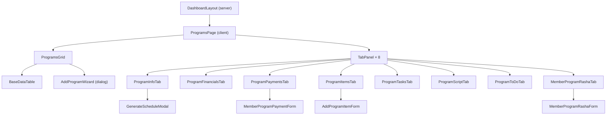
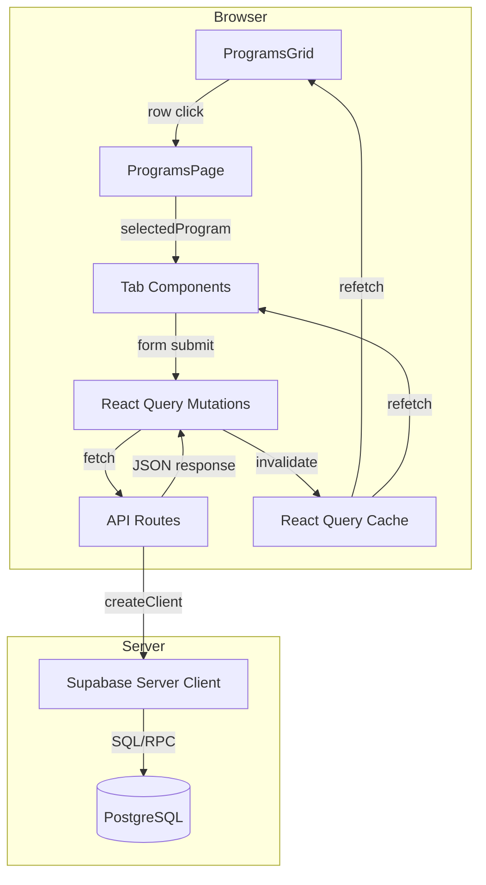

# Sales / Programs Screen — Technical & User Documentation

---

## 1. SCREEN OVERVIEW

| Attribute | Value |
|-----------|-------|
| **Screen Name** | Programs (under Sales section) |
| **Route / URL** | `/dashboard/programs` |
| **Page File** | `src/app/dashboard/programs/page.tsx` |
| **Purpose** | Central hub for creating, viewing, editing, and managing member programs — including financials, items, payments, tasks, scripts, to-dos, and RASHA assignments. |
| **User Roles** | Any authenticated user whose permission set includes `/dashboard/programs`. Admins (`isAdmin`) see all nav items by default. |
| **Auth Gating** | 1) Root middleware redirects unauthenticated users to `/login`. 2) Dashboard layout server component calls `supabase.auth.getUser()` and redirects if null. 3) Sidebar filters nav links by `useUserPermissions()`. |

### Workflow Position

| Before | This Screen | After |
|--------|-------------|-------|
| Lead created in **Marketing → Leads** | Create & manage member programs | Program data feeds into **Coordinator** (script execution), **Payments Tracking**, **Sales Reports**, **Program Analytics**, **Report Card** |

### Layout Description (Top → Bottom)

1. **Programs Data Grid** — MUI DataGrid Pro table listing all member programs with columns: Program Name, Member, Status, Type, Start Date, Cost, Charge, Program Price, Margin, Flag, Created/Updated metadata. Includes toolbar with search, column visibility, density, CSV/print export. An "Add Program" button opens a 3-step wizard dialog. An aggregation footer shows average margin.
2. **Program Details Tabs** (visible only when a row is selected) — A `Card` containing 8 horizontal tabs:
   - **PROGRAM** — Editable form (name, member, status, start date, duration, description, active flag) plus document generation buttons (Contract, Contract Options, Plan Summary) and Generate Schedule.
   - **Financials** — Items Cost, Items Charge, Margin, Financing Type, Finance Charges, Discounts, Taxes, Program Price, Credit. Save button auto-regenerates payments when applicable.
   - **Payments** — DataGrid of payment rows (due date, paid date, amount, status, method, reference, notes) with sum aggregation footer.
   - **Items** — DataGrid of program items (therapy type/name, bucket, quantity, scheduling params, cost, charge, taxable) with Add/Edit/Delete modals.
   - **Tasks** — DataGrid of item tasks (therapy, task name, description, delay, status, completion info) with inline edit modal.
   - **Script** — Read-only DataGrid of scheduled therapy instances (date, type, therapy, instance #, redeemed/missed/pending status).
   - **To Do** — Read-only DataGrid of scheduled task instances (due date, therapy, task, description, status).
   - **RASHA** — Group summary cards + DataGrid of RASHA items (name, length, group, type, order, flag) with Add/Edit/Delete modals.
3. **Unsaved Changes Dialog** — Modal warning when switching tabs with dirty form state.

---

## 2. COMPONENT ARCHITECTURE

### Component Tree

### Component Details

#### `ProgramsPage` — `src/app/dashboard/programs/page.tsx`

| Aspect | Details |
|--------|---------|
| **Props** | None (page component) |
| **Local State** | `selectedProgram: MemberPrograms \| null` (null) — currently selected grid row; `tabValue: number` (0) — active tab index; `hasUnsavedChanges: boolean` (false) — dirty flag from child tabs; `showUnsavedWarning: boolean` (false) — controls warning dialog; `pendingTabChange: number \| null` (null) — deferred tab switch |
| **Hooks** | `useUpdateMemberProgram()` — mutation for saving program edits |
| **Event Handlers** | `handleProgramSelect` — sets selected program, resets tab to 0; `handleTabChange` — guards against unsaved changes; `handleProgramUpdate` — calls PUT mutation then updates local state; `handleUnsavedWarningConfirm/Cancel` — resolve/reject pending tab switch |
| **Conditional Rendering** | Detail tabs render only when `selectedProgram !== null` |

#### `ProgramsGrid` — `src/components/programs/programs-grid.tsx`

| Aspect | Details |
|--------|---------|
| **Props** | `onProgramSelect: (program: MemberPrograms \| null) => void` (required); `selectedProgram: MemberPrograms \| null` (required) |
| **Hooks** | `useMemberPrograms()` — fetches all programs; `useDeleteMemberProgram()` — delete mutation |
| **Columns** | Program Name, Member, Status, Type, Start Date, Cost, Charge, Program Price, Margin, Flag, Created At/By, Updated At/By |
| **Config** | `persistStateKey="programsGrid"`, `pageSize=5`, `enableExport=true`, aggregation on margin (avg), sort by program_template_name asc |
| **Create Mode** | Renders `AddProgramWizard` dialog |

#### `AddProgramWizard` — `src/components/programs/add-program-wizard.tsx`

| Aspect | Details |
|--------|---------|
| **Props** | `open: boolean`, `onClose: () => void`, `onSuccess?: () => void` |
| **Steps** | 1) Select Lead → 2) Select Program Template(s) → 3) Program Details (name, type, description) |
| **Validation** | Step 1: `lead_id` required; Step 2: `selected_template_ids` min 1; Step 3: `program_template_name` required, `program_type` required |
| **Submit** | Calls `useCreateMemberProgram()` with `program_status_id` auto-set to "Quote" |

#### `ProgramInfoTab` — `src/components/programs/program-info-tab.tsx`

| Aspect | Details |
|--------|---------|
| **Props** | `program: MemberPrograms`, `onProgramUpdate: (program) => void`, `onUnsavedChangesChange: (boolean) => void` |
| **Form** | react-hook-form + Zod (`memberProgramSchema`). Fields: program_template_name, lead_id, program_status_id, start_date, duration, active_flag, description |
| **Read-Only** | Disabled when status is Completed, Cancelled, or Lost |
| **Document Buttons** | Contract (Active only), Contract Options (Quote only), Plan Summary (always) |
| **Schedule Generation** | Requires Active status + start_date. Calls `/api/member-programs/[id]/schedule/generate` |
| **Status Transitions** | Validates transition matrix; shows confirmation dialogs for Active↔Paused; calls pause RPC for Active→Paused |

#### `ProgramFinancialsTab` — `src/components/programs/program-financials-tab.tsx`

| Aspect | Details |
|--------|---------|
| **Props** | `program: MemberPrograms`, `onFinancesUpdate?: (data) => void`, `onUnsavedChangesChange?: (boolean) => void` |
| **Hooks** | `useMemberProgramFinances`, `useActiveFinancingTypes`, `useMemberProgramPayments`, `useMemberProgramItems`, `useProgramStatus`, `useFinancialsLock`, `useFinancialsDerived`, `useMembershipFinances` |
| **Lock Logic** | Locked when program is not in Quote status (via `isProgramLocked`). Read-only when Completed/Cancelled. |
| **Derived Values** | Program Price, Margin, Taxes computed via `useFinancialsDerived` hook |
| **Membership Mode** | Shows Monthly Payment, Monthly Discount, Member Since row; hides Financing Type, Finance Charges, Credit |

#### `ProgramPaymentsTab` — `src/components/programs/program-payments-tab.tsx`

| Aspect | Details |
|--------|---------|
| **Props** | `program: MemberPrograms` |
| **Columns** | Due Date, Paid Date, Amount, Status, Method, Reference, Notes |
| **Edit** | Available in Quote or Active status only, renders `MemberProgramPaymentForm` |
| **Aggregation** | Sum of payment_amount shown in footer |

#### `ProgramItemsTab` — `src/components/programs/program-items-tab.tsx`

| Aspect | Details |
|--------|---------|
| **Props** | `program: MemberPrograms`, `onProgramUpdate: (program) => void`, `onUnsavedChangesChange?: (boolean) => void` |
| **CRUD** | Add/Edit via `AddProgramItemForm` dialog; Delete with confirmation |
| **Lock** | Read-only when Completed/Cancelled. Membership items locked after activation. Delete blocked when `used_count > 0`. |

#### `ProgramTasksTab` — `src/components/programs/program-tasks-tab.tsx`

| Aspect | Details |
|--------|---------|
| **Props** | `program: MemberPrograms` |
| **CRUD** | Edit (delay, description, completed_flag) via modal; Delete inline |

#### `ProgramScriptTab` — `src/components/programs/program-script-tab.tsx`

| Aspect | Details |
|--------|---------|
| **Props** | `program: MemberPrograms` |
| **Data** | Read-only schedule instances from `useProgramSchedule`. Three-state status: Redeemed/Missed/Pending. |

#### `ProgramToDoTab` — `src/components/programs/program-todo-tab.tsx`

| Aspect | Details |
|--------|---------|
| **Props** | `program: MemberPrograms` |
| **Data** | Read-only task schedule instances from `useProgramToDo`. Same three-state status. |

#### `MemberProgramRashaTab` — `src/components/programs/member-program-rasha-tab.tsx`

| Aspect | Details |
|--------|---------|
| **Props** | `program: MemberPrograms` |
| **Features** | Group summary cards (color-coded, duration totals), CRUD via `MemberProgramRashaForm`, type mismatch warnings |

---

## 3. DATA FLOW

### Data Lifecycle

1. **Entry**: `useMemberPrograms()` hook calls `GET /api/member-programs` on mount. Returns all programs with joined lead name, status name, template name, margin, final_total_price.
2. **Display**: `ProgramsGrid` maps response to `MemberProgramEntity[]` (adds `id` field for DataGrid). Programs displayed in sortable, filterable, exportable grid.
3. **Selection**: Clicking a row calls `handleProgramSelect`, setting `selectedProgram` state and rendering the 8-tab detail panel.
4. **Tab Data**: Each tab independently fetches its data via dedicated hooks (e.g., `useMemberProgramFinances`, `useMemberProgramItems`, `useMemberProgramPayments`).
5. **Edits**: Forms use react-hook-form with Zod validation. On submit, mutations call API endpoints, then invalidate React Query caches.
6. **Cache Invalidation**: Mutations invalidate `['member-programs', 'list']` and related query keys. Tab switches within a program do not re-fetch unless cache is stale.

### Data Flow Diagram

---

## 4. API / SERVER LAYER

### `GET /api/member-programs`

| Attribute | Value |
|-----------|-------|
| **File** | `src/app/api/member-programs/route.ts` |
| **Auth** | Session required (401 if missing) |
| **Params** | `?active=true` (optional query param to filter active_flag) |
| **Response** | `{ data: MemberPrograms[] }` — flat objects with joined `lead_name`, `lead_email`, `status_name`, `template_name`, `margin`, `final_total_price`, `created_by_email/full_name`, `updated_by_email/full_name` |
| **Joins** | `users` (created/updated), `leads`, `program_status`, `program_template`, `member_program_finances` |
| **Errors** | 401 Unauthorized, 500 Internal |

### `POST /api/member-programs`

| Attribute | Value |
|-----------|-------|
| **File** | `src/app/api/member-programs/route.ts` |
| **Auth** | Session required |
| **Payload** | `{ lead_id: number, selected_template_ids: number[], program_template_name?: string, description?: string, start_date?: string, program_status_id?: number, program_type?: 'one-time' \| 'membership' }` |
| **Validation** | lead_id + selected_template_ids required; verifies lead exists; verifies all templates exist |
| **Action** | Calls `create_member_program_from_template` RPC, then updates program_status_id, program_type, duration (30 for membership) |
| **Response** | `{ data: MemberPrograms }` (201) |
| **Errors** | 400 validation, 401 Unauthorized, 500 Internal |

### `GET /api/member-programs/[id]`

| Attribute | Value |
|-----------|-------|
| **File** | `src/app/api/member-programs/[id]/route.ts` |
| **Auth** | Session required |
| **Response** | `{ data: MemberPrograms }` with lead/status/template joins |
| **Errors** | 401, 404 (not found), 500 |

### `PUT /api/member-programs/[id]`

| Attribute | Value |
|-----------|-------|
| **File** | `src/app/api/member-programs/[id]/route.ts` |
| **Auth** | Session required |
| **Payload** | Partial `MemberPrograms` fields |
| **Validation** | program_template_name cannot be empty; status transition matrix enforced server-side |
| **Side Effects** | Membership activation (Quote→Active): creates `member_program_membership_finances`, sets `billing_period_month=1` on items, sets `next_billing_date`, creates first payment. Unpause (Paused→Active): calls `generate_member_program_schedule` RPC. |
| **Errors** | 400 (invalid transition), 401, 500 |

### `POST /api/member-programs/[id]?action=pause`

| Attribute | Value |
|-----------|-------|
| **File** | `src/app/api/member-programs/[id]/route.ts` |
| **Auth** | Session required |
| **Action** | Calls `pause_member_program` RPC |
| **Errors** | 400 (invalid id or unsupported action), 401, 500 |

### `DELETE /api/member-programs/[id]`

| Attribute | Value |
|-----------|-------|
| **File** | `src/app/api/member-programs/[id]/route.ts` |
| **Auth** | Session required |
| **Validation** | Cannot delete if program has active items |
| **Errors** | 400 (has active items), 401, 500 |

### Additional API Endpoints Used by Tabs

| Endpoint | Method | Tab | Purpose |
|----------|--------|-----|---------|
| `/api/member-programs/[id]/finances` | GET, POST, PUT | Financials | CRUD for `member_program_finances` |
| `/api/member-programs/[id]/payments` | GET | Payments | List payments |
| `/api/member-programs/[id]/payments/[paymentId]` | PUT | Payments | Update single payment |
| `/api/member-programs/[id]/payments/regenerate` | POST | Financials | Regenerate payments after financial changes |
| `/api/member-programs/[id]/items` | GET, POST | Items | List/create items |
| `/api/member-programs/[id]/items/[itemId]` | PUT, DELETE | Items | Update/delete items |
| `/api/member-programs/[id]/tasks` | GET | Tasks | List tasks |
| `/api/member-programs/[id]/tasks/[taskId]` | PUT, DELETE | Tasks | Update/delete tasks |
| `/api/member-programs/[id]/schedule` | GET | Script | List schedule instances |
| `/api/member-programs/[id]/schedule/generate` | POST | Program Info | Generate schedule (with `?recentOnly=true` option) |
| `/api/member-programs/[id]/todo` | GET | To Do | List task schedule instances |
| `/api/member-programs/[id]/rasha` | GET, POST | RASHA | List/create RASHA items |
| `/api/member-programs/[id]/rasha/[rashaId]` | PUT, DELETE | RASHA | Update/delete RASHA items |
| `/api/member-programs/[id]/membership-finances` | GET | Financials | Membership monthly finances |

---

## 5. DATABASE LAYER

### Tables Touched

#### `member_programs` (primary)

| Column | Type | Nullable | Notes |
|--------|------|----------|-------|
| member_program_id | integer (PK) | No | Auto-increment |
| program_template_name | text | Yes | Display name |
| description | text | Yes | Member goals |
| total_cost | numeric | Yes | Sum of item costs |
| total_charge | numeric | Yes | Sum of item charges |
| lead_id | integer (FK → leads) | Yes | Associated member |
| start_date | date | Yes | Program start |
| duration | integer | No | Days (default 30 for memberships) |
| active_flag | boolean | No | Soft-delete flag |
| program_status_id | integer (FK → program_status) | Yes | Current status |
| source_template_id | integer (FK → program_template) | Yes | Original template |
| template_version_date | timestamp | Yes | Template snapshot date |
| program_type | text | Yes | `'one-time'` or `'membership'` |
| next_billing_date | date | Yes | Next membership billing date |
| created_at/updated_at | timestamp | Yes | Audit timestamps |
| created_by/updated_by | uuid (FK → users) | Yes | Audit user IDs |

#### `member_program_finances`

| Column | Type | Nullable | Notes |
|--------|------|----------|-------|
| member_program_finance_id | integer (PK) | No | |
| member_program_id | integer (FK) | No | One-to-one with member_programs |
| finance_charges | numeric | Yes | Can be negative (partner cost) or positive (financing fee) |
| taxes | numeric | Yes | Calculated from taxable items at 8.25% |
| discounts | numeric | Yes | Always negative |
| final_total_price | numeric | Yes | Locked program price |
| margin | numeric | Yes | Percentage |
| financing_type_id | integer (FK) | Yes | |
| contracted_at_margin | numeric | Yes | Margin at time of activation |
| variance | numeric | Yes | Projected - Locked price |

#### `member_program_items`

| Column | Type | Nullable | Notes |
|--------|------|----------|-------|
| member_program_item_id | integer (PK) | No | |
| member_program_id | integer (FK) | Yes | |
| therapy_id | integer (FK → therapies) | Yes | |
| quantity | integer | Yes | Number of instances |
| item_cost | numeric | Yes | Cost per unit |
| item_charge | numeric | Yes | Charge per unit |
| days_from_start | integer | Yes | Scheduling offset |
| days_between | integer | Yes | Recurrence interval |
| instructions | text | Yes | |
| program_role_id | integer (FK) | Yes | |
| billing_period_month | integer | Yes | Membership billing period |

#### `member_program_payments`

| Column | Type | Notes |
|--------|------|-------|
| member_program_payment_id | integer (PK) | |
| member_program_id | integer (FK) | |
| payment_amount | numeric | |
| payment_due_date | date | |
| payment_date | date | Null until paid |
| payment_status_id | integer (FK) | |
| payment_method_id | integer (FK) | |
| payment_reference | text | |
| notes | text | |

#### Other Tables

| Table | Relationship |
|-------|-------------|
| `program_status` | Lookup: status_name (Quote, Active, Paused, Completed, Cancelled) |
| `program_template` | Source template for program creation |
| `member_program_item_tasks` | Tasks attached to program items |
| `member_program_item_schedule` | Script instances (therapy schedule) |
| `member_program_items_task_schedule` | To-do instances (task schedule) |
| `member_program_rasha` | RASHA assignments |
| `member_program_membership_finances` | Locked monthly values for memberships |
| `leads` | Member/lead information |
| `therapies` | Therapy catalog |
| `program_roles` | Role assignments within programs |
| `financing_types` | Payment plan options |

### Key Database RPCs

| RPC | Called From | Purpose |
|-----|------------|---------|
| `create_member_program_from_template` | POST /api/member-programs | Creates program + copies template items/tasks/RASHA |
| `pause_member_program` | POST /api/member-programs/[id]?action=pause | Pauses schedules, records transition |
| `generate_member_program_schedule` | POST /api/member-programs/[id]/schedule/generate | Generates/regenerates schedule instances |
| `regenerate_member_program_payments` | POST /api/member-programs/[id]/payments/regenerate | Recalculates payment rows |

---

## 6. BUSINESS RULES & LOGIC

### Status Transition Matrix

| From \ To | Quote | Active | Paused | Completed | Cancelled |
|-----------|-------|--------|--------|-----------|-----------|
| **Quote** | — | Yes | No | No | Yes |
| **Active** | No | — | Yes | Yes* | Yes |
| **Paused** | No | Yes | — | Yes* | Yes |
| **Completed** | No | No | No | — | No |
| **Cancelled** | No | No | No | No | — |

\* Membership programs **cannot** transition to Completed (only One-Time can).

**Enforcement**: Client-side (dropdown disables invalid options + toast), Server-side (API returns 400).

### Activation Prerequisites (Quote → Active)

| Rule | Enforcement | Violation Behavior |
|------|------------|-------------------|
| Start Date must be set | Frontend toast + API | "Start Date is required when status is Active" |
| Financing Type must be selected (one-time only) | Frontend toast | "Financing Type must be selected before activating program" |
| At least one payment must exist (one-time only) | Frontend toast | "Program must have at least one payment before activating" |

### Pause / Unpause Behavior

- **Active → Paused**: Calls `pause_member_program` RPC (holds incomplete script items/tasks). Confirmation dialog shown.
- **Paused → Active**: Calls `generate_member_program_schedule` RPC (shifts incomplete items forward by pause duration). Confirmation dialog shown.

### Membership Activation Side Effects

When a membership program transitions from Quote → Active, the API automatically:
1. Calculates `monthly_rate` from active item charges
2. Creates `member_program_membership_finances` record
3. Sets `billing_period_month = 1` on all active items
4. Sets `next_billing_date = start_date + 1 month`
5. Creates first payment record (monthly_rate + monthly_discount)

### Read-Only States

Programs in **Completed**, **Cancelled**, or **Lost** status are fully read-only. All tabs display a warning alert and disable editing via `<fieldset disabled>`.

### Financial Lock

The Financials tab is locked (non-editable) when program status is **not** Quote. Finance charges require a financing type to be selected first.

### Membership Item Lock

For membership programs, items are locked after activation (not in Quote status) to ensure consistent monthly billing.

### Delete Guard

Programs cannot be deleted if they have active items (`active_flag = true`).

### Item Delete Guard

Items cannot be deleted if `used_count > 0` (instances already scheduled/redeemed).

### Financial Calculations

| Value | Formula |
|-------|---------|
| **Program Price (Quote)** | `totalCharge + taxes + max(financeCharges, 0) + discounts + \|variance\|` |
| **Program Price (Active)** | Locked price (set at activation) |
| **Taxes** | `totalTaxableCharge × 0.0825` (8.25% sales tax on taxable items only) |
| **Margin** | `((preTaxRevenue - adjustedCost) / preTaxRevenue) × 100` |
| **Margin Color** | Green ≥ 80%, Orange ≥ 75%, Red < 75% |

### Payments Auto-Regeneration

Saving the Financials tab auto-regenerates payments when financing type, finance charges, or discounts change (one-time programs only). Membership payments are generated monthly by a separate system job.

---

## 7. FORM & VALIDATION DETAILS

### Program Info Form (`memberProgramSchema`)

| Field | Type | Validation | Client Error |
|-------|------|-----------|--------------|
| program_template_name | TextField | `z.string().min(1)` | "Program Name is required" |
| description | TextField (multiline) | `z.string().nullable().optional()` | — |
| lead_id | Select (leads) | `z.number().nullable().optional()` | — |
| start_date | Date input | `z.string().nullable().optional()` | Toast: "Start Date is required when status is Active" |
| duration | Number input | `z.number().min(1)` | "Duration must be at least 1" |
| program_status_id | Select (statuses) | `z.number().nullable().optional()` | Toast for invalid transitions |
| active_flag | Switch | `z.boolean().optional()` | — |

### Financials Form (`memberProgramFinancesSchema`)

| Field | Type | Validation | Client Error |
|-------|------|-----------|--------------|
| finance_charges | Currency/% input | `z.number().min(-999999.99).max(999999.99)` | Range violation message |
| discounts | Currency/% input | `z.number().max(0).min(-999999.99)` | "Discounts must be negative" |
| financing_type_id | Select | `z.number().optional()` | — |
| final_total_price | Display only | `z.number().min(0).max(9999999.99)` | — |
| margin | Display only | `z.number().min(-999.99).max(999.99)` | — |

### Add Program Wizard

| Step | Fields | Validation |
|------|--------|-----------|
| 1 - Select Lead | `lead_id` | `z.number().min(1, 'Please select a lead')` |
| 2 - Select Templates | `selected_template_ids` | `z.array(z.number()).min(1)` |
| 3 - Program Details | `program_template_name`, `program_type`, `description` | Name required, type required (`'one-time' \| 'membership'`) |

### Unsaved Changes Tracking

- `ProgramInfoTab`: Uses react-hook-form `isDirty` flag → notifies parent via `onUnsavedChangesChange`.
- `ProgramFinancialsTab`: Compares current values against baseline refs (`originalFinancingTypeIdRef`, `originalFinanceChargesRef`, `originalDiscountsRef`).
- `ProgramItemsTab`: Passes `onUnsavedChangesChange` but currently unused.
- Tab switching with unsaved changes triggers confirmation dialog.

---

## 8. STATE MANAGEMENT

### Local Component State

| Component | State | Purpose |
|-----------|-------|---------|
| ProgramsPage | `selectedProgram`, `tabValue`, `hasUnsavedChanges`, `showUnsavedWarning`, `pendingTabChange` | Page-level selection and tab control |
| ProgramInfoTab | `isSaving`, `confirmOpen`, `pendingSave`, `isGenerating*` (5 flags) | Save/generate loading states |
| ProgramFinancialsTab | `discountsInput`, `financeChargesInput`, `baselineVersion`, `inline` | Local display inputs, save status |
| ProgramItemsTab | `isAddModalOpen`, `isEditModalOpen`, `editingItem`, `isDeleteModalOpen`, `deletingItem`, `validationError` | Modal control |

### Shared/Global State

| Store | Keys | Purpose |
|-------|------|---------|
| React Query Cache | `['member-programs', 'list']` | All programs list |
| React Query Cache | `['member-programs', 'detail', id]` | Single program detail |
| React Query Cache | `['member-program-finances', id]` | Program financials |
| React Query Cache | `['member-program-payments', id]` | Program payments |
| React Query Cache | `['member-program-items', id]` | Program items |
| React Query Cache | `['program-schedule', id]` | Script schedule |
| React Query Cache | `['program-todo', id]` | Task schedule |
| React Query Cache | `['member-program-rasha', id]` | RASHA items |
| React Query Cache | `['user-permissions']` | Sidebar permission filtering |

### URL State

None — the screen uses no query params or route params. Program selection is ephemeral (lost on refresh).

### Persisted State

DataGrid column/sort/filter state persisted via `persistStateKey` prop (localStorage via MUI DataGrid Pro state persistence): `"programsGrid"`, `"programItemsGrid"`, `"programPaymentsGrid"`, `"programScriptGrid"`, `"programToDoGrid"`, `"programRashaGrid"`.

---

## 9. NAVIGATION & ROUTING

### Inbound

| Source | Path | Trigger |
|--------|------|---------|
| Sidebar | `Sales → Programs` | Click nav item |
| Direct URL | `/dashboard/programs` | Browser navigation |

### Outbound

No outbound links from this screen. Users navigate away via the sidebar.

### Route Guards

1. **Middleware** (`middleware.ts`): Checks `x-user` header; redirects `/dashboard/*` to `/login` if not authenticated.
2. **Dashboard Layout** (`src/app/dashboard/layout.tsx`): Server-side `supabase.auth.getUser()`; redirects to `/login` if null.
3. **Sidebar Permission** (`Sidebar.tsx`): Filters nav items by `useUserPermissions()`. Users without `/dashboard/programs` permission won't see the link (but can still access via direct URL — no page-level guard).

### Deep Linking

Not supported. Program selection is local state, not URL-based. Sharing the URL `/dashboard/programs` always shows the grid with no program selected.

---

## 10. ERROR HANDLING & EDGE CASES

### Error States

| Scenario | Treatment | Recovery |
|----------|-----------|----------|
| Programs fetch fails | `BaseDataTable` shows error message in grid area | Automatic retry via React Query (3 retries by default) |
| Program update fails | Toast error via `sonner` | User can retry save |
| Schedule generation fails | Toast error | User can retry |
| Document generation fails | Toast error with detailed message | User can retry |
| Financial data fetch fails | `Alert severity="error"` inline | Page-level error display |
| Invalid status transition | Toast with allowed transitions listed | User selects valid status |
| Delete blocked (has items) | API returns 400, toast error | Remove items first |

### Empty States

| Scenario | Display |
|----------|---------|
| No programs exist | Empty DataGrid with "No rows" message |
| No program selected | Only grid shown; detail tabs hidden |
| No items on program | Empty items DataGrid |
| No payments | Empty payments DataGrid |
| No script instances | Empty script DataGrid |
| No RASHA items | No group summary cards; empty DataGrid |

### Loading States

| Component | Loading Indicator |
|-----------|------------------|
| ProgramsGrid | `BaseDataTable` built-in loading overlay |
| Tab data fetches | Individual loading states per hook |
| Save operations | Button shows `CircularProgress` spinner + "Saving..." text |
| Document generation | Button shows `CircularProgress` spinner + "Generating..." text |
| Sidebar permissions | "Loading permissions..." text |

### Timeout / Offline

No explicit timeout handling or offline support. Supabase client will fail with network errors surfaced as generic error messages.

---

## 11. ACCESSIBILITY

### ARIA

| Element | ARIA Attribute |
|---------|---------------|
| Tab panels | `role="tabpanel"`, `id="program-tabpanel-{index}"`, `aria-labelledby="program-tab-{index}"` |
| Tabs | `aria-label="program tabs"` |
| Unsaved changes dialog | `aria-labelledby="unsaved-changes-dialog-title"` |
| Confirm status dialog | `aria-labelledby` set on DialogTitle |

### Keyboard Navigation

- Standard MUI Tab keyboard navigation (Arrow keys to switch tabs, Enter/Space to select).
- DataGrid supports full keyboard navigation (arrow keys, Enter to select, Space for checkboxes).
- Dialogs trap focus per MUI Dialog behavior.

### Screen Reader Considerations

- Tab icons have associated labels (e.g., `label="PROGRAM"`).
- Status chips use text labels (not color alone).
- Currency values rendered as text, not images.

### Color Contrast

- Margin color coding (green/orange/red) is supplemented by numeric percentage display.
- RASHA type mismatch uses both WarningIcon and tooltip text.
- Status chips use MUI's built-in color palette with WCAG-compliant contrast.

### Focus Management

- Dialog open: focus moves into dialog (MUI default).
- Dialog close: focus returns to trigger element (MUI default).
- Tab switch: focus moves to tab content area.

---

## 12. PERFORMANCE CONSIDERATIONS

### Potential Concerns

| Area | Status | Notes |
|------|--------|-------|
| **Programs list size** | No virtualization needed | `pageSize=5` with pagination; DataGrid Pro handles large datasets efficiently |
| **Tab lazy rendering** | Implemented | `TabPanel` only renders children when `value === index` |
| **Re-renders** | Moderate | `useFinancialsDerived` uses `useMemo`; some components could benefit from `React.memo` |
| **N+1 queries** | Avoided | API uses Supabase joins (`select('*, lead:leads!..., ...')`) |
| **Bundle impact** | Significant | MUI DataGrid Pro, MUI X, react-hook-form, zod, docx generation libraries |
| **Document generation** | Client-side | Template loading + DOCX generation happens in browser; could be slow for large documents |

### Caching Strategy

- **React Query**: Default stale time; data refetched on window focus. Mutations invalidate relevant query keys.
- **DataGrid State**: Column widths, sort order, filters persisted to localStorage via `persistStateKey`.
- **No server-side caching**: API routes do not set Cache-Control headers.

---

## 13. THIRD-PARTY INTEGRATIONS

| Service | Purpose | Package | Config |
|---------|---------|---------|--------|
| **Supabase** | Authentication, Database, RPC | `@supabase/supabase-js`, `@supabase/ssr` | `NEXT_PUBLIC_SUPABASE_URL`, `NEXT_PUBLIC_SUPABASE_ANON_KEY` (env vars) |
| **Sonner** | Toast notifications | `sonner` | No config needed |
| **DOCX Generation** | Quote/Contract/Plan Summary documents | Template-based (via `src/lib/utils/generate-quote-template.ts`, `template-loader.ts`) | Templates in `public/templates/` directory |

### Failure Modes

- **Supabase down**: All data fetches fail; error states shown. No fallback.
- **Template missing**: Document generation fails with descriptive error toast.

---

## 14. SECURITY CONSIDERATIONS

### Authentication

- Supabase session-based auth via cookies (`@supabase/ssr`).
- Every API route checks `supabase.auth.getSession()` and returns 401 if missing.
- `updated_by` field set to `session.user.id` server-side (cannot be spoofed by client).

### Authorization

- **Sidebar-level**: Nav items filtered by user permissions (client-side hiding only).
- **API-level**: No role-based authorization on `/api/member-programs/*` routes. Any authenticated user can read/write any program. **This is a gap** — see Code Review Findings.
- **RLS**: No Row Level Security policies on `member_programs` or related tables in checked-in migrations.

### Input Sanitization

- Zod schemas validate input types and ranges on the client.
- API routes validate required fields and existence checks (lead, template).
- Supabase client uses parameterized queries (no raw SQL injection risk).
- No explicit XSS sanitization on text fields (relies on React's built-in escaping).

### CSRF

- Supabase uses cookie-based auth with `SameSite` attribute. No explicit CSRF tokens.

### Sensitive Data

- No PII beyond lead names and emails (displayed in dropdowns and grid).
- Financial data (costs, charges, prices) visible to all authenticated users.
- No HIPAA-specific controls observed.

---

## 15. TESTING COVERAGE

### Existing Tests

| File | Coverage |
|------|---------|
| `src/lib/services/__tests__/program-status-service.test.md` | Test plan document (markdown, not executable) |

### Gaps

No executable unit, integration, or E2E tests exist for this screen.

### Suggested Test Cases

#### Unit Tests

- `memberProgramSchema` validation (required name, valid duration, nullable optionals)
- `memberProgramFinancesSchema` validation (negative discounts, range limits)
- `isProgramReadOnly()` — returns true for Completed/Cancelled/Lost, false otherwise
- `isProgramLocked()` — locks when not Quote status
- `calculateProjectedPrice()` — correct formula with positive/negative finance charges
- `useFinancialsDerived` — correct margin, taxes, program price for Quote vs Active
- `getValidStatusTransitions()` — correct transitions per status and program type

#### Integration Tests

- `GET /api/member-programs` — returns joined data, filters by active flag
- `POST /api/member-programs` — creates from template, validates lead/template existence
- `PUT /api/member-programs/[id]` — enforces status transitions, handles membership activation
- `DELETE /api/member-programs/[id]` — blocks when items exist

#### E2E Tests

- Create a new program via wizard (select lead → select template → enter details → verify grid)
- Edit program info → change status from Quote to Active (verify prerequisites enforced)
- Add/edit/delete items on a program → verify cost/charge updates
- Modify financials → verify payments regenerate
- Navigate away with unsaved changes → verify warning dialog

---

## 16. CODE REVIEW FINDINGS

| Severity | File | Issue | Suggested Fix |
|----------|------|-------|---------------|
| **Critical** | `src/app/api/member-programs/[id]/route.ts` (PUT, line 296-423) | Membership activation is not transactional. If step 3/4/5/6 fails, earlier steps are committed. Status is already changed. | Wrap activation in a Postgres function/transaction or use Supabase RPC. Currently logs error but returns partial success. |
| **High** | All `/api/member-programs/*` routes | No role-based authorization. Any authenticated user can modify any program. Sidebar permission filtering is client-side only. | Add server-side permission checks or RLS policies on `member_programs`. |
| **High** | `src/app/api/member-programs/[id]/route.ts` (DELETE, line 481) | `context.params` not awaited (uses `context.params.id` directly instead of `await context.params`). Inconsistent with GET/PUT which await params. May break in Next.js 15+. | Use `const { id } = await context.params;` |
| **Medium** | `src/components/programs/programs-grid.tsx` (line 198-226) | Edit mode (`handleEdit` and `renderProgramForm` for edit) returns `null` — edit via grid action button is non-functional. | Implement edit form or remove edit action from grid. |
| **Medium** | `src/app/dashboard/programs/page.tsx` | No URL-based program selection. Selecting a program is lost on page refresh. | Use URL search params (`?id=123`) to persist selection. |
| **Medium** | `src/components/programs/program-financials-tab.tsx` (line 153-162) | Margin color thresholds (80/75) are hardcoded. | Extract to constants or configuration. |
| **Medium** | `src/components/programs/program-info-tab.tsx` (line 302-358) | Contract Options generation checks `existingDiscounts !== 0` to block, but Contract generation has no such check. Inconsistent business logic. | Clarify whether the discount check should apply to both or neither. |
| **Low** | `src/components/programs/programs-grid.tsx` (line 32-43) | `renderCell` uses inline styles instead of MUI `sx` prop. | Use `sx` for consistency. |
| **Low** | `src/components/programs/program-financials-tab.tsx` | `hasChanges` and `wouldRegenerate` memos compute identical logic. | Extract to single memo. |
| **Low** | Multiple tab components | Repeated pattern of fetching `freshProgram`, `statuses`, computing `isProgramReadOnly`. | Extract to a shared hook like `useProgramReadOnlyState(program)`. |
| **Low** | `src/components/programs/program-info-tab.tsx` (line 106) | `console.error` statements left in production code across multiple files. | Replace with structured logging or remove. |

---

## 17. TECH DEBT & IMPROVEMENT OPPORTUNITIES

### Refactoring Opportunities

1. **Extract `useProgramReadOnlyState` hook** — Every tab duplicates `useMemberProgram` + `useProgramStatus` + `isProgramReadOnly` logic. A single hook would reduce ~50 lines per tab.
2. **Extract status transition logic** — `getValidStatusTransitions()` is duplicated in ProgramInfoTab and the API route. Move to a shared utility.
3. **Unify financial inputs** — `discountsInput` / `financeChargesInput` local state pattern in Financials tab could be a reusable `CurrencyPercentInput` component.
4. **Remove backup file** — `program-financials-tab.backup.tsx` should be deleted.

### Missing Abstractions

- **Document generation service** — Quote, Contract, Contract Options, Plan Summary generation logic lives in the component. Extract to a service layer.
- **Permission middleware** — No reusable server-side permission check. Each API route only checks authentication, not authorization.

### Deprecated Patterns

- **`context.params` without `await`** in DELETE handler (Next.js 15 requires `await`).
- **`any` type usage** — Extensive `any` casts in DataGrid column definitions and row handlers.

### Scalability Suggestions

- **Paginate programs API** — Currently fetches all programs. Add server-side pagination for large datasets.
- **Add URL-based program selection** — Enable deep linking and refresh persistence.
- **Add optimistic updates** — Mutations currently wait for server response before updating UI.

---

## 18. END-USER DOCUMENTATION DRAFT

### Programs

Manage all member programs — create new programs from templates, track financials, schedule therapies, and monitor progress.

---

### What This Page Is For

The Programs page is where you manage the full lifecycle of a member's program. From here you can create new programs, set pricing and financials, manage therapy items, generate schedules, track payments, and produce documents like quotes and contracts.

---

### Step-by-Step Instructions

#### Creating a New Program

1. Click **Add Program** in the top-right of the programs grid.
2. **Step 1 — Select Lead**: Choose the member from the dropdown, then click **Next**.
3. **Step 2 — Select Templates**: Check one or more program templates to use. A cost summary appears below. Click **Next**.
4. **Step 3 — Program Details**: Enter the program name (pre-filled from template), select the program type (One-Time or Membership), and optionally add a member goal. Click **Create Program**.
5. The new program appears in the grid with **Quote** status.

#### Editing Program Details

1. Click a program row in the grid to open its detail tabs.
2. On the **PROGRAM** tab, modify fields such as Status, Start Date, Duration, or Description.
3. Click **Save Changes** when done.

#### Managing Financials

1. Select a program and go to the **Financials** tab.
2. Set the **Financing Type** (required before activating).
3. Enter **Discounts** and/or **Finance Charges** (supports dollar amounts or percentages — type `10%` and press Tab).
4. Review the calculated **Program Price**, **Taxes**, and **Margin**.
5. Click **Save and Update Payments** to save and recalculate payment rows.

#### Activating a Program

Before activating, ensure:
- A **Start Date** is set
- A **Financing Type** is selected (one-time programs)
- At least one **Payment** exists (one-time programs)

Then change the Status dropdown to **Active** and click **Save Changes**.

#### Generating a Schedule

1. Ensure the program is **Active** with a Start Date.
2. Click **Generate Schedule** on the PROGRAM tab.
3. Choose **Generate All** (full schedule) or **Generate Recent** (items added in the last 30 minutes).

#### Generating Documents

- **Contract Options** — Available when the program is in **Quote** status. Generates a document with multiple financing scenarios.
- **Contract** — Available when the program is **Active**. Generates the final signed contract.
- **Plan Summary** — Available at any time. Generates a summary of all program items.

---

### Field Descriptions

| Field | Description |
|-------|-------------|
| **Program Name** | The name of this program (defaults to the template name) |
| **Member** | The lead/member associated with this program (cannot be changed after creation) |
| **Status** | Current lifecycle stage: Quote → Active → Completed, or Paused/Cancelled |
| **Start Date** | When the program begins (required for activation) |
| **Duration** | Program length in days (auto-set to 30 for memberships) |
| **Program Type** | One-Time (fixed duration) or Membership (monthly recurring) |
| **Active Flag** | Whether this program is active in the system |
| **Member Goals** | Free-text description of the member's goals for this program |

---

### Tips and Notes

- **Unsaved changes warning**: If you've edited a form and try to switch tabs, you'll be warned about losing your changes.
- **Margin colors**: Green (≥80%) means healthy margin, Orange (≥75%) is cautionary, Red (<75%) needs attention.
- **Percentage input**: In financial fields, you can type `10%` and the system will convert it to a dollar amount based on the relevant base.
- **Membership programs** have different rules: items are locked after activation, payments are generated monthly, and the "Completed" status is not available.

---

### FAQ

**Q: Why can't I change the status to Active?**
A: The Active option is disabled if prerequisites aren't met. Check that you have a Start Date, a Financing Type selected (one-time programs), and at least one payment created (one-time programs).

**Q: Why is the Financials tab locked?**
A: Financial fields can only be edited when the program is in **Quote** status. Once activated, the program price is locked to protect the contracted amount.

**Q: Can I edit items after a program is activated?**
A: For one-time programs, yes. For membership programs, items are locked after activation to ensure consistent monthly billing.

**Q: What happens when I pause a program?**
A: All incomplete script items and tasks are put on hold. When you reactivate, they are automatically shifted forward by the pause duration.

**Q: Why can't I delete a program?**
A: Programs with active items cannot be deleted. Remove all items first, then delete.

---

### Troubleshooting

| Issue | Solution |
|-------|----------|
| **Programs grid is empty** | Check that programs exist in the system. If you just created one, try refreshing the page. |
| **"Failed to save program" error** | Check your internet connection. If the error mentions a status transition, ensure you're following a valid transition path. |
| **Document generation fails** | Ensure the program has financial data (at minimum, items with costs). Check that template files exist in the server's templates directory. |
| **Schedule generation says "0 instances created"** | Ensure items have `days_from_start` and `quantity` values set. The program must also have a Start Date. |
| **Financial values seem wrong** | Remember that taxes are only applied to taxable items (8.25%). Discounts must be negative numbers. Negative finance charges affect margin but not the customer price. |
