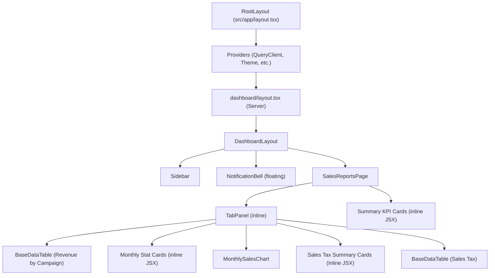
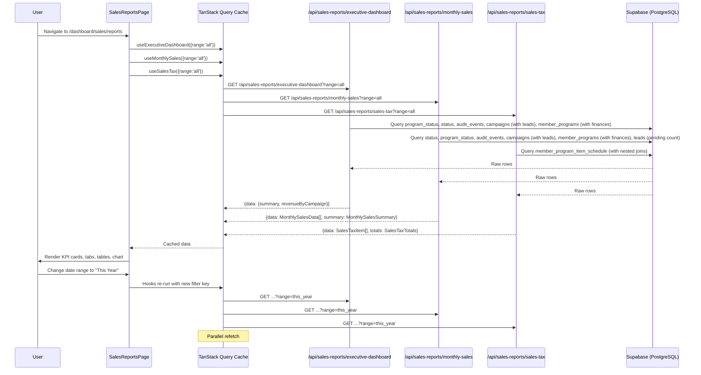

# Sales Reports Screen — Technical & End-User Documentation

---

## 1. Screen Overview

| Property | Value |
|---|---|
| **Screen Name** | Sales Reports |
| **Route / URL** | `/dashboard/sales/reports` |
| **Page File** | `src/app/dashboard/sales/reports/page.tsx` |
| **Purpose** | Provides comprehensive sales performance analytics: KPI summary cards, revenue-by-campaign breakdowns, monthly trend charts, and sales tax reporting for redeemed items. |

### User Roles & Access

- **Authentication:** Required. Middleware (`middleware.ts`) redirects unauthenticated users to `/login` for any path under `/dashboard`. The dashboard layout (`src/app/dashboard/layout.tsx`) performs a secondary server-side check via `supabase.auth.getUser()`.
- **Permission Gating:** The sidebar filters navigation items via `useUserPermissions()`. A user sees the "Reports" link under the **Sales** section only if `isAdmin === true`, `permissions` includes `'*'`, or `permissions` includes `'/dashboard/sales/reports'`. Permissions are stored in the `user_menu_permissions` table.
- **API-Level Auth:** Each API route independently verifies authentication (see Section 4). There is **no** role or permission check at the API level — any authenticated user who knows the URL can access the data.

### Workflow Context

| Direction | Screen | Trigger |
|---|---|---|
| **Inbound** | Sidebar → Sales → Reports | User clicks nav link |
| **Sibling** | Sales → Programs (`/dashboard/programs`) | Sidebar nav |
| **Related** | Operations → Executive Dashboard (reuses `useExecutiveDashboard`) | Sidebar nav |

### Layout Description (Top → Bottom)

1. **Header:** Page title "Sales Reports" with subtitle, plus a date-range filter bar (preset dropdown + optional custom date pickers).
2. **Summary KPI Cards (5):** A single row of cards — Total Revenue, Pipeline Value, Avg Program Value, Avg Margin %, Conversion Rate — each with an icon and colored top border.
3. **Tabs Bar:** Three tabs — "Revenue by Campaign", "Monthly Stats", "Sales Tax".
4. **Tab Content:**
   - **Revenue by Campaign (Tab 0):** Full-width MUI X DataGridPro table with campaign-level metrics.
   - **Monthly Stats (Tab 1):** Left sidebar with two summary cards (PMEs Scheduled, Programs Won) + right area with a Recharts `ComposedChart` showing revenue, PME → Win %, and Event → PME % over time.
   - **Sales Tax (Tab 2):** Three summary cards (Total Charges, Taxable Amount, Total Sales Tax) + a DataGridPro table of individual redeemed items with tax details.

---

## 2. Component Architecture

### Component Tree



### Component Details

#### `SalesReportsPage` — `src/app/dashboard/sales/reports/page.tsx`

| Aspect | Details |
|---|---|
| **Props** | None (page component) |
| **Local State** | `tabValue: number` (init `0`) — active tab index |
| | `dateRange: DateRangeFilter['range']` (init `'all'`) — selected preset |
| | `startDate: string \| null` (init `null`) — custom range start |
| | `endDate: string \| null` (init `null`) — custom range end |
| **Hooks** | `useExecutiveDashboard(filters)` — fetches KPI summary + campaign table data |
| | `useMonthlySales(filters)` — fetches monthly trend + summary counts |
| | `useSalesTax(filters)` — fetches sales tax line items + totals |
| **Event Handlers** | `handleTabChange(event, newValue)` — sets `tabValue` |
| | `handleDateRangeChange(value)` — sets `dateRange`, initializes/clears custom dates |
| **Conditional Rendering** | Error state: shown when `error` is truthy (executive dashboard hook) |
| | Loading state: shown when `isLoading` is truthy |
| | Dashboard content: shown when `!error && !isLoading` |
| | Custom date pickers: shown only when `dateRange === 'custom'` |
| | Tab panels: rendered based on `tabValue === index` match |

#### `TabPanel` — Inline in `page.tsx`

| Aspect | Details |
|---|---|
| **Props** | `children: ReactNode`, `index: number`, `value: number` |
| **Behavior** | Renders children only when `value === index`; sets `role="tabpanel"` and appropriate ARIA IDs |

#### `MonthlySalesChart` — `src/components/sales-reports/MonthlySalesChart.tsx`

| Aspect | Details |
|---|---|
| **Props** | `data: MonthlySalesData[] \| undefined` (required), `isLoading: boolean` (required), `error: Error \| null` (required) |
| **Local State** | None |
| **Conditional Rendering** | Loading → Skeleton card; Error → Alert card; Empty → Info alert; Data → ComposedChart |
| **Internal Components** | `CustomTooltip` — inline component for Recharts tooltip formatting |
| **Helper Functions** | `formatMonthLabel(monthString)` — converts `"2025-11"` → `"Nov '25"` |

#### `BaseDataTable<T>` — `src/components/tables/base-data-table.tsx`

| Aspect | Details |
|---|---|
| **Generic** | `T extends BaseEntity` (requires `id` field) |
| **Key Props Used** | `title=""`, `data`, `columns`, `loading`, `onEdit={() => {}}`, `showCreateButton=false`, `showActionsColumn=false`, `persistStateKey` |
| **State Persistence** | Uses `persistStateKey` + `user.id` to save/restore DataGridPro column widths, order, sort, and pagination to `localStorage` |
| **Internal Hooks** | `useAuth()` for user ID (state persistence keying), `useGridApiRef()` for DataGrid API access |

---

## 3. Data Flow

### Data Lifecycle

1. **Entry:** Page mounts → three TanStack Query hooks fire `GET` requests to `/api/sales-reports/*` endpoints with date-range query params.
2. **Server Processing:** Each API route authenticates via Supabase, queries multiple tables, performs in-memory aggregation/filtering, returns JSON.
3. **Client Transformation:** Minimal — campaign summary is destructured from response; `MonthlySalesChart` formats month labels; currency values are formatted inline via `toLocaleString` and `renderCell` functions.
4. **Display:** Data flows into MUI components (Cards, DataGridPro, Recharts chart).
5. **User Interaction:** User selects a date range → state updates → TanStack Query cache key changes → automatic refetch. Tab switching is client-only (no refetch).

### Data Flow Diagram



---

## 4. API / Server Layer

### 4.1 `GET /api/sales-reports/executive-dashboard`

| Property | Value |
|---|---|
| **File** | `src/app/api/sales-reports/executive-dashboard/route.ts` |
| **Method** | `GET` |
| **Auth** | `supabase.auth.getUser()` — returns 401 if no user |
| **Permission Check** | None (any authenticated user) |

**Query Parameters:**

| Param | Type | Required | Default | Validation |
|---|---|---|---|---|
| `range` | `string` | No | `'all'` | One of: `all`, `this_year`, `last_year`, `this_month`, `last_month`, `this_quarter`, `last_quarter`, `custom` |
| `startDate` | `string` (YYYY-MM-DD) | No | `null` | Used only when `range=custom` |
| `endDate` | `string` (YYYY-MM-DD) | No | `null` | Used only when `range=custom` |

**Response Shape (200):**

```typescript
{
  data: {
    summary: {
      totalRevenue: number;
      pipelineValue: number;
      avgProgramValue: number;
      avgMargin: number;        // Weighted average (0–100)
      conversionRate: number;   // PME → Win % (0–100)
      revenueTrend: number[];   // Cumulative daily revenue array
    };
    revenueByCampaign: Array<{
      id: string;               // "campaign-{id}"
      campaign_id: number;
      campaign_name: string;
      campaign_date: string;
      campaign_status: 'Active' | 'Closed' | 'Mixed';
      pme_scheduled: number;
      pme_no_shows: number;
      programs_won: number;
      pme_win_percentage: number;
      campaign_cost: number;
      cost_per_customer: number;
      total_revenue: number;
      roi_percentage: number;
    }>;
  }
}
```

**Error Responses:**

| Status | Body | Trigger |
|---|---|---|
| 401 | `{ error: 'Unauthorized' }` | No authenticated user |
| 500 | `{ error: '<message>' }` | Database query failure or calculation error |

---

### 4.2 `GET /api/sales-reports/monthly-sales`

| Property | Value |
|---|---|
| **File** | `src/app/api/sales-reports/monthly-sales/route.ts` |
| **Method** | `GET` |
| **Auth** | `supabase.auth.getUser()` — returns 401 if no user |

**Query Parameters:** Same as executive-dashboard.

**Response Shape (200):**

```typescript
{
  data: Array<{
    month: string;          // "YYYY-MM"
    conversionRate: number; // Event → PME % (0–100)
    pmeWinRate: number;     // PME → Win % (0–100)
    totalRevenue: number;
  }>;
  summary: {
    totalPMEsScheduled: number;
    totalProgramsWon: number;
    pendingPMEs: number;
  }
}
```

**Error Responses:** Same pattern as executive-dashboard (401, 500).

---

### 4.3 `GET /api/sales-reports/sales-tax`

| Property | Value |
|---|---|
| **File** | `src/app/api/sales-reports/sales-tax/route.ts` |
| **Method** | `GET` |
| **Auth** | `supabase.auth.getSession()` — returns 401 if no session |

**Query Parameters:** Same as executive-dashboard, but `this_quarter` and `last_quarter` are **not handled** (fall through to no filter).

**Response Shape (200):**

```typescript
{
  data: Array<{
    id: number;
    redemption_date: string;
    member_name: string;
    product_service: string;
    taxable: boolean;
    unit_charge: number;
    discount_ratio: number;
    sales_tax: number;
  }>;
  totals: {
    total_unit_charge: number;
    total_taxable_after_discount: number;
    total_sales_tax: number;
  }
}
```

**Error Responses:** Same pattern (401, 500).

---

## 5. Database Layer

### Tables Accessed

#### `program_status`
| Column | Type | Notes |
|---|---|---|
| `program_status_id` | integer (PK) | |
| `status_name` | text | Values: 'Active', 'Completed', 'Quote', etc. |

Used by: executive-dashboard, monthly-sales — to resolve status IDs for filtering programs.

#### `status` (Lead Status)
| Column | Type | Notes |
|---|---|---|
| `status_id` | integer (PK) | |
| `status_name` | text | Values: 'PME Scheduled', 'No Show', 'Confirmed', 'Won', 'Lost', 'No PME', 'No Program' |

Used by: executive-dashboard, monthly-sales — to identify PME and no-show leads.

#### `audit_events`
| Column | Type | Notes |
|---|---|---|
| `event_id` | integer (PK) | |
| `table_name` | text | Filtered to `'leads'` |
| `record_id` | integer | FK → `leads.lead_id` |
| `event_at` | timestamptz | When the status change occurred |

#### `audit_event_changes`
| Column | Type | Notes |
|---|---|---|
| `column_name` | text | Filtered to `'status_id'` |
| `old_value` | text | Previous status ID (cast to int) |
| `new_value` | text | New status ID (cast to int) |

Used by: executive-dashboard, monthly-sales — to reconstruct lead status history for PME tracking.

#### `campaigns`
| Column | Type | Notes |
|---|---|---|
| `campaign_id` | integer (PK) | |
| `campaign_name` | text | |
| `campaign_date` | date | |
| `ad_spend` | numeric | |
| `food_cost` | numeric | |

Related: has many `leads` via `leads.campaign_id`.

#### `leads`
| Column | Type | Notes |
|---|---|---|
| `lead_id` | integer (PK) | |
| `campaign_id` | integer (FK) | → `campaigns.campaign_id` |
| `status_id` | integer (FK) | → `status.status_id` |
| `pmedate` | date | Actual PME appointment date |
| `first_name` | text | Used in sales-tax for member name |
| `last_name` | text | |

#### `member_programs`
| Column | Type | Notes |
|---|---|---|
| `member_program_id` | integer (PK) | |
| `lead_id` | integer (FK) | → `leads.lead_id` |
| `program_status_id` | integer (FK) | → `program_status.program_status_id` |
| `start_date` | date | Used for date filtering (Active/Completed) |
| `created_at` | timestamptz | Used for date filtering (Quote) |
| `total_charge` | numeric | Used in sales-tax discount ratio |

#### `member_program_finances`
| Column | Type | Notes |
|---|---|---|
| `final_total_price` | numeric | Revenue figure |
| `margin` | numeric | Margin percentage (0–1 or 0–100 scale) |
| `discounts` | numeric | Total discount amount (stored as negative) |

Related: belongs to `member_programs`.

#### `member_program_items`
| Column | Type | Notes |
|---|---|---|
| `member_program_item_id` | integer (PK) | |
| `item_charge` | numeric | Per-item charge |
| `member_programs` | FK | Nested join |
| `therapies` | FK | Nested join |

#### `member_program_item_schedule`
| Column | Type | Notes |
|---|---|---|
| `member_program_item_schedule_id` | integer (PK) | |
| `scheduled_date` | date | Redemption date |
| `completed_flag` | boolean | Filtered to `true` |

Used by: sales-tax route — fetches all completed (redeemed) items.

#### `therapies`
| Column | Type | Notes |
|---|---|---|
| `therapy_id` | integer (PK) | |
| `therapy_name` | text | Product/service name |
| `taxable` | boolean | Whether sales tax applies |

#### `users`
| Column | Type | Notes |
|---|---|---|
| `id` | uuid (PK) | Supabase auth user ID |
| `is_admin` | boolean | Admin flag |
| `is_active` | boolean | Active user flag |

#### `user_menu_permissions`
| Column | Type | Notes |
|---|---|---|
| `user_id` | uuid (FK) | → `users.id` |
| `menu_path` | text | e.g., `'/dashboard/sales/reports'` |

### Key Queries

**Executive Dashboard Route — Campaigns with Leads:**
```sql
-- Supabase query (file: src/app/api/sales-reports/executive-dashboard/route.ts)
-- Read operation
supabase.from('campaigns').select(`
  campaign_id, campaign_name, campaign_date, ad_spend, food_cost,
  leads:leads!leads_campaign_id_fkey(
    lead_id, status_id, pmedate,
    status:status!leads_status_id_fkey(status_id, status_name)
  )
`)
```
**Performance Note:** Fetches ALL campaigns with ALL their leads unconditionally — no pagination, no date filter at the DB level. Could be expensive with large datasets.

**Executive Dashboard Route — Programs with Finances:**
```sql
-- Read operation
supabase.from('member_programs').select(`
  member_program_id, lead_id, program_status_id, start_date, created_at,
  member_program_finances(final_total_price, margin)
`).in('program_status_id', [activeId, completedId, quoteId])
```
**Performance Note:** Fetches all programs of the three status types, then filters by date in JavaScript.

**Sales Tax Route — Redeemed Items:**
```sql
-- Read operation
supabase.from('member_program_item_schedule').select(`
  member_program_item_schedule_id, scheduled_date, completed_flag,
  member_program_items(
    member_program_item_id, item_charge,
    member_programs(
      member_program_id, total_charge,
      leads(first_name, last_name),
      member_program_finances(discounts)
    ),
    therapies(therapy_id, therapy_name, taxable)
  )
`).eq('completed_flag', true).order('scheduled_date', { ascending: false })
```
**Performance Note:** Deep 4-level nested join. Fetches ALL completed items, then filters by date in JavaScript. No database-level date filter is applied.

---

## 6. Business Rules & Logic

### Revenue Calculation
- **Total Revenue** = Sum of `final_total_price` for all programs with status Active or Completed within the date range (date determined by `start_date`).
- **Pipeline Value** = Sum of `final_total_price` for programs with status Quote (date determined by `created_at`).

### Average Program Value
- `totalRevenue / count(Active + Completed programs)`. Returns 0 if no programs.

### Average Margin
- Weighted average: `sum(margin × final_total_price) / totalRevenue`. Returns 0 if no revenue.

### Conversion Rate (Summary Card)
- `(Programs Won count / PMEs Scheduled count) × 100`
- PMEs counted by `pmedate` field being within the date range.
- Programs Won counted by `start_date` being within the date range. A September PME can result in an October program.

### Campaign Status Logic
- **Active:** Campaign has leads that are not Won, Lost, No Program, No PME, or No Show.
- **Closed:** All leads resolved to Won/Lost/No Program/No PME/No Show.
- **Mixed:** Fallback (neither fully Active nor fully Closed).

### Campaign Cost
- `ad_spend + food_cost` per campaign.

### ROI %
- `((total_revenue - campaign_cost) / campaign_cost) × 100`. Shows "N/A" when campaign cost is 0.

### PME → Win % (Campaign Table)
- `programs_won / (pme_scheduled - pme_no_shows) × 100`. Returns 0 when attended PMEs is 0.

### Sales Tax Calculation
- Tax rate: **8.25%** (hardcoded).
- Discount ratio: `|discounts| / total_charge` per program.
- Tax per item: `unit_charge × (1 - discount_ratio) × 0.0825` — only for items where `therapies.taxable = true`.
- Rounded to nearest cent: `Math.round(value * 100) / 100`.

### Monthly Stats Chart Metrics
- **Event → PME %:** `pmeScheduledCampaign / (totalLeads - noShows) × 100` — campaign-date-based.
- **PME → Win %:** `programsWon / pmeScheduledByDate × 100` — pmedate-based.
- **Total Revenue:** Sum of `final_total_price` for Active/Completed programs in that month.

---

## 7. Form & Validation Details

N/A — This screen is read-only. There are no forms, no user input beyond date-range selection. The date range dropdown uses predefined values; custom date fields use HTML `<input type="date">` with no additional validation.

---

## 8. State Management

### Local Component State

| Variable | Type | Initial | Purpose |
|---|---|---|---|
| `tabValue` | `number` | `0` | Active tab index (0, 1, or 2) |
| `dateRange` | `DateRangeFilter['range']` | `'all'` | Selected date preset |
| `startDate` | `string \| null` | `null` | Custom range start |
| `endDate` | `string \| null` | `null` | Custom range end |

### TanStack Query Cache

| Query Key | Stale Time | Refetch on Focus |
|---|---|---|
| `['sales-reports', 'executive-dashboard', filters]` | 60s (global default) | No (global default) |
| `['sales-reports', 'monthly-sales', filters]` | 60s | No |
| `['sales-reports', 'sales-tax', filters]` | 60s | No |

### Persisted State (localStorage)

| Key Pattern | Content |
|---|---|
| `salesRevenueByCampaignGrid_{userId}` | DataGridPro state (column widths, order, sort, pagination) |
| `salesTaxGrid_{userId}` | DataGridPro state |

### URL State
- None. The date filter and active tab are not reflected in URL params. Deep linking does not preserve filter state.

---

## 9. Navigation & Routing

### Inbound Routes
| From | Trigger |
|---|---|
| Sidebar → Sales → Reports | Click nav link `/dashboard/sales/reports` |
| Direct URL | Browser address bar |

### Outbound Navigation
- No outbound navigation from this screen (no clickable links to other pages within the content area). The sidebar provides navigation to all other screens.

### Route Guards
1. **Middleware** (`middleware.ts`): Redirects to `/login` if unauthenticated and path starts with `/dashboard`.
2. **Dashboard Layout** (`src/app/dashboard/layout.tsx`): Server-side `supabase.auth.getUser()` → `redirect('/login')` if no user.
3. **Sidebar Permission Filter:** Hides the nav link if the user lacks the `/dashboard/sales/reports` permission. However, the page itself does **not** enforce permissions — a user can navigate directly via URL.

### Dynamic Route Segments
- None. This is a static route.

### Deep Linking
- The URL `/dashboard/sales/reports` is shareable but always loads with default state (tab 0, date range "All Time"). Filter and tab state are not URL-persisted.

---

## 10. Error Handling & Edge Cases

### Error States

| Trigger | Treatment | Recovery |
|---|---|---|
| Executive dashboard API fails | Centered red "Error: {message}" text replaces all dashboard content | Change date range to retry; or refresh page |
| Monthly sales API fails | `MonthlySalesChart` shows an `<Alert severity="error">` inside a card | Change date range to retry |
| Sales tax API fails | Centered red "Error: {message}" replaces the Sales Tax tab content | Change date range to retry |
| Network failure (fetch rejected) | TanStack Query surfaces `Error` object to `error` variable | Automatic retry disabled; manual page refresh |

### Empty States

| Scenario | Treatment |
|---|---|
| No monthly sales data | `MonthlySalesChart` renders an `<Alert severity="info">` — "No sales data available for the selected date range." |
| No campaign data | Revenue by Campaign table shows an empty DataGridPro |
| No sales tax items | Sales Tax table shows an empty DataGridPro |
| Summary values are zero | Cards display `$0`, `0.0%` — no special empty treatment |

### Loading States

| Component | Treatment |
|---|---|
| Executive dashboard loading | Full-page centered `<CircularProgress>` (48px) |
| Monthly sales chart loading | `<Skeleton variant="rectangular" height={400}>` inside a card |
| Monthly stat cards loading | Inline `'-'` text for values, `'...'` for pending count |
| Sales tax loading | `'-'` for summary card values; DataGrid built-in loading overlay |
| DataGrid (both tables) | `loading` prop triggers BaseDataTable overlay spinner |

### Timeout Handling
- No explicit timeout. Relies on browser/fetch defaults and TanStack Query default behavior.

### Offline Behavior
- No offline support. API calls will fail; standard browser error behavior applies.

---

## 11. Accessibility

### ARIA Attributes
- Tab panels use `role="tabpanel"`, `id="sales-reports-tabpanel-{index}"`, `aria-labelledby="sales-reports-tab-{index}"`.
- MUI `<Tabs>` component has `aria-label="sales reports tabs"`.
- DataGridPro provides built-in ARIA roles for grid, rows, and cells.

### Keyboard Navigation
- **Tabs:** MUI Tabs support arrow key navigation between tab headers.
- **DataGrid:** Full keyboard navigation (arrow keys, Enter to sort, Tab to move between cells).
- **Date inputs:** Standard HTML date picker keyboard support.

### Screen Reader Considerations
- Summary card values are plain text within `<Typography>` — readable by screen readers.
- Chart (`MonthlySalesChart`) uses Recharts SVG — **no** ARIA labels or `<title>`/`<desc>` elements on chart data points. Screen reader users cannot access chart data.

### Color Contrast
- Summary cards use theme palette colors (primary, success, info, warning, error) with MUI defaults — generally WCAG AA compliant.
- ROI % column uses `success.main` / `error.main` for positive/negative — color alone conveys meaning (no icon or text alternative).

### Focus Management
- No custom focus management. Standard browser tab order applies.

---

## 12. Performance Considerations

### Identified Concerns

| Concern | Severity | Details |
|---|---|---|
| **Unbounded campaign query** | High | Executive-dashboard and monthly-sales routes fetch ALL campaigns with ALL leads (no pagination, no date filter at DB level). Grows linearly with business history. |
| **Unbounded audit query** | High | Fetches ALL audit events for leads table status changes across all time. This table grows continuously. |
| **In-memory date filtering** | Medium | Programs and sales tax items are fetched in full, then filtered in JavaScript. Should use database-level `WHERE` clauses. |
| **Deep nested join (sales-tax)** | Medium | 4-level nested Supabase select (`schedule → items → programs → leads/finances`). Could be slow with large datasets. |
| **Three parallel API calls** | Low | All three endpoints make similar queries (campaigns, programs, statuses). Could be consolidated into fewer endpoints. |
| **No memoization of inline columns** | Low | `campaignColumns` array and sales-tax columns are recreated on every render. Not wrapped in `useMemo`. |
| **Recharts bundle size** | Low | Recharts adds ~45KB gzipped. Acceptable for a chart-heavy page. |

### Caching Strategy
- **Client:** TanStack Query caches responses for 60 seconds (`staleTime`). No `refetchOnWindowFocus`.
- **Server:** No HTTP caching headers set. No CDN caching.
- **DataGrid State:** Column widths, sort, and pagination persisted per-user in `localStorage`.

---

## 13. Third-Party Integrations

| Service | Purpose | Package | Config |
|---|---|---|---|
| **Supabase** | Database, Authentication | `@supabase/ssr`, `@supabase/supabase-js` | `NEXT_PUBLIC_SUPABASE_URL`, `NEXT_PUBLIC_SUPABASE_ANON_KEY` |
| **MUI / MUI X** | UI components, DataGridPro | `@mui/material`, `@mui/x-data-grid-pro` | MUI X license key (via `MuiXLicense` component) |
| **Recharts** | Chart visualization | `recharts` | None |
| **TanStack Query** | Data fetching / caching | `@tanstack/react-query` | Global `QueryClient` in `Providers.tsx` |
| **Sonner** | Toast notifications | `sonner` | Position: top-right, duration: 4000ms, dark theme |

**Failure Modes:**
- Supabase unavailable → API routes return 500 → error states shown.
- MUI X license invalid → watermark on DataGridPro (non-blocking).

---

## 14. Security Considerations

### Authentication
- Middleware checks Supabase session on every `/dashboard` request.
- Dashboard layout performs server-side auth check.
- Each API route independently verifies auth.

### Authorization Gap
- **API routes do NOT check user permissions/roles.** Any authenticated user who knows the endpoint URL can access all sales data. The sidebar hides the link, but the data is accessible via direct API call.

### Input Sanitization
- Date range values are used in Supabase client queries (parameterized) — safe from SQL injection.
- **Exception:** The sales-tax route builds a raw SQL `dateFilter` string via string interpolation (lines 30–39). However, this string is **never actually used** in any query — the filtering is done in JavaScript. It is dead code but a concerning pattern.

### CSRF Protection
- Next.js API routes use `credentials: 'include'` for cookie-based auth. Supabase tokens are in cookies. No explicit CSRF token mechanism, but Supabase session cookies use `SameSite` attributes.

### Sensitive Data
- Financial data (revenue, margins, costs) is returned to any authenticated user without role filtering.
- No PII beyond member names in sales tax data.
- No PHI/HIPAA-regulated data on this screen.

---

## 15. Testing Coverage

### Existing Tests
- **None.** No test files exist for any component or API route involved in this screen.

### Gaps

| Category | What Should Be Tested |
|---|---|
| Unit | `formatMonthLabel` helper, date range calculation logic (`getDateRange`), sales tax calculation, campaign status logic, ROI/margin/conversion formulas |
| Component | `MonthlySalesChart` rendering in loading/error/empty/data states |
| API Integration | Each endpoint with various date ranges, edge cases (no data, single campaign, zero costs) |
| E2E | Navigate to page, verify KPI cards load, switch tabs, change date range, verify data updates |

### Suggested Test Cases

**Unit Tests:**
- `getDateRange('this_quarter')` returns correct start/end for each quarter
- Sales tax calculation with 0% discount, 50% discount, 100% discount
- Campaign status determination with various lead distributions
- PME → Win % when `pme_scheduled = 0` (division by zero guard)
- `formatMonthLabel` for edge cases (invalid strings, single-digit months)

**Integration Tests:**
- Executive dashboard endpoint returns correct summary when all programs are Quote status
- Monthly sales endpoint with no campaigns returns empty array
- Sales tax endpoint with all non-taxable items returns `total_sales_tax = 0`
- Auth: endpoints return 401 without session

**E2E Tests:**
- Full page load → verify 5 KPI cards display values
- Switch to "Monthly Stats" tab → verify chart renders
- Switch to "Sales Tax" tab → verify table and summary cards
- Select "This Month" → verify data updates
- Select "Custom Range" → verify date pickers appear

---

## 16. Code Review Findings

| Severity | File | Location | Issue | Suggested Fix |
|---|---|---|---|---|
| **Critical** | `sales-tax/route.ts` | Lines 30–39 | Dead SQL string built via string interpolation with user input (`startDate`, `endDate`). While never executed, it's a SQL injection pattern waiting to be copy-pasted. | Remove the dead `dateFilter` variable entirely. |
| **High** | `sales-tax/route.ts` | Line 16 | Uses `getSession()` instead of `getUser()`. Supabase docs recommend `getUser()` for server-side auth as `getSession()` reads from the JWT without server validation. | Change to `supabase.auth.getUser()` to match other routes. |
| **High** | All 3 API routes | Auth section | No authorization check — any authenticated user can access all sales data. | Add permission validation (check `users.is_admin` or `user_menu_permissions`). |
| **High** | `executive-dashboard/route.ts` | Lines 111–153 | Fetches ALL audit events for ALL leads across all time. Unbounded query that grows continuously. | Add date-range filter or `table_name` + `record_id` scoping to the audit query. |
| **Medium** | `sales-tax/route.ts` | Entire file | Missing `this_quarter` and `last_quarter` date range handling. These ranges silently return unfiltered data. | Add quarter cases to match the other two routes. |
| **Medium** | `executive-dashboard/route.ts`, `monthly-sales/route.ts` | `getDateRange` function | Identical ~55-line `getDateRange` helper duplicated across both files. | Extract to a shared utility in `src/lib/utils/date-range.ts`. |
| **Medium** | `page.tsx` | Lines 120, 747 | `campaignColumns` and sales-tax column arrays are recreated on every render (not memoized). With DataGridPro, this can cause unnecessary re-renders. | Wrap column definitions in `useMemo` or move to module scope. |
| **Medium** | `page.tsx` | Lines 577, 799 | `onEdit={() => {}}` passes a no-op function. BaseDataTable uses `onEdit` to determine whether to show edit actions, but `showActionsColumn={false}` already hides them. | Remove the `onEdit` prop entirely. |
| **Low** | `executive-dashboard/route.ts` | Lines 191–195 | Comment says "We'll filter in memory" but the code block is empty (date filtering comment with no implementation at the query level). Misleading dead comment. | Remove the misleading comment block. |
| **Low** | `MonthlySalesChart.tsx` | Line 32 | `CustomTooltip` uses `any` types for props. | Type with Recharts `TooltipProps` generic. |
| **Low** | `page.tsx` | Line 220 | Unused import: `leadStatusMap` values `noShowStatusId` and `confirmedStatusId` are computed but the `noShowStatusId` variable is unused in the executive-dashboard route (no-show detection uses status name string instead). | Remove unused variable or use it consistently. |

---

## 17. Tech Debt & Improvement Opportunities

### Refactoring Opportunities

1. **Extract shared `getDateRange` utility.** Duplicated across `executive-dashboard/route.ts` and `monthly-sales/route.ts`. A single `src/lib/utils/date-range.ts` would reduce maintenance burden and ensure consistency.

2. **Move date filtering to the database level.** All three API routes fetch unbounded data and filter in JavaScript. Using `.gte()` and `.lte()` on Supabase queries would reduce data transfer and improve response times.

3. **Consolidate API endpoints.** The executive-dashboard and monthly-sales routes share ~80% of their query logic (campaigns, leads, programs, audit events, status mappings). A single endpoint or shared data-fetching service could reduce database load.

4. **Extract campaign metrics calculation.** The campaign metric logic (PME counting, status determination, ROI calculation) is inlined in the API route. Extract to a `src/lib/services/campaign-metrics.ts` for reuse and testability.

5. **Add server-side authorization.** Currently, API routes only check authentication. Adding permission checks would close the gap between sidebar-level and API-level security.

6. **URL-persist filter state.** Store `dateRange`, `startDate`, `endDate`, and `tabValue` in URL search params so the page is deep-linkable and shareable.

### Missing Abstractions

- Currency formatting is repeated inline across multiple `renderCell` functions. The existing `renderCurrency` export from `base-data-table.tsx` is not used on this page.
- Sales tax rate (8.25%) is hardcoded. Should be an environment variable or database configuration for maintainability.

### Deprecated Patterns
- `getSession()` in the sales-tax route. Supabase recommends `getUser()` for server-side contexts.

---

## 18. End-User Documentation Draft

### Sales Reports

**One-line description:** View sales performance metrics, campaign-level revenue analysis, monthly trends, and sales tax details.

---

### What This Page Is For

The Sales Reports page gives you a bird's-eye view of your organization's sales performance. Use it to:
- Track total revenue, pipeline value, and conversion rates at a glance.
- Compare campaign performance (which campaigns generated the most revenue, best ROI).
- Monitor monthly trends in PME scheduling, program wins, and revenue.
- Review sales tax obligations for redeemed products and services.

---

### Step-by-Step Instructions

#### Viewing the Dashboard
1. From the sidebar, click **Sales → Reports**.
2. The page loads with five summary cards at the top showing key metrics for **All Time**.
3. Below the cards, three tabs provide detailed breakdowns.

#### Filtering by Date Range
1. Use the **Date Range** dropdown at the top of the page.
2. Select a preset: All Time, This Year, Last Year, This Month, Last Month, This Quarter, or Last Quarter.
3. To use a custom range, select **Custom Range**, then enter a **Start Date** and **End Date**.
4. All data on the page — summary cards, tables, and charts — updates automatically.

#### Revenue by Campaign (Tab 1)
1. Click the **Revenue by Campaign** tab.
2. The table shows one row per campaign with key metrics.
3. Use column headers to sort. Drag column edges to resize.
4. The grid remembers your column widths and sort preferences.

#### Monthly Stats (Tab 2)
1. Click the **Monthly Stats** tab.
2. Two summary cards on the left show total PMEs Scheduled (with pending count) and Programs Won.
3. The chart on the right plots three metrics over time:
   - **Total Revenue** (orange area, left axis in dollars)
   - **PME → Win %** (green area, right axis as percentage)
   - **Event → PME %** (blue area, right axis as percentage)
4. Hover over any point for a detailed tooltip.

#### Sales Tax (Tab 3)
1. Click the **Sales Tax** tab.
2. Three summary cards show Total Charges, Taxable Amount (after discounts), and Total Sales Tax at 8.25%.
3. The table below lists each redeemed item with its date, member name, product, taxable status, unit charge, and calculated tax.

---

### Field Descriptions

#### Summary Cards
| Card | Meaning |
|---|---|
| **Total Revenue** | Sum of all Active and Completed program prices in the selected period. |
| **Pipeline Value** | Sum of all Quote-status program prices (potential revenue not yet finalized). |
| **Avg Program Value** | Total Revenue divided by the number of programs. |
| **Avg Margin %** | Revenue-weighted average profit margin across all programs. |
| **Conversion Rate** | Percentage of PME appointments that resulted in a program win. |

#### Revenue by Campaign Table
| Column | Meaning |
|---|---|
| **Campaign Name** | The marketing campaign or event name. |
| **Campaign Date** | When the campaign took place. |
| **Status** | Active (has open leads), Closed (all leads resolved), or Mixed. |
| **PMEs Scheduled** | Number of PME (Preliminary Medical Evaluation) appointments from this campaign. |
| **PME No Shows** | Leads who were scheduled for a PME but didn't attend. |
| **Programs Won** | Number of leads from this campaign that converted to active/completed programs. |
| **PME → Win %** | Of those who attended their PME, what percentage became a program? |
| **Campaign Cost** | Total spent (ad spend + food cost). |
| **Cost per Customer** | Campaign cost divided by programs won. |
| **Total Revenue** | Total revenue from programs originating from this campaign. |
| **ROI %** | Return on investment: `(Revenue - Cost) / Cost × 100`. Green = positive, red = negative. |

#### Sales Tax Table
| Column | Meaning |
|---|---|
| **Redemption Date** | When the item/service was redeemed (used). |
| **Member** | The program member's name. |
| **Product/Service** | The therapy or item redeemed. |
| **Taxable** | Whether this item is subject to sales tax. |
| **Unit Charge** | The price of the individual item. |
| **Sales Tax** | Calculated tax (8.25% of the charge after prorated discount). |

---

### Tips and Notes

- **Date ranges affect everything.** When you change the date filter, all three tabs update. If you see unexpected zeros, check your date range.
- **Column preferences are saved.** If you resize or reorder columns in the tables, those preferences persist for your user account.
- **PME → Win % vs. Conversion Rate:** The summary card "Conversion Rate" counts PMEs by their scheduled date. The campaign table's "PME → Win %" counts by campaign. These may differ because a PME from one month's campaign can result in a program start in a later month.
- **Quarter filters in Sales Tax:** The Sales Tax tab does not currently support the "This Quarter" or "Last Quarter" presets. Use "Custom Range" as a workaround.

---

### FAQ

**Q: Why is my Total Revenue showing $0?**
A: Check the date range — you may have selected a period with no Active or Completed programs. Try "All Time" to verify data exists.

**Q: Why does the chart show no data points?**
A: The Monthly Stats chart requires campaigns with dates in the selected range. If no campaigns fall within the range, the chart will show an info message.

**Q: Can I export the data?**
A: The data tables do not currently have an export button on this screen. You can copy data from the grid using standard browser selection, or ask an admin about enabling exports.

**Q: Why doesn't the Sales Tax tab respond to "This Quarter" filter?**
A: This is a known limitation. The Sales Tax endpoint does not handle quarter-based filtering. Use the "Custom Range" option to specify quarter dates manually.

**Q: How is sales tax calculated?**
A: For taxable items: `unit_charge × (1 - discount_ratio) × 8.25%`. The discount is prorated from the program-level total discount. Non-taxable items have $0 tax.

---

### Troubleshooting

| Problem | Solution |
|---|---|
| Page shows "Error: Failed to fetch..." | Check your internet connection. If the problem persists, contact your administrator — the database may be unavailable. |
| Loading spinner never stops | Refresh the page. If it continues, clear your browser cache or try an incognito window. |
| Column widths keep resetting | Ensure you're logged in with the same account. Grid preferences are saved per user. Clearing browser localStorage will reset preferences. |
| Numbers don't match other reports | Different reports may use different date logic (e.g., `start_date` vs. `pmedate` vs. `campaign_date`). Confirm you're comparing the same date range and metric definition. |
| Page is blank / not loading | You may not have permission to view this page. Contact your administrator to request access to `/dashboard/sales/reports`. |
